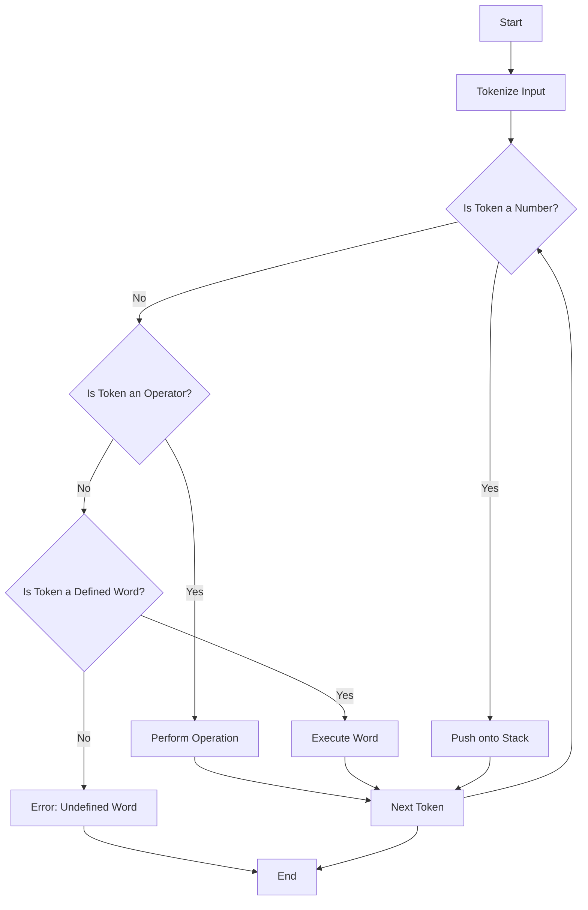

## 12.7 Bootstrapping Languages: Forth in 40 Lines of Lua

In this section, we delve into the fascinating world of language design by implementing a simple Forth interpreter using Lua. This exercise not only demonstrates Lua's metaprogramming capabilities but also provides insights into the principles of language design and execution models. Let's embark on this journey to understand how a stack-based, extensible language like Forth can be brought to life in just 40 lines of Lua code.

### Understanding Forth

Forth is a unique programming language known for its stack-based architecture and extensibility. It operates by manipulating a stack of data, where operations are performed using a postfix notation (also known as Reverse Polish Notation). This means that operators follow their operands, making it a natural fit for stack-based execution.

#### Key Characteristics of Forth

- **Stack-Based**: All operations are performed on a stack, which serves as the primary data structure.
- **Extensible**: Users can define new words (functions) to extend the language.
- **Minimalistic Syntax**: Forth's syntax is simple and concise, focusing on direct manipulation of the stack.

### Implementing a Forth Interpreter

Our goal is to implement a basic Forth interpreter in Lua. This interpreter will handle parsing input, performing stack operations, and allowing users to define new words.

#### Parsing Input

The first step in our interpreter is to read and tokenize user input. This involves splitting the input string into individual tokens that can be processed.

```lua
-- Tokenize the input string into words
function tokenize(input)
    local tokens = {}
    for word in input:gmatch("%S+") do
        table.insert(tokens, word)
    end
    return tokens
end
```

#### Stack Operations

Forth relies heavily on stack operations. We'll implement basic operations such as push, pop, and arithmetic operations.

```lua
-- Initialize the stack
local stack = {}

-- Push a value onto the stack
function push(value)
    table.insert(stack, value)
end

-- Pop a value from the stack
function pop()
    return table.remove(stack)
end

-- Perform arithmetic operations
function add()
    local b = pop()
    local a = pop()
    push(a + b)
end

function subtract()
    local b = pop()
    local a = pop()
    push(a - b)
end

function multiply()
    local b = pop()
    local a = pop()
    push(a * b)
end

function divide()
    local b = pop()
    local a = pop()
    push(a / b)
end
```

#### Defining New Words

One of Forth's strengths is its extensibility. Users can define new words (functions) to extend the language. We'll implement a simple mechanism to allow this.

```lua
-- Table to store user-defined words
local words = {}

-- Define a new word
function define_word(name, definition)
    words[name] = definition
end

-- Execute a word
function execute_word(word)
    if words[word] then
        words[word]()
    else
        error("Undefined word: " .. word)
    end
end
```

### Educational Insights

Implementing a Forth interpreter in Lua provides valuable insights into language design and execution models. Here are some key takeaways:

#### Language Design Principles

- **Parsing and Tokenization**: Understanding how to break down input into manageable pieces is crucial for any interpreter.
- **Stack-Based Execution**: Learning how to manipulate a stack to perform operations is a fundamental concept in many programming languages.
- **Extensibility**: Allowing users to define new words showcases the power of extensibility in language design.

#### Demonstrating Lua's Power

Lua's simplicity and flexibility make it an excellent choice for implementing interpreters. This exercise demonstrates how Lua's metaprogramming capabilities can be leveraged to create concise and powerful implementations.

### Complete Forth Interpreter in Lua

Now, let's put it all together and see the complete Forth interpreter in action.

```lua
-- Tokenize the input string into words
function tokenize(input)
    local tokens = {}
    for word in input:gmatch("%S+") do
        table.insert(tokens, word)
    end
    return tokens
end

-- Initialize the stack
local stack = {}

-- Push a value onto the stack
function push(value)
    table.insert(stack, value)
end

-- Pop a value from the stack
function pop()
    return table.remove(stack)
end

-- Perform arithmetic operations
function add()
    local b = pop()
    local a = pop()
    push(a + b)
end

function subtract()
    local b = pop()
    local a = pop()
    push(a - b)
end

function multiply()
    local b = pop()
    local a = pop()
    push(a * b)
end

function divide()
    local b = pop()
    local a = pop()
    push(a / b)
end

-- Table to store user-defined words
local words = {}

-- Define a new word
function define_word(name, definition)
    words[name] = definition
end

-- Execute a word
function execute_word(word)
    if words[word] then
        words[word]()
    else
        error("Undefined word: " .. word)
    end
end

-- Main interpreter loop
function interpret(input)
    local tokens = tokenize(input)
    for _, token in ipairs(tokens) do
        if tonumber(token) then
            push(tonumber(token))
        elseif token == "+" then
            add()
        elseif token == "-" then
            subtract()
        elseif token == "*" then
            multiply()
        elseif token == "/" then
            divide()
        else
            execute_word(token)
        end
    end
end

-- Example usage
interpret("3 4 +")
print(pop()) -- Output: 7
```

### Try It Yourself

Now that we've implemented a basic Forth interpreter, try experimenting with it. Here are some suggestions:

- **Add More Operations**: Implement additional arithmetic operations or logical operations.
- **Enhance Error Handling**: Improve the error handling to provide more informative messages.
- **Extend the Language**: Allow users to define more complex words or add control structures.

### Visualizing the Forth Interpreter

To better understand the flow of our Forth interpreter, let's visualize the process using a flowchart.



**Diagram Description**: This flowchart illustrates the process of interpreting a Forth program. It starts by tokenizing the input, then checks each token to determine if it's a number, an operator, or a defined word, and performs the appropriate action.

### References and Links

For further reading on Forth and language design, consider the following resources:

- [Forth Programming Language](https://en.wikipedia.org/wiki/Forth_(programming_language))
- [Lua Programming Language](https://www.lua.org/)
- [Metaprogramming in Lua](https://www.lua.org/pil/16.html)

### Knowledge Check

Before we conclude, let's reinforce what we've learned with a few questions:

- What are the key characteristics of Forth?
- How does the stack-based execution model work?
- Why is extensibility important in language design?

### Embrace the Journey

Remember, this is just the beginning. As you progress, you'll gain a deeper understanding of language design and metaprogramming. Keep experimenting, stay curious, and enjoy the journey!

## Quiz Time!



### What is a key characteristic of Forth?

- [x] Stack-based execution
- [ ] Object-oriented programming
- [ ] Functional programming
- [ ] Event-driven architecture

> **Explanation:** Forth is known for its stack-based execution model, where operations are performed using a stack.

### What does the `tokenize` function do in our Forth interpreter?

- [x] Splits input into individual tokens
- [ ] Executes arithmetic operations
- [ ] Defines new words
- [ ] Handles error messages

> **Explanation:** The `tokenize` function splits the input string into individual tokens for processing.

### How does the `push` function work?

- [x] Adds a value to the stack
- [ ] Removes a value from the stack
- [ ] Performs addition
- [ ] Defines a new word

> **Explanation:** The `push` function adds a value to the stack, which is the primary data structure in Forth.

### What is the purpose of the `execute_word` function?

- [x] Executes a user-defined word
- [ ] Performs arithmetic operations
- [ ] Tokenizes input
- [ ] Handles stack operations

> **Explanation:** The `execute_word` function executes a user-defined word, allowing for extensibility in the language.

### Which operation is performed by the `add` function?

- [x] Addition
- [ ] Subtraction
- [ ] Multiplication
- [ ] Division

> **Explanation:** The `add` function performs addition on the top two values of the stack.

### What does the `interpret` function do?

- [x] Processes input and executes tokens
- [ ] Defines new words
- [ ] Handles error messages
- [ ] Performs stack operations

> **Explanation:** The `interpret` function processes input, tokenizes it, and executes the tokens accordingly.

### What is the output of `interpret("3 4 +")`?

- [x] 7
- [ ] 12
- [ ] 1
- [ ] 0

> **Explanation:** The `interpret` function adds 3 and 4, resulting in 7.

### Why is extensibility important in language design?

- [x] Allows users to define new functionalities
- [ ] Simplifies syntax
- [ ] Reduces code size
- [ ] Increases execution speed

> **Explanation:** Extensibility allows users to define new functionalities, making the language more versatile.

### What is the role of metaprogramming in our Forth interpreter?

- [x] Enables dynamic behavior and language extension
- [ ] Simplifies syntax
- [ ] Increases execution speed
- [ ] Reduces code size

> **Explanation:** Metaprogramming enables dynamic behavior and language extension, allowing for a flexible interpreter.

### Is Lua a suitable language for implementing interpreters?

- [x] True
- [ ] False

> **Explanation:** Lua's simplicity and flexibility make it a suitable language for implementing interpreters.


