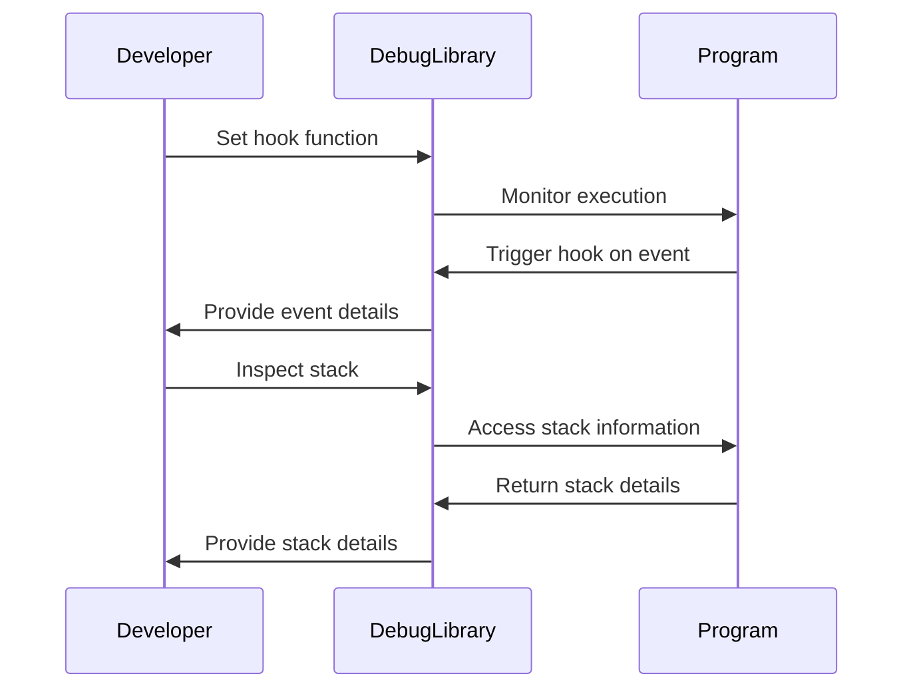

## 12.8 Debug Library and Introspection

In the realm of software development, debugging and introspection are crucial for understanding and improving code. Lua, with its lightweight and flexible nature, provides a powerful toolset for these tasks through its debug library. This section delves into the capabilities of Lua's debug library, offering insights into how you can inspect and manipulate program state at runtime. We will explore stack inspection, variable access, hook functions, and best practices for using these features effectively.

### Inspecting Program State: Using Lua's Debug Library

The debug library in Lua is a powerful tool that allows developers to inspect and manipulate the state of a program during its execution. This capability is invaluable for debugging, profiling, and dynamic analysis. Let's explore the core functionalities of the debug library.

#### Capabilities of the Debug Library

##### Stack Inspection

Stack inspection is a fundamental feature of the debug library, enabling developers to access information about the call stack. This includes details about active functions, their parameters, and local variables. Understanding the call stack is essential for diagnosing issues and understanding program flow.

```lua
function trace()
    local level = 1
    while true do
        local info = debug.getinfo(level, "Sln")
        if not info then break end
        print(string.format("[%d] %s:%d -- %s", level, info.short_src, info.currentline, info.name or "unknown"))
        level = level + 1
    end
end

function exampleFunction()
    trace()
end

exampleFunction()
```

In this example, the `trace` function iterates over the call stack, printing information about each level. This can help you understand the sequence of function calls leading to a particular point in your program.

##### Variable Access

The debug library allows you to read and modify local and upvalue variables. This capability is useful for inspecting the state of variables at different points in your program and for making dynamic changes during execution.

```lua
function modifyVariable()
    local x = 10
    print("Before modification: ", x)
    
    local function change()
        local i = 1
        while true do
            local name, value = debug.getlocal(2, i)
            if not name then break end
            if name == "x" then
                debug.setlocal(2, i, 20)
            end
            i = i + 1
        end
    end
    
    change()
    print("After modification: ", x)
end

modifyVariable()
```

Here, the `modifyVariable` function demonstrates how to access and modify a local variable using `debug.getlocal` and `debug.setlocal`. This can be particularly useful for testing and debugging purposes.

##### Hook Functions

Hook functions allow you to respond to specific events during program execution, such as function calls, line execution, and returns. This feature is instrumental in profiling and dynamic analysis.

```lua
function hook(event, line)
    local info = debug.getinfo(2)
    print(string.format("Event: %s, Line: %d, Function: %s", event, line, info.name or "unknown"))
end

debug.sethook(hook, "crl")

function sampleFunction()
    for i = 1, 3 do
        print("Iteration: ", i)
    end
end

sampleFunction()
debug.sethook()  -- Remove the hook
```

In this example, a hook function is set to trigger on function calls, returns, and line executions. The `hook` function logs these events, providing insights into the program's execution flow.

### Best Practices

While the debug library is powerful, it should be used judiciously to avoid potential pitfalls.

#### Use in Development

Limit the use of the debug library to development and debugging scenarios. Its capabilities can introduce security risks and performance overhead if used in production environments.

#### Performance Considerations

Understand the overhead involved in using the debug library. Operations like stack inspection and hook functions can slow down your program, so use them sparingly and only when necessary.

### Use Cases and Examples

The debug library is versatile and can be applied to various use cases, including profiling tools and dynamic analysis.

#### Profiling Tools

Profiling involves measuring the performance of different parts of your program to identify bottlenecks. The debug library's hook functions are particularly useful for this purpose.

```lua
local function profiler()
    local startTime = os.clock()
    local function hook(event)
        if event == "call" then
            startTime = os.clock()
        elseif event == "return" then
            local elapsedTime = os.clock() - startTime
            print(string.format("Function executed in: %.4f seconds", elapsedTime))
        end
    end
    debug.sethook(hook, "cr")
end

function testFunction()
    for i = 1, 1000000 do end
end

profiler()
testFunction()
debug.sethook()  -- Remove the hook
```

This example demonstrates a simple profiler that measures the execution time of functions using hook functions.

#### Dynamic Analysis

Dynamic analysis involves examining the behavior of a program during execution to detect and diagnose issues. The debug library can be used to monitor variable changes and function calls dynamically.

```lua
function dynamicMonitor()
    local function hook(event)
        if event == "call" then
            local info = debug.getinfo(2)
            print("Function called: ", info.name or "unknown")
        end
    end
    debug.sethook(hook, "c")
end

function monitoredFunction()
    print("Inside monitored function")
end

dynamicMonitor()
monitoredFunction()
debug.sethook()  -- Remove the hook
```

In this example, the `dynamicMonitor` function sets a hook to log function calls, providing insights into the program's execution.

### Visualizing Debug Library Capabilities

To better understand the capabilities of the debug library, let's visualize the process of stack inspection and hook function execution.



This sequence diagram illustrates the interaction between the developer, the debug library, and the program during stack inspection and hook function execution.

### Knowledge Check

Before we conclude, let's reinforce what we've learned with a few questions:

1. What is the primary purpose of the debug library in Lua?
2. How can you access and modify local variables using the debug library?
3. What are hook functions, and how can they be used in profiling?
4. Why should the use of the debug library be limited to development environments?
5. What are some potential performance considerations when using the debug library?

### Embrace the Journey

Remember, mastering the debug library and introspection in Lua is a journey. As you continue to explore and experiment, you'll gain deeper insights into your programs and become more adept at diagnosing and resolving issues. Keep experimenting, stay curious, and enjoy the journey!

## Quiz Time!



### What is the primary purpose of the debug library in Lua?

- [x] To inspect and manipulate the state of a program during execution
- [ ] To compile Lua scripts into machine code
- [ ] To encrypt Lua scripts for security
- [ ] To optimize Lua scripts for performance

> **Explanation:** The debug library is used to inspect and manipulate the state of a program during its execution, which is essential for debugging and introspection.

### How can you access and modify local variables using the debug library?

- [x] Using `debug.getlocal` and `debug.setlocal`
- [ ] Using `debug.traceback`
- [ ] Using `debug.sethook`
- [ ] Using `debug.getinfo`

> **Explanation:** `debug.getlocal` and `debug.setlocal` are used to access and modify local variables in the debug library.

### What are hook functions used for in the debug library?

- [x] To respond to specific events during program execution
- [ ] To encrypt data
- [ ] To compile Lua scripts
- [ ] To optimize performance

> **Explanation:** Hook functions are used to respond to specific events during program execution, such as function calls and line executions.

### Why should the use of the debug library be limited to development environments?

- [x] It can introduce security risks and performance overhead
- [ ] It is not compatible with Lua 5.1
- [ ] It cannot be used with LuaJIT
- [ ] It requires a special license

> **Explanation:** The debug library can introduce security risks and performance overhead, so it should be limited to development environments.

### What is a potential performance consideration when using the debug library?

- [x] It can slow down program execution
- [ ] It can increase memory usage
- [ ] It can cause syntax errors
- [ ] It can lead to data loss

> **Explanation:** The debug library can slow down program execution due to the overhead of operations like stack inspection and hook functions.

### What is stack inspection used for in the debug library?

- [x] To access information about the call stack
- [ ] To encrypt data
- [ ] To compile Lua scripts
- [ ] To optimize performance

> **Explanation:** Stack inspection is used to access information about the call stack, which is essential for understanding program flow.

### How can you measure function execution times using the debug library?

- [x] By setting hook functions to respond to call and return events
- [ ] By using `debug.traceback`
- [ ] By using `debug.getinfo`
- [ ] By using `debug.getlocal`

> **Explanation:** Hook functions can be set to respond to call and return events, allowing you to measure function execution times.

### What is dynamic analysis in the context of the debug library?

- [x] Examining the behavior of a program during execution
- [ ] Compiling Lua scripts into machine code
- [ ] Encrypting Lua scripts for security
- [ ] Optimizing Lua scripts for performance

> **Explanation:** Dynamic analysis involves examining the behavior of a program during execution to detect and diagnose issues.

### What is the role of `debug.getinfo` in the debug library?

- [x] To retrieve information about a function or call stack
- [ ] To modify local variables
- [ ] To set hook functions
- [ ] To encrypt data

> **Explanation:** `debug.getinfo` is used to retrieve information about a function or call stack, which is useful for introspection.

### True or False: The debug library can be used for both debugging and performance optimization.

- [x] True
- [ ] False

> **Explanation:** The debug library can be used for debugging and performance optimization, such as profiling function execution times.


