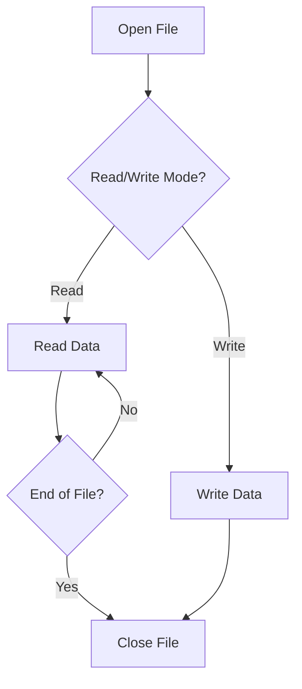

## 13.1 File I/O and Stream Processing

In the realm of software engineering, efficient data handling is paramount. Lua, with its lightweight and flexible nature, provides robust capabilities for file input/output (I/O) and stream processing. This section delves into the intricacies of file manipulation in Lua, offering insights into reading and writing files, processing large datasets, and applying transformations to data streams.

### Reading and Writing Files

File I/O is a fundamental aspect of programming, enabling applications to persist data, read configurations, and interact with external systems. In Lua, file operations are straightforward, yet powerful, allowing developers to handle text and binary data with ease.

#### Implementing File I/O

##### Opening Files

To perform file operations in Lua, we begin by opening a file using the `io.open()` function. This function requires the file path and mode as arguments. The mode specifies the operation type, such as reading, writing, or appending.

```lua
-- Open a file in read mode
local file = io.open("example.txt", "r")

-- Check if the file was successfully opened
if not file then
    error("Could not open file for reading")
end
```

**File Modes:**

- `"r"`: Read mode. Opens the file for reading.
- `"w"`: Write mode. Opens the file for writing (overwrites existing content).
- `"a"`: Append mode. Opens the file for writing, appending data to the end.
- `"r+"`: Read/update mode. Opens the file for both reading and writing.
- `"w+"`: Write/update mode. Opens the file for reading and writing (overwrites existing content).
- `"a+"`: Append/update mode. Opens the file for reading and writing, appending data to the end.

##### Reading Data

Once a file is opened, we can read its contents using various methods:

- **Line by Line**: Ideal for processing text files where each line represents a distinct data entry.

```lua
-- Read and print each line from the file
for line in file:lines() do
    print(line)
end
```

- **All at Once**: Useful for small files where the entire content can be loaded into memory.

```lua
-- Read the entire file content
local content = file:read("*all")
print(content)
```

- **In Chunks**: Suitable for binary files or when processing large files in parts.

```lua
-- Read the file in chunks of 1024 bytes
local chunkSize = 1024
while true do
    local chunk = file:read(chunkSize)
    if not chunk then break end
    print(chunk)
end
```

##### Writing Data

Writing data to files is equally straightforward. Depending on the mode, data can be written from scratch or appended to existing content.

```lua
-- Open a file in write mode
local file = io.open("output.txt", "w")

-- Write data to the file
file:write("Hello, Lua!\n")
file:write("File I/O is fun!")

-- Close the file
file:close()
```

### Stream Processing

Stream processing is a technique used to handle data efficiently, especially when dealing with large files or continuous data streams. It allows for real-time data processing without the need to load entire datasets into memory.

#### Processing Large Files

When working with large files, it's crucial to process data incrementally to avoid memory exhaustion. Lua's file I/O functions facilitate this by allowing data to be read in manageable chunks.

```lua
-- Open a large file for reading
local file = io.open("largefile.txt", "r")

-- Process the file in chunks
local chunkSize = 4096
while true do
    local chunk = file:read(chunkSize)
    if not chunk then break end
    -- Process the chunk
    print(chunk)
end

file:close()
```

#### Filtering Data Streams

Filtering involves applying transformations or extracting specific data from a stream. This can be done as data is read or written, enabling efficient data manipulation.

```lua
-- Open a file and filter lines containing a specific keyword
local file = io.open("log.txt", "r")
local keyword = "ERROR"

for line in file:lines() do
    if line:find(keyword) then
        print("Error found:", line)
    end
end

file:close()
```

### Use Cases and Examples

#### Log File Analysis

Log files are ubiquitous in software systems, capturing events, errors, and operational data. Analyzing these files can provide valuable insights into system performance and issues.

```lua
-- Analyze a log file to count occurrences of a specific error
local file = io.open("system.log", "r")
local errorCount = 0

for line in file:lines() do
    if line:find("ERROR") then
        errorCount = errorCount + 1
    end
end

file:close()
print("Total errors found:", errorCount)
```

#### Data Import/Export

Managing data formats like CSV, JSON, or XML is a common requirement. Lua's flexibility allows for easy parsing and generation of these formats.

```lua
-- Example of reading a CSV file
local csvFile = io.open("data.csv", "r")

for line in csvFile:lines() do
    local fields = {}
    for field in line:gmatch("([^,]+)") do
        table.insert(fields, field)
    end
    print(table.concat(fields, " | "))
end

csvFile:close()
```

### Visualizing File I/O and Stream Processing

To better understand the flow of file I/O and stream processing, let's visualize the process using a flowchart.



**Diagram Description:** This flowchart illustrates the basic process of file I/O in Lua, showing the decision-making between reading and writing modes, and the loop for reading data until the end of the file is reached.

### Try It Yourself

Experiment with the code examples provided. Try modifying the file paths, changing the read/write modes, or filtering for different keywords in the log file analysis example. This hands-on approach will deepen your understanding of Lua's file I/O capabilities.

### Knowledge Check

- What are the different file modes available in Lua for opening files?
- How can you read a file line by line in Lua?
- What is the advantage of processing files in chunks?
- How can you filter data streams in Lua?

### Embrace the Journey

Remember, mastering file I/O and stream processing in Lua is just the beginning. As you progress, you'll be able to handle more complex data processing tasks with ease. Keep experimenting, stay curious, and enjoy the journey!

### References and Links

- [Lua 5.4 Reference Manual - Input and Output Facilities](https://www.lua.org/manual/5.4/manual.html#6.8)
- [Programming in Lua - File I/O](https://www.lua.org/pil/21.html)

## Quiz Time!



### What function is used to open a file in Lua?

- [x] io.open()
- [ ] file.open()
- [ ] open.file()
- [ ] io.file()

> **Explanation:** The `io.open()` function is used to open files in Lua, specifying the file path and mode.

### Which file mode is used to append data to a file?

- [ ] "r"
- [ ] "w"
- [x] "a"
- [ ] "r+"

> **Explanation:** The "a" mode is used for appending data to the end of a file.

### How can you read a file line by line in Lua?

- [x] Using file:lines()
- [ ] Using file:read("*all")
- [ ] Using file:read("*line")
- [ ] Using file:read("*chunk")

> **Explanation:** The `file:lines()` method allows reading a file line by line in Lua.

### What is the benefit of processing files in chunks?

- [x] Reduces memory usage
- [ ] Increases file size
- [ ] Decreases processing speed
- [ ] Simplifies code

> **Explanation:** Processing files in chunks reduces memory usage by not loading the entire file into memory at once.

### How can you filter data streams in Lua?

- [x] By applying transformations as data is read or written
- [ ] By loading the entire file into memory first
- [ ] By using a separate filtering library
- [ ] By converting data to binary format

> **Explanation:** Filtering data streams involves applying transformations directly as data is read or written, allowing for efficient processing.

### What is the purpose of the "r+" file mode?

- [x] To open a file for both reading and writing
- [ ] To open a file for writing only
- [ ] To open a file for appending only
- [ ] To open a file for reading only

> **Explanation:** The "r+" mode opens a file for both reading and writing, allowing updates to existing content.

### Which method reads the entire content of a file at once?

- [x] file:read("*all")
- [ ] file:read("*line")
- [ ] file:read("*chunk")
- [ ] file:read("*byte")

> **Explanation:** The `file:read("*all")` method reads the entire content of a file at once.

### What is a common use case for file I/O in Lua?

- [x] Log file analysis
- [ ] Image processing
- [ ] Real-time gaming
- [ ] Network communication

> **Explanation:** Log file analysis is a common use case for file I/O in Lua, as it involves reading and processing text data.

### What is the advantage of using stream processing?

- [x] Efficient handling of large datasets
- [ ] Simplifies code structure
- [ ] Increases file size
- [ ] Reduces processing speed

> **Explanation:** Stream processing allows for efficient handling of large datasets by processing data incrementally.

### True or False: Lua can only handle text files, not binary files.

- [ ] True
- [x] False

> **Explanation:** Lua can handle both text and binary files, allowing for versatile file I/O operations.


