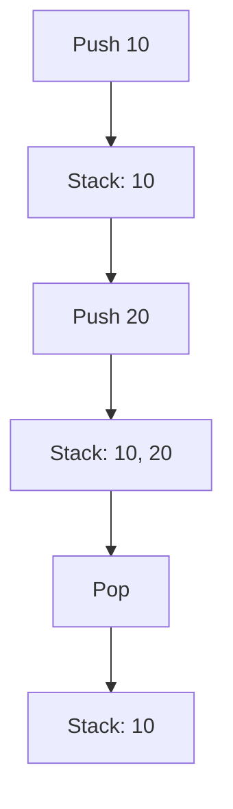

## 13.10 Building Data Structures and Iterators in Lua

In this section, we delve into the art of building custom data structures and iterators in Lua. As a powerful and flexible scripting language, Lua offers unique capabilities for implementing data structures and iterators, which are essential for efficient data processing and traversal. By mastering these concepts, you can enhance your software engineering skills and create robust Lua applications.

### Creating Custom Data Structures

Data structures are fundamental to programming, providing ways to organize and store data efficiently. In Lua, tables are the primary data structure, offering flexibility and power. Let's explore how to implement common data structures such as stacks, queues, and trees using Lua tables.

#### Implementing Data Structures

##### Using Tables

Lua tables are versatile and can be used to implement various data structures. They can function as arrays, dictionaries, or even objects. Here's how you can use tables to create a stack:

```lua
-- Stack implementation using Lua tables
Stack = {}
Stack.__index = Stack

-- Create a new stack
function Stack:new()
    local instance = {items = {}}
    setmetatable(instance, Stack)
    return instance
end

-- Push an item onto the stack
function Stack:push(item)
    table.insert(self.items, item)
end

-- Pop an item from the stack
function Stack:pop()
    return table.remove(self.items)
end

-- Peek at the top item of the stack
function Stack:peek()
    return self.items[#self.items]
end

-- Check if the stack is empty
function Stack:isEmpty()
    return #self.items == 0
end

-- Example usage
local stack = Stack:new()
stack:push(10)
stack:push(20)
print(stack:pop()) -- Output: 20
print(stack:peek()) -- Output: 10
```

In this example, we define a `Stack` class using Lua's table and metatable features. The `Stack:new()` function creates a new stack instance, and methods like `push`, `pop`, and `peek` provide stack operations.

##### Encapsulation

Encapsulation is a key principle in object-oriented programming, allowing you to hide implementation details and expose only necessary functionality. In Lua, you can achieve encapsulation by controlling access to table fields and methods.

```lua
-- Queue implementation with encapsulation
Queue = {}
Queue.__index = Queue

function Queue:new()
    local instance = {items = {}, front = 1, back = 0}
    setmetatable(instance, Queue)
    return instance
end

function Queue:enqueue(item)
    self.back = self.back + 1
    self.items[self.back] = item
end

function Queue:dequeue()
    if self:isEmpty() then return nil end
    local item = self.items[self.front]
    self.items[self.front] = nil
    self.front = self.front + 1
    return item
end

function Queue:isEmpty()
    return self.front > self.back
end

-- Example usage
local queue = Queue:new()
queue:enqueue("first")
queue:enqueue("second")
print(queue:dequeue()) -- Output: first
```

In this queue implementation, we encapsulate the queue's internal state (`items`, `front`, `back`) and provide methods for enqueuing and dequeuing items.

### Iterators

Iterators are a powerful concept in programming, allowing you to traverse data structures efficiently. In Lua, you can create custom iterators using the `__call` metamethod and generator functions with coroutines.

#### Custom Iterators

Custom iterators enable you to define how a data structure should be traversed. By implementing the `__call` metamethod, you can create objects that behave like functions.

```lua
-- Custom iterator for a range of numbers
Range = {}
Range.__index = Range

function Range:new(start, stop, step)
    local instance = {current = start, stop = stop, step = step or 1}
    setmetatable(instance, Range)
    return instance
end

function Range:__call()
    if self.current <= self.stop then
        local value = self.current
        self.current = self.current + self.step
        return value
    end
end

-- Example usage
local range = Range:new(1, 5)
for number in range do
    print(number) -- Output: 1 2 3 4 5
end
```

In this example, the `Range` class defines a custom iterator that generates numbers from `start` to `stop`. The `__call` metamethod allows the `Range` object to be used in a `for` loop.

#### Generator Functions

Generator functions use coroutines to yield values one at a time, providing a simple way to create iterators.

```lua
-- Generator function for Fibonacci sequence
function fibonacci()
    local a, b = 0, 1
    return function()
        a, b = b, a + b
        return a
    end
end

-- Example usage
for number in fibonacci() do
    if number > 100 then break end
    print(number) -- Output: 1 1 2 3 5 8 13 21 34 55 89
end
```

The `fibonacci` function returns a closure that generates Fibonacci numbers. The `for` loop iterates over the sequence, stopping when the number exceeds 100.

### Use Cases and Examples

Custom data structures and iterators have numerous applications in software development. Let's explore some use cases and examples.

#### Algorithm Implementation

Data structures are crucial for implementing algorithms efficiently. For instance, a binary search tree can be used for fast data retrieval.

```lua
-- Binary Search Tree implementation
BST = {}
BST.__index = BST

function BST:new(value)
    local instance = {value = value, left = nil, right = nil}
    setmetatable(instance, BST)
    return instance
end

function BST:insert(newValue)
    if newValue < self.value then
        if self.left then
            self.left:insert(newValue)
        else
            self.left = BST:new(newValue)
        end
    else
        if self.right then
            self.right:insert(newValue)
        else
            self.right = BST:new(newValue)
        end
    end
end

function BST:traverse()
    if self.left then self.left:traverse() end
    print(self.value)
    if self.right then self.right:traverse() end
end

-- Example usage
local tree = BST:new(10)
tree:insert(5)
tree:insert(15)
tree:insert(7)
tree:traverse() -- Output: 5 7 10 15
```

This binary search tree implementation allows you to insert values and traverse the tree in order.

#### Data Traversal

Iterators are invaluable for traversing complex data structures. For example, you can create an iterator for a graph to perform depth-first search.

```lua
-- Graph traversal using DFS iterator
Graph = {}
Graph.__index = Graph

function Graph:new()
    local instance = {nodes = {}}
    setmetatable(instance, Graph)
    return instance
end

function Graph:addEdge(u, v)
    if not self.nodes[u] then self.nodes[u] = {} end
    table.insert(self.nodes[u], v)
end

function Graph:dfs(start)
    local visited = {}
    local stack = {start}

    return function()
        while #stack > 0 do
            local node = table.remove(stack)
            if not visited[node] then
                visited[node] = true
                for _, neighbor in ipairs(self.nodes[node] or {}) do
                    table.insert(stack, neighbor)
                end
                return node
            end
        end
    end
end

-- Example usage
local graph = Graph:new()
graph:addEdge(1, 2)
graph:addEdge(1, 3)
graph:addEdge(2, 4)
graph:addEdge(3, 4)

for node in graph:dfs(1) do
    print(node) -- Output: 1 3 4 2
end
```

This graph implementation uses a depth-first search iterator to traverse nodes starting from a given node.

### Try It Yourself

Experiment with the code examples provided in this section. Try modifying the stack, queue, and tree implementations to add new features or optimize performance. Create your own custom iterators for different data structures and explore their applications.

### Visualizing Data Structures and Iterators

To better understand the flow of data and operations in these structures, let's visualize a stack and a queue using Mermaid.js diagrams.



**Figure 1: Stack Operations**

```mermaid
graph TD;
    A[Enqueue "first"] --> B[Queue: "first"];
    B --> C[Enqueue "second"];
    C --> D[Queue: "first", "second"];
    D --> E[Dequeue];
    E --> F[Queue: "second"];
```

**Figure 2: Queue Operations**

These diagrams illustrate the sequence of operations in a stack and a queue, helping you visualize how data is managed in these structures.

### References and Links

For further reading on Lua data structures and iterators, consider exploring the following resources:

- [Programming in Lua](https://www.lua.org/pil/contents.html) - The official book on Lua programming.
- [Lua Users Wiki](http://lua-users.org/wiki/) - A community-driven resource for Lua programmers.
- [MDN Web Docs on Iterators](https://developer.mozilla.org/en-US/docs/Web/JavaScript/Guide/Iterators_and_Generators) - While focused on JavaScript, this guide provides insights into iterator concepts applicable to Lua.

### Knowledge Check

To reinforce your understanding of building data structures and iterators in Lua, try answering the following questions and challenges.

## Quiz Time!



### What is the primary data structure used in Lua for implementing custom data structures?

- [x] Tables
- [ ] Arrays
- [ ] Linked Lists
- [ ] Hash Maps

> **Explanation:** Lua tables are versatile and can be used to implement various data structures, including arrays, dictionaries, and objects.

### How can you achieve encapsulation in Lua?

- [x] By controlling access to table fields and methods
- [ ] By using private variables
- [ ] By using classes
- [ ] By using interfaces

> **Explanation:** Encapsulation in Lua is achieved by controlling access to table fields and methods, hiding implementation details.

### What is the purpose of the `__call` metamethod in Lua?

- [x] To allow objects to be called like functions
- [ ] To define equality between objects
- [ ] To handle arithmetic operations
- [ ] To manage garbage collection

> **Explanation:** The `__call` metamethod allows objects to be called like functions, enabling custom iterator behavior.

### Which Lua feature is used to create generator functions?

- [x] Coroutines
- [ ] Metatables
- [ ] Modules
- [ ] Closures

> **Explanation:** Coroutines in Lua are used to create generator functions, allowing for lazy evaluation and iteration.

### What is the output of the following code snippet?

```lua
local stack = Stack:new()
stack:push(10)
stack:push(20)
print(stack:pop())
```

- [x] 20
- [ ] 10
- [ ] nil
- [ ] Error

> **Explanation:** The `pop` method removes and returns the top item of the stack, which is 20 in this case.

### Which data structure is best suited for implementing a breadth-first search algorithm?

- [x] Queue
- [ ] Stack
- [ ] Tree
- [ ] Graph

> **Explanation:** A queue is best suited for implementing a breadth-first search algorithm, as it processes nodes in a first-in, first-out order.

### How can you iterate over a custom data structure in Lua?

- [x] By implementing a custom iterator using the `__call` metamethod
- [ ] By using a for loop directly
- [ ] By using a while loop
- [ ] By using a repeat-until loop

> **Explanation:** Implementing a custom iterator using the `__call` metamethod allows you to define how a data structure should be traversed.

### What is the advantage of using generator functions in Lua?

- [x] They allow for lazy evaluation and efficient iteration
- [ ] They simplify error handling
- [ ] They improve memory management
- [ ] They enhance security

> **Explanation:** Generator functions allow for lazy evaluation and efficient iteration, as they yield values one at a time.

### True or False: Lua tables can only be used as arrays.

- [ ] True
- [x] False

> **Explanation:** Lua tables are versatile and can be used as arrays, dictionaries, or objects, making them suitable for various data structures.

### Which of the following is a common use case for iterators in Lua?

- [x] Data traversal
- [ ] Memory management
- [ ] Error handling
- [ ] Security

> **Explanation:** Iterators are commonly used for data traversal, allowing efficient iteration over complex data structures.



Remember, this is just the beginning. As you progress, you'll build more complex and interactive Lua applications. Keep experimenting, stay curious, and enjoy the journey!
