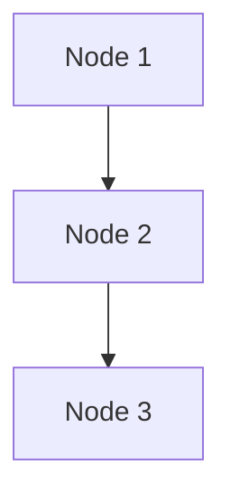
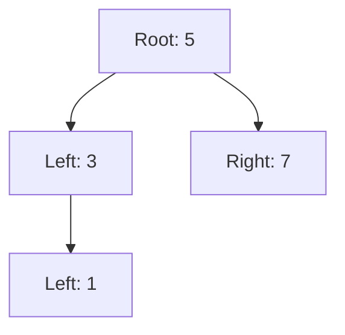
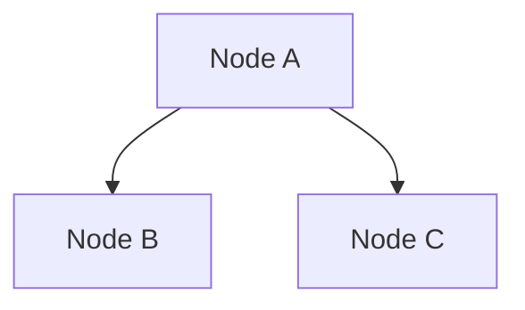

## 13.11 Lua Implementations of Common Data Structures

In the world of software engineering, data structures are fundamental building blocks that allow us to efficiently store, organize, and manipulate data. Lua, with its lightweight and flexible nature, provides unique opportunities for implementing these structures. In this section, we will explore how to implement some of the most common data structures in Lua, including linked lists, binary trees, and graphs. We will also discuss their use cases and provide practical examples to illustrate their applications.

### Standard Data Structures

Before diving into the implementations, let's briefly review the standard data structures we will cover:

- **Lists**: Ordered collections of elements.
- **Dictionaries**: Key-value pairs for efficient data retrieval.
- **Sets**: Collections of unique elements.
- **Linked Lists**: Chains of nodes connected by references.
- **Binary Trees**: Hierarchical structures with nodes having two children.
- **Graphs**: Collections of nodes and edges representing relationships.

### Implementing Common Structures

#### Linked Lists

A linked list is a linear data structure where each element is a separate object, called a node. Each node contains data and a reference (or link) to the next node in the sequence. Linked lists are dynamic, allowing for efficient insertion and deletion of elements.

**Implementation in Lua:**

```lua
-- Define a Node class
Node = {}
Node.__index = Node

function Node:new(value)
    local node = {
        value = value,
        next = nil
    }
    setmetatable(node, Node)
    return node
end

-- Define a LinkedList class
LinkedList = {}
LinkedList.__index = LinkedList

function LinkedList:new()
    local list = {
        head = nil,
        tail = nil
    }
    setmetatable(list, LinkedList)
    return list
end

function LinkedList:append(value)
    local node = Node:new(value)
    if not self.head then
        self.head = node
        self.tail = node
    else
        self.tail.next = node
        self.tail = node
    end
end

function LinkedList:printList()
    local current = self.head
    while current do
        print(current.value)
        current = current.next
    end
end

-- Example usage
local list = LinkedList:new()
list:append(1)
list:append(2)
list:append(3)
list:printList()
```

**Try It Yourself:** Modify the `LinkedList` class to include a method for removing a node by value. Consider edge cases such as removing the head or tail node.

#### Binary Trees

A binary tree is a hierarchical data structure in which each node has at most two children, referred to as the left child and the right child. Binary trees are used in various applications, such as searching and sorting algorithms.

**Implementation in Lua:**

```lua
-- Define a TreeNode class
TreeNode = {}
TreeNode.__index = TreeNode

function TreeNode:new(value)
    local node = {
        value = value,
        left = nil,
        right = nil
    }
    setmetatable(node, TreeNode)
    return node
end

-- Define a BinaryTree class
BinaryTree = {}
BinaryTree.__index = BinaryTree

function BinaryTree:new()
    local tree = {
        root = nil
    }
    setmetatable(tree, BinaryTree)
    return tree
end

function BinaryTree:insert(value)
    local node = TreeNode:new(value)
    if not self.root then
        self.root = node
    else
        self:_insertNode(self.root, node)
    end
end

function BinaryTree:_insertNode(current, node)
    if node.value < current.value then
        if not current.left then
            current.left = node
        else
            self:_insertNode(current.left, node)
        end
    else
        if not current.right then
            current.right = node
        else
            self:_insertNode(current.right, node)
        end
    end
end

function BinaryTree:inOrderTraversal(node)
    if node then
        self:inOrderTraversal(node.left)
        print(node.value)
        self:inOrderTraversal(node.right)
    end
end

-- Example usage
local tree = BinaryTree:new()
tree:insert(5)
tree:insert(3)
tree:insert(7)
tree:insert(1)
tree:inOrderTraversal(tree.root)
```

**Try It Yourself:** Implement a method to search for a specific value in the binary tree. Consider the efficiency of your search algorithm.

#### Graphs

Graphs are data structures that consist of nodes (or vertices) and edges connecting them. They are used to represent networks, such as social networks, transportation systems, and more.

**Implementation in Lua:**

```lua
-- Define a Graph class
Graph = {}
Graph.__index = Graph

function Graph:new()
    local graph = {
        nodes = {},
        edges = {}
    }
    setmetatable(graph, Graph)
    return graph
end

function Graph:addNode(node)
    self.nodes[node] = true
end

function Graph:addEdge(node1, node2)
    if not self.edges[node1] then
        self.edges[node1] = {}
    end
    table.insert(self.edges[node1], node2)
end

function Graph:printGraph()
    for node, _ in pairs(self.nodes) do
        io.write(node .. ": ")
        if self.edges[node] then
            for _, edge in ipairs(self.edges[node]) do
                io.write(edge .. " ")
            end
        end
        print()
    end
end

-- Example usage
local graph = Graph:new()
graph:addNode("A")
graph:addNode("B")
graph:addNode("C")
graph:addEdge("A", "B")
graph:addEdge("A", "C")
graph:printGraph()
```

**Try It Yourself:** Extend the `Graph` class to implement a method for detecting cycles in the graph. Consider both directed and undirected graphs.

### Use Cases and Examples

#### Search Algorithms

Data structures like linked lists, binary trees, and graphs are often used in search algorithms. For example, binary trees can be used to implement binary search, which is efficient for sorted data.

#### Organizing Data

Efficient data storage and retrieval are crucial in software applications. Data structures like dictionaries and sets allow for quick access to data, making them ideal for tasks such as caching and indexing.

### Visualizing Data Structures

To better understand the relationships and operations within these data structures, let's visualize them using Mermaid.js diagrams.

**Linked List Visualization:**



**Binary Tree Visualization:**



**Graph Visualization:**



### References and Links

- [Lua Programming Language](https://www.lua.org/)
- [Data Structures and Algorithms in Lua](https://www.geeksforgeeks.org/data-structures/)
- [Mermaid.js Documentation](https://mermaid-js.github.io/mermaid/#/)

### Knowledge Check

- What are the advantages of using linked lists over arrays?
- How does a binary tree differ from a binary search tree?
- What are some real-world applications of graphs?

### Embrace the Journey

Remember, mastering data structures in Lua is a journey. As you continue to explore and experiment with these structures, you'll gain a deeper understanding of how to efficiently manage data in your applications. Keep experimenting, stay curious, and enjoy the journey!

## Quiz Time!



### What is a linked list?

- [x] A linear data structure with nodes connected by references.
- [ ] A hierarchical data structure with nodes having two children.
- [ ] A collection of key-value pairs.
- [ ] A collection of unique elements.

> **Explanation:** A linked list is a linear data structure where each element is a separate object, called a node, connected by references.

### What is the primary advantage of a binary tree?

- [x] Efficient searching and sorting.
- [ ] Storing key-value pairs.
- [ ] Ensuring unique elements.
- [ ] Representing networks.

> **Explanation:** Binary trees are used in various applications, such as searching and sorting algorithms, due to their hierarchical structure.

### How are nodes connected in a graph?

- [x] By edges.
- [ ] By references.
- [ ] By keys.
- [ ] By values.

> **Explanation:** In a graph, nodes (or vertices) are connected by edges.

### What is a common use case for dictionaries?

- [x] Quick data retrieval.
- [ ] Efficient sorting.
- [ ] Representing hierarchical data.
- [ ] Ensuring unique elements.

> **Explanation:** Dictionaries are used for quick data retrieval through key-value pairs.

### What is the purpose of a set?

- [x] To store unique elements.
- [ ] To store key-value pairs.
- [ ] To connect nodes.
- [ ] To sort data.

> **Explanation:** Sets are collections of unique elements, ensuring no duplicates.

### What is a key feature of a linked list?

- [x] Dynamic size.
- [ ] Fixed size.
- [ ] Hierarchical structure.
- [ ] Key-value pairs.

> **Explanation:** Linked lists are dynamic, allowing for efficient insertion and deletion of elements.

### What is the main difference between a binary tree and a binary search tree?

- [x] Binary search trees have ordered nodes.
- [ ] Binary trees have ordered nodes.
- [ ] Binary search trees have unique nodes.
- [ ] Binary trees have unique nodes.

> **Explanation:** In a binary search tree, nodes are ordered such that the left child is less than the parent, and the right child is greater.

### What is a common application of graphs?

- [x] Representing networks.
- [ ] Sorting data.
- [ ] Storing key-value pairs.
- [ ] Ensuring unique elements.

> **Explanation:** Graphs are used to represent networks, such as social networks and transportation systems.

### What is the benefit of using a binary tree for searching?

- [x] It reduces the search space by half at each step.
- [ ] It ensures unique elements.
- [ ] It connects nodes efficiently.
- [ ] It stores key-value pairs.

> **Explanation:** Binary trees allow for efficient searching by reducing the search space by half at each step.

### True or False: A graph can only have directed edges.

- [ ] True
- [x] False

> **Explanation:** Graphs can have both directed and undirected edges.


