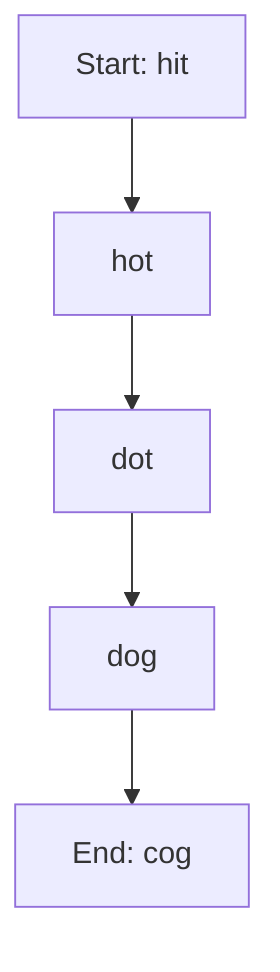

## 13.12 Word Ladders and Algorithmic Implementations

### Introduction

In this section, we delve into the fascinating world of word ladders, a classic puzzle that challenges us to transform one word into another by changing a single letter at a time. This problem not only serves as an engaging puzzle but also provides a practical application for algorithmic thinking and implementation in Lua. We will explore how to solve word ladders using the breadth-first search (BFS) algorithm, discuss optimization techniques, and examine real-world use cases.

### Understanding the Word Ladder Problem

**Definition**: The word ladder problem involves transforming a start word into an end word by changing one letter at a time, with each intermediate step also being a valid word. The goal is to find the shortest transformation sequence.

**Example**: Transform "hit" to "cog" using the following sequence:
- hit -> hot -> dot -> dog -> cog

Each step involves changing one letter, and each resulting word must be valid.

### Algorithmic Approach: Breadth-First Search (BFS)

To solve the word ladder problem efficiently, we employ the breadth-first search (BFS) algorithm. BFS is ideal for finding the shortest path in an unweighted graph, which aligns perfectly with our need to find the shortest transformation sequence.

#### Key Concepts of BFS

- **Queue Data Structure**: BFS uses a queue to explore nodes level by level.
- **Visited Set**: Keeps track of visited words to avoid cycles and redundant paths.
- **Level Tracking**: Ensures that we find the shortest path by exploring all possibilities at the current level before moving to the next.

### Implementing BFS in Lua

Let's implement the BFS algorithm to solve the word ladder problem in Lua. We'll use a queue to manage our exploration and a set to track visited words.

```lua
-- Lua implementation of the word ladder problem using BFS

-- Function to check if two words differ by only one letter
local function is_one_letter_diff(word1, word2)
    local diff_count = 0
    for i = 1, #word1 do
        if word1:sub(i, i) ~= word2:sub(i, i) then
            diff_count = diff_count + 1
            if diff_count > 1 then
                return false
            end
        end
    end
    return diff_count == 1
end

-- BFS function to find the shortest transformation sequence
local function word_ladder_bfs(start_word, end_word, word_list)
    local queue = {{start_word}}
    local visited = {[start_word] = true}

    while #queue > 0 do
        local path = table.remove(queue, 1)
        local last_word = path[#path]

        if last_word == end_word then
            return path
        end

        for _, word in ipairs(word_list) do
            if not visited[word] and is_one_letter_diff(last_word, word) then
                visited[word] = true
                local new_path = {table.unpack(path)}
                table.insert(new_path, word)
                table.insert(queue, new_path)
            end
        end
    end

    return nil -- No transformation sequence found
end

-- Example usage
local start_word = "hit"
local end_word = "cog"
local word_list = {"hot", "dot", "dog", "lot", "log", "cog"}

local result = word_ladder_bfs(start_word, end_word, word_list)
if result then
    print("Shortest transformation sequence:")
    for _, word in ipairs(result) do
        print(word)
    end
else
    print("No transformation sequence found.")
end
```

### Optimization Techniques

While BFS is effective, we can further optimize our solution by implementing the following techniques:

- **Bidirectional Search**: Instead of searching from the start word to the end word, we can simultaneously search from both ends, meeting in the middle. This reduces the search space significantly.
- **Word Preprocessing**: Preprocess the word list to create a dictionary of potential transformations, reducing the need to check each word individually.
- **Pruning**: Eliminate paths that are unlikely to lead to a solution early in the search process.

### Use Cases and Examples

#### Educational Tools

Word ladders serve as excellent educational tools for teaching algorithmic concepts. By implementing word ladders in Lua, educators can demonstrate the practical application of BFS and optimization techniques.

#### Game Mechanics

Word ladders can be integrated into games as puzzles or challenges. By generating random word ladders, game developers can create engaging and dynamic gameplay experiences.

### Try It Yourself

Experiment with the provided code by modifying the word list or changing the start and end words. Try implementing bidirectional search or preprocessing techniques to see how they affect performance.

### Visualizing the BFS Process

To better understand the BFS process, let's visualize the exploration of nodes using a simple flowchart.



This flowchart illustrates the path taken by the BFS algorithm to transform "hit" into "cog".

### References and Further Reading

- [Breadth-First Search on Wikipedia](https://en.wikipedia.org/wiki/Breadth-first_search)
- [Lua Programming Language](https://www.lua.org/)
- [Algorithm Design Manual by Steven S. Skiena](https://www.algorist.com/)

### Knowledge Check

- What is the primary goal of the word ladder problem?
- How does BFS ensure the shortest path is found?
- What data structure is essential for implementing BFS?
- How can bidirectional search optimize the BFS algorithm?

### Embrace the Journey

Remember, solving word ladders is just the beginning. As you explore more complex puzzles and algorithms, you'll continue to build your problem-solving skills. Keep experimenting, stay curious, and enjoy the journey!

## Quiz Time!



### What is the primary goal of the word ladder problem?

- [x] To transform one word into another by changing one letter at a time.
- [ ] To find the longest sequence of words.
- [ ] To create a new word from a set of letters.
- [ ] To sort words alphabetically.

> **Explanation:** The primary goal is to transform one word into another by changing one letter at a time, ensuring each intermediate word is valid.

### Which algorithm is commonly used to solve the word ladder problem?

- [x] Breadth-first search (BFS)
- [ ] Depth-first search (DFS)
- [ ] Dijkstra's algorithm
- [ ] A* search

> **Explanation:** BFS is used because it efficiently finds the shortest path in an unweighted graph, which is ideal for word ladders.

### What data structure is essential for implementing BFS?

- [x] Queue
- [ ] Stack
- [ ] Linked list
- [ ] Binary tree

> **Explanation:** A queue is essential for BFS as it allows for level-by-level exploration of nodes.

### How can bidirectional search optimize the BFS algorithm?

- [x] By reducing the search space by searching from both ends.
- [ ] By increasing the number of nodes explored.
- [ ] By sorting the nodes before searching.
- [ ] By using a stack instead of a queue.

> **Explanation:** Bidirectional search reduces the search space by simultaneously searching from both the start and end words, meeting in the middle.

### What is the role of the visited set in BFS?

- [x] To keep track of visited nodes and avoid cycles.
- [ ] To store the final path.
- [ ] To sort the nodes alphabetically.
- [ ] To increase the search depth.

> **Explanation:** The visited set keeps track of visited nodes to avoid cycles and redundant paths, ensuring efficient exploration.

### What is the main advantage of using BFS for word ladders?

- [x] It finds the shortest transformation sequence.
- [ ] It explores all possible paths.
- [ ] It uses less memory than DFS.
- [ ] It is faster than all other algorithms.

> **Explanation:** BFS is advantageous because it finds the shortest transformation sequence by exploring nodes level by level.

### Which technique can further optimize BFS for word ladders?

- [x] Word preprocessing
- [ ] Depth-first search
- [ ] Sorting the word list
- [ ] Using a binary search tree

> **Explanation:** Word preprocessing can optimize BFS by creating a dictionary of potential transformations, reducing unnecessary checks.

### What is the purpose of pruning in BFS?

- [x] To eliminate unlikely paths early in the search process.
- [ ] To increase the search depth.
- [ ] To sort the nodes alphabetically.
- [ ] To store the final path.

> **Explanation:** Pruning eliminates unlikely paths early, improving efficiency by focusing on more promising paths.

### True or False: BFS is always the best choice for solving word ladders.

- [ ] True
- [x] False

> **Explanation:** While BFS is effective for finding the shortest path, other techniques like bidirectional search can offer optimizations.

### What is a potential use case for word ladders in game development?

- [x] Puzzle generation and solutions
- [ ] Sorting player scores
- [ ] Managing game assets
- [ ] Rendering graphics

> **Explanation:** Word ladders can be used in game development for puzzle generation and solutions, providing engaging challenges for players.


