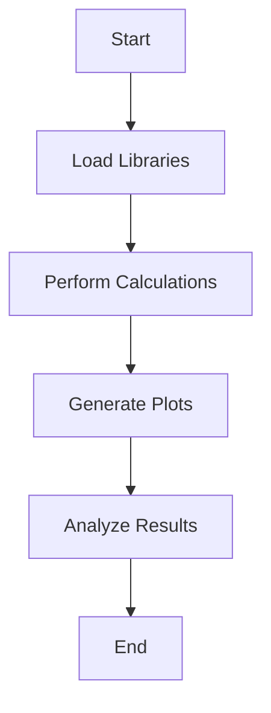

## 13.13 A Primer of Scientific Computing in Lua

Scientific computing involves the use of computational techniques to solve scientific and engineering problems. Lua, known for its simplicity and flexibility, can be a powerful tool in this domain. In this section, we will explore how Lua can be leveraged for scientific applications, focusing on numerical computing libraries, plotting and visualization, and practical use cases.

### Using Lua for Scientific Applications

Lua's lightweight nature and ease of integration make it an excellent choice for scientific computing tasks. Its ability to interface with C and other languages allows it to leverage existing scientific libraries, while its scripting capabilities make it ideal for rapid prototyping and experimentation.

#### Numerical Computing Libraries

Numerical computing is a cornerstone of scientific computing, involving operations such as matrix manipulations, linear algebra, and Fourier transforms. Lua has several libraries that facilitate these tasks:

##### LuaMatrix: Matrix and Linear Algebra Operations

LuaMatrix is a library that provides matrix operations and linear algebra functionalities. It is designed to be simple and efficient, making it suitable for scientific computations.

```lua
-- Example: Basic Matrix Operations with LuaMatrix
local matrix = require("luamatrix")

-- Create a 2x2 matrix
local A = matrix{{1, 2}, {3, 4}}

-- Create another 2x2 matrix
local B = matrix{{5, 6}, {7, 8}}

-- Matrix addition
local C = A + B

-- Matrix multiplication
local D = A * B

-- Print the result
print("Matrix C (A + B):")
print(C)

print("Matrix D (A * B):")
print(D)
```

In this example, we demonstrate basic matrix operations such as addition and multiplication using LuaMatrix. The library provides a straightforward API for handling matrices, making it easy to perform complex calculations.

##### LuaFFT: Fast Fourier Transform Implementations

Fast Fourier Transform (FFT) is a critical algorithm in signal processing and data analysis. LuaFFT is a library that implements FFT in Lua, enabling efficient frequency domain analysis.

```lua
-- Example: Performing FFT with LuaFFT
local fft = require("luafft")

-- Define a signal
local signal = {1, 2, 3, 4, 5, 6, 7, 8}

-- Perform FFT
local spectrum = fft.fft(signal)

-- Print the frequency spectrum
print("Frequency Spectrum:")
for i, v in ipairs(spectrum) do
    print(i, v)
end
```

This example shows how to perform an FFT on a simple signal using LuaFFT. The library provides functions for both forward and inverse FFT, making it versatile for various applications.

### Plotting and Visualization

Visualization is a crucial aspect of scientific computing, allowing researchers to interpret and communicate their results effectively. Lua can interface with several graphing tools to create plots and visualizations.

#### Integration with Graphing Tools

Lua can be integrated with popular graphing tools such as Gnuplot and Matplotlib, enabling the creation of high-quality plots.

##### Interfacing with Gnuplot

Gnuplot is a powerful plotting tool that can be used with Lua to generate plots. By using Lua's ability to execute shell commands, we can easily create visualizations.

```lua
-- Example: Plotting with Gnuplot
local gnuplot = require("gnuplot")

-- Define data points
local x = {1, 2, 3, 4, 5}
local y = {2, 4, 6, 8, 10}

-- Create a plot
gnuplot.plot(x, y, "linespoints", "Sample Plot", "X-axis", "Y-axis")
```

In this example, we use the `gnuplot` module to create a simple line plot. The module provides functions for setting plot titles, labels, and styles, making it easy to customize plots.

##### Using Matplotlib with Lua

Matplotlib is a popular plotting library in Python, and it can be used with Lua through the `luaplot` library, which acts as a bridge between Lua and Python.

```lua
-- Example: Plotting with Matplotlib
local luaplot = require("luaplot")

-- Define data points
local x = {1, 2, 3, 4, 5}
local y = {2, 4, 6, 8, 10}

-- Create a plot
luaplot.plot(x, y, "Sample Plot", "X-axis", "Y-axis")
```

This example demonstrates how to create a plot using Matplotlib from Lua. The `luaplot` library allows Lua scripts to call Python functions, enabling the use of Matplotlib's extensive plotting capabilities.

### Use Cases and Examples

Lua's versatility makes it suitable for a wide range of scientific applications. Here, we explore some common use cases and examples.

#### Data Analysis: Statistical Computations

Data analysis often involves statistical computations, such as calculating means, variances, and correlations. Lua can be used to perform these tasks efficiently.

```lua
-- Example: Statistical Computations
local stats = require("luastats")

-- Define a dataset
local data = {1, 2, 3, 4, 5}

-- Calculate mean
local mean = stats.mean(data)

-- Calculate variance
local variance = stats.variance(data)

-- Print results
print("Mean:", mean)
print("Variance:", variance)
```

In this example, we use the `luastats` library to perform basic statistical computations on a dataset. The library provides functions for various statistical measures, making it a valuable tool for data analysis.

#### Simulation Models: Physics Simulations and Modeling

Lua can be used to create simulation models for physics and other scientific domains. Its scripting capabilities make it ideal for defining simulation parameters and running experiments.

```lua
-- Example: Simple Physics Simulation
local physics = require("luaphysics")

-- Define initial conditions
local position = {x = 0, y = 0}
local velocity = {x = 1, y = 1}
local acceleration = {x = 0, y = -9.8}

-- Simulate motion over time
for t = 0, 10, 0.1 do
    -- Update velocity
    velocity.x = velocity.x + acceleration.x * t
    velocity.y = velocity.y + acceleration.y * t

    -- Update position
    position.x = position.x + velocity.x * t
    position.y = position.y + velocity.y * t

    -- Print position
    print(string.format("Time: %.1f, Position: (%.2f, %.2f)", t, position.x, position.y))
end
```

This example demonstrates a simple physics simulation using Lua. We simulate the motion of an object under the influence of gravity, updating its position and velocity over time.

### Try It Yourself

Experiment with the code examples provided in this section. Try modifying the parameters, such as matrix dimensions, signal values, or simulation conditions, to see how the results change. This hands-on approach will deepen your understanding of scientific computing in Lua.

### Visualizing Scientific Computing Concepts

To better understand the flow of scientific computing tasks in Lua, let's visualize the process using a flowchart.



**Figure 1: Scientific Computing Workflow in Lua**

This flowchart illustrates the typical workflow in scientific computing using Lua. We start by loading the necessary libraries, perform calculations, generate plots, analyze results, and conclude the process.

### References and Links

For further reading and exploration, consider the following resources:

- [LuaMatrix Documentation](https://github.com/davidm/lua-matrix)
- [LuaFFT Documentation](https://github.com/h4rm/luafft)
- [Gnuplot Official Site](http://www.gnuplot.info/)
- [Matplotlib Documentation](https://matplotlib.org/)

### Knowledge Check

To reinforce your understanding, consider the following questions:

- What are the advantages of using Lua for scientific computing?
- How can LuaMatrix be used to perform matrix operations?
- Describe how Lua can interface with Gnuplot for plotting.
- What are some common use cases for Lua in scientific computing?

### Embrace the Journey

Remember, this is just the beginning. As you progress, you'll discover more advanced techniques and applications of Lua in scientific computing. Keep experimenting, stay curious, and enjoy the journey!

## Quiz Time!



### What is LuaMatrix used for in scientific computing?

- [x] Matrix and linear algebra operations
- [ ] Data visualization
- [ ] Signal processing
- [ ] Statistical analysis

> **Explanation:** LuaMatrix is a library that provides matrix and linear algebra operations, essential for scientific computing tasks.

### Which library is used for Fast Fourier Transform in Lua?

- [ ] LuaMatrix
- [x] LuaFFT
- [ ] LuaStats
- [ ] LuaPlot

> **Explanation:** LuaFFT is the library used for implementing Fast Fourier Transform in Lua.

### How can Lua interface with Gnuplot for plotting?

- [x] By executing shell commands
- [ ] By using Lua's built-in plotting functions
- [ ] By directly calling Gnuplot's API
- [ ] By converting Lua scripts to Gnuplot scripts

> **Explanation:** Lua can interface with Gnuplot by executing shell commands to generate plots.

### What is the primary use of Lua in scientific computing?

- [ ] Web development
- [x] Computational tasks
- [ ] Game development
- [ ] Database management

> **Explanation:** Lua is primarily used for computational tasks in scientific computing due to its simplicity and flexibility.

### Which library allows Lua to call Python functions for plotting?

- [ ] LuaMatrix
- [ ] LuaFFT
- [x] LuaPlot
- [ ] LuaStats

> **Explanation:** LuaPlot is the library that allows Lua scripts to call Python functions, enabling the use of Matplotlib for plotting.

### What is the purpose of the `luastats` library?

- [ ] Matrix operations
- [ ] Plotting
- [x] Statistical computations
- [ ] Signal processing

> **Explanation:** The `luastats` library is used for performing statistical computations in Lua.

### What is a common use case for Lua in scientific computing?

- [ ] Web scraping
- [x] Physics simulations
- [ ] Mobile app development
- [ ] Network programming

> **Explanation:** Lua is commonly used for physics simulations and modeling in scientific computing.

### How does Lua's ability to interface with C benefit scientific computing?

- [x] It allows Lua to leverage existing scientific libraries
- [ ] It makes Lua faster than other languages
- [ ] It simplifies Lua's syntax
- [ ] It enhances Lua's plotting capabilities

> **Explanation:** Lua's ability to interface with C allows it to leverage existing scientific libraries, enhancing its capabilities in scientific computing.

### What is the benefit of using Lua for rapid prototyping in scientific computing?

- [x] Lua's scripting capabilities make it ideal for rapid prototyping
- [ ] Lua is faster than compiled languages
- [ ] Lua has built-in scientific libraries
- [ ] Lua is specifically designed for scientific computing

> **Explanation:** Lua's scripting capabilities make it ideal for rapid prototyping, allowing researchers to quickly test and iterate on their ideas.

### True or False: Lua is primarily used for web development in scientific computing.

- [ ] True
- [x] False

> **Explanation:** False. Lua is primarily used for computational tasks in scientific computing, not web development.


