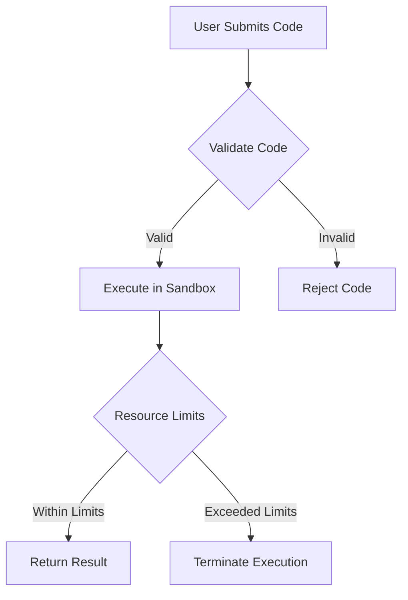

## 13.14 Execution Sandboxing and Security

In the world of software development, running untrusted code safely is a critical concern. Whether you're developing an online code runner, a plugin system, or any application that executes user-submitted code, ensuring the security and integrity of your system is paramount. This section delves into the concepts of execution sandboxing and security in Lua, providing you with the tools and knowledge to isolate code execution environments effectively.

### Running Untrusted Code Safely

Running untrusted code involves executing code that originates from an external source, which may not be fully trusted. This can pose significant security risks, including unauthorized access to sensitive data, system compromise, and resource exhaustion. To mitigate these risks, we employ execution sandboxing—a technique that isolates code execution environments to prevent malicious activities.

#### Implementing Sandboxes

A sandbox is a controlled environment where code can be executed with restricted permissions. In Lua, implementing a sandbox involves creating a secure execution environment that limits access to sensitive functions and resources.

##### Restricted Environments

To create a restricted environment, we need to limit the functions and libraries available to the untrusted code. This can be achieved by creating a custom environment table that only includes safe functions. Here's a basic example:

```lua
-- Define a safe environment
local safe_env = {
    print = print,  -- Allow printing
    math = math,    -- Allow math operations
}

-- Function to execute code in a sandbox
function execute_in_sandbox(code)
    local func, err = load(code, "sandbox", "t", safe_env)
    if not func then
        return nil, err
    end
    return pcall(func)
end

-- Example usage
local code = [[
    print("Hello, world!")
    return math.sqrt(16)
]]

local success, result = execute_in_sandbox(code)
if success then
    print("Result:", result)
else
    print("Error:", result)
end
```

In this example, we define a `safe_env` table that includes only the `print` function and the `math` library. The `execute_in_sandbox` function loads and executes the code within this restricted environment, preventing access to any other global functions or libraries.

##### Resource Limits

In addition to restricting the environment, it's crucial to control the execution time and memory usage of the untrusted code. This prevents resource exhaustion attacks, where malicious code consumes excessive CPU or memory resources.

Lua does not provide built-in mechanisms for setting resource limits, but you can achieve this by using external libraries or tools. For example, you can use the `lua-sandbox` library, which allows you to set execution time limits and memory usage restrictions.

### Security Measures

Implementing a sandbox is only part of the solution. We must also apply additional security measures to ensure the safety of our execution environment.

#### Preventing Escapes

One of the primary concerns when running untrusted code is preventing it from escaping the sandbox and accessing restricted resources. This involves securing metatables and global variables.

- **Securing Metatables**: Metatables can be used to override default behaviors in Lua. To prevent unauthorized modifications, ensure that metatables are not accessible from the sandboxed environment.
- **Securing Global Variables**: Limit access to global variables by using a custom environment table, as demonstrated in the previous example.

#### Input Validation

Before executing any code, it's essential to validate the input to ensure that only safe code is executed. This involves checking for potentially dangerous constructs, such as `os.execute` or `io.popen`, which can be used to execute system commands.

Here's an example of a simple input validation function:

```lua
-- Function to validate code input
function validate_code(code)
    local forbidden_patterns = {"os%.execute", "io%.popen"}
    for _, pattern in ipairs(forbidden_patterns) do
        if code:match(pattern) then
            return false, "Forbidden pattern detected: " .. pattern
        end
    end
    return true
end

-- Example usage
local code = [[
    print("Hello, world!")
    os.execute("rm -rf /")
]]

local is_valid, err = validate_code(code)
if not is_valid then
    print("Validation failed:", err)
else
    -- Execute code if valid
end
```

In this example, the `validate_code` function checks for forbidden patterns in the input code. If any are found, it returns an error message, preventing the code from being executed.

### Use Cases and Examples

Execution sandboxing and security are applicable in various scenarios, including online code runners and plugin systems.

#### Online Code Runners

Online code runners allow users to submit and execute code in a controlled environment. By implementing a sandbox, you can ensure that user-submitted code does not compromise the security of your system.

#### Plugin Systems

Plugin systems enable users to extend the functionality of an application by writing custom plugins. By sandboxing plugin execution, you can allow users to enhance your application without risking security breaches.

### Visualizing Execution Sandboxing

To better understand the concept of execution sandboxing, let's visualize the process using a flowchart.



**Figure 1**: This flowchart illustrates the process of executing user-submitted code in a sandbox. The code is first validated, then executed in a sandbox if valid. Resource limits are enforced during execution, and the result is returned if the execution completes within limits.

### Try It Yourself

To reinforce your understanding of execution sandboxing, try modifying the code examples provided. Experiment with different environment restrictions, input validation patterns, and resource limits. Consider creating a more complex sandbox that supports additional safe functions and libraries.

### References and Links

- [Lua 5.4 Reference Manual](https://www.lua.org/manual/5.4/)
- [lua-sandbox GitHub Repository](https://github.com/Neopallium/lua-sandbox)
- [Secure Lua Sandboxing Techniques](https://www.lua.org/pil/14.1.html)

### Knowledge Check

- What is execution sandboxing, and why is it important?
- How can you restrict the environment in which untrusted code is executed?
- What are some common security measures to prevent sandbox escapes?
- How can input validation enhance the security of code execution?
- What are some use cases for execution sandboxing in software development?

### Embrace the Journey

Remember, mastering execution sandboxing and security is a journey. As you continue to explore and experiment, you'll develop a deeper understanding of how to protect your applications from potential threats. Stay curious, keep learning, and enjoy the process!

## Quiz Time!



### What is the primary purpose of execution sandboxing?

- [x] To isolate code execution environments and prevent malicious activities
- [ ] To enhance the performance of Lua scripts
- [ ] To simplify code debugging
- [ ] To improve code readability

> **Explanation:** Execution sandboxing is primarily used to isolate code execution environments, preventing malicious activities and ensuring security.


### Which Lua function is used to load and execute code in a sandbox?

- [x] load
- [ ] require
- [ ] dofile
- [ ] loadfile

> **Explanation:** The `load` function is used to load and execute code in a sandbox, allowing you to specify a custom environment.


### What is a common method for restricting the environment in a Lua sandbox?

- [x] Creating a custom environment table with limited functions
- [ ] Using global variables
- [ ] Disabling the Lua interpreter
- [ ] Running code in a separate thread

> **Explanation:** A common method for restricting the environment in a Lua sandbox is to create a custom environment table with limited functions.


### What is the purpose of input validation in execution sandboxing?

- [x] To ensure only safe code is executed
- [ ] To improve code performance
- [ ] To enhance code readability
- [ ] To simplify debugging

> **Explanation:** Input validation ensures that only safe code is executed, preventing potentially dangerous constructs from being run.


### Which of the following is a potential risk of running untrusted code?

- [x] Unauthorized access to sensitive data
- [ ] Improved code performance
- [ ] Enhanced code readability
- [ ] Simplified debugging

> **Explanation:** Running untrusted code can lead to unauthorized access to sensitive data, posing a significant security risk.


### What is a common use case for execution sandboxing?

- [x] Online code runners
- [ ] Code refactoring
- [ ] Performance optimization
- [ ] Code documentation

> **Explanation:** Online code runners are a common use case for execution sandboxing, as they allow user-submitted code to be executed safely.


### How can you prevent sandbox escapes in Lua?

- [x] Securing metatables and global variables
- [ ] Disabling the Lua interpreter
- [ ] Running code in a separate thread
- [ ] Using global variables

> **Explanation:** Preventing sandbox escapes involves securing metatables and global variables to restrict unauthorized access.


### What is a potential consequence of not setting resource limits in a sandbox?

- [x] Resource exhaustion attacks
- [ ] Improved code readability
- [ ] Enhanced code performance
- [ ] Simplified debugging

> **Explanation:** Not setting resource limits can lead to resource exhaustion attacks, where malicious code consumes excessive resources.


### What is the role of the `pcall` function in sandboxing?

- [x] To execute code safely and handle errors
- [ ] To load code into a sandbox
- [ ] To improve code performance
- [ ] To simplify debugging

> **Explanation:** The `pcall` function is used to execute code safely and handle errors, ensuring that exceptions do not crash the program.


### True or False: Execution sandboxing can be used to enhance the performance of Lua scripts.

- [ ] True
- [x] False

> **Explanation:** Execution sandboxing is primarily focused on security, not performance enhancement. Its main purpose is to isolate code execution environments to prevent malicious activities.




