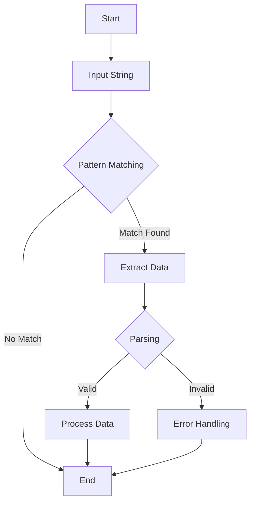

## 13.2 Pattern Matching and Parsing

Pattern matching and parsing are fundamental techniques in programming, especially when dealing with text processing, data extraction, and language interpretation. Lua, with its lightweight and efficient design, offers powerful pattern matching capabilities that are both flexible and easy to use. In this section, we will delve into the world of Lua patterns, exploring basic and advanced techniques, and demonstrate how these can be applied in real-world scenarios.

### Using Lua Patterns: Matching and Extracting Information from Strings

Lua patterns are a powerful tool for matching and extracting information from strings. They are similar to regular expressions in other languages but are simpler and more intuitive. Lua patterns are used in functions like `string.match`, `string.find`, `string.gsub`, and `string.gmatch`.

#### Implementing Pattern Matching

##### Basic Patterns: Literals, Character Classes, and Quantifiers

**Literals** are the simplest form of patterns. They match the exact characters in a string. For example, the pattern `"hello"` will match the string `"hello"`.

**Character Classes** allow you to match any character from a set. They are defined using square brackets. For example, `[abc]` matches any of the characters `a`, `b`, or `c`. You can also specify ranges, such as `[a-z]` to match any lowercase letter.

**Quantifiers** specify how many times a character or character class should be matched. The most common quantifiers are `*` (zero or more times), `+` (one or more times), and `-` (zero or more times, non-greedy).

```lua
local text = "hello world"
-- Match the word 'hello'
local match = string.match(text, "hello")
print(match)  -- Output: hello

-- Match any lowercase letter
local match = string.match(text, "[a-z]+")
print(match)  -- Output: hello

-- Match one or more spaces
local match = string.match(text, "%s+")
print(match)  -- Output: (a single space)
```

##### Captures: Extracting Substrings from Matches

Captures are used to extract parts of the string that match a pattern. They are defined using parentheses. For example, the pattern `"(hello)"` will capture the word `"hello"`.

```lua
local text = "hello world"
-- Capture the word 'hello'
local match = string.match(text, "(hello)")
print(match)  -- Output: hello

-- Capture two words separated by a space
local word1, word2 = string.match(text, "(%w+)%s+(%w+)")
print(word1, word2)  -- Output: hello world
```

##### Advanced Patterns: Balanced Matches and Frontier Patterns

**Balanced Matches** are used to match nested structures, such as parentheses or brackets. Lua provides the `%b` pattern for this purpose. For example, `%b()` matches balanced parentheses.

```lua
local text = "a (b (c) d) e"
-- Match balanced parentheses
local match = string.match(text, "%b()")
print(match)  -- Output: (b (c) d)
```

**Frontier Patterns** are used to match patterns at word boundaries. They are defined using `%f[]`. For example, `%f[%w]` matches a word boundary.

```lua
local text = "hello world"
-- Match 'world' at a word boundary
local match = string.match(text, "%f[%w]world")
print(match)  -- Output: world
```

### Parsing Techniques

Parsing involves analyzing a string to extract meaningful information. It is often used in language interpreters, data processing, and configuration file parsing.

#### Tokenization: Breaking Strings into Meaningful Tokens

Tokenization is the process of breaking a string into smaller components, called tokens. Tokens can be words, numbers, or symbols. In Lua, tokenization can be achieved using pattern matching and string manipulation functions.

```lua
local text = "name=John age=30"
local tokens = {}
for token in string.gmatch(text, "%w+=") do
    table.insert(tokens, token)
end
for _, token in ipairs(tokens) do
    print(token)
end
-- Output:
-- name=
-- age=
```

#### Recursive Parsing: Handling Nested Structures

Recursive parsing is used to handle nested structures, such as mathematical expressions or nested data formats like JSON or XML. In Lua, recursive parsing can be implemented using recursive functions and pattern matching.

```lua
local function parse_expression(expression)
    local function parse_term(expr)
        return string.match(expr, "%b()") or string.match(expr, "%d+")
    end

    local function parse(expr)
        local term = parse_term(expr)
        if term then
            return term, string.sub(expr, #term + 1)
        end
    end

    local result, remainder = parse(expression)
    return result, remainder
end

local expression = "(3 + (2 * 5))"
local result, remainder = parse_expression(expression)
print(result)  -- Output: (3 + (2 * 5))
```

### Use Cases and Examples

#### Text Processing: Validating and Transforming Input

Pattern matching and parsing are commonly used in text processing to validate and transform input. For example, you can use patterns to validate email addresses, phone numbers, or other input formats.

```lua
local function validate_email(email)
    local pattern = "^[%w._%%-]+@[%w.-]+%.[a-zA-Z]{2,4}$"
    return string.match(email, pattern) ~= nil
end

print(validate_email("test@example.com"))  -- Output: true
print(validate_email("invalid-email"))     -- Output: false
```

#### Language Interpreters: Parsing Code or Configuration Files

Pattern matching and parsing are essential in language interpreters for parsing code or configuration files. They allow you to extract and interpret commands, parameters, and values.

```lua
local function parse_config(config)
    local settings = {}
    for key, value in string.gmatch(config, "(%w+)=(%w+)") do
        settings[key] = value
    end
    return settings
end

local config = "host=localhost port=8080"
local settings = parse_config(config)
for key, value in pairs(settings) do
    print(key, value)
end
-- Output:
-- host localhost
-- port 8080
```

### Visualizing Pattern Matching and Parsing

To better understand the flow of pattern matching and parsing, let's visualize the process using a flowchart.



**Figure 1:** Flowchart illustrating the process of pattern matching and parsing in Lua.

### Try It Yourself

Experiment with the code examples provided in this section. Try modifying the patterns to match different strings or extract different parts of the input. For example, you can:

- Modify the email validation pattern to allow additional domains.
- Extend the configuration parser to handle more complex settings.
- Implement a simple calculator that parses and evaluates mathematical expressions.

### References and Links

- [Lua 5.4 Reference Manual - Patterns](https://www.lua.org/manual/5.4/manual.html#6.4.1)
- [Programming in Lua - Pattern Matching](https://www.lua.org/pil/20.2.html)
- [MDN Web Docs - Regular Expressions](https://developer.mozilla.org/en-US/docs/Web/JavaScript/Guide/Regular_Expressions)

### Knowledge Check

- What are the basic components of a Lua pattern?
- How do captures work in Lua patterns?
- What is the purpose of balanced matches in pattern matching?
- How can you tokenize a string in Lua?
- What is recursive parsing, and when is it used?

### Embrace the Journey

Remember, mastering pattern matching and parsing in Lua is a journey. As you practice and experiment with different patterns and parsing techniques, you'll become more proficient in handling complex text processing tasks. Keep exploring, stay curious, and enjoy the process!

## Quiz Time!



### What is the simplest form of a Lua pattern?

- [x] Literals
- [ ] Character Classes
- [ ] Quantifiers
- [ ] Captures

> **Explanation:** Literals match the exact characters in a string, making them the simplest form of a pattern.

### Which Lua pattern is used to match any character from a set?

- [ ] Literals
- [x] Character Classes
- [ ] Quantifiers
- [ ] Captures

> **Explanation:** Character classes, defined using square brackets, match any character from a specified set.

### What does the quantifier `*` signify in Lua patterns?

- [ ] One or more times
- [x] Zero or more times
- [ ] Exactly once
- [ ] At least once

> **Explanation:** The `*` quantifier matches zero or more occurrences of the preceding character or character class.

### How are captures defined in Lua patterns?

- [ ] Using square brackets
- [ ] Using curly braces
- [x] Using parentheses
- [ ] Using angle brackets

> **Explanation:** Captures are defined using parentheses to extract parts of the string that match a pattern.

### What is the purpose of balanced matches in Lua?

- [ ] To match word boundaries
- [x] To match nested structures
- [ ] To match any character
- [ ] To match exact strings

> **Explanation:** Balanced matches, defined using `%b`, are used to match nested structures like parentheses or brackets.

### How can you tokenize a string in Lua?

- [x] Using pattern matching and string manipulation functions
- [ ] Using only string.find
- [ ] Using only string.gsub
- [ ] Using only string.match

> **Explanation:** Tokenization can be achieved using pattern matching and various string manipulation functions like `string.gmatch`.

### What is recursive parsing used for?

- [ ] Validating email addresses
- [ ] Matching word boundaries
- [x] Handling nested structures
- [ ] Extracting substrings

> **Explanation:** Recursive parsing is used to handle nested structures, such as mathematical expressions or nested data formats.

### Which pattern matches balanced parentheses in Lua?

- [ ] %f[]
- [ ] %w+
- [x] %b()
- [ ] %s+

> **Explanation:** The `%b()` pattern is used to match balanced parentheses in Lua.

### What is the output of the following code snippet?
```lua
local text = "hello world"
local match = string.match(text, "%f[%w]world")
print(match)
```

- [ ] hello
- [x] world
- [ ] (a single space)
- [ ] nil

> **Explanation:** The `%f[%w]world` pattern matches 'world' at a word boundary, resulting in the output "world".

### True or False: Lua patterns are as complex as regular expressions in other languages.

- [ ] True
- [x] False

> **Explanation:** Lua patterns are simpler and more intuitive compared to regular expressions in other languages.


