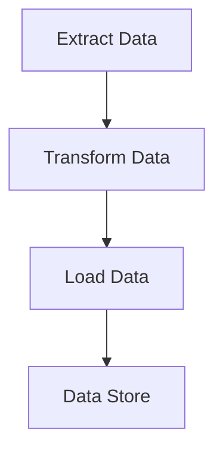

## 13.3 Data Transformation Pipelines

In the world of data processing, the ability to efficiently transform and manipulate data is paramount. Data transformation pipelines are a powerful design pattern that allows developers to process data through a series of transformation steps, often referred to as chaining operations. This section will delve into how to implement these pipelines in Lua, leveraging functional composition and streaming data techniques. We'll explore practical use cases such as ETL (Extract, Transform, Load) processes and data cleaning, providing you with the tools to handle complex data workflows effectively.

### Chaining Operations: Processing Data Through a Series of Transformation Steps

Chaining operations involve linking multiple data transformation functions together, where the output of one function becomes the input of the next. This approach promotes modularity and reusability, allowing developers to build complex data processing workflows from simple, well-defined components.

#### Implementing Pipelines in Lua

Implementing data transformation pipelines in Lua involves several key concepts, including functional composition and streaming data. Let's explore these concepts in detail.

#### Functional Composition: Combining Functions to Process Data

Functional composition is the process of combining simple functions to build more complex ones. In Lua, this can be achieved by defining a series of functions that each perform a specific transformation on the data, and then chaining them together.

**Example: Basic Functional Composition in Lua**

```lua
-- Define simple transformation functions
local function double(x)
    return x * 2
end

local function increment(x)
    return x + 1
end

-- Compose functions to create a pipeline
local function compose(...)
    local functions = {...}
    return function(x)
        for _, func in ipairs(functions) do
            x = func(x)
        end
        return x
    end
end

-- Create a pipeline that doubles and then increments a number
local pipeline = compose(double, increment)

-- Test the pipeline
local result = pipeline(3) -- Output: 7
print("Pipeline result:", result)
```

In this example, we define two simple functions, `double` and `increment`, and then use a `compose` function to chain them together. The `compose` function takes a variable number of functions as arguments and returns a new function that applies each of them in sequence.

#### Streaming Data: Handling Data as It Becomes Available

Streaming data involves processing data in real-time as it becomes available, rather than waiting for the entire dataset to be loaded. This is particularly useful for handling large datasets or real-time data feeds.

**Example: Streaming Data with Coroutines in Lua**

```lua
-- Define a coroutine to simulate streaming data
local function dataStream()
    return coroutine.wrap(function()
        for i = 1, 5 do
            coroutine.yield(i)
        end
    end)
end

-- Define a transformation function
local function transformData(data)
    return data * 2
end

-- Process the data stream
local stream = dataStream()
for data in stream do
    local transformed = transformData(data)
    print("Transformed data:", transformed)
end
```

In this example, we use a coroutine to simulate a data stream, yielding numbers from 1 to 5. The `transformData` function is applied to each piece of data as it becomes available, demonstrating how to handle streaming data in Lua.

### Use Cases and Examples

Data transformation pipelines are applicable in a wide range of scenarios. Let's explore two common use cases: ETL processes and data cleaning.

#### ETL Processes: Extracting, Transforming, and Loading Data

ETL processes involve extracting data from various sources, transforming it into a desired format, and loading it into a target system. Lua's flexibility and simplicity make it an excellent choice for implementing ETL pipelines.

**Example: Simple ETL Pipeline in Lua**

```lua
-- Define a function to extract data
local function extractData()
    return {1, 2, 3, 4, 5}
end

-- Define a function to transform data
local function transformData(data)
    local transformed = {}
    for _, value in ipairs(data) do
        table.insert(transformed, value * 2)
    end
    return transformed
end

-- Define a function to load data
local function loadData(data)
    for _, value in ipairs(data) do
        print("Loading data:", value)
    end
end

-- Implement the ETL pipeline
local function etlPipeline()
    local data = extractData()
    local transformedData = transformData(data)
    loadData(transformedData)
end

-- Execute the ETL pipeline
etlPipeline()
```

This example demonstrates a simple ETL pipeline in Lua, where data is extracted from a source, transformed by doubling each value, and then loaded by printing each transformed value.

#### Data Cleaning: Normalizing and Validating Datasets

Data cleaning involves normalizing and validating datasets to ensure consistency and accuracy. Lua's string manipulation capabilities and functional programming features make it well-suited for data cleaning tasks.

**Example: Data Cleaning Pipeline in Lua**

```lua
-- Define a function to normalize data
local function normalizeData(data)
    return string.lower(data)
end

-- Define a function to validate data
local function validateData(data)
    return string.match(data, "^%a+$") ~= nil
end

-- Implement the data cleaning pipeline
local function cleanDataPipeline(data)
    local cleanedData = {}
    for _, value in ipairs(data) do
        local normalized = normalizeData(value)
        if validateData(normalized) then
            table.insert(cleanedData, normalized)
        end
    end
    return cleanedData
end

-- Test the data cleaning pipeline
local rawData = {"Hello", "WORLD", "123", "Lua"}
local cleanedData = cleanDataPipeline(rawData)
for _, value in ipairs(cleanedData) do
    print("Cleaned data:", value)
end
```

In this example, we define a data cleaning pipeline that normalizes strings to lowercase and validates them to ensure they contain only alphabetic characters. The pipeline processes a list of raw data, filtering out invalid entries.

### Visualizing Data Transformation Pipelines

To better understand the flow of data through a transformation pipeline, let's visualize the process using a flowchart.



This flowchart represents a typical ETL pipeline, where data is extracted, transformed, and loaded into a data store. Each step can be implemented as a separate function in Lua, allowing for modular and reusable code.

### Try It Yourself

Experiment with the code examples provided by modifying the transformation functions or adding new steps to the pipelines. For instance, try adding a filtering step to the ETL pipeline to remove certain values before loading them. This hands-on approach will deepen your understanding of data transformation pipelines in Lua.

### References and Links

For further reading on data transformation pipelines and related concepts, consider exploring the following resources:

- [MDN Web Docs on Functional Programming](https://developer.mozilla.org/en-US/docs/Glossary/Functional_programming)
- [W3Schools on Data Processing](https://www.w3schools.com/python/python_ml_data_processing.asp)

### Knowledge Check

To reinforce your understanding of data transformation pipelines in Lua, let's pose a few questions and challenges.

1. How can you modify the `compose` function to handle asynchronous operations?
2. What are the benefits of using coroutines for streaming data in Lua?
3. Implement a data transformation pipeline that includes a filtering step.

### Embrace the Journey

Remember, mastering data transformation pipelines is just the beginning. As you progress, you'll be able to tackle more complex data processing tasks and build robust, efficient applications. Keep experimenting, stay curious, and enjoy the journey!

## Quiz Time!



### What is the primary purpose of a data transformation pipeline?

- [x] To process data through a series of transformation steps
- [ ] To store data in a database
- [ ] To visualize data
- [ ] To encrypt data

> **Explanation:** A data transformation pipeline processes data through a series of transformation steps, allowing for modular and reusable data processing workflows.

### How does functional composition benefit data transformation pipelines?

- [x] It allows combining simple functions to build complex workflows
- [ ] It increases the speed of data processing
- [ ] It reduces memory usage
- [ ] It simplifies data storage

> **Explanation:** Functional composition allows developers to combine simple functions to build complex workflows, promoting modularity and reusability.

### What Lua feature is particularly useful for handling streaming data?

- [x] Coroutines
- [ ] Tables
- [ ] Metatables
- [ ] Strings

> **Explanation:** Coroutines in Lua are particularly useful for handling streaming data, as they allow for real-time data processing.

### In the ETL pipeline example, what is the purpose of the `transformData` function?

- [x] To modify the data before loading it
- [ ] To extract data from a source
- [ ] To load data into a target system
- [ ] To validate the data

> **Explanation:** The `transformData` function modifies the data before loading it, which is a key step in the ETL process.

### What does the `validateData` function do in the data cleaning pipeline example?

- [x] It checks if the data contains only alphabetic characters
- [ ] It converts data to uppercase
- [ ] It removes duplicates from the data
- [ ] It sorts the data

> **Explanation:** The `validateData` function checks if the data contains only alphabetic characters, ensuring data validity.

### How can you visualize a data transformation pipeline?

- [x] Using a flowchart
- [ ] Using a pie chart
- [ ] Using a bar graph
- [ ] Using a scatter plot

> **Explanation:** A flowchart is an effective way to visualize a data transformation pipeline, showing the flow of data through each step.

### What is a common use case for data transformation pipelines?

- [x] ETL processes
- [ ] Image processing
- [ ] Audio editing
- [ ] Game development

> **Explanation:** ETL processes are a common use case for data transformation pipelines, involving extracting, transforming, and loading data.

### What is the benefit of using a `compose` function in Lua?

- [x] It allows chaining multiple functions together
- [ ] It increases the speed of function execution
- [ ] It reduces the size of the code
- [ ] It simplifies error handling

> **Explanation:** The `compose` function allows chaining multiple functions together, creating a pipeline for data processing.

### What is the role of the `dataStream` function in the streaming data example?

- [x] To simulate a data stream using a coroutine
- [ ] To transform data
- [ ] To load data into a database
- [ ] To validate data

> **Explanation:** The `dataStream` function simulates a data stream using a coroutine, yielding data in real-time.

### True or False: Data transformation pipelines can only be used for numerical data.

- [ ] True
- [x] False

> **Explanation:** False. Data transformation pipelines can be used for various types of data, including numerical, textual, and more.




