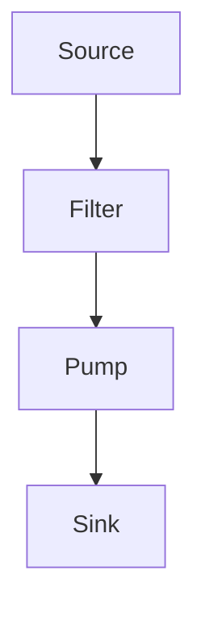

## 13.4 Filters, Sources, Sinks, and Pumps in Data Streams

In the realm of data processing, the concepts of filters, sources, sinks, and pumps play a crucial role in managing and transforming data streams. These components allow developers to build modular, reusable, and efficient data processing systems. In this section, we will delve into these components, explore their implementation in Lua, and provide practical examples to illustrate their use in real-world applications.

### Modular Data Processing

Modular data processing involves breaking down a data processing task into smaller, manageable components. Each component has a specific role, and together they form a pipeline that processes data from start to finish. Let's explore the key components:

#### Components

1. **Sources**: These are the producers of data. A source might read data from a file, a network socket, or generate data programmatically.

2. **Sinks**: These are the consumers of data. A sink might write data to a file, send it over a network, or display it to the user.

3. **Filters**: Filters transform data as it flows from sources to sinks. They can modify, enrich, or filter data based on specific criteria.

4. **Pumps**: Pumps control the movement of data through the pipeline. They manage the flow rate and ensure data is processed in a timely manner.

### Implementing Stream Components

In Lua, we can implement these components using coroutines and iterators, which facilitate the flow of data through the pipeline. Let's explore how to implement each component.

#### Coroutines and Iterators

Coroutines in Lua are a powerful feature that allows functions to yield and resume execution, making them ideal for implementing data streams. Iterators, on the other hand, provide a way to traverse data structures. Together, they enable efficient data flow management.

**Example: Implementing a Source**

```lua
-- A simple source that generates numbers from 1 to n
function numberSource(n)
    return coroutine.wrap(function()
        for i = 1, n do
            coroutine.yield(i)
        end
    end)
end

-- Usage
local source = numberSource(5)
for number in source do
    print(number)  -- Outputs: 1, 2, 3, 4, 5
end
```

In this example, `numberSource` is a coroutine that generates numbers from 1 to `n`. The `coroutine.wrap` function creates an iterator that yields each number.

**Example: Implementing a Filter**

```lua
-- A filter that doubles each number
function doubleFilter(input)
    return coroutine.wrap(function()
        for value in input do
            coroutine.yield(value * 2)
        end
    end)
end

-- Usage
local source = numberSource(5)
local filtered = doubleFilter(source)
for number in filtered do
    print(number)  -- Outputs: 2, 4, 6, 8, 10
end
```

The `doubleFilter` function takes an input iterator and returns a new iterator that yields doubled values.

**Example: Implementing a Sink**

```lua
-- A sink that prints each value
function printSink(input)
    for value in input do
        print("Sink received:", value)
    end
end

-- Usage
local source = numberSource(5)
local filtered = doubleFilter(source)
printSink(filtered)
```

The `printSink` function consumes the input iterator and prints each value.

**Example: Implementing a Pump**

```lua
-- A pump that controls the flow of data
function controlledPump(input, delay)
    return coroutine.wrap(function()
        for value in input do
            coroutine.yield(value)
            os.execute("sleep " .. delay)  -- Introduce a delay
        end
    end)
end

-- Usage
local source = numberSource(5)
local filtered = doubleFilter(source)
local pumped = controlledPump(filtered, 1)
printSink(pumped)
```

The `controlledPump` function introduces a delay between each yielded value, simulating controlled data flow.

### Composition

Composition allows us to combine these components to build complex data processing pipelines. By chaining sources, filters, sinks, and pumps, we can create flexible and reusable processing systems.

**Example: Composing a Data Processing Pipeline**

```lua
-- Compose a pipeline
local source = numberSource(5)
local filtered = doubleFilter(source)
local pumped = controlledPump(filtered, 1)
printSink(pumped)
```

In this example, we compose a pipeline that generates numbers, doubles them, controls the flow, and prints the results.

### Use Cases and Examples

Let's explore some practical use cases for these components.

#### Network Data Processing

In network applications, data often arrives in streams. By using sources, filters, sinks, and pumps, we can efficiently process real-time data.

**Example: Network Data Processing**

```lua
-- Simulate a network data source
function networkSource()
    return coroutine.wrap(function()
        local data = {"Hello", "World", "Lua", "Rocks"}
        for _, message in ipairs(data) do
            coroutine.yield(message)
        end
    end)
end

-- A filter that converts messages to uppercase
function uppercaseFilter(input)
    return coroutine.wrap(function()
        for message in input do
            coroutine.yield(string.upper(message))
        end
    end)
end

-- Usage
local source = networkSource()
local filtered = uppercaseFilter(source)
printSink(filtered)
```

In this example, `networkSource` simulates receiving messages from a network. The `uppercaseFilter` converts each message to uppercase before passing it to the sink.

#### Modular System Design

By designing systems with modular components, we can build reusable processing blocks that can be easily combined and extended.

**Example: Modular System Design**

```lua
-- A reusable filter that adds a prefix to messages
function prefixFilter(input, prefix)
    return coroutine.wrap(function()
        for message in input do
            coroutine.yield(prefix .. message)
        end
    end)
end

-- Usage
local source = networkSource()
local prefixed = prefixFilter(source, "[INFO] ")
local filtered = uppercaseFilter(prefixed)
printSink(filtered)
```

In this example, `prefixFilter` adds a prefix to each message. By composing it with other filters, we can create a flexible processing pipeline.

### Visualizing Data Flow

To better understand the flow of data through these components, let's visualize the process using a diagram.



**Diagram Description**: This diagram illustrates the flow of data from a source through a filter and a pump, finally reaching a sink. Each component plays a specific role in processing the data stream.

### Knowledge Check

Let's reinforce our understanding of these concepts with a few questions:

- What is the role of a source in a data processing pipeline?
- How can filters be used to transform data?
- What is the purpose of a pump in a data stream?
- How can we compose multiple components to build a complex processing system?

### Embrace the Journey

Remember, mastering these concepts is just the beginning. As you continue to explore Lua and data processing, you'll discover new ways to optimize and enhance your systems. Keep experimenting, stay curious, and enjoy the journey!

### References and Links

For further reading on data processing and Lua programming, consider exploring the following resources:

- [Lua 5.4 Reference Manual](https://www.lua.org/manual/5.4/)
- [Programming in Lua](https://www.lua.org/pil/)
- [Coroutines in Lua](https://www.lua.org/manual/5.4/manual.html#2.6)

## Quiz Time!



### What is the primary role of a source in a data processing pipeline?

- [x] To produce data
- [ ] To consume data
- [ ] To transform data
- [ ] To control data flow

> **Explanation:** A source is responsible for producing data in a data processing pipeline.

### How do filters transform data in a pipeline?

- [x] By modifying or enriching data
- [ ] By consuming data
- [ ] By producing data
- [ ] By controlling data flow

> **Explanation:** Filters modify or enrich data as it flows from sources to sinks.

### What is the purpose of a sink in a data processing pipeline?

- [ ] To produce data
- [x] To consume data
- [ ] To transform data
- [ ] To control data flow

> **Explanation:** A sink is responsible for consuming data in a data processing pipeline.

### How can pumps control data flow in a pipeline?

- [x] By managing the flow rate
- [ ] By transforming data
- [ ] By producing data
- [ ] By consuming data

> **Explanation:** Pumps manage the flow rate and ensure data is processed in a timely manner.

### What Lua feature is ideal for implementing data streams?

- [x] Coroutines
- [ ] Tables
- [ ] Metatables
- [ ] Functions

> **Explanation:** Coroutines in Lua allow functions to yield and resume execution, making them ideal for implementing data streams.

### How can we compose multiple components in a data processing system?

- [x] By chaining sources, filters, sinks, and pumps
- [ ] By using only sources and sinks
- [ ] By avoiding filters
- [ ] By using only pumps

> **Explanation:** We can compose multiple components by chaining sources, filters, sinks, and pumps to build complex processing systems.

### What is a common use case for modular data processing?

- [x] Network data processing
- [ ] Static data processing
- [ ] Manual data entry
- [ ] Data storage

> **Explanation:** Modular data processing is commonly used in network data processing to handle real-time data streams.

### What does a filter do in a data processing pipeline?

- [x] Transforms data
- [ ] Consumes data
- [ ] Produces data
- [ ] Controls data flow

> **Explanation:** A filter transforms data as it flows from sources to sinks.

### What is the benefit of using modular components in system design?

- [x] Reusability and flexibility
- [ ] Increased complexity
- [ ] Reduced performance
- [ ] Limited scalability

> **Explanation:** Modular components provide reusability and flexibility, making it easier to build and extend systems.

### True or False: A pump can introduce delays in data processing.

- [x] True
- [ ] False

> **Explanation:** A pump can introduce delays to control the flow of data through the pipeline.


