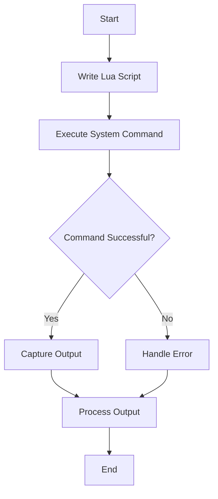

## 13.5 Automation Scripting with Lua

Automation scripting is a powerful tool for software engineers and architects, allowing them to streamline repetitive tasks and improve efficiency. Lua, with its lightweight nature and ease of integration, is an excellent choice for automation scripting. In this section, we will explore how to use Lua for automating tasks and processes, focusing on common automation tasks, integrating with the operating system, and providing use cases and examples.

### Automating Tasks and Processes

Automation scripting involves writing scripts to perform repetitive tasks, reducing the need for manual intervention. Lua's simplicity and flexibility make it an ideal language for automation, allowing developers to quickly write scripts that can interact with the operating system and perform a wide range of tasks.

#### Common Automation Tasks

Automation tasks can vary widely depending on the needs of the organization or individual. Here are some common tasks that can be automated using Lua:

- **File Management**: Automating file operations such as copying, moving, or organizing files can save time and reduce errors. Lua scripts can be used to manage files on local or remote systems, ensuring that files are organized and accessible.

- **System Administration**: Managing system processes, users, or configurations can be complex and time-consuming. Lua scripts can automate these tasks, allowing administrators to focus on more strategic activities.

#### Integrating with the Operating System

To effectively automate tasks, Lua scripts need to interact with the operating system. Lua provides several functions for executing system commands and accessing environmental variables, making it easy to integrate with the operating system.

##### Executing System Commands

Lua provides the `os.execute()` and `io.popen()` functions for executing system commands. These functions allow Lua scripts to run shell commands and capture their output, enabling a wide range of automation tasks.

- **`os.execute()`**: This function executes a command in the system's command interpreter. It returns a status code indicating the success or failure of the command.

```lua
-- Execute a system command to list files in the current directory
local status = os.execute("ls -l")
if status == 0 then
    print("Command executed successfully")
else
    print("Command execution failed")
end
```

- **`io.popen()`**: This function opens a process by executing a command and returns a file handle that can be used to read the command's output.

```lua
-- Execute a system command and capture its output
local handle = io.popen("ls -l")
local result = handle:read("*a")
handle:close()
print(result)
```

##### Environmental Variables

Environmental variables are used to store system settings and configuration information. Lua scripts can access and modify these variables using the `os.getenv()` and `os.setenv()` functions.

- **`os.getenv()`**: This function retrieves the value of an environmental variable.

```lua
-- Get the value of the PATH environmental variable
local path = os.getenv("PATH")
print("PATH:", path)
```

- **`os.setenv()`**: This function sets the value of an environmental variable. Note that this function is not available in the standard Lua library and may require additional libraries or extensions.

```lua
-- Set the value of a custom environmental variable
os.setenv("MY_VAR", "Hello, World!")
print("MY_VAR:", os.getenv("MY_VAR"))
```

### Use Cases and Examples

Automation scripting with Lua can be applied to a wide range of use cases. Here are some examples of how Lua can be used to automate tasks:

#### Deployment Scripts

Automating software deployment can save time and reduce errors. Lua scripts can be used to automate the deployment process, ensuring that software is installed and configured correctly.

```lua
-- Example deployment script
local function deploy_software()
    -- Download the software package
    os.execute("wget http://example.com/software.tar.gz")

    -- Extract the package
    os.execute("tar -xzf software.tar.gz")

    -- Run the installation script
    os.execute("./install.sh")

    print("Software deployed successfully")
end

deploy_software()
```

#### Bulk Operations

Applying changes across multiple files or systems can be time-consuming and error-prone. Lua scripts can automate these bulk operations, ensuring that changes are applied consistently and accurately.

```lua
-- Example script to rename files in a directory
local function rename_files(directory, old_extension, new_extension)
    local command = string.format("find %s -type f -name '*.%s' -exec rename 's/\\.%s$/\\.%s/' {} \\;", directory, old_extension, old_extension, new_extension)
    os.execute(command)
    print("Files renamed successfully")
end

rename_files("/path/to/directory", "txt", "md")
```

### Visualizing Automation Scripting with Lua

To better understand how Lua interacts with the operating system for automation scripting, let's visualize the process using a flowchart.



**Figure 1**: This flowchart illustrates the process of automation scripting with Lua, from writing the script to executing system commands and handling the output.

### Try It Yourself

Experiment with the code examples provided in this section. Try modifying the scripts to perform different tasks or integrate with different system commands. For example, you could:

- Modify the deployment script to install a different software package.
- Change the file renaming script to organize files by date or size.
- Create a new script to automate a task specific to your environment.

### References and Links

For further reading on Lua and automation scripting, consider the following resources:

- [Lua 5.4 Reference Manual](https://www.lua.org/manual/5.4/)
- [Lua Users Wiki](http://lua-users.org/wiki/)
- [Lua Programming on W3Schools](https://www.w3schools.com/lua/)

### Knowledge Check

To reinforce your understanding of automation scripting with Lua, consider the following questions:

- What are some common tasks that can be automated using Lua?
- How can Lua scripts interact with the operating system to execute commands?
- What is the difference between `os.execute()` and `io.popen()`?
- How can environmental variables be accessed and modified in Lua scripts?

### Embrace the Journey

Remember, automation scripting is a powerful tool that can save time and reduce errors. As you continue to explore Lua and automation scripting, keep experimenting and learning. The possibilities are endless, and the skills you develop will be valuable in any software engineering or architecture role.

## Quiz Time!



### What is a common use case for automation scripting with Lua?

- [x] File management
- [ ] Game development
- [ ] Web design
- [ ] Graphic design

> **Explanation:** Automation scripting with Lua is commonly used for tasks like file management, which involves copying, moving, or organizing files.

### Which Lua function is used to execute a system command and capture its output?

- [ ] os.execute()
- [x] io.popen()
- [ ] os.getenv()
- [ ] os.setenv()

> **Explanation:** The `io.popen()` function is used to execute a system command and capture its output in Lua.

### How can environmental variables be accessed in Lua?

- [x] Using os.getenv()
- [ ] Using io.popen()
- [ ] Using os.execute()
- [ ] Using io.read()

> **Explanation:** Environmental variables can be accessed in Lua using the `os.getenv()` function.

### What is the purpose of automation scripting?

- [x] To perform repetitive tasks automatically
- [ ] To create graphical user interfaces
- [ ] To develop video games
- [ ] To design web pages

> **Explanation:** Automation scripting is used to perform repetitive tasks automatically, reducing the need for manual intervention.

### Which function is not available in the standard Lua library for setting environmental variables?

- [ ] os.getenv()
- [x] os.setenv()
- [ ] io.popen()
- [ ] os.execute()

> **Explanation:** The `os.setenv()` function is not available in the standard Lua library and may require additional libraries or extensions.

### What is the output of the following Lua script?
```lua
local handle = io.popen("echo Hello, World!")
local result = handle:read("*a")
handle:close()
print(result)
```

- [x] Hello, World!
- [ ] Error
- [ ] nil
- [ ] 0

> **Explanation:** The script uses `io.popen()` to execute the `echo` command, which outputs "Hello, World!".

### Which Lua function can be used to execute a command in the system's command interpreter?

- [x] os.execute()
- [ ] io.popen()
- [ ] os.getenv()
- [ ] os.setenv()

> **Explanation:** The `os.execute()` function is used to execute a command in the system's command interpreter.

### What is a benefit of using automation scripting?

- [x] Reducing errors in repetitive tasks
- [ ] Increasing manual workload
- [ ] Decreasing system performance
- [ ] Limiting task flexibility

> **Explanation:** Automation scripting reduces errors in repetitive tasks by automating processes that would otherwise require manual intervention.

### What is the role of `os.getenv()` in Lua?

- [x] To retrieve the value of an environmental variable
- [ ] To execute a system command
- [ ] To open a file for reading
- [ ] To set the value of an environmental variable

> **Explanation:** The `os.getenv()` function is used to retrieve the value of an environmental variable in Lua.

### True or False: Lua is not suitable for automation scripting.

- [ ] True
- [x] False

> **Explanation:** False. Lua is suitable for automation scripting due to its lightweight nature and ease of integration with the operating system.


