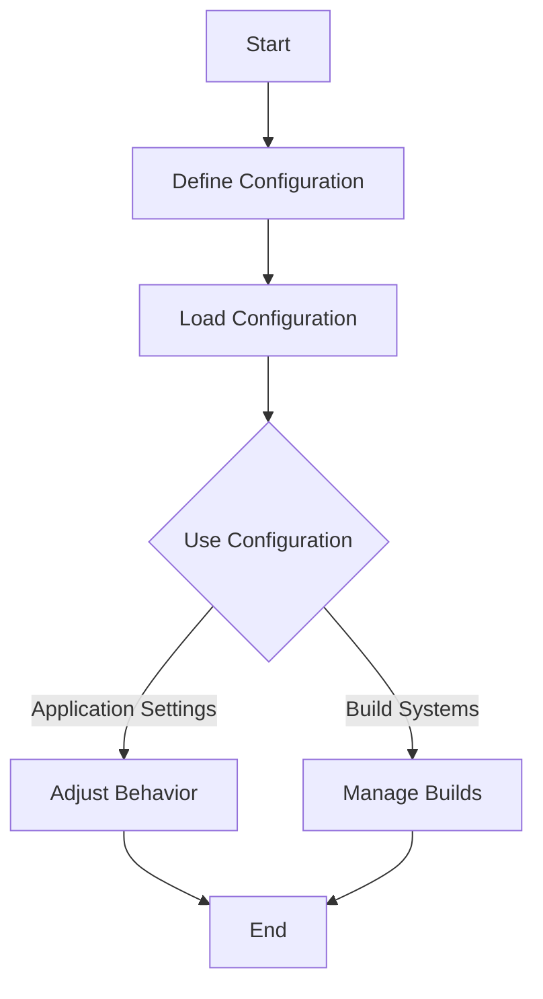

## 13.6 Configuration Management with Lua Scripts

In the realm of software engineering, configuration management plays a pivotal role in ensuring that applications are adaptable, maintainable, and scalable. Lua, with its lightweight and flexible nature, offers a unique approach to configuration management through scripting. This section delves into how Lua scripts can be leveraged for dynamic configuration, providing programmable settings and reusability across projects.

### Dynamic Configuration with Lua

Dynamic configuration refers to the ability to adjust application settings at runtime, allowing for greater flexibility and adaptability. Lua scripts excel in this area due to their interpretative nature and ease of integration.

#### Benefits of Using Lua for Configuration

1. **Programmable Settings**: Lua scripts allow for complex calculations and conditional logic within configuration files. This means that configurations can be adjusted based on runtime conditions or external inputs.

2. **Reusability**: Lua's modular nature enables the sharing of configuration logic across multiple projects, reducing redundancy and promoting consistency.

3. **Simplicity and Readability**: Lua's syntax is simple and easy to read, making configuration files more understandable and maintainable.

4. **Integration with Existing Systems**: Lua can be embedded into various applications, making it a versatile choice for configuration management.

### Implementing Configuration Scripts

To harness the power of Lua for configuration management, we need to understand how to define and load configurations effectively.

#### Defining Configurations

Configurations in Lua are typically defined using tables and functions. Tables in Lua are versatile data structures that can store various types of data, making them ideal for configuration purposes.

```lua
-- Define a configuration table
local config = {
    appName = "MyApp",
    version = "1.0.0",
    debug = true,
    database = {
        host = "localhost",
        port = 3306,
        user = "root",
        password = "password"
    },
    features = {
        enableLogging = true,
        maxConnections = 100
    }
}

-- Function to print configuration
local function printConfig(cfg)
    for key, value in pairs(cfg) do
        if type(value) == "table" then
            print(key .. ":")
            printConfig(value)
        else
            print(key .. " = " .. tostring(value))
        end
    end
end

-- Print the configuration
printConfig(config)
```

In this example, we define a configuration table with various settings, including application details and database credentials. The `printConfig` function recursively prints the configuration, demonstrating how tables can be used to structure complex configurations.

#### Loading Configurations

Loading configurations in Lua involves executing the script to obtain the settings. This can be done using the `dofile`, `loadfile`, or `require` functions, depending on the use case.

```lua
-- Load configuration from a file
local config = dofile("config.lua")

-- Access configuration values
print("Application Name: " .. config.appName)
print("Database Host: " .. config.database.host)
```

In this snippet, we use `dofile` to execute a Lua script containing configuration settings. This approach allows for dynamic loading and updating of configurations without recompiling the application.

### Use Cases and Examples

Lua's flexibility makes it suitable for a wide range of configuration management scenarios. Here are some common use cases:

#### Application Settings

Lua scripts can be used to configure software behavior, such as enabling or disabling features, setting thresholds, and defining user preferences.

```lua
-- Feature toggle configuration
local features = {
    logging = true,
    analytics = false,
    darkMode = true
}

-- Function to check if a feature is enabled
local function isFeatureEnabled(feature)
    return features[feature] or false
end

-- Usage
if isFeatureEnabled("logging") then
    print("Logging is enabled.")
end
```

This example demonstrates a simple feature toggle system using Lua tables, allowing developers to easily enable or disable features at runtime.

#### Build Systems

Lua can also be used to manage build parameters and dependencies, providing a programmable approach to build configuration.

```lua
-- Build configuration
local buildConfig = {
    target = "release",
    optimizations = true,
    includePaths = { "src/", "include/" },
    libraries = { "libmath", "libgraphics" }
}

-- Function to print build settings
local function printBuildSettings(cfg)
    print("Build Target: " .. cfg.target)
    print("Optimizations: " .. tostring(cfg.optimizations))
    print("Include Paths: " .. table.concat(cfg.includePaths, ", "))
    print("Libraries: " .. table.concat(cfg.libraries, ", "))
end

-- Print the build settings
printBuildSettings(buildConfig)
```

In this scenario, Lua scripts define build settings, such as target environments, optimization flags, and library dependencies. This approach allows for dynamic adjustments to the build process based on specific requirements.

### Visualizing Configuration Management

To better understand how Lua scripts facilitate configuration management, let's visualize the process using a flowchart.



**Figure 1: Configuration Management Workflow with Lua Scripts**

This flowchart illustrates the typical workflow for managing configurations with Lua scripts, from defining and loading configurations to utilizing them in various contexts.

### Try It Yourself

Experiment with the provided code examples by modifying the configuration settings or adding new features. For instance, try adding a new feature toggle or adjusting the build settings to see how the application behavior changes.

### References and Further Reading

- [Lua 5.4 Reference Manual](https://www.lua.org/manual/5.4/)
- [Programming in Lua](https://www.lua.org/pil/)
- [Lua Users Wiki](http://lua-users.org/wiki/)

### Knowledge Check

1. Explain the benefits of using Lua scripts for configuration management.
2. Demonstrate how to define a configuration using Lua tables.
3. Provide an example of loading a configuration script in Lua.
4. Discuss a use case where Lua-based configuration management is advantageous.

### Embrace the Journey

Remember, mastering configuration management with Lua scripts is just the beginning. As you continue to explore and experiment, you'll discover new ways to leverage Lua's flexibility and power in your projects. Stay curious, keep learning, and enjoy the journey!

## Quiz Time!



### What is a key benefit of using Lua for configuration management?

- [x] Programmable settings
- [ ] Static configurations
- [ ] Complex syntax
- [ ] Limited integration

> **Explanation:** Lua allows for programmable settings, enabling dynamic and flexible configurations.

### How are configurations typically defined in Lua?

- [x] Using tables and functions
- [ ] Using XML files
- [ ] Using JSON strings
- [ ] Using binary files

> **Explanation:** Configurations in Lua are often defined using tables and functions due to their flexibility and simplicity.

### Which Lua function is used to load a configuration script?

- [x] dofile
- [ ] print
- [ ] os.execute
- [ ] io.open

> **Explanation:** The `dofile` function is used to execute a Lua script and load its contents.

### What is a common use case for Lua-based configuration management?

- [x] Application settings
- [ ] Image processing
- [ ] Network routing
- [ ] Hardware design

> **Explanation:** Lua is commonly used for managing application settings due to its flexibility and ease of use.

### What is an advantage of using Lua for build systems?

- [x] Dynamic adjustments
- [ ] Static build files
- [ ] Complex dependencies
- [ ] Limited flexibility

> **Explanation:** Lua allows for dynamic adjustments to build parameters, making it suitable for build systems.

### What does the `printConfig` function do in the provided example?

- [x] Prints the configuration settings
- [ ] Loads the configuration file
- [ ] Saves the configuration to disk
- [ ] Deletes the configuration

> **Explanation:** The `printConfig` function recursively prints the configuration settings.

### How can Lua scripts enhance reusability in configuration management?

- [x] By sharing logic across projects
- [ ] By using static files
- [ ] By limiting functionality
- [ ] By increasing complexity

> **Explanation:** Lua scripts enhance reusability by allowing configuration logic to be shared across multiple projects.

### What is the purpose of the `isFeatureEnabled` function?

- [x] To check if a feature is enabled
- [ ] To disable a feature
- [ ] To load a feature
- [ ] To delete a feature

> **Explanation:** The `isFeatureEnabled` function checks if a specific feature is enabled based on the configuration.

### What does the flowchart in the article represent?

- [x] Configuration management workflow
- [ ] Database schema
- [ ] Network topology
- [ ] User interface design

> **Explanation:** The flowchart represents the workflow for managing configurations with Lua scripts.

### True or False: Lua scripts can only be used for static configurations.

- [ ] True
- [x] False

> **Explanation:** Lua scripts are used for dynamic configurations, allowing for flexibility and adaptability.


