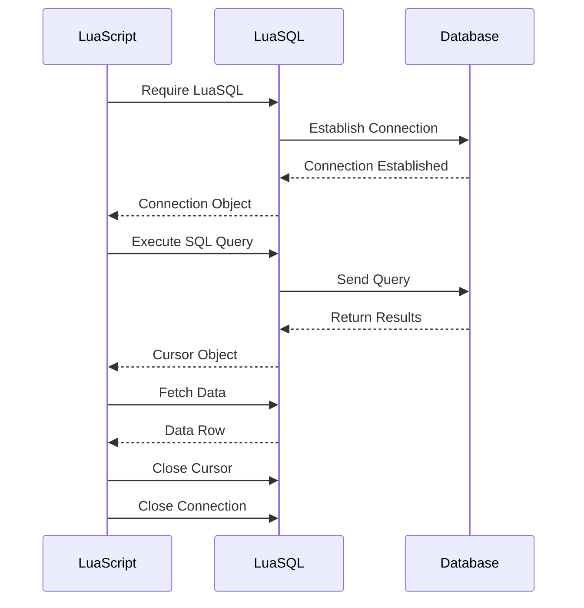

## 13.7 Interfacing with Databases

Interfacing with databases is a crucial aspect of modern software development, enabling applications to store, retrieve, and manipulate data efficiently. Lua, with its lightweight and flexible nature, provides robust capabilities for database interaction through libraries like LuaSQL. In this section, we will explore how to connect to databases, execute queries, and manage transactions using Lua, with a focus on LuaSQL.

### Connecting to Databases

To begin interfacing with databases in Lua, we need to establish a connection. LuaSQL is a popular library that provides a simple interface to connect to various databases such as MySQL, PostgreSQL, and SQLite. Let's dive into the process of setting up and using LuaSQL.

#### Using LuaSQL

LuaSQL is a binding for Lua that allows you to connect to databases and execute SQL statements. It supports several database systems, including MySQL, PostgreSQL, SQLite, and more. To use LuaSQL, you need to install the library and require it in your Lua script.

**Installation:**

To install LuaSQL, you can use LuaRocks, the package manager for Lua:

```bash
luarocks install luasql-mysql
luarocks install luasql-postgres
luarocks install luasql-sqlite3
```

**Requiring LuaSQL:**

Once installed, you can require LuaSQL in your Lua script:

```lua
local luasql = require "luasql.mysql"  -- For MySQL
-- local luasql = require "luasql.postgres"  -- For PostgreSQL
-- local luasql = require "luasql.sqlite3"  -- For SQLite
```

#### Establishing Connections

Establishing a connection to a database involves creating an environment and then opening a connection using the appropriate credentials.

**Opening a Connection:**

Here's how you can open a connection to a MySQL database:

```lua
local env = luasql.mysql()
local conn = env:connect('database_name', 'username', 'password', 'host', port)

if conn then
    print("Connection established!")
else
    print("Failed to connect.")
end
```

**Closing a Connection:**

Always remember to close the connection and environment when done:

```lua
conn:close()
env:close()
```

### Executing Queries

Once connected to a database, you can execute SQL queries to interact with the data. LuaSQL provides methods to run various SQL commands such as SELECT, INSERT, UPDATE, and DELETE.

#### SQL Commands

**Running Queries:**

To execute a query, use the `conn:execute` method. Here's an example of running a SELECT statement:

```lua
local cursor = conn:execute("SELECT * FROM users")

-- Fetching results
local row = cursor:fetch({}, "a")
while row do
    print(string.format("ID: %s, Name: %s", row.id, row.name))
    row = cursor:fetch(row, "a")
end

cursor:close()
```

**Inserting Data:**

To insert data into a table, use an INSERT statement:

```lua
local res = conn:execute("INSERT INTO users (name, email) VALUES ('John Doe', 'john@example.com')")
if res then
    print("Data inserted successfully!")
else
    print("Failed to insert data.")
end
```

**Updating Data:**

To update existing data, use an UPDATE statement:

```lua
local res = conn:execute("UPDATE users SET email = 'john.doe@example.com' WHERE name = 'John Doe'")
if res then
    print("Data updated successfully!")
else
    print("Failed to update data.")
end
```

**Deleting Data:**

To delete data, use a DELETE statement:

```lua
local res = conn:execute("DELETE FROM users WHERE name = 'John Doe'")
if res then
    print("Data deleted successfully!")
else
    print("Failed to delete data.")
end
```

#### Prepared Statements

Prepared statements are a powerful feature that enhances security and performance by pre-compiling SQL statements and allowing parameterized queries.

**Creating Prepared Statements:**

LuaSQL supports prepared statements, which can be used as follows:

```lua
local stmt = conn:prepare("INSERT INTO users (name, email) VALUES (?, ?)")
stmt:execute("Jane Doe", "jane@example.com")
stmt:close()
```

**Benefits of Prepared Statements:**

- **Security**: Protects against SQL injection attacks by separating SQL logic from data.
- **Performance**: Reduces parsing time as the statement is compiled once and executed multiple times.

### Use Cases and Examples

Let's explore some practical use cases of interfacing with databases using Lua.

#### Data Retrieval

Data retrieval is a common operation where you query the database to fetch and display data.

**Example: Fetching User Data**

```lua
local cursor = conn:execute("SELECT * FROM users WHERE email LIKE '%@example.com'")
local row = cursor:fetch({}, "a")
while row do
    print(string.format("User: %s, Email: %s", row.name, row.email))
    row = cursor:fetch(row, "a")
end
cursor:close()
```

#### Transaction Management

Transactions are essential for ensuring data integrity, especially when performing multiple related operations.

**Using Transactions:**

LuaSQL allows you to manage transactions using `conn:commit()` and `conn:rollback()`.

```lua
conn:setautocommit(false)  -- Disable auto-commit

local res1 = conn:execute("INSERT INTO orders (product_id, quantity) VALUES (1, 10)")
local res2 = conn:execute("UPDATE inventory SET stock = stock - 10 WHERE product_id = 1")

if res1 and res2 then
    conn:commit()  -- Commit transaction
    print("Transaction committed successfully!")
else
    conn:rollback()  -- Rollback transaction
    print("Transaction failed, rolled back.")
end

conn:setautocommit(true)  -- Re-enable auto-commit
```

### Visualizing Database Interaction

To better understand the flow of database interaction in Lua, let's visualize the process using a sequence diagram.



### References and Links

For further reading on LuaSQL and database interaction, consider the following resources:

- [LuaSQL Documentation](http://keplerproject.github.io/luasql/)
- [MySQL Documentation](https://dev.mysql.com/doc/)
- [PostgreSQL Documentation](https://www.postgresql.org/docs/)
- [SQLite Documentation](https://www.sqlite.org/docs.html)

### Knowledge Check

Let's reinforce what we've learned with some questions and exercises:

- **Question**: What are the benefits of using prepared statements in LuaSQL?
- **Exercise**: Modify the example code to include error handling for database operations.

### Embrace the Journey

Remember, mastering database interaction in Lua is a journey. As you progress, you'll build more complex and efficient data-driven applications. Keep experimenting, stay curious, and enjoy the journey!

## Quiz Time!



### What is LuaSQL?

- [x] A library for interfacing with databases in Lua
- [ ] A Lua module for web development
- [ ] A tool for debugging Lua scripts
- [ ] A framework for game development

> **Explanation:** LuaSQL is a library that provides an interface for connecting to and interacting with databases using Lua.

### Which of the following databases is NOT supported by LuaSQL?

- [ ] MySQL
- [ ] PostgreSQL
- [ ] SQLite
- [x] Oracle

> **Explanation:** LuaSQL supports MySQL, PostgreSQL, and SQLite, but not Oracle.

### What is the purpose of prepared statements in LuaSQL?

- [x] To enhance security and performance
- [ ] To simplify database connection
- [ ] To format SQL queries
- [ ] To manage database transactions

> **Explanation:** Prepared statements enhance security by preventing SQL injection and improve performance by pre-compiling SQL queries.

### How do you disable auto-commit in LuaSQL?

- [x] conn:setautocommit(false)
- [ ] conn:disableautocommit()
- [ ] conn:autocommit(false)
- [ ] conn:commit(false)

> **Explanation:** The `setautocommit(false)` method is used to disable auto-commit in LuaSQL.

### What is the correct way to close a database connection in LuaSQL?

- [x] conn:close()
- [ ] conn:terminate()
- [ ] conn:disconnect()
- [ ] conn:shutdown()

> **Explanation:** The `close()` method is used to properly close a database connection in LuaSQL.

### Which SQL command is used to update data in a table?

- [ ] SELECT
- [ ] INSERT
- [x] UPDATE
- [ ] DELETE

> **Explanation:** The `UPDATE` command is used to modify existing data in a table.

### What is the first step in establishing a database connection using LuaSQL?

- [x] Create an environment
- [ ] Execute a query
- [ ] Fetch data
- [ ] Close the connection

> **Explanation:** The first step is to create an environment using LuaSQL before establishing a connection.

### What method is used to execute a SQL query in LuaSQL?

- [x] conn:execute()
- [ ] conn:run()
- [ ] conn:query()
- [ ] conn:perform()

> **Explanation:** The `execute()` method is used to run SQL queries in LuaSQL.

### True or False: LuaSQL can be used to manage transactions.

- [x] True
- [ ] False

> **Explanation:** LuaSQL supports transaction management through methods like `commit()` and `rollback()`.

### Which of the following is a benefit of using LuaSQL?

- [x] It provides a simple interface for database interaction
- [ ] It is a built-in Lua library
- [ ] It only supports NoSQL databases
- [ ] It requires no installation

> **Explanation:** LuaSQL offers a straightforward interface for connecting to and interacting with various databases.


