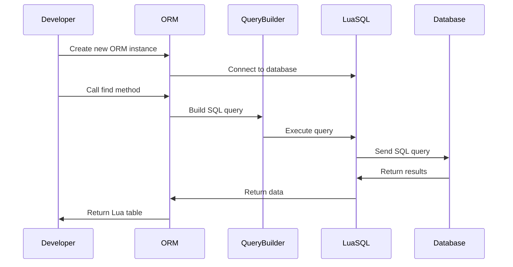

## 13.8 Abstractions for LuaSQL

In the realm of software engineering, efficient database interaction is crucial for building robust applications. LuaSQL, a powerful library for database connectivity in Lua, provides the foundational tools needed to interact with various databases. However, working directly with raw SQL can be cumbersome and error-prone. This section explores how to create higher-level abstractions over LuaSQL, focusing on ORM (Object-Relational Mapping) patterns and query builders to simplify database interactions.

### Simplifying Database Interactions

Creating abstractions over LuaSQL involves designing layers that encapsulate the complexity of direct database interactions. These abstractions aim to:

- **Reduce Boilerplate Code**: By providing reusable components, developers can focus on business logic rather than repetitive SQL statements.
- **Enhance Database Portability**: Abstracting database-specific differences allows for easier transitions between different database systems.
- **Improve Code Maintainability**: High-level abstractions lead to cleaner, more organized codebases.

### Implementing Abstractions

#### ORM Patterns: Mapping Database Tables to Lua Tables

ORM (Object-Relational Mapping) is a design pattern that maps database tables to objects in a programming language. In Lua, this involves creating Lua tables that represent database records, allowing developers to interact with data using Lua's native constructs.

**Key Concepts of ORM in LuaSQL:**

- **Entities**: Lua tables that represent database tables.
- **Attributes**: Fields in Lua tables corresponding to columns in database tables.
- **Persistence**: Mechanisms to save and retrieve Lua tables from the database.

**Example: Basic ORM Implementation**

```lua
-- Define a simple ORM class
local ORM = {}
ORM.__index = ORM

-- Constructor for ORM class
function ORM:new(tableName)
    local instance = setmetatable({}, self)
    instance.tableName = tableName
    return instance
end

-- Method to find a record by ID
function ORM:find(id)
    local query = string.format("SELECT * FROM %s WHERE id = %d", self.tableName, id)
    -- Execute query using LuaSQL (assuming connection is established)
    local cursor = connection:execute(query)
    local row = cursor:fetch({}, "a")
    cursor:close()
    return row
end

-- Method to save a record
function ORM:save(record)
    local fields, values = {}, {}
    for k, v in pairs(record) do
        table.insert(fields, k)
        table.insert(values, string.format("'%s'", v))
    end
    local query = string.format("INSERT INTO %s (%s) VALUES (%s)", self.tableName, table.concat(fields, ", "), table.concat(values, ", "))
    connection:execute(query)
end

-- Usage
local User = ORM:new("users")
local user = User:find(1)
print(user.name)

local newUser = {name = "John Doe", email = "john@example.com"}
User:save(newUser)
```

**Design Considerations:**

- **Flexibility**: Ensure the ORM can handle different data types and relationships between tables.
- **Performance**: Optimize queries to minimize database load and latency.
- **Error Handling**: Implement robust error handling for database operations.

#### Query Builders: Constructing SQL Queries Programmatically

Query builders provide a programmatic way to construct SQL queries, offering a more intuitive and error-free approach compared to writing raw SQL strings.

**Key Features of Query Builders:**

- **Fluent Interface**: Allows chaining of method calls to build queries.
- **Parameter Binding**: Safely includes user input in queries to prevent SQL injection.
- **Dynamic Query Construction**: Easily modify queries based on runtime conditions.

**Example: Simple Query Builder**

```lua
-- Define a QueryBuilder class
local QueryBuilder = {}
QueryBuilder.__index = QueryBuilder

-- Constructor for QueryBuilder class
function QueryBuilder:new()
    local instance = setmetatable({}, self)
    instance.queryParts = {}
    return instance
end

-- Method to select fields
function QueryBuilder:select(fields)
    self.queryParts.select = "SELECT " .. table.concat(fields, ", ")
    return self
end

-- Method to specify the table
function QueryBuilder:from(tableName)
    self.queryParts.from = "FROM " .. tableName
    return self
end

-- Method to add a where clause
function QueryBuilder:where(condition)
    self.queryParts.where = "WHERE " .. condition
    return self
end

-- Method to build the final query
function QueryBuilder:build()
    return table.concat(self.queryParts, " ")
end

-- Usage
local qb = QueryBuilder:new()
local query = qb:select({"name", "email"}):from("users"):where("id = 1"):build()
print(query)  -- Output: SELECT name, email FROM users WHERE id = 1
```

**Design Considerations:**

- **Extensibility**: Allow for additional SQL clauses (e.g., JOIN, ORDER BY) to be easily added.
- **Usability**: Ensure the API is intuitive and easy to use for developers.
- **Security**: Implement parameter binding to prevent SQL injection.

### Use Cases and Examples

#### Rapid Development: Reducing Boilerplate Code

By using ORM patterns and query builders, developers can significantly reduce the amount of boilerplate code required for database interactions. This leads to faster development cycles and more focus on application logic.

**Example: Using ORM for Rapid Development**

```lua
-- Define a Product entity
local Product = ORM:new("products")

-- Find a product by ID
local product = Product:find(42)
print(product.name)

-- Save a new product
local newProduct = {name = "Widget", price = 19.99}
Product:save(newProduct)
```

#### Database Portability: Abstracting Differences Between Databases

Abstractions over LuaSQL can help manage differences between various database systems, such as SQL syntax variations and data type support. This makes it easier to switch databases or support multiple databases within the same application.

**Example: Abstracting Database Differences**

```lua
-- Define a DatabaseAdapter class
local DatabaseAdapter = {}
DatabaseAdapter.__index = DatabaseAdapter

-- Constructor for DatabaseAdapter class
function DatabaseAdapter:new(driver)
    local instance = setmetatable({}, self)
    instance.driver = driver
    return instance
end

-- Method to execute a query
function DatabaseAdapter:execute(query)
    if self.driver == "mysql" then
        -- MySQL-specific execution
    elseif self.driver == "postgresql" then
        -- PostgreSQL-specific execution
    end
end

-- Usage
local adapter = DatabaseAdapter:new("mysql")
adapter:execute("SELECT * FROM users")
```

**Design Considerations:**

- **Compatibility**: Ensure the abstraction layer supports the necessary features of each target database.
- **Performance**: Minimize the overhead introduced by the abstraction layer.
- **Maintainability**: Keep the abstraction layer simple and well-documented to facilitate future updates.

### Visualizing LuaSQL Abstractions

To better understand the flow of data and interactions within LuaSQL abstractions, let's visualize the process using a sequence diagram.



**Diagram Description:** This sequence diagram illustrates the interaction between a developer, ORM, query builder, LuaSQL, and the database. It shows how an ORM instance is created, a query is built and executed, and results are returned to the developer.

### Try It Yourself

To deepen your understanding of LuaSQL abstractions, try modifying the provided code examples:

- **Extend the ORM**: Add methods for updating and deleting records.
- **Enhance the Query Builder**: Implement support for JOIN and ORDER BY clauses.
- **Experiment with Database Adapters**: Add support for a new database system.

### Knowledge Check

Reflect on the following questions to reinforce your understanding:

- How do ORM patterns simplify database interactions in Lua?
- What are the benefits of using a query builder over raw SQL strings?
- How can abstractions improve database portability in Lua applications?

### Embrace the Journey

Remember, mastering LuaSQL abstractions is a journey. As you continue to explore and experiment, you'll gain deeper insights into efficient database interactions. Keep pushing the boundaries of what's possible with Lua and LuaSQL, and enjoy the process of learning and growing as a software engineer.

## Quiz Time!



### What is the primary purpose of ORM patterns in LuaSQL?

- [x] To map database tables to Lua tables
- [ ] To execute raw SQL queries
- [ ] To manage database connections
- [ ] To handle database transactions

> **Explanation:** ORM patterns are designed to map database tables to Lua tables, allowing developers to interact with data using Lua's native constructs.

### Which of the following is a key feature of query builders?

- [x] Fluent interface
- [ ] Direct database manipulation
- [ ] Automatic schema generation
- [ ] Data encryption

> **Explanation:** Query builders provide a fluent interface, allowing developers to chain method calls to construct SQL queries programmatically.

### How do abstractions over LuaSQL enhance database portability?

- [x] By abstracting database-specific differences
- [ ] By generating SQL queries automatically
- [ ] By encrypting database connections
- [ ] By providing a graphical user interface

> **Explanation:** Abstractions over LuaSQL help manage differences between various database systems, making it easier to switch databases or support multiple databases within the same application.

### What is a potential benefit of using ORM patterns in LuaSQL?

- [x] Reduced boilerplate code
- [ ] Increased database size
- [ ] Slower query execution
- [ ] More complex code

> **Explanation:** ORM patterns reduce the amount of boilerplate code required for database interactions, allowing developers to focus more on application logic.

### Which method in the ORM example is used to find a record by ID?

- [x] find
- [ ] save
- [ ] update
- [ ] delete

> **Explanation:** The `find` method is used to retrieve a record by its ID in the ORM example.

### What does the QueryBuilder class primarily help with?

- [x] Constructing SQL queries programmatically
- [ ] Managing database connections
- [ ] Encrypting data
- [ ] Generating database schemas

> **Explanation:** The QueryBuilder class provides a programmatic way to construct SQL queries, offering a more intuitive and error-free approach compared to writing raw SQL strings.

### What is a key consideration when designing ORM patterns?

- [x] Flexibility to handle different data types
- [ ] Automatic query execution
- [ ] Direct database access
- [ ] Data encryption

> **Explanation:** Flexibility is crucial in ORM patterns to ensure they can handle different data types and relationships between tables.

### How can query builders improve security in database interactions?

- [x] By implementing parameter binding
- [ ] By encrypting SQL queries
- [ ] By generating random queries
- [ ] By providing a graphical interface

> **Explanation:** Query builders improve security by implementing parameter binding, which helps prevent SQL injection attacks.

### What is a common use case for LuaSQL abstractions?

- [x] Rapid development
- [ ] Data encryption
- [ ] Network communication
- [ ] Image processing

> **Explanation:** LuaSQL abstractions are commonly used for rapid development by reducing boilerplate code and simplifying database interactions.

### True or False: Abstractions over LuaSQL can help manage differences between various database systems.

- [x] True
- [ ] False

> **Explanation:** True. Abstractions over LuaSQL can help manage differences between various database systems, enhancing database portability.


