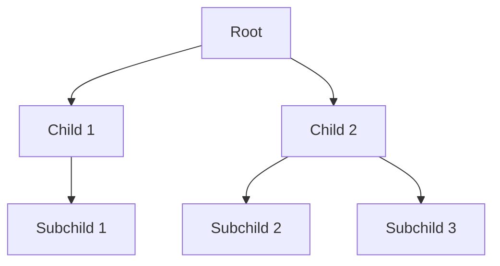

## 13.9 Complex Structured Data Input

In today's interconnected world, software systems often need to handle complex structured data from various sources. Whether it's configuration files, data interchange formats like JSON and XML, or custom data formats, the ability to parse and process intricate data structures is crucial. In this section, we will delve into the techniques and patterns for handling complex structured data input in Lua, a powerful yet lightweight scripting language.

### Handling Nested and Complex Data

Complex data structures often involve nested elements, requiring careful parsing and processing. Let's explore how Lua can be used to handle such data effectively.

#### Data Formats

Understanding the data formats you are working with is the first step in handling complex structured data. Two of the most common formats are JSON and XML, but custom formats are also prevalent in specific domains.

##### JSON and XML

**JSON (JavaScript Object Notation)** is a lightweight data interchange format that is easy for humans to read and write, and easy for machines to parse and generate. Lua provides libraries like `dkjson` and `cjson` for parsing JSON data.

**XML (eXtensible Markup Language)** is a markup language that defines a set of rules for encoding documents in a format that is both human-readable and machine-readable. Libraries such as `LuaXML` can be used to parse XML data in Lua.

##### Custom Formats

Custom data formats are often designed to meet specific needs, such as proprietary configuration files or domain-specific data representations. Designing parsers for these formats requires a deep understanding of the data structure and the ability to handle various edge cases.

### Implementing Parsers

Implementing parsers for complex structured data involves understanding the structure of the data and using appropriate parsing techniques.

#### Recursive Descent Parsing

Recursive descent parsing is a top-down parsing technique that is particularly useful for parsing nested data structures. It involves writing a set of recursive functions, each of which processes a specific part of the data structure.

**Example: Parsing a Simple Expression**

```lua
-- A simple recursive descent parser for arithmetic expressions
local function parseExpression(tokens)
    local function parseTerm()
        local token = table.remove(tokens, 1)
        if token == "(" then
            local expr = parseExpression()
            assert(table.remove(tokens, 1) == ")", "Expected ')'")
            return expr
        elseif tonumber(token) then
            return tonumber(token)
        else
            error("Unexpected token: " .. token)
        end
    end

    local function parseFactor()
        local term = parseTerm()
        local token = tokens[1]
        while token == "*" or token == "/" do
            table.remove(tokens, 1)
            local nextTerm = parseTerm()
            if token == "*" then
                term = term * nextTerm
            else
                term = term / nextTerm
            end
            token = tokens[1]
        end
        return term
    end

    local function parseExpression()
        local factor = parseFactor()
        local token = tokens[1]
        while token == "+" or token == "-" do
            table.remove(tokens, 1)
            local nextFactor = parseFactor()
            if token == "+" then
                factor = factor + nextFactor
            else
                factor = factor - nextFactor
            end
            token = tokens[1]
        end
        return factor
    end

    return parseExpression()
end

-- Example usage
local tokens = {"3", "+", "5", "*", "(", "2", "-", "1", ")"}
print(parseExpression(tokens)) -- Output: 8
```

In this example, we demonstrate a simple recursive descent parser for arithmetic expressions. The parser handles basic arithmetic operations and respects operator precedence.

#### Error Handling

When dealing with complex data, error handling is crucial. Malformed data can lead to unexpected behavior or crashes if not handled properly. Lua provides mechanisms for error handling using `pcall` and `xpcall`.

**Example: Handling Errors in Parsing**

```lua
local function safeParseExpression(tokens)
    local status, result = pcall(parseExpression, tokens)
    if not status then
        print("Error parsing expression: " .. result)
        return nil
    end
    return result
end

-- Example usage
local tokens = {"3", "+", "5", "*", "(", "2", "-", "1", ")"}
local result = safeParseExpression(tokens)
if result then
    print("Parsed result: " .. result)
else
    print("Failed to parse expression.")
end
```

In this example, we use `pcall` to safely call the `parseExpression` function, catching any errors that occur during parsing.

### Use Cases and Examples

Let's explore some practical use cases where complex structured data input is essential.

#### Configuration Files

Configuration files often contain complex settings that need to be parsed and processed. Lua's flexibility makes it an excellent choice for reading and interpreting configuration data.

**Example: Parsing a JSON Configuration File**

```lua
local json = require("dkjson")

local function loadConfig(filename)
    local file = io.open(filename, "r")
    if not file then
        error("Could not open file: " .. filename)
    end
    local content = file:read("*a")
    file:close()
    local config, pos, err = json.decode(content, 1, nil)
    if err then
        error("Error parsing JSON: " .. err)
    end
    return config
end

-- Example usage
local config = loadConfig("config.json")
print("Database host: " .. config.database.host)
```

In this example, we demonstrate how to parse a JSON configuration file using the `dkjson` library. The configuration is loaded into a Lua table, allowing easy access to individual settings.

#### Data Import

Integrating with external systems often involves importing complex data structures. Lua's ability to parse and process various data formats makes it a valuable tool for data import tasks.

**Example: Importing XML Data**

```lua
local xml = require("LuaXML")

local function parseXMLData(filename)
    local file = io.open(filename, "r")
    if not file then
        error("Could not open file: " .. filename)
    end
    local content = file:read("*a")
    file:close()
    local xmlData = xml.eval(content)
    return xmlData
end

-- Example usage
local xmlData = parseXMLData("data.xml")
print("Root element: " .. xmlData:tag())
```

In this example, we use the `LuaXML` library to parse XML data from a file. The parsed data is represented as a Lua table, allowing easy traversal and manipulation.

### Visualizing Complex Data Structures

Understanding complex data structures can be challenging. Visual representations can aid in comprehending the relationships and hierarchies within the data.



**Diagram: Visualizing a Nested Data Structure**

This diagram represents a simple nested data structure, with a root element and multiple levels of children and subchildren. Such visualizations can help in understanding the structure of complex data.

### Try It Yourself

Experiment with the provided code examples by modifying them to handle different data structures or formats. For instance, try adding support for additional arithmetic operators in the recursive descent parser or parsing a different XML structure.

### References and Links

- [JSON in Lua](https://www.json.org/json-en.html)
- [XML in Lua](https://www.w3schools.com/xml/)
- [LuaXML Documentation](https://github.com/LuaDist/luaxml)

### Knowledge Check

To reinforce your understanding, consider the following questions and exercises:

1. What are the advantages of using recursive descent parsing for nested data structures?
2. How can error handling be implemented in a Lua parser?
3. Modify the JSON configuration file parser to handle missing or optional fields gracefully.
4. Create a custom parser for a simple CSV format using Lua.
5. Visualize a complex XML data structure using a diagram.

### Embrace the Journey

Remember, mastering complex structured data input is a journey. As you progress, you'll gain the skills to handle increasingly intricate data structures. Keep experimenting, stay curious, and enjoy the process!

## Quiz Time!



### What is the primary advantage of using JSON for data interchange?

- [x] It is lightweight and easy for both humans and machines to read and write.
- [ ] It is a binary format that is faster to parse.
- [ ] It is specifically designed for XML compatibility.
- [ ] It is the only format supported by Lua.

> **Explanation:** JSON is a lightweight data interchange format that is easy for humans to read and write, and easy for machines to parse and generate.

### Which Lua library is commonly used for parsing JSON data?

- [x] dkjson
- [ ] LuaXML
- [ ] lpeg
- [ ] luasocket

> **Explanation:** The `dkjson` library is commonly used for parsing JSON data in Lua.

### What is recursive descent parsing?

- [x] A top-down parsing technique using recursive functions to process data.
- [ ] A bottom-up parsing technique using iterative loops.
- [ ] A method for parsing binary data formats.
- [ ] A technique for optimizing Lua scripts.

> **Explanation:** Recursive descent parsing is a top-down parsing technique that involves writing a set of recursive functions, each of which processes a specific part of the data structure.

### How can errors be handled in Lua when parsing data?

- [x] Using `pcall` and `xpcall` to catch and handle errors.
- [ ] By ignoring malformed data and continuing execution.
- [ ] By using global variables to store error messages.
- [ ] By restarting the Lua interpreter.

> **Explanation:** Lua provides mechanisms for error handling using `pcall` and `xpcall`, which allow you to catch and handle errors during execution.

### What is a common use case for parsing XML data in Lua?

- [x] Integrating with external systems that provide data in XML format.
- [ ] Creating binary data files for storage.
- [ ] Optimizing Lua script performance.
- [ ] Compiling Lua code to machine language.

> **Explanation:** A common use case for parsing XML data in Lua is integrating with external systems that provide data in XML format.

### Which of the following is a key feature of the LuaXML library?

- [x] It allows parsing and manipulation of XML data in Lua.
- [ ] It provides a GUI for editing XML files.
- [ ] It compiles XML data into Lua bytecode.
- [ ] It converts XML to JSON automatically.

> **Explanation:** The LuaXML library allows parsing and manipulation of XML data in Lua, making it easier to work with XML structures.

### What is the purpose of visualizing complex data structures?

- [x] To aid in understanding the relationships and hierarchies within the data.
- [ ] To convert data into a binary format.
- [ ] To improve the performance of Lua scripts.
- [ ] To automatically generate Lua code.

> **Explanation:** Visualizing complex data structures helps in understanding the relationships and hierarchies within the data, making it easier to comprehend and work with.

### How can you modify the recursive descent parser to handle additional operators?

- [x] By adding new functions or extending existing ones to process the new operators.
- [ ] By recompiling the Lua interpreter with additional libraries.
- [ ] By using global variables to store operator precedence.
- [ ] By converting the parser to a bottom-up approach.

> **Explanation:** You can modify the recursive descent parser by adding new functions or extending existing ones to process additional operators, ensuring they are handled correctly.

### What is the benefit of using Lua for parsing configuration files?

- [x] Lua's flexibility and ease of use make it suitable for reading and interpreting configuration data.
- [ ] Lua automatically converts configuration files to JSON.
- [ ] Lua provides built-in support for all configuration file formats.
- [ ] Lua compiles configuration files into machine code.

> **Explanation:** Lua's flexibility and ease of use make it an excellent choice for reading and interpreting configuration data, allowing for easy manipulation and access.

### True or False: Custom data formats require a deep understanding of the data structure to design effective parsers.

- [x] True
- [ ] False

> **Explanation:** Designing parsers for custom data formats requires a deep understanding of the data structure to handle various edge cases and ensure accurate parsing.


