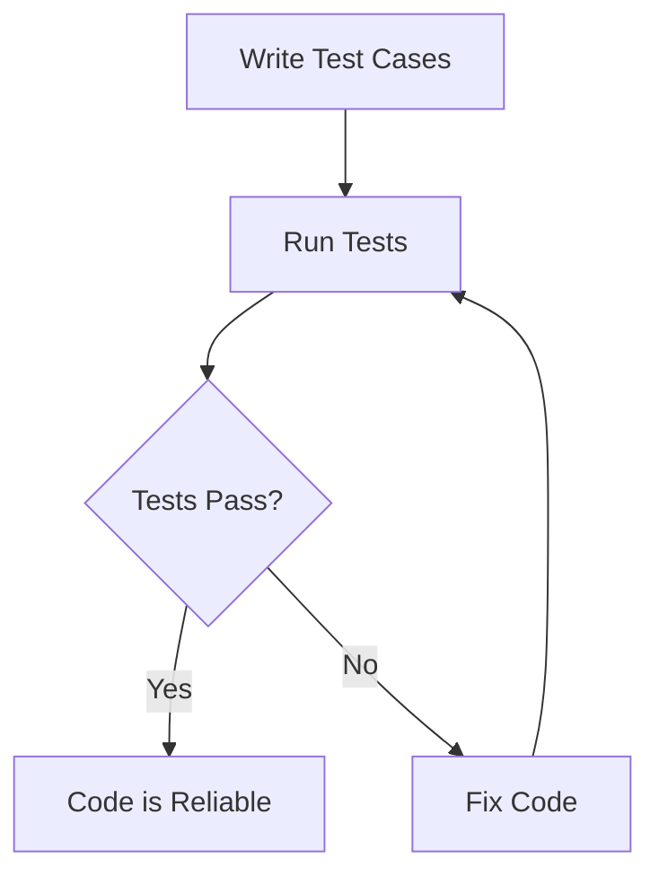

## 14.1 Unit Testing Frameworks

In the world of software development, ensuring code reliability is paramount. Unit testing frameworks play a crucial role in verifying individual pieces of code, ensuring they function as expected. In this section, we will delve into the popular unit testing frameworks available for Lua, explore how to implement unit tests, and discuss their use cases and examples.

### Ensuring Code Reliability

Unit testing is a software testing method where individual units or components of a software are tested. The purpose is to validate that each unit of the software performs as designed. A unit is the smallest testable part of any software, typically a function or method.

**Key Benefits of Unit Testing:**

- **Early Bug Detection**: Identify issues early in the development cycle.
- **Code Refactoring**: Safely refactor code with confidence.
- **Documentation**: Serve as documentation for the codebase.
- **Design Improvement**: Encourage better design and modularity.

### Popular Lua Testing Frameworks

Lua offers several testing frameworks that cater to different testing styles and preferences. Let's explore two of the most popular ones: LuaUnit and Busted.

#### LuaUnit

**LuaUnit** is a unit testing framework for Lua, inspired by JUnit. It provides a simple and straightforward way to write and run tests.

- **Features**:
  - Simple and easy to use.
  - Supports assertions for testing conditions.
  - Provides test suites for organizing tests.
  - Offers detailed test reports.

**Example Usage of LuaUnit**:

```lua
-- Import LuaUnit
local lu = require('luaunit')

-- Define a test class
TestMath = {}

-- Test case for addition
function TestMath:testAddition()
    local result = 1 + 1
    lu.assertEquals(result, 2)
end

-- Test case for subtraction
function TestMath:testSubtraction()
    local result = 5 - 3
    lu.assertEquals(result, 2)
end

-- Run the tests
os.exit(lu.LuaUnit.run())
```

In this example, we define a test class `TestMath` with two test cases: `testAddition` and `testSubtraction`. We use `lu.assertEquals` to assert that the results are as expected.

#### Busted

**Busted** is a behavior-driven development (BDD) testing framework for Lua. It allows you to write tests in a human-readable format, making it easier to understand the behavior of the code.

- **Features**:
  - Supports BDD-style testing.
  - Provides a rich set of assertions.
  - Allows for asynchronous testing.
  - Offers detailed output with colors and formatting.

**Example Usage of Busted**:

```lua
-- Import Busted
describe("Math operations", function()
    it("should add numbers correctly", function()
        local result = 1 + 1
        assert.are.equal(result, 2)
    end)

    it("should subtract numbers correctly", function()
        local result = 5 - 3
        assert.are.equal(result, 2)
    end)
end)
```

In this example, we use Busted's `describe` and `it` functions to define test cases in a BDD style. The `assert.are.equal` function is used to check the results.

### Implementing Unit Tests

Implementing unit tests involves writing test cases, running tests, and interpreting the results. Let's explore these steps in detail.

#### Writing Test Cases

Writing test cases is the first step in implementing unit tests. A test case typically consists of three parts: setup, execution, and assertions.

- **Setup**: Prepare the environment and inputs for the test.
- **Execution**: Run the code being tested.
- **Assertions**: Verify that the output matches the expected result.

**Example Test Case**:

```lua
-- Setup
local function setup()
    return 1, 1
end

-- Execution
local function execute(a, b)
    return a + b
end

-- Assertions
local function assertResult(result)
    assert(result == 2, "Expected result to be 2")
end

-- Run the test
local a, b = setup()
local result = execute(a, b)
assertResult(result)
```

In this example, we define functions for setup, execution, and assertions. We then run the test by calling these functions in sequence.

#### Running Tests

Running tests can be automated using the testing framework's built-in tools. Both LuaUnit and Busted provide command-line interfaces for running tests.

- **LuaUnit**: Use `os.exit(lu.LuaUnit.run())` to run tests.
- **Busted**: Use the `busted` command to run tests from the terminal.

**Example Command for Busted**:

```bash
busted test_file.lua
```

This command runs all the tests defined in `test_file.lua` using Busted.

### Use Cases and Examples

Unit testing frameworks are versatile tools that can be used in various scenarios. Let's explore some common use cases and examples.

#### Regression Testing

Regression testing ensures that new code changes do not introduce bugs into existing functionality. By running unit tests after each change, you can quickly identify and fix regressions.

**Example**:

Consider a function that calculates the area of a rectangle. After refactoring the function, you can run existing unit tests to ensure the refactoring did not introduce any errors.

```lua
function calculateArea(length, width)
    return length * width
end

-- Test case for regression testing
function TestMath:testCalculateArea()
    local area = calculateArea(5, 4)
    lu.assertEquals(area, 20)
end
```

#### Test-First Development

Test-first development, also known as test-driven development (TDD), involves writing tests before writing the actual code. This approach helps guide the design of the code and ensures that it meets the specified requirements.

**Example**:

Suppose you need to implement a function that checks if a number is even. Start by writing a test case for the function.

```lua
-- Test case for isEven function
function TestMath:testIsEven()
    lu.assertTrue(isEven(4))
    lu.assertFalse(isEven(3))
end

-- Implement the function
function isEven(number)
    return number % 2 == 0
end
```

By writing the test case first, you define the expected behavior of the `isEven` function before implementing it.

### Try It Yourself

Experiment with the code examples provided in this section. Try modifying the test cases to test different scenarios or add new test cases for additional functions. This hands-on practice will help reinforce your understanding of unit testing frameworks in Lua.

### Visualizing the Unit Testing Process

To better understand the unit testing process, let's visualize it using a flowchart. This diagram illustrates the steps involved in writing and running unit tests.



**Diagram Description**: This flowchart represents the unit testing process. It starts with writing test cases, running the tests, and checking if they pass. If the tests pass, the code is considered reliable. If not, the code is fixed, and the tests are run again.

### References and Links

For further reading on unit testing frameworks in Lua, consider exploring the following resources:

- [LuaUnit Documentation](https://github.com/bluebird75/luaunit)
- [Busted Documentation](https://olivinelabs.com/busted/)
- [Test-Driven Development by Example](https://www.amazon.com/Test-Driven-Development-Kent-Beck/dp/0321146530)

### Knowledge Check

To reinforce your understanding of unit testing frameworks in Lua, consider the following questions:

- What are the benefits of unit testing?
- How does LuaUnit differ from Busted?
- What are the three parts of a test case?
- How can regression testing prevent bugs from reappearing?
- What is test-first development, and how does it guide code design?

### Embrace the Journey

Remember, mastering unit testing frameworks is just the beginning. As you progress, you'll build more reliable and maintainable Lua applications. Keep experimenting, stay curious, and enjoy the journey!

## Quiz Time!



### What is the primary purpose of unit testing?

- [x] To validate that each unit of the software performs as designed.
- [ ] To replace manual testing entirely.
- [ ] To ensure the software is free of bugs.
- [ ] To increase the complexity of the code.

> **Explanation:** Unit testing aims to validate that each unit of the software performs as designed, ensuring reliability and correctness.

### Which Lua testing framework is inspired by JUnit?

- [x] LuaUnit
- [ ] Busted
- [ ] TestNG
- [ ] Mocha

> **Explanation:** LuaUnit is a unit testing framework for Lua inspired by JUnit, providing a simple way to write and run tests.

### What style of testing does Busted support?

- [ ] Unit Testing
- [x] Behavior-Driven Development (BDD)
- [ ] Integration Testing
- [ ] System Testing

> **Explanation:** Busted supports behavior-driven development (BDD) testing, allowing tests to be written in a human-readable format.

### What are the three parts of a test case?

- [x] Setup, Execution, Assertions
- [ ] Setup, Execution, Cleanup
- [ ] Initialization, Execution, Validation
- [ ] Preparation, Execution, Verification

> **Explanation:** A test case typically consists of setup, execution, and assertions to verify the expected outcome.

### How can regression testing help in software development?

- [x] By ensuring new code changes do not introduce bugs into existing functionality.
- [ ] By eliminating the need for manual testing.
- [ ] By increasing the complexity of the codebase.
- [ ] By reducing the need for documentation.

> **Explanation:** Regression testing ensures that new code changes do not introduce bugs into existing functionality, maintaining software reliability.

### What is the first step in test-first development?

- [x] Writing test cases
- [ ] Writing the code
- [ ] Debugging the code
- [ ] Refactoring the code

> **Explanation:** In test-first development, also known as test-driven development (TDD), the first step is writing test cases before writing the actual code.

### What command is used to run tests with Busted?

- [x] busted test_file.lua
- [ ] lua test_file.lua
- [ ] run test_file.lua
- [ ] execute test_file.lua

> **Explanation:** The `busted` command is used to run tests with Busted, specifying the test file to execute.

### What is a key benefit of unit testing?

- [x] Early bug detection
- [ ] Increased code complexity
- [ ] Reduced documentation
- [ ] Elimination of manual testing

> **Explanation:** Unit testing provides early bug detection, allowing issues to be identified and resolved early in the development cycle.

### What does the `assert.are.equal` function do in Busted?

- [x] Checks if two values are equal
- [ ] Checks if a value is true
- [ ] Checks if a value is false
- [ ] Checks if a value is nil

> **Explanation:** The `assert.are.equal` function in Busted checks if two values are equal, used for verifying test outcomes.

### True or False: Unit testing can serve as documentation for the codebase.

- [x] True
- [ ] False

> **Explanation:** True. Unit tests can serve as documentation for the codebase, providing insights into the expected behavior of the code.


