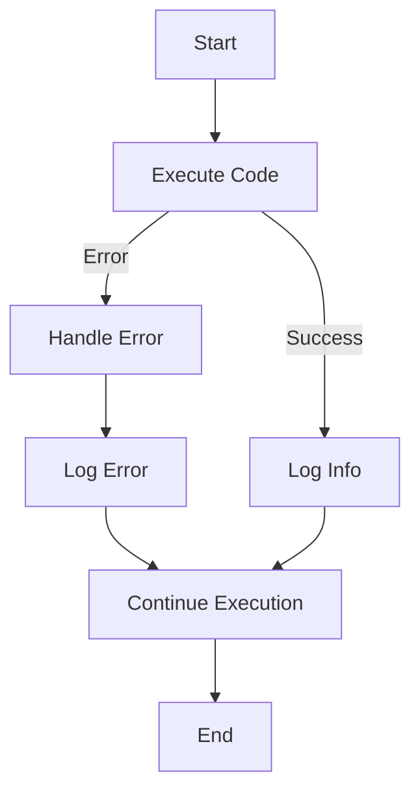

## 14.10 Error Handling and Logging Best Practices

In the realm of software development, error handling and logging are crucial components that ensure the robustness and maintainability of applications. In Lua, a dynamically typed language known for its simplicity and efficiency, mastering these aspects can significantly enhance your development workflow. This section delves into the best practices for error handling and logging in Lua, providing you with the tools to manage errors gracefully and maintain comprehensive logs for analysis.

### Managing Errors Gracefully

Errors are inevitable in any software application. The key is not to avoid them entirely but to handle them gracefully, ensuring that your program can recover or fail safely without crashing. Let's explore how to implement effective error handling in Lua.

#### Implementing Error Handling

Error handling in Lua can be achieved using several built-in functions and techniques. The primary methods include `pcall()` and `xpcall()`, which allow you to execute code with protection against runtime errors.

##### `pcall()` and `xpcall()`: Protecting Code Execution

The `pcall()` (protected call) function is used to call a function in protected mode. This means that if an error occurs during the execution of the function, it will not crash the program. Instead, `pcall()` returns a status code and the error message.

```lua
-- Example of using pcall for error handling
local function divide(a, b)
    return a / b
end

local status, result = pcall(divide, 10, 0)

if status then
    print("Result:", result)
else
    print("Error:", result)  -- result contains the error message
end
```

In this example, `pcall()` is used to safely execute the `divide` function. If an error occurs (such as division by zero), `pcall()` catches it, and the program continues running without crashing.

The `xpcall()` function extends `pcall()` by allowing you to specify an error handler function. This can be useful for logging errors or performing cleanup tasks.

```lua
-- Example of using xpcall with an error handler
local function errorHandler(err)
    print("Error handled:", err)
end

local status, result = xpcall(divide, errorHandler, 10, 0)

if status then
    print("Result:", result)
else
    print("An error occurred.")
end
```

Here, `xpcall()` calls the `divide` function with an error handler. If an error occurs, the `errorHandler` function is invoked, providing a centralized place to manage errors.

##### Custom Error Messages: Providing Informative Feedback

Providing informative error messages is essential for debugging and user feedback. Lua's `error()` function allows you to generate custom error messages.

```lua
-- Example of generating a custom error message
local function safeDivide(a, b)
    if b == 0 then
        error("Division by zero is not allowed")
    end
    return a / b
end

local status, result = pcall(safeDivide, 10, 0)

if not status then
    print("Caught error:", result)
end
```

In this example, `error()` is used to generate a custom error message when attempting to divide by zero. This message is then caught by `pcall()` and can be logged or displayed to the user.

### Logging Practices

Logging is an essential practice for monitoring application behavior, diagnosing issues, and maintaining traceability. Effective logging involves differentiating log levels and ensuring logs are persistent for later analysis.

#### Log Levels: Differentiating Between Info, Warning, and Error Logs

Log levels help categorize the importance and severity of log messages. Common log levels include:

- **Info**: General information about application execution.
- **Warning**: Indications of potential issues that do not affect execution.
- **Error**: Critical issues that may cause application failure.

Implementing log levels in Lua can be done using a simple logging function.

```lua
-- Example of a simple logging function with log levels
local function log(level, message)
    local levels = {INFO = 1, WARNING = 2, ERROR = 3}
    local currentLevel = levels[level] or levels.INFO

    if currentLevel >= levels.INFO then
        print("[" .. level .. "] " .. message)
    end
end

log("INFO", "Application started")
log("WARNING", "Low disk space")
log("ERROR", "Failed to connect to database")
```

This function logs messages with a specified level, allowing you to filter logs based on their severity.

#### Persistent Logs: Writing Logs to Files for Later Analysis

For production systems, it's crucial to persist logs to files for later analysis. Lua's `io` library provides functions for file operations, enabling you to write logs to a file.

```lua
-- Example of writing logs to a file
local function logToFile(level, message)
    local file = io.open("application.log", "a")
    if file then
        file:write("[" .. level .. "] " .. message .. "\n")
        file:close()
    else
        print("Error opening log file")
    end
end

logToFile("INFO", "Application started")
logToFile("ERROR", "Failed to connect to database")
```

This example demonstrates how to append log messages to a file, ensuring that logs are retained for future reference.

### Use Cases and Examples

Understanding how error handling and logging are applied in real-world scenarios can provide valuable insights into their importance and implementation.

#### Production Systems: Maintaining Reliability and Traceability

In production environments, maintaining reliability and traceability is paramount. Effective error handling ensures that applications can recover from unexpected conditions, while comprehensive logging provides a record of events for troubleshooting and auditing.

Consider a web server application written in Lua. Implementing error handling and logging can help maintain uptime and diagnose issues quickly.

```lua
-- Example of error handling and logging in a web server
local function handleRequest(request)
    local status, err = pcall(function()
        -- Process the request
        if not request.valid then
            error("Invalid request")
        end
        -- Further processing...
    end)

    if not status then
        logToFile("ERROR", "Request handling failed: " .. err)
    end
end
```

In this example, `pcall()` is used to handle errors during request processing, and errors are logged to a file for analysis.

#### Development Environments: Facilitating Debugging and Testing

In development environments, error handling and logging facilitate debugging and testing by providing insights into application behavior and potential issues.

```lua
-- Example of using logging for debugging
local function debugFunction()
    log("INFO", "Entering debugFunction")
    -- Simulate a potential issue
    local success, err = pcall(function()
        error("Simulated error")
    end)
    if not success then
        log("ERROR", "Error in debugFunction: " .. err)
    end
    log("INFO", "Exiting debugFunction")
end

debugFunction()
```

This example demonstrates how logging can be used to trace function execution and capture errors during development.

### Try It Yourself

To solidify your understanding of error handling and logging in Lua, try modifying the code examples provided. Experiment with different error conditions, log levels, and file operations. Consider implementing a more sophisticated logging system that supports log rotation or remote logging.

### Visualizing Error Handling and Logging

To better understand the flow of error handling and logging, let's visualize the process using a flowchart.



**Figure 1: Error Handling and Logging Flowchart**

This flowchart illustrates the typical flow of error handling and logging in a Lua application. Code execution is attempted, and based on the outcome, appropriate logs are generated, and execution continues.

### References and Links

For further reading on error handling and logging in Lua, consider the following resources:

- [Lua 5.4 Reference Manual](https://www.lua.org/manual/5.4/)
- [Programming in Lua](https://www.lua.org/pil/contents.html)
- [Lua Users Wiki: Error Handling](http://lua-users.org/wiki/ErrorHandling)

### Knowledge Check

To reinforce your understanding of error handling and logging best practices in Lua, consider the following questions and exercises:

1. What is the difference between `pcall()` and `xpcall()`?
2. How can you implement custom error messages in Lua?
3. Describe the importance of log levels in logging practices.
4. Write a Lua function that logs messages to a file with a timestamp.
5. How can error handling and logging improve the reliability of production systems?

### Embrace the Journey

Remember, mastering error handling and logging is a journey. As you continue to develop your skills, you'll find new ways to enhance the robustness and maintainability of your Lua applications. Keep experimenting, stay curious, and enjoy the journey!

## Quiz Time!



### What is the primary purpose of `pcall()` in Lua?

- [x] To execute a function in protected mode
- [ ] To log error messages
- [ ] To handle file operations
- [ ] To perform mathematical calculations

> **Explanation:** `pcall()` is used to execute a function in protected mode, allowing the program to catch errors without crashing.

### How does `xpcall()` differ from `pcall()`?

- [x] It allows specifying an error handler function
- [ ] It logs errors automatically
- [ ] It performs asynchronous operations
- [ ] It is used for mathematical calculations

> **Explanation:** `xpcall()` extends `pcall()` by allowing you to specify an error handler function, providing more control over error management.

### What is the role of log levels in logging practices?

- [x] To categorize the importance and severity of log messages
- [ ] To execute functions in protected mode
- [ ] To handle file operations
- [ ] To perform mathematical calculations

> **Explanation:** Log levels help categorize the importance and severity of log messages, aiding in filtering and analysis.

### Which Lua function is used to generate custom error messages?

- [x] `error()`
- [ ] `pcall()`
- [ ] `xpcall()`
- [ ] `log()`

> **Explanation:** The `error()` function is used to generate custom error messages in Lua.

### What is a common use case for persistent logs?

- [x] Maintaining traceability in production systems
- [ ] Executing functions in protected mode
- [ ] Performing mathematical calculations
- [ ] Handling file operations

> **Explanation:** Persistent logs are commonly used in production systems to maintain traceability and facilitate troubleshooting.

### How can logging facilitate debugging in development environments?

- [x] By providing insights into application behavior and potential issues
- [ ] By executing functions in protected mode
- [ ] By handling file operations
- [ ] By performing mathematical calculations

> **Explanation:** Logging provides insights into application behavior and potential issues, aiding in debugging and testing.

### What is the benefit of using `xpcall()` with an error handler?

- [x] It provides a centralized place to manage errors
- [ ] It logs errors automatically
- [ ] It performs asynchronous operations
- [ ] It is used for mathematical calculations

> **Explanation:** Using `xpcall()` with an error handler provides a centralized place to manage errors, enhancing error handling capabilities.

### How can you implement log levels in Lua?

- [x] By using a simple logging function with conditional checks
- [ ] By executing functions in protected mode
- [ ] By handling file operations
- [ ] By performing mathematical calculations

> **Explanation:** Log levels can be implemented using a simple logging function with conditional checks to filter messages based on severity.

### What is the purpose of writing logs to a file?

- [x] To retain logs for future reference and analysis
- [ ] To execute functions in protected mode
- [ ] To handle file operations
- [ ] To perform mathematical calculations

> **Explanation:** Writing logs to a file retains them for future reference and analysis, aiding in troubleshooting and auditing.

### True or False: Error handling and logging are only important in production environments.

- [ ] True
- [x] False

> **Explanation:** Error handling and logging are important in both development and production environments, as they facilitate debugging, testing, and maintaining reliability.




