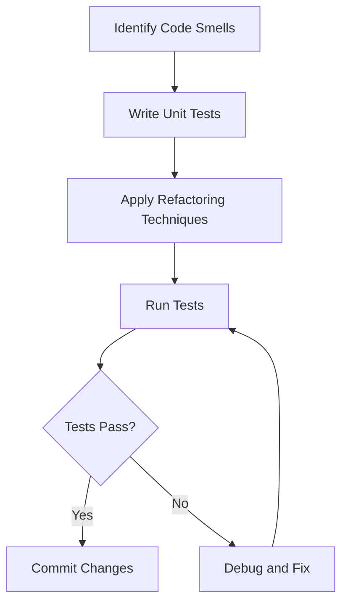

## 14.11 Refactoring Strategies

Refactoring is a crucial aspect of software development that involves restructuring existing code without altering its external behavior. This process is essential for improving code readability, maintainability, and performance. In this section, we will delve into various refactoring strategies tailored for Lua, a powerful and lightweight scripting language. Whether you're dealing with legacy code or enhancing a new project, these strategies will guide you in refining your codebase effectively.

### Improving Existing Code

Refactoring is not just about making code look prettier; it's about enhancing the overall quality of the software. By systematically applying refactoring techniques, developers can ensure that their code remains robust and adaptable to future changes.

#### Refactoring Techniques

1. **Code Simplification**

   Code simplification involves removing redundancy and unnecessary complexity from your code. This makes the code easier to understand and maintain. Let's explore some common methods for simplifying code in Lua:

   - **Eliminate Duplicate Code**: Identify and remove duplicate code blocks by creating reusable functions or modules.
   - **Simplify Conditional Logic**: Use guard clauses or early returns to simplify complex conditional statements.
   - **Use Descriptive Variable Names**: Replace ambiguous variable names with descriptive ones to improve readability.

   **Example: Simplifying Conditional Logic**

   ```lua
   -- Before refactoring
   function calculateDiscount(price, customerType)
       if customerType == "regular" then
           if price > 100 then
               return price * 0.9
           else
               return price
           end
       elseif customerType == "vip" then
           return price * 0.8
       else
           return price
       end
   end

   -- After refactoring
   function calculateDiscount(price, customerType)
       if customerType == "vip" then
           return price * 0.8
       end
       if customerType == "regular" and price > 100 then
           return price * 0.9
       end
       return price
   end
   ```

2. **Modularization**

   Modularization involves breaking down code into smaller, manageable functions or modules. This enhances code organization and reusability.

   - **Create Functions for Repeated Logic**: Extract repeated logic into separate functions.
   - **Use Lua Modules**: Organize related functions and data into modules for better encapsulation.

   **Example: Modularizing Code**

   ```lua
   -- Before refactoring
   function processOrder(order)
       -- Validate order
       if not order.id or not order.amount then
           return false
       end
       -- Calculate total
       local total = order.amount * 1.2
       -- Process payment
       print("Processing payment for order " .. order.id)
       return true
   end

   -- After refactoring
   local OrderProcessor = {}

   function OrderProcessor.validate(order)
       return order.id and order.amount
   end

   function OrderProcessor.calculateTotal(amount)
       return amount * 1.2
   end

   function OrderProcessor.processPayment(orderId)
       print("Processing payment for order " .. orderId)
   end

   function processOrder(order)
       if not OrderProcessor.validate(order) then
           return false
       end
       local total = OrderProcessor.calculateTotal(order.amount)
       OrderProcessor.processPayment(order.id)
       return true
   end
   ```

3. **Renaming and Reorganizing**

   Enhancing code readability often involves renaming variables, functions, and modules to better reflect their purpose. Reorganizing code structure can also improve clarity.

   - **Rename Variables and Functions**: Use meaningful names that convey the purpose of the variable or function.
   - **Reorganize Code Structure**: Group related functions and data together to improve logical flow.

   **Example: Renaming and Reorganizing**

   ```lua
   -- Before refactoring
   function calc(a, b)
       return a + b
   end

   -- After refactoring
   function calculateSum(number1, number2)
       return number1 + number2
   end
   ```

### Best Practices

Refactoring should be approached methodically to ensure that changes do not introduce new bugs or issues. Here are some best practices to follow:

1. **Unit Testing**

   Unit testing is crucial during refactoring to ensure that changes do not break existing functionality. Write tests for critical parts of the code before refactoring and run them frequently.

   **Example: Unit Testing with Busted**

   ```lua
   -- Install Busted: luarocks install busted

   -- test_calculateDiscount.lua
   describe("calculateDiscount", function()
       it("applies a 10% discount for regular customers with price over 100", function()
           assert.are.equal(90, calculateDiscount(100, "regular"))
       end)

       it("applies a 20% discount for VIP customers", function()
           assert.are.equal(80, calculateDiscount(100, "vip"))
       end)
   end)
   ```

2. **Incremental Changes**

   Make small, manageable updates rather than large-scale changes. This reduces the risk of introducing errors and makes it easier to identify the source of any issues.

3. **Use Version Control**

   Utilize version control systems like Git to track changes and revert to previous versions if necessary. This provides a safety net during refactoring.

### Use Cases and Examples

1. **Legacy Code Maintenance**

   Refactoring is often necessary when maintaining legacy codebases. Over time, code can become outdated or difficult to understand. Refactoring helps modernize the code and make it more maintainable.

   **Example: Refactoring Legacy Code**

   ```lua
   -- Legacy code
   function legacyFunction(data)
       -- Complex and outdated logic
       return data * 2
   end

   -- Refactored code
   function modernFunction(data)
       return data * 2 -- Simplified logic
   end
   ```

2. **Code Reviews**

   Refactoring can address issues identified during code reviews. Peer reviews often highlight areas for improvement, and refactoring helps implement these suggestions.

   **Example: Addressing Code Review Feedback**

   ```lua
   -- Original code
   function process(data)
       -- Complex logic
       return data * 2
   end

   -- Feedback: Simplify logic
   function process(data)
       return data * 2 -- Simplified logic
   end
   ```

### Visualizing Refactoring Strategies

To better understand the refactoring process, let's visualize the flow of refactoring a Lua codebase using a flowchart.



**Diagram Description**: This flowchart illustrates the refactoring process, starting with identifying code smells, writing unit tests, applying refactoring techniques, and running tests to ensure changes are successful.

### Try It Yourself

Experiment with the code examples provided in this section. Try simplifying complex logic, modularizing code, and renaming variables to enhance readability. Use unit testing frameworks like Busted to ensure your changes don't introduce new issues.

### Knowledge Check

- What is the primary goal of refactoring?
- How can unit testing aid in the refactoring process?
- Why is it important to make incremental changes during refactoring?

### Embrace the Journey

Remember, refactoring is an ongoing process. As you continue to develop and maintain your Lua applications, regularly revisit your code to identify areas for improvement. Keep experimenting, stay curious, and enjoy the journey of mastering refactoring strategies in Lua!

## Quiz Time!



### What is the primary goal of refactoring?

- [x] To improve code readability and maintainability without changing its behavior
- [ ] To add new features to the code
- [ ] To optimize the code for performance
- [ ] To rewrite the code in a different programming language

> **Explanation:** Refactoring focuses on improving the internal structure of the code without altering its external behavior.

### Which technique involves breaking code into smaller, manageable functions or modules?

- [x] Modularization
- [ ] Code Simplification
- [ ] Renaming and Reorganizing
- [ ] Unit Testing

> **Explanation:** Modularization involves organizing code into smaller, reusable components for better structure and maintainability.

### How can unit testing aid in the refactoring process?

- [x] By ensuring that changes do not introduce new bugs
- [ ] By automatically refactoring the code
- [ ] By optimizing the code for performance
- [ ] By rewriting the code in a different language

> **Explanation:** Unit testing helps verify that refactoring changes do not break existing functionality.

### What is a common method for simplifying conditional logic?

- [x] Using guard clauses or early returns
- [ ] Adding more conditional statements
- [ ] Removing all conditional logic
- [ ] Using complex nested loops

> **Explanation:** Guard clauses and early returns simplify conditional logic by reducing complexity and improving readability.

### Why is it important to make incremental changes during refactoring?

- [x] To reduce the risk of introducing errors
- [ ] To complete refactoring faster
- [ ] To rewrite the entire codebase
- [ ] To avoid using version control

> **Explanation:** Incremental changes make it easier to identify issues and ensure stability during refactoring.

### What is a benefit of renaming variables and functions?

- [x] Enhancing code readability
- [ ] Increasing code execution speed
- [ ] Reducing memory usage
- [ ] Adding new features

> **Explanation:** Renaming variables and functions with descriptive names improves code readability and understanding.

### Which tool can be used for unit testing in Lua?

- [x] Busted
- [ ] JUnit
- [ ] Mocha
- [ ] Jasmine

> **Explanation:** Busted is a popular unit testing framework for Lua.

### What is a common use case for refactoring?

- [x] Maintaining legacy code
- [ ] Adding new features
- [ ] Optimizing for performance
- [ ] Rewriting in a different language

> **Explanation:** Refactoring is often used to improve the maintainability of legacy codebases.

### What should be done if tests fail after refactoring?

- [x] Debug and fix the issues
- [ ] Ignore the failures
- [ ] Revert all changes
- [ ] Add more features

> **Explanation:** Debugging and fixing issues ensures that refactoring changes are successful and do not introduce new problems.

### True or False: Refactoring changes the external behavior of the code.

- [ ] True
- [x] False

> **Explanation:** Refactoring improves the internal structure of the code without altering its external behavior.


