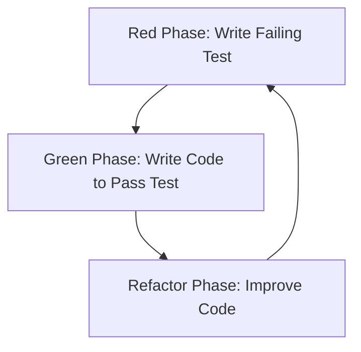

## 14.2 Test-Driven Development (TDD) in Lua

Test-Driven Development (TDD) is a software development approach that emphasizes writing tests before writing the actual code. This methodology not only helps in ensuring that the code meets the desired requirements but also encourages developers to think through the design and functionality of their code before implementation. In this section, we will delve into the principles of TDD, explore its benefits, and demonstrate how to apply TDD in Lua with practical examples.

### Developing with Testing in Mind

The core idea of TDD is to write tests before writing the code that fulfills those tests. This approach can be broken down into a simple cycle known as the **TDD Cycle**:

1. **Red Phase**: Write a test that defines a function or improvements of a function, which should fail initially because the function does not exist yet or is incomplete.
2. **Green Phase**: Write the minimum amount of code necessary to pass the test.
3. **Refactor Phase**: Clean up the code, ensuring that all tests still pass.

By following this cycle, developers can ensure that their code is always tested and validated, leading to more robust and reliable software.

### The TDD Cycle

#### Red Phase: Writing a Failing Test

The first step in the TDD cycle is to write a test that fails. This might seem counterintuitive, but it serves as a clear goal for what the code needs to achieve. In Lua, we can use a testing framework like **busted** to write our tests.

```lua
-- Example of a failing test using busted
describe("Calculator", function()
    it("should add two numbers correctly", function()
        local result = add(2, 3)
        assert.are.equal(5, result)
    end)
end)
```

In this example, we are testing a hypothetical `add` function that should add two numbers. Since the function does not exist yet, this test will fail.

#### Green Phase: Writing Code to Make the Test Pass

Once we have a failing test, the next step is to write just enough code to make the test pass. This encourages developers to focus on the immediate requirements without over-engineering.

```lua
-- Implementation to pass the test
function add(a, b)
    return a + b
end
```

With this simple implementation, the test should now pass, moving us to the next phase.

#### Refactor Phase: Improving Code While Keeping Tests Passing

Refactoring involves cleaning up the code, improving its structure and readability without changing its behavior. The key is to ensure that all tests continue to pass after refactoring.

```lua
-- Refactored code (in this simple case, no changes needed)
function add(a, b)
    return a + b
end
```

In more complex scenarios, refactoring might involve breaking down functions, renaming variables for clarity, or optimizing algorithms.

### Benefits of TDD

#### Design Feedback

One of the primary benefits of TDD is the immediate feedback it provides on the design and functionality of the code. By writing tests first, developers are forced to think about the API and how it will be used, leading to better-designed software.

#### Improved Code Quality

TDD encourages cleaner, more maintainable code. Since tests are written first, the code is designed to be testable, which often results in better separation of concerns and more modular code.

### Use Cases and Examples

#### Library Development

When developing libraries, TDD ensures that the API meets the specified requirements and behaves as expected. This is crucial for libraries that will be used by other developers, as it guarantees reliability and consistency.

```lua
-- Example: Testing a string utility library
describe("StringUtils", function()
    it("should capitalize the first letter of a string", function()
        local result = StringUtils.capitalize("lua")
        assert.are.equal("Lua", result)
    end)
end)

-- Implementation
StringUtils = {}
function StringUtils.capitalize(str)
    return str:gsub("^%l", string.upper)
end
```

#### Critical Systems

In systems where correctness is paramount, such as financial applications or safety-critical systems, TDD provides a safety net by ensuring that all code is thoroughly tested and verified.

### Try It Yourself

To get hands-on experience with TDD in Lua, try modifying the examples above. For instance, add more test cases to the `add` function to handle edge cases like adding negative numbers or zero. Experiment with refactoring the `StringUtils.capitalize` function to handle multi-word strings.

### Visualizing the TDD Cycle

Let's visualize the TDD cycle to better understand the process:



This diagram illustrates the iterative nature of TDD, where each phase leads into the next, forming a continuous loop of development and testing.

### References and Links

- [Busted Testing Framework](https://olivinelabs.com/busted/)
- [Test-Driven Development by Example](https://www.amazon.com/Test-Driven-Development-Kent-Beck/dp/0321146530) by Kent Beck

### Knowledge Check

- What are the three phases of the TDD cycle?
- How does TDD improve code quality?
- Why is it important to write tests before code in TDD?

### Embrace the Journey

Remember, TDD is not just about writing tests; it's a mindset that encourages better design and more reliable software. As you practice TDD, you'll find that it becomes an integral part of your development process, leading to more robust and maintainable code. Keep experimenting, stay curious, and enjoy the journey!

## Quiz Time!



### What is the first phase in the TDD cycle?

- [x] Red Phase
- [ ] Green Phase
- [ ] Refactor Phase
- [ ] Blue Phase

> **Explanation:** The first phase in the TDD cycle is the Red Phase, where you write a failing test.

### What is the main goal of the Green Phase in TDD?

- [x] To write code that makes the test pass
- [ ] To refactor the code
- [ ] To write more tests
- [ ] To deploy the code

> **Explanation:** The Green Phase focuses on writing the minimum amount of code necessary to pass the test.

### How does TDD improve code quality?

- [x] By encouraging cleaner, more maintainable code
- [ ] By reducing the number of tests needed
- [ ] By increasing code complexity
- [ ] By eliminating the need for refactoring

> **Explanation:** TDD improves code quality by encouraging developers to write cleaner, more modular code that is easier to maintain.

### Which of the following is a benefit of TDD?

- [x] Immediate design feedback
- [ ] Reduced testing time
- [ ] Increased code complexity
- [ ] Elimination of bugs

> **Explanation:** TDD provides immediate feedback on the design and functionality of the code, helping to ensure it meets requirements.

### In which phase of TDD do you improve the code structure?

- [ ] Red Phase
- [ ] Green Phase
- [x] Refactor Phase
- [ ] Blue Phase

> **Explanation:** The Refactor Phase is where you improve the code structure while keeping all tests passing.

### What is a common use case for TDD?

- [x] Library development
- [ ] Writing documentation
- [ ] Designing user interfaces
- [ ] Creating graphics

> **Explanation:** TDD is commonly used in library development to ensure APIs meet specifications and behave as expected.

### What tool can be used for testing in Lua?

- [x] Busted
- [ ] Mocha
- [ ] JUnit
- [ ] Jasmine

> **Explanation:** Busted is a popular testing framework for Lua.

### What does TDD stand for?

- [x] Test-Driven Development
- [ ] Test-Driven Design
- [ ] Test-Driven Deployment
- [ ] Test-Driven Debugging

> **Explanation:** TDD stands for Test-Driven Development.

### Why is it important to write tests before code in TDD?

- [x] To define the expected behavior and requirements
- [ ] To reduce the number of tests needed
- [ ] To increase code complexity
- [ ] To eliminate the need for refactoring

> **Explanation:** Writing tests before code helps define the expected behavior and ensures the code meets the requirements.

### TDD encourages writing tests after the code is complete.

- [ ] True
- [x] False

> **Explanation:** TDD encourages writing tests before the code is implemented, not after.


