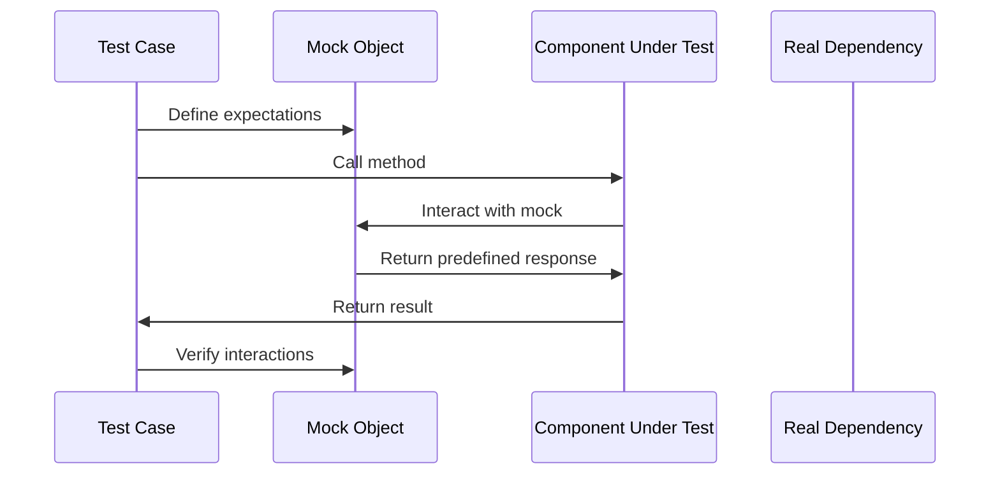

## 14.3 Mocking and Stubbing Techniques

In the realm of software testing, particularly in Lua, mocking and stubbing are indispensable techniques that allow developers to isolate code for testing. These techniques are crucial for simulating complex dependencies and providing controlled environments for testing individual components. In this section, we will delve into the concepts of mocking and stubbing, explore their implementation in Lua, and examine practical use cases to enhance your testing strategies.

### Isolating Code for Testing

When testing software, it is often necessary to isolate the code under test from its dependencies. This isolation ensures that tests are reliable and repeatable, focusing solely on the functionality of the component being tested. Mocking and stubbing are two techniques that facilitate this isolation by replacing parts of the system with mock objects or stubs.

#### Mock Objects

Mock objects are simulated objects that mimic the behavior of real objects in a controlled way. They are used to test the interactions between the component under test and its dependencies. Mock objects can verify that certain methods were called, with specific arguments, and in a particular order.

**Example:**

```lua
-- Mock object example in Lua
local MockDatabase = {}

function MockDatabase:new()
    local instance = {
        queries = {}
    }
    setmetatable(instance, self)
    self.__index = self
    return instance
end

function MockDatabase:query(sql)
    table.insert(self.queries, sql)
    return "mocked result"
end

function MockDatabase:verifyQuery(expectedSql)
    for _, sql in ipairs(self.queries) do
        if sql == expectedSql then
            return true
        end
    end
    return false
end

-- Usage
local db = MockDatabase:new()
db:query("SELECT * FROM users")
assert(db:verifyQuery("SELECT * FROM users"), "Query was not executed as expected")
```

In this example, `MockDatabase` is a mock object that simulates a database. It records the queries executed and allows verification of whether a specific query was made.

#### Stubs

Stubs are simplified implementations of components that provide predefined responses to method calls. Unlike mocks, stubs do not verify interactions; they simply return fixed data to the component under test.

**Example:**

```lua
-- Stub example in Lua
local StubWeatherService = {}

function StubWeatherService:getWeather(city)
    if city == "New York" then
        return "Sunny"
    elseif city == "London" then
        return "Rainy"
    else
        return "Unknown"
    end
end

-- Usage
local weatherService = StubWeatherService
local weather = weatherService:getWeather("New York")
assert(weather == "Sunny", "Weather should be Sunny for New York")
```

In this example, `StubWeatherService` provides predefined weather data for specific cities, allowing tests to proceed without relying on an actual weather service.

### Framework Support

Lua, being a lightweight and flexible language, has several libraries and tools that support mocking and stubbing. One such tool is LuaMock, which provides a framework for creating mock objects and stubs in Lua.

#### Using Libraries: LuaMock

LuaMock is a popular library that simplifies the creation of mock objects and stubs. It provides a fluent API for defining expectations and verifying interactions.

**Installation:**

To use LuaMock, you can install it via LuaRocks:

```bash
luarocks install luamock
```

**Example:**

```lua
local mock = require("luamock")

-- Create a mock object
local mockService = mock()

-- Define expectations
mockService:expect("fetchData"):with("parameter1"):and_return("mocked data")

-- Use the mock object
local result = mockService:fetchData("parameter1")
assert(result == "mocked data", "Expected mocked data")

-- Verify interactions
mockService:verify()
```

In this example, LuaMock is used to create a mock object `mockService` with an expectation that the `fetchData` method will be called with a specific parameter and return a predefined result.

### Use Cases and Examples

Mocking and stubbing are particularly useful in scenarios where testing real components is impractical or undesirable. Let's explore some common use cases.

#### Testing Network Code

Network code often involves interactions with external servers, which can be slow, unreliable, or costly to test. By using mocks and stubs, you can simulate server responses and test your network code in isolation.

**Example:**

```lua
local mock = require("luamock")

-- Mock HTTP client
local mockHttpClient = mock()

-- Define expected behavior
mockHttpClient:expect("get"):with("http://example.com/api"):and_return({status = 200, body = "mocked response"})

-- Function to test
local function fetchData(httpClient, url)
    local response = httpClient:get(url)
    if response.status == 200 then
        return response.body
    else
        return nil
    end
end

-- Test the function
local result = fetchData(mockHttpClient, "http://example.com/api")
assert(result == "mocked response", "Expected mocked response")

-- Verify interactions
mockHttpClient:verify()
```

In this example, a mock HTTP client is used to simulate a server response, allowing the `fetchData` function to be tested without making actual network requests.

#### Isolating Components

In complex systems, it is often necessary to test components in isolation to ensure they function correctly on their own. Mocking and stubbing can help achieve this by replacing dependencies with controlled substitutes.

**Example:**

```lua
local mock = require("luamock")

-- Mock dependency
local mockLogger = mock()

-- Define expected behavior
mockLogger:expect("log"):with("Component initialized")

-- Component to test
local function initializeComponent(logger)
    logger:log("Component initialized")
end

-- Test the component
initializeComponent(mockLogger)

-- Verify interactions
mockLogger:verify()
```

In this example, a mock logger is used to verify that the `initializeComponent` function logs the expected message.

### Visualizing Mocking and Stubbing

To better understand the flow of mocking and stubbing, let's visualize the process using a sequence diagram.



**Diagram Description:** This sequence diagram illustrates the interaction between a test case, a mock object, the component under test, and the real dependency. The test case defines expectations on the mock object, calls the component's method, and verifies the interactions with the mock.

### Knowledge Check

To reinforce your understanding of mocking and stubbing techniques, consider the following questions:

- What is the primary purpose of using mock objects in testing?
- How do stubs differ from mocks in terms of functionality?
- Why is it beneficial to use libraries like LuaMock for mocking and stubbing?
- In what scenarios would you prefer to use stubs over mocks?
- How can mocking and stubbing improve the reliability of your tests?

### Try It Yourself

To deepen your understanding, try modifying the code examples provided:

- Change the predefined responses in the stub examples and observe how the tests behave.
- Add additional expectations to the mock examples and verify that they are correctly enforced.
- Experiment with creating your own mock objects for different types of dependencies.

### Embrace the Journey

Remember, mastering mocking and stubbing techniques is a journey. As you continue to explore these concepts, you'll gain greater confidence in isolating code for testing and ensuring the reliability of your software. Keep experimenting, stay curious, and enjoy the process of learning and improving your testing strategies.

## Quiz Time!



### What is the primary purpose of using mock objects in testing?

- [x] To simulate complex dependencies and verify interactions
- [ ] To provide predefined responses without verification
- [ ] To replace real objects with simpler implementations
- [ ] To execute tests faster by skipping certain components

> **Explanation:** Mock objects are used to simulate complex dependencies and verify interactions between the component under test and its dependencies.

### How do stubs differ from mocks in terms of functionality?

- [x] Stubs provide predefined responses without verifying interactions
- [ ] Stubs verify interactions and provide predefined responses
- [ ] Stubs are used for testing network code only
- [ ] Stubs are more complex than mocks

> **Explanation:** Stubs provide predefined responses to method calls without verifying interactions, unlike mocks which verify interactions.

### Why is it beneficial to use libraries like LuaMock for mocking and stubbing?

- [x] They simplify the creation and management of mock objects and stubs
- [ ] They automatically generate test cases
- [ ] They provide real-time feedback on code performance
- [ ] They eliminate the need for manual testing

> **Explanation:** Libraries like LuaMock simplify the creation and management of mock objects and stubs, making it easier to define expectations and verify interactions.

### In what scenarios would you prefer to use stubs over mocks?

- [x] When you need predefined responses without verifying interactions
- [ ] When you need to verify method call order
- [ ] When testing complex network interactions
- [ ] When testing user interfaces

> **Explanation:** Stubs are preferred when you need predefined responses without the need to verify interactions, making them suitable for simpler testing scenarios.

### How can mocking and stubbing improve the reliability of your tests?

- [x] By isolating components and controlling dependencies
- [ ] By reducing the number of test cases needed
- [ ] By increasing test execution speed
- [ ] By eliminating the need for real dependencies

> **Explanation:** Mocking and stubbing improve test reliability by isolating components and controlling dependencies, ensuring tests focus on the component under test.

### What is a key advantage of using mock objects?

- [x] They allow verification of method calls and interactions
- [ ] They provide faster test execution
- [ ] They eliminate the need for real dependencies
- [ ] They simplify code implementation

> **Explanation:** Mock objects allow verification of method calls and interactions, ensuring that the component under test behaves as expected.

### Which Lua library is commonly used for mocking and stubbing?

- [x] LuaMock
- [ ] LuaTest
- [ ] LuaUnit
- [ ] LuaCheck

> **Explanation:** LuaMock is a commonly used library for creating mock objects and stubs in Lua.

### What is the role of a mock object in a test case?

- [x] To simulate a real object and verify interactions
- [ ] To provide a simplified implementation of a component
- [ ] To execute tests faster by skipping certain components
- [ ] To automatically generate test cases

> **Explanation:** A mock object simulates a real object and verifies interactions, ensuring that the component under test interacts correctly with its dependencies.

### What is the main difference between a mock and a stub?

- [x] Mocks verify interactions, while stubs provide predefined responses
- [ ] Mocks provide predefined responses, while stubs verify interactions
- [ ] Mocks are used for network testing, while stubs are not
- [ ] Mocks are more complex than stubs

> **Explanation:** Mocks verify interactions between components, while stubs provide predefined responses without verification.

### True or False: Stubs can be used to verify the order of method calls.

- [ ] True
- [x] False

> **Explanation:** Stubs do not verify the order of method calls; they simply provide predefined responses to method calls.


