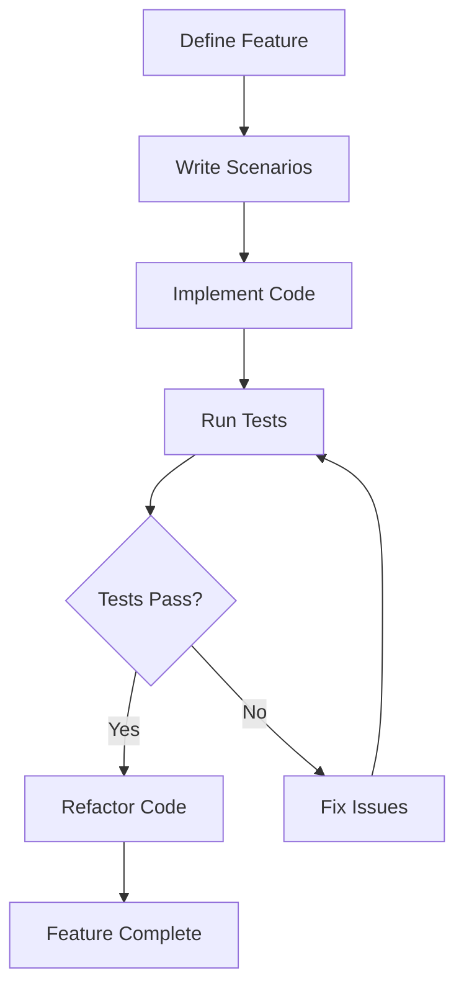

## 14.4 Behavior-Driven Development (BDD)

Behavior-Driven Development (BDD) is a software development approach that emphasizes collaboration between developers, testers, and non-technical stakeholders. It focuses on defining how software should behave in specific scenarios, using natural language to describe features and expectations. This approach not only enhances communication but also ensures that the software meets the intended requirements.

### Focusing on Behavior

In BDD, the primary focus is on the behavior of the software rather than the technical implementation. This is achieved by defining scenarios that describe how the software should behave in various situations. These scenarios are written in a language that is easily understandable by all stakeholders, including those without technical expertise.

#### Key Concepts of BDD

- **Feature**: A high-level description of a software capability.
- **Scenario**: A specific example of how a feature should behave.
- **Given-When-Then**: A format for writing scenarios that describe the initial context (Given), the action (When), and the expected outcome (Then).

### Implementing BDD in Lua

Implementing BDD in Lua involves using frameworks that support BDD-style testing. These frameworks allow developers to write tests in a way that mirrors the natural language descriptions of features and scenarios.

#### Describing Features

Features in BDD are described using human-readable language. This makes it easier for stakeholders to understand what the software is supposed to do. Here's an example of how a feature might be described:

```
Feature: User Login

  Scenario: Successful login
    Given the user is on the login page
    When the user enters valid credentials
    Then the user should be redirected to the dashboard
```

#### Writing Specifications

Specifications in BDD are written in natural language, defining the expectations for each scenario. These specifications serve as both documentation and tests, ensuring that the software behaves as expected.

### Frameworks for BDD in Lua

Several frameworks support BDD-style testing in Lua, with Busted being one of the most popular.

#### Busted

Busted is a unit testing framework for Lua that supports BDD-style tests. It allows developers to write tests in a natural language style, making it easier to describe the behavior of the software.

##### Installing Busted

To get started with Busted, you need to install it. You can do this using LuaRocks, the package manager for Lua:

```bash
luarocks install busted
```

##### Writing Tests with Busted

Here's an example of how you can write a BDD-style test using Busted:

```lua
describe("User Login", function()
  it("should redirect to the dashboard on successful login", function()
    -- Given
    local user = { username = "testuser", password = "password123" }
    local loginPage = LoginPage.new()

    -- When
    local result = loginPage:login(user)

    -- Then
    assert.is_true(result.success)
    assert.are_equal("dashboard", result.redirect)
  end)
end)
```

In this example, we describe a feature ("User Login") and a scenario ("should redirect to the dashboard on successful login"). The test is written in a way that mirrors the natural language description, making it easy to understand.

### Use Cases and Examples

BDD is particularly useful in scenarios where collaboration between developers and stakeholders is crucial. It helps bridge the communication gap and ensures that everyone is on the same page regarding the software's behavior.

#### Collaborative Development

BDD facilitates collaborative development by involving all stakeholders in the process of defining software behavior. This ensures that the software meets the needs of the users and aligns with business goals.

#### Documenting Code Behavior

Tests written in a BDD style serve as living documentation. They provide a clear and concise description of how the software should behave, making it easier for new team members to understand the codebase.

### Try It Yourself

To get a hands-on experience with BDD in Lua, try modifying the example test above. Change the scenario to test an unsuccessful login attempt and see how the test results change. This will help you understand how BDD tests can be used to describe different behaviors.

### Visualizing BDD Workflow

To better understand the BDD workflow, let's visualize the process using a flowchart:



**Caption**: This flowchart illustrates the BDD workflow, starting from defining features to completing the feature after passing tests.

### References and Links

For further reading on BDD and its implementation in Lua, consider the following resources:

- [Busted Documentation](https://olivinelabs.com/busted/)
- [Cucumber: A Tool for BDD](https://cucumber.io/)
- [Behavior-Driven Development on Wikipedia](https://en.wikipedia.org/wiki/Behavior-driven_development)

### Knowledge Check

To reinforce your understanding of BDD in Lua, consider the following questions:

- What is the primary focus of BDD?
- How does BDD enhance collaboration between developers and stakeholders?
- What is the Given-When-Then format used for?
- How does Busted support BDD-style testing in Lua?

### Embrace the Journey

Remember, mastering BDD is a journey. As you continue to explore and implement BDD in your projects, you'll find that it not only improves the quality of your software but also enhances collaboration and communication within your team. Keep experimenting, stay curious, and enjoy the journey!

## Quiz Time!



### What is the primary focus of Behavior-Driven Development (BDD)?

- [x] Defining how software should behave in specific scenarios
- [ ] Writing code in a specific programming language
- [ ] Optimizing software performance
- [ ] Designing user interfaces

> **Explanation:** BDD focuses on defining how software should behave in specific scenarios using natural language descriptions.

### Which framework is commonly used for BDD-style testing in Lua?

- [x] Busted
- [ ] Mocha
- [ ] Jasmine
- [ ] JUnit

> **Explanation:** Busted is a popular framework for BDD-style testing in Lua.

### What is the Given-When-Then format used for in BDD?

- [x] Writing scenarios that describe the initial context, action, and expected outcome
- [ ] Defining programming languages
- [ ] Optimizing algorithms
- [ ] Designing user interfaces

> **Explanation:** The Given-When-Then format is used to write scenarios that describe the initial context, action, and expected outcome in BDD.

### How does BDD enhance collaboration between developers and stakeholders?

- [x] By using natural language to describe software behavior
- [ ] By writing complex algorithms
- [ ] By focusing on technical implementation
- [ ] By designing user interfaces

> **Explanation:** BDD enhances collaboration by using natural language to describe software behavior, making it accessible to all stakeholders.

### What role do tests play in BDD?

- [x] They serve as living documentation
- [ ] They are only used for debugging
- [ ] They are not necessary
- [ ] They are used to design user interfaces

> **Explanation:** In BDD, tests serve as living documentation, providing a clear description of how the software should behave.

### What is the purpose of the "describe" function in Busted?

- [x] To define a feature or a group of related tests
- [ ] To execute a test case
- [ ] To optimize code performance
- [ ] To design user interfaces

> **Explanation:** The "describe" function in Busted is used to define a feature or a group of related tests.

### How can BDD tests be used in collaborative development?

- [x] By involving all stakeholders in defining software behavior
- [ ] By focusing solely on technical implementation
- [ ] By excluding non-technical stakeholders
- [ ] By designing user interfaces

> **Explanation:** BDD tests involve all stakeholders in defining software behavior, facilitating collaborative development.

### What is the main advantage of using BDD in software development?

- [x] It ensures that the software meets the intended requirements
- [ ] It focuses solely on code optimization
- [ ] It excludes non-technical stakeholders
- [ ] It designs user interfaces

> **Explanation:** The main advantage of BDD is that it ensures the software meets the intended requirements by involving all stakeholders.

### How does Busted support writing tests in a natural language style?

- [x] By allowing tests to be written in a way that mirrors natural language descriptions
- [ ] By focusing on technical implementation
- [ ] By excluding non-technical stakeholders
- [ ] By designing user interfaces

> **Explanation:** Busted supports writing tests in a natural language style, making it easier to describe software behavior.

### True or False: BDD is only useful for technical stakeholders.

- [ ] True
- [x] False

> **Explanation:** False. BDD is useful for both technical and non-technical stakeholders, as it enhances collaboration and communication.


