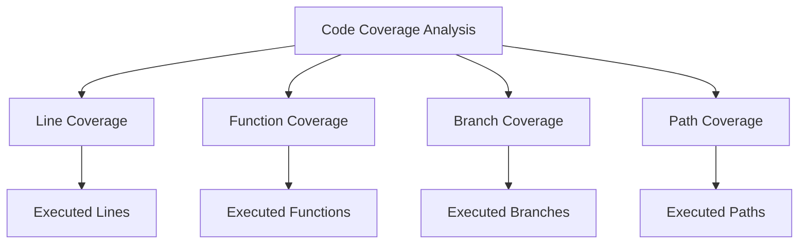

## 14.5 Code Coverage Analysis

In the realm of software development, ensuring that your code is thoroughly tested is paramount. Code coverage analysis is a critical aspect of this process, providing insights into which parts of your codebase are exercised by your tests. In this section, we will delve into the nuances of code coverage analysis in Lua, focusing on measuring test effectiveness, implementing tools like LuaCov, and enhancing test coverage for robust software development.

### Measuring Test Effectiveness

Code coverage is a metric used to determine the extent to which your code is executed during testing. It helps identify untested parts of your codebase, ensuring that critical paths are not overlooked. By measuring test effectiveness, developers can gain confidence in the reliability and stability of their applications.

#### Types of Code Coverage

1. **Line Coverage**: Measures the percentage of executed lines of code.
2. **Function Coverage**: Assesses the percentage of functions invoked during testing.
3. **Branch Coverage**: Evaluates the execution of all possible branches in control structures.
4. **Path Coverage**: Analyzes the execution of all possible paths through the code.

Each type of coverage provides different insights, and a combination of these metrics offers a comprehensive view of test effectiveness.

### Implementing Code Coverage

To implement code coverage analysis in Lua, we utilize tools like LuaCov. LuaCov is a popular code coverage tool for Lua, designed to help developers identify untested code paths and improve test coverage.

#### Tools: Using LuaCov for Coverage Analysis

LuaCov is a lightweight and easy-to-use tool that integrates seamlessly into Lua projects. It provides detailed reports on code coverage, highlighting areas that require additional testing.

**Installation and Setup**

To get started with LuaCov, you need to install it using LuaRocks, the package manager for Lua:

```bash
luarocks install luacov
```

Once installed, you can configure LuaCov by creating a `.luacov` configuration file in your project directory. This file allows you to customize the coverage analysis, specifying which files and directories to include or exclude.

**Running LuaCov**

To run LuaCov, execute your Lua script with the `luacov` module:

```bash
lua -lluacov your_script.lua
```

After running your tests, LuaCov generates a coverage report in the `luacov.report.out` file. This report provides a detailed breakdown of code coverage, highlighting lines that were executed and those that were not.

#### Analyzing Results: Identifying Untested Code Paths

Analyzing the coverage report is crucial for identifying untested code paths. The report highlights lines of code that were not executed during testing, allowing you to pinpoint areas that require additional test cases.

**Example Coverage Report**

```plaintext
File: your_script.lua
Lines executed: 80.00% of 50
Branches executed: 70.00% of 20
Functions executed: 85.00% of 10
```

In this example, 80% of the lines, 70% of the branches, and 85% of the functions were executed. The untested lines and branches indicate areas that need further testing.

### Improving Coverage

Improving code coverage involves writing additional tests to target uncovered areas and refactoring complex code to enhance testability.

#### Writing Additional Tests: Targeting Uncovered Areas

To improve coverage, focus on writing tests for the untested parts of your code. This may involve creating new test cases or expanding existing ones to cover different scenarios and edge cases.

**Example: Adding Tests for Untested Branches**

Consider a function with conditional logic that was not fully covered by tests:

```lua
function calculateDiscount(price, customerType)
    if customerType == "VIP" then
        return price * 0.8
    elseif customerType == "Regular" then
        return price * 0.9
    else
        return price
    end
end
```

To improve coverage, add tests for each branch:

```lua
local function testCalculateDiscount()
    assert(calculateDiscount(100, "VIP") == 80)
    assert(calculateDiscount(100, "Regular") == 90)
    assert(calculateDiscount(100, "New") == 100)
end

testCalculateDiscount()
```

#### Refactoring: Simplifying Complex Code

Refactoring complex code can enhance testability and improve coverage. Simplifying logic and breaking down large functions into smaller, testable units makes it easier to achieve comprehensive coverage.

**Example: Refactoring for Better Coverage**

Before refactoring:

```lua
function processOrder(order)
    if order.status == "pending" then
        -- complex logic
    elseif order.status == "completed" then
        -- complex logic
    else
        -- complex logic
    end
end
```

After refactoring:

```lua
function handlePendingOrder(order)
    -- simplified logic
end

function handleCompletedOrder(order)
    -- simplified logic
end

function handleOtherOrder(order)
    -- simplified logic
end

function processOrder(order)
    if order.status == "pending" then
        handlePendingOrder(order)
    elseif order.status == "completed" then
        handleCompletedOrder(order)
    else
        handleOtherOrder(order)
    end
end
```

By breaking down the `processOrder` function into smaller functions, each part can be tested independently, improving overall coverage.

### Use Cases and Examples

Code coverage analysis is invaluable in various scenarios, from quality assurance to continuous integration.

#### Quality Assurance: Ensuring Critical Code is Thoroughly Tested

In quality assurance, code coverage analysis ensures that critical code paths are thoroughly tested, reducing the risk of defects in production. By identifying untested areas, QA teams can focus their efforts on writing tests that cover essential functionality.

#### Continuous Integration: Integrating Coverage Analysis into Build Pipelines

Integrating code coverage analysis into continuous integration (CI) pipelines automates the process of measuring test effectiveness. Tools like Jenkins or GitHub Actions can be configured to run LuaCov as part of the build process, providing real-time feedback on code coverage.

**Example: Integrating LuaCov with GitHub Actions**

Create a `.github/workflows/ci.yml` file in your repository:

```yaml
name: CI

on: [push, pull_request]

jobs:
  build:
    runs-on: ubuntu-latest

    steps:
    - uses: actions/checkout@v2
    - name: Set up Lua
      uses: leafo/gh-actions-luarocks@v1
    - name: Install dependencies
      run: luarocks install luacov
    - name: Run tests with coverage
      run: lua -lluacov your_script.lua
    - name: Upload coverage report
      uses: actions/upload-artifact@v2
      with:
        name: coverage-report
        path: luacov.report.out
```

This configuration runs LuaCov on each push or pull request, generating a coverage report that can be reviewed by the development team.

### Visualizing Code Coverage

Visualizing code coverage can help developers understand the coverage metrics and identify areas for improvement.



**Diagram Description**: This diagram illustrates the different types of code coverage analysis, including line, function, branch, and path coverage. Each type provides insights into different aspects of test effectiveness.

### Try It Yourself

Experiment with LuaCov by modifying the example code provided. Try adding new functions or branches and observe how the coverage report changes. This hands-on approach will deepen your understanding of code coverage analysis.

### References and Links

- [LuaCov GitHub Repository](https://github.com/keplerproject/luacov)
- [LuaRocks: The Lua Package Manager](https://luarocks.org/)
- [GitHub Actions Documentation](https://docs.github.com/en/actions)

### Knowledge Check

- What are the different types of code coverage?
- How can LuaCov be integrated into a CI pipeline?
- Why is code coverage analysis important in quality assurance?

### Embrace the Journey

Remember, mastering code coverage analysis is a journey. As you progress, you'll gain insights into the effectiveness of your tests and improve the quality of your software. Keep experimenting, stay curious, and enjoy the journey!

## Quiz Time!



### What is the primary purpose of code coverage analysis?

- [x] To determine which parts of code are exercised by tests
- [ ] To measure the performance of the code
- [ ] To identify syntax errors in the code
- [ ] To optimize the code for speed

> **Explanation:** Code coverage analysis is used to determine which parts of the code are exercised by tests, ensuring that critical paths are tested.

### Which tool is commonly used for code coverage analysis in Lua?

- [x] LuaCov
- [ ] LuaTest
- [ ] LuaCheck
- [ ] LuaLint

> **Explanation:** LuaCov is a popular tool for code coverage analysis in Lua, providing detailed reports on code coverage.

### What type of code coverage measures the percentage of executed lines of code?

- [x] Line Coverage
- [ ] Function Coverage
- [ ] Branch Coverage
- [ ] Path Coverage

> **Explanation:** Line coverage measures the percentage of executed lines of code during testing.

### How can you improve code coverage?

- [x] Writing additional tests for uncovered areas
- [ ] Ignoring untested code paths
- [ ] Removing tests that fail
- [ ] Increasing code complexity

> **Explanation:** Improving code coverage involves writing additional tests for uncovered areas and simplifying complex code.

### What is the benefit of integrating code coverage analysis into CI pipelines?

- [x] Provides real-time feedback on code coverage
- [ ] Increases the speed of the build process
- [ ] Reduces the need for manual testing
- [ ] Eliminates the need for code reviews

> **Explanation:** Integrating code coverage analysis into CI pipelines provides real-time feedback on code coverage, helping teams identify untested areas.

### What does branch coverage evaluate?

- [x] Execution of all possible branches in control structures
- [ ] Execution of all functions in the code
- [ ] Execution of all lines of code
- [ ] Execution of all paths through the code

> **Explanation:** Branch coverage evaluates the execution of all possible branches in control structures, ensuring that all decision points are tested.

### Why is refactoring important for improving code coverage?

- [x] Simplifies complex code, making it easier to test
- [ ] Increases the number of lines of code
- [ ] Reduces the need for testing
- [ ] Eliminates the need for documentation

> **Explanation:** Refactoring simplifies complex code, making it easier to test and improving overall code coverage.

### What is the role of a `.luacov` configuration file?

- [x] Customizes the coverage analysis by specifying files and directories to include or exclude
- [ ] Stores the results of the coverage analysis
- [ ] Compiles the Lua code
- [ ] Executes the Lua tests

> **Explanation:** The `.luacov` configuration file customizes the coverage analysis by specifying which files and directories to include or exclude.

### What is the significance of path coverage?

- [x] Analyzes the execution of all possible paths through the code
- [ ] Measures the percentage of executed lines of code
- [ ] Evaluates the execution of all functions
- [ ] Assesses the execution of all branches

> **Explanation:** Path coverage analyzes the execution of all possible paths through the code, providing insights into complex control flows.

### True or False: Code coverage analysis can completely eliminate the risk of defects in production.

- [ ] True
- [x] False

> **Explanation:** While code coverage analysis helps identify untested areas, it cannot completely eliminate the risk of defects in production. It is one of many tools used to improve software quality.


