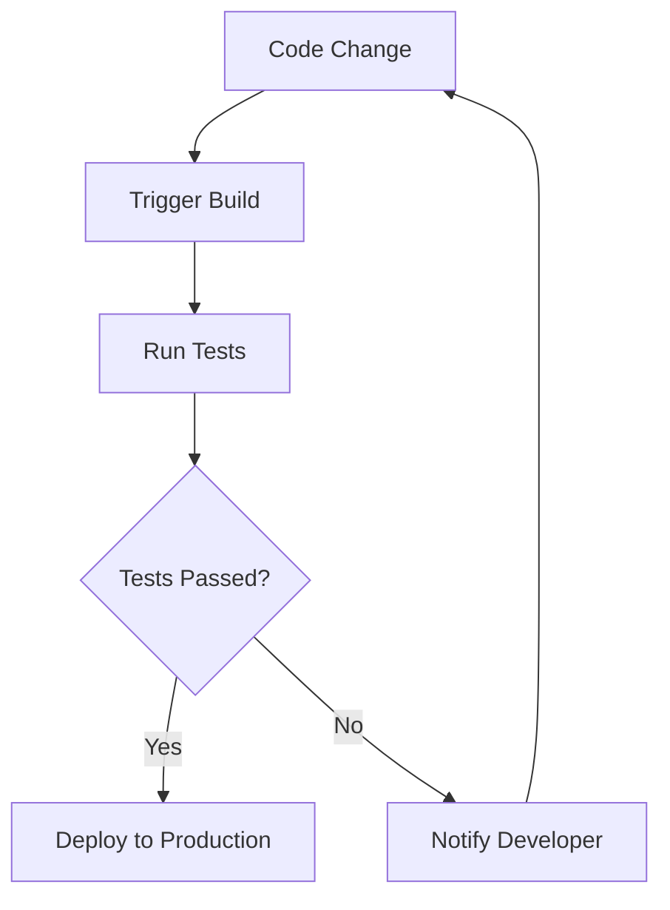

## 14.6 Continuous Integration and Deployment

In the fast-paced world of software development, Continuous Integration (CI) and Continuous Deployment (CD) have become essential practices for delivering high-quality software efficiently. This section will guide you through the concepts of CI/CD, specifically tailored for Lua projects, and provide practical insights into automating testing and deployment processes.

### Automating Testing and Deployment

Continuous Integration and Deployment are practices that aim to automate the software development lifecycle, from code integration to deployment. By integrating changes frequently and deploying reliably, teams can reduce the time to market and improve software quality.

#### Implementing CI/CD Pipelines

A CI/CD pipeline is a series of automated processes that enable developers to integrate code changes, run tests, and deploy applications seamlessly. Let's explore the key components of a CI/CD pipeline for Lua projects.

##### Version Control Integration

Version control systems (VCS) like Git are the backbone of CI/CD pipelines. They allow developers to track changes, collaborate, and trigger automated processes. Here's how you can integrate version control into your CI/CD pipeline:

- **Triggering Builds on Code Changes**: Set up your CI/CD tool to monitor your VCS repository. Whenever a change is pushed, the tool should automatically trigger a build process. This ensures that every change is tested and validated.

```lua
-- Example of a Lua script that could be part of a build process
local function build_project()
    print("Building the Lua project...")
    -- Simulate build steps
    os.execute("luac -o output.luac main.lua")
    print("Build completed.")
end

build_project()
```

- **Branching Strategies**: Use branching strategies like Git Flow or GitHub Flow to manage feature development, bug fixes, and releases. This helps in organizing the workflow and ensuring that only stable code is deployed.

##### Automated Testing

Automated testing is a crucial part of the CI/CD pipeline. It ensures that code changes do not introduce new bugs and that the application behaves as expected.

- **Running Tests as Part of the Build Process**: Integrate automated tests into your build process. Use testing frameworks like Busted or LuaUnit to write and execute tests.

```lua
-- Example of a simple test using LuaUnit
local lu = require('luaunit')

function testAddition()
    local result = 1 + 1
    lu.assertEquals(result, 2)
end

os.exit(lu.LuaUnit.run())
```

- **Test Coverage**: Aim for high test coverage to ensure that most of your code is tested. Use tools like LuaCov to measure test coverage and identify untested parts of your code.

### Tools and Platforms

Several tools and platforms can help you set up CI/CD pipelines for Lua projects. Let's explore some popular options.

#### Jenkins

Jenkins is a widely-used open-source automation server that supports building, deploying, and automating any project. Here's how you can set up Jenkins for a Lua project:

- **Installation and Setup**: Install Jenkins on your server and configure it to monitor your VCS repository.
- **Creating a Pipeline**: Use Jenkins Pipeline to define your build, test, and deployment steps in a Jenkinsfile.

```groovy
pipeline {
    agent any
    stages {
        stage('Build') {
            steps {
                sh 'luac -o output.luac main.lua'
            }
        }
        stage('Test') {
            steps {
                sh 'lua test.lua'
            }
        }
        stage('Deploy') {
            steps {
                echo 'Deploying application...'
                // Add deployment steps here
            }
        }
    }
}
```

#### Travis CI

Travis CI is a cloud-based CI/CD service that integrates with GitHub repositories. It is easy to set up and use for open-source projects.

- **Configuration**: Add a `.travis.yml` file to your repository to define the build and test process.

```yaml
language: lua
script:
  - luac -o output.luac main.lua
  - lua test.lua
```

- **Integration with GitHub**: Travis CI automatically triggers builds when changes are pushed to your GitHub repository.

#### GitHub Actions

GitHub Actions is a powerful CI/CD tool integrated directly into GitHub. It allows you to automate workflows based on events in your repository.

- **Creating a Workflow**: Define a workflow in a YAML file within the `.github/workflows` directory.

```yaml
name: CI

on:
  push:
    branches: [ main ]

jobs:
  build:
    runs-on: ubuntu-latest
    steps:
    - uses: actions/checkout@v2
    - name: Set up Lua
      uses: leafo/gh-actions-lua@v1
    - name: Build
      run: luac -o output.luac main.lua
    - name: Test
      run: lua test.lua
```

### Use Cases and Examples

CI/CD pipelines are beneficial in various development scenarios. Let's explore some use cases and examples.

#### Agile Development

In Agile development, rapid feedback on code changes is crucial. CI/CD pipelines provide immediate feedback by running tests and builds automatically.

- **Continuous Feedback**: Developers receive instant feedback on their code changes, allowing them to fix issues quickly and maintain a high-quality codebase.

#### Reducing Deployment Risks

Deploying code to production can be risky if not done correctly. CI/CD pipelines help catch issues before they reach production.

- **Automated Testing**: By running tests automatically, CI/CD pipelines ensure that only tested and validated code is deployed.
- **Rollback Mechanisms**: Implement rollback mechanisms to revert to a previous stable version in case of deployment failures.

### Try It Yourself

To get hands-on experience with CI/CD for Lua projects, try setting up a simple pipeline using one of the tools mentioned above. Modify the code examples to include additional build or test steps, and observe how the pipeline handles these changes.

### Visualizing CI/CD Pipelines

To better understand the flow of a CI/CD pipeline, let's visualize it using a Mermaid.js diagram.



**Diagram Description**: This diagram illustrates a basic CI/CD pipeline. A code change triggers a build, followed by running tests. If the tests pass, the code is deployed to production. If not, the developer is notified to fix the issues.

### References and Links

For further reading on CI/CD and related tools, consider exploring the following resources:

- [Jenkins Documentation](https://www.jenkins.io/doc/)
- [Travis CI Documentation](https://docs.travis-ci.com/)
- [GitHub Actions Documentation](https://docs.github.com/en/actions)
- [LuaUnit Testing Framework](https://github.com/bluebird75/luaunit)
- [LuaCov Coverage Tool](https://keplerproject.github.io/luacov/)

### Knowledge Check

To reinforce your understanding of CI/CD in Lua projects, consider the following questions:

- What are the benefits of using CI/CD pipelines in software development?
- How can you integrate automated testing into a CI/CD pipeline?
- What are some popular tools for setting up CI/CD pipelines for Lua projects?

### Embrace the Journey

Remember, mastering CI/CD is a journey. As you progress, you'll discover more advanced techniques and tools to enhance your development workflow. Keep experimenting, stay curious, and enjoy the journey!

## Quiz Time!



### What is the primary purpose of Continuous Integration (CI)?

- [x] To integrate code changes frequently and ensure they are tested
- [ ] To deploy applications to production
- [ ] To manage version control systems
- [ ] To write automated tests

> **Explanation:** Continuous Integration focuses on integrating code changes frequently and ensuring they are tested to maintain a stable codebase.

### Which tool is NOT commonly used for CI/CD?

- [ ] Jenkins
- [ ] Travis CI
- [ ] GitHub Actions
- [x] Microsoft Word

> **Explanation:** Microsoft Word is not a CI/CD tool. Jenkins, Travis CI, and GitHub Actions are popular CI/CD tools.

### What is the role of automated testing in a CI/CD pipeline?

- [x] To ensure code changes do not introduce new bugs
- [ ] To deploy applications to production
- [ ] To manage version control systems
- [ ] To write code documentation

> **Explanation:** Automated testing ensures that code changes do not introduce new bugs and that the application behaves as expected.

### How can you trigger a build in a CI/CD pipeline?

- [x] By pushing code changes to a version control system
- [ ] By manually starting the build process
- [ ] By writing new documentation
- [ ] By deploying the application

> **Explanation:** A build in a CI/CD pipeline is typically triggered by pushing code changes to a version control system.

### Which of the following is a benefit of using CI/CD pipelines?

- [x] Rapid feedback on code changes
- [x] Reducing deployment risks
- [ ] Increasing manual testing
- [ ] Delaying code integration

> **Explanation:** CI/CD pipelines provide rapid feedback on code changes and reduce deployment risks by automating testing and deployment processes.

### What is a common branching strategy used in CI/CD?

- [x] Git Flow
- [ ] Waterfall
- [ ] Scrum
- [ ] Kanban

> **Explanation:** Git Flow is a common branching strategy used in CI/CD to manage feature development, bug fixes, and releases.

### Which file is used to define a Travis CI build process?

- [x] .travis.yml
- [ ] Jenkinsfile
- [ ] Dockerfile
- [ ] README.md

> **Explanation:** The `.travis.yml` file is used to define a Travis CI build process.

### What is the purpose of a rollback mechanism in CI/CD?

- [x] To revert to a previous stable version in case of deployment failures
- [ ] To deploy new features to production
- [ ] To write automated tests
- [ ] To manage version control systems

> **Explanation:** A rollback mechanism allows reverting to a previous stable version in case of deployment failures, ensuring application stability.

### Which CI/CD tool is integrated directly into GitHub?

- [x] GitHub Actions
- [ ] Jenkins
- [ ] Travis CI
- [ ] CircleCI

> **Explanation:** GitHub Actions is a CI/CD tool integrated directly into GitHub, allowing automation of workflows based on repository events.

### True or False: CI/CD pipelines can only be used for web applications.

- [ ] True
- [x] False

> **Explanation:** CI/CD pipelines can be used for various types of applications, not just web applications. They are applicable to any software development process.


