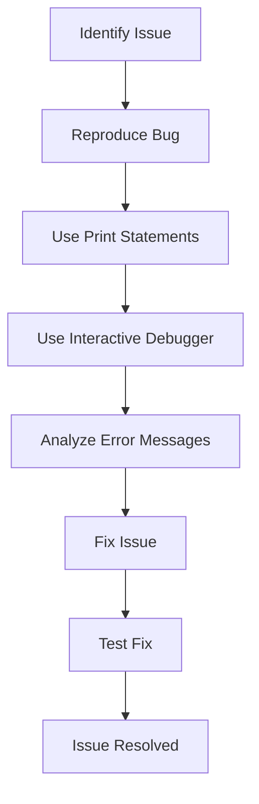

## 14.7 Debugging Techniques and Tools

Debugging is an essential skill for any software engineer, and mastering it in Lua can significantly enhance your ability to develop robust applications. In this section, we will explore various debugging techniques and tools that can help you identify and fix issues in your Lua code efficiently.

### Identifying and Fixing Issues

Debugging in Lua involves several strategies to identify and fix issues. Let's delve into some of the most effective methods.

#### Debugging Methods

1. **Print Statements**

   One of the simplest yet effective debugging techniques is using print statements. By strategically placing print statements in your code, you can inspect the values of variables and the flow of execution. This method is particularly useful for quick checks and understanding the state of your program at various points.

   ```lua
   function calculateSum(a, b)
       print("Calculating sum of", a, "and", b) -- Debugging output
       local sum = a + b
       print("Sum is", sum) -- Debugging output
       return sum
   end

   calculateSum(5, 10)
   ```

   **Key Points:**
   - Use print statements to log variable values and execution flow.
   - Remove or comment out print statements after debugging to keep your code clean.

2. **Interactive Debuggers**

   Interactive debuggers provide a more sophisticated approach to debugging. Tools like ZeroBrane Studio offer a built-in debugger that allows you to set breakpoints, step through code, and inspect variables in real-time.

   **Using ZeroBrane Studio:**
   - Set breakpoints by clicking on the line numbers in the editor.
   - Run your script in debug mode to pause execution at breakpoints.
   - Use the debugger panel to step through code and inspect variables.

   **Benefits:**
   - Provides a visual interface for debugging.
   - Allows for precise control over code execution.

3. **Error Messages**

   Lua's error messages and stack traces are invaluable for debugging. Understanding how to interpret these messages can help you quickly identify the source of an issue.

   **Example:**

   ```lua
   function divide(a, b)
       if b == 0 then
           error("Division by zero!") -- Generates an error message
       end
       return a / b
   end

   divide(10, 0)
   ```

   **Interpreting Error Messages:**
   - Look for the error message and the line number where the error occurred.
   - Use the stack trace to trace back the function calls leading to the error.

### Best Practices

1. **Reproducing Bugs**

   Reproducing bugs is crucial for effective debugging. Ensure you can consistently reproduce the issue before attempting to fix it. This involves isolating the conditions that trigger the bug.

   **Steps to Reproduce Bugs:**
   - Identify the inputs and environment that cause the issue.
   - Create a minimal test case that consistently reproduces the bug.

2. **Simplifying Cases**

   Simplifying your code to the minimal failing example can help you focus on the root cause of the issue. This involves removing unnecessary code and dependencies until you isolate the problem.

   **Example:**

   ```lua
   -- Original complex function
   function complexFunction(x, y, z)
       -- Many lines of code
       return x + y + z
   end

   -- Simplified version for debugging
   function simpleFunction(x, y)
       return x + y
   end
   ```

   **Benefits:**
   - Makes it easier to identify the source of the problem.
   - Reduces the complexity of the debugging process.

### Use Cases and Examples

1. **Runtime Errors**

   Runtime errors occur during the execution of your program and can cause crashes or unexpected behavior. Diagnosing these errors involves understanding the error messages and stack traces.

   **Example:**

   ```lua
   function accessTable(t, key)
       if not t[key] then
           error("Key not found in table!") -- Error message
       end
       return t[key]
   end

   local myTable = {a = 1, b = 2}
   accessTable(myTable, "c")
   ```

   **Steps to Diagnose:**
   - Read the error message to understand the nature of the error.
   - Use the stack trace to locate the function call that caused the error.

2. **Performance Issues**

   Performance issues can significantly impact the efficiency of your Lua applications. Identifying bottlenecks involves profiling your code to find slow sections.

   **Using Lua Profiler:**
   - Install a Lua profiler such as LuaProfiler.
   - Run your script with the profiler to collect performance data.
   - Analyze the profiler output to identify slow functions.

   **Example:**

   ```lua
   -- Sample code with a performance bottleneck
   function slowFunction()
       for i = 1, 1000000 do
           -- Intensive computation
       end
   end

   slowFunction()
   ```

   **Optimization Tips:**
   - Focus on optimizing the most time-consuming functions.
   - Consider algorithmic improvements and data structure optimizations.

### Visualizing Debugging Workflow

To better understand the debugging workflow, let's visualize the process using a flowchart.



**Description:** This flowchart represents the typical debugging workflow, starting from identifying an issue to resolving it through various debugging techniques.

### References and Links

- [Lua Users Wiki - Debugging](http://lua-users.org/wiki/DebuggingLuaCode)
- [ZeroBrane Studio - Lua IDE](https://studio.zerobrane.com/)
- [LuaProfiler GitHub Repository](https://github.com/luaforge/luaprofiler)

### Knowledge Check

- What are the benefits of using print statements for debugging?
- How can interactive debuggers enhance your debugging process?
- Why is it important to reproduce bugs before fixing them?

### Embrace the Journey

Remember, debugging is a skill that improves with practice. As you encounter and resolve more issues, you'll become more adept at identifying and fixing problems in your Lua code. Keep experimenting, stay curious, and enjoy the journey!

## Quiz Time!



### What is the primary purpose of using print statements in debugging?

- [x] To inspect variable values and execution flow
- [ ] To compile the code
- [ ] To optimize performance
- [ ] To create user interfaces

> **Explanation:** Print statements are used to log variable values and understand the flow of execution, which helps in debugging.

### Which tool provides an interactive debugger for Lua?

- [x] ZeroBrane Studio
- [ ] Visual Studio Code
- [ ] Eclipse
- [ ] IntelliJ IDEA

> **Explanation:** ZeroBrane Studio is a Lua IDE that offers an interactive debugger for setting breakpoints and inspecting variables.

### What is the benefit of reproducing bugs before fixing them?

- [x] It ensures the issue can be consistently triggered
- [ ] It automatically fixes the bug
- [ ] It optimizes the code
- [ ] It compiles the code

> **Explanation:** Reproducing bugs ensures that the issue can be consistently triggered, which is crucial for effective debugging.

### How can error messages help in debugging?

- [x] By providing information about the nature and location of errors
- [ ] By optimizing the code
- [ ] By compiling the code
- [ ] By creating user interfaces

> **Explanation:** Error messages provide information about the nature and location of errors, which aids in debugging.

### What is the purpose of simplifying cases in debugging?

- [x] To isolate the root cause of the issue
- [ ] To compile the code
- [ ] To optimize performance
- [ ] To create user interfaces

> **Explanation:** Simplifying cases helps isolate the root cause of the issue by reducing code complexity.

### Which of the following is a common tool for profiling Lua code?

- [x] LuaProfiler
- [ ] Visual Studio Code
- [ ] Eclipse
- [ ] IntelliJ IDEA

> **Explanation:** LuaProfiler is a tool used for profiling Lua code to identify performance bottlenecks.

### What is the first step in the debugging workflow?

- [x] Identify Issue
- [ ] Fix Issue
- [ ] Test Fix
- [ ] Use Print Statements

> **Explanation:** The first step in the debugging workflow is to identify the issue that needs to be resolved.

### How can interactive debuggers enhance your debugging process?

- [x] By providing a visual interface and precise control over code execution
- [ ] By compiling the code
- [ ] By optimizing performance
- [ ] By creating user interfaces

> **Explanation:** Interactive debuggers provide a visual interface and precise control over code execution, enhancing the debugging process.

### What is the purpose of using a flowchart in debugging?

- [x] To visualize the debugging workflow
- [ ] To compile the code
- [ ] To optimize performance
- [ ] To create user interfaces

> **Explanation:** A flowchart helps visualize the debugging workflow, making it easier to understand the process.

### True or False: Debugging is a skill that improves with practice.

- [x] True
- [ ] False

> **Explanation:** Debugging is indeed a skill that improves with practice, as encountering and resolving more issues enhances one's ability to debug effectively.


