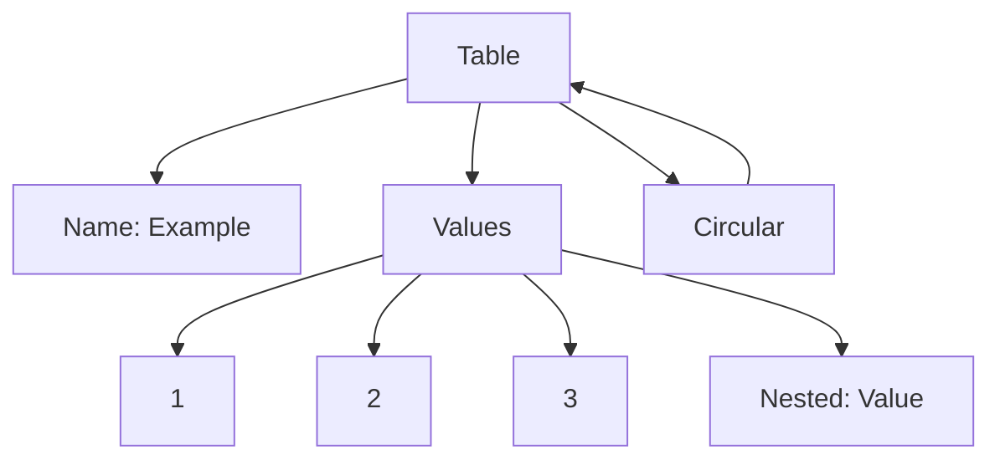

## 14.8 `vardump` and Inspection Tools

In the world of software development, understanding the state of your program at any given moment is crucial. This is especially true when debugging complex data structures in Lua. The `vardump` function and other inspection tools are invaluable for examining the contents of variables, providing insights into the program's state, and helping developers identify and resolve issues efficiently.

### Inspecting Data Structures

Inspecting data structures involves examining the contents of variables to understand their current state. This is particularly useful when dealing with complex or nested data structures, such as tables in Lua. By inspecting these structures, developers can gain insights into the program's behavior and identify potential issues.

#### Implementing `vardump`

The `vardump` function is a powerful tool for inspecting data structures in Lua. It allows developers to recursively traverse tables and nested structures, printing their contents in a readable format. This can be incredibly helpful for debugging and understanding the state of the program.

##### Recursive Traversal

Recursive traversal is a key feature of the `vardump` function. It enables the function to explore tables and nested structures, printing their contents in a structured manner. This is particularly useful when dealing with complex data structures that contain multiple levels of nesting.

```lua
function vardump(value, depth, key)
    local linePrefix = ""
    local spaces = ""

    if key ~= nil then
        linePrefix = "[" .. key .. "] = "
    end

    if depth == nil then
        depth = 0
    else
        depth = depth + 1
    end

    for i = 1, depth do
        spaces = spaces .. "  "
    end

    if type(value) == "table" then
        mTable = getmetatable(value)
        if mTable == nil then
            print(spaces .. linePrefix .. "(table) ")
        else
            print(spaces .. "(metatable) ")
            value = mTable
        end
        for tableKey, tableValue in pairs(value) do
            vardump(tableValue, depth, tableKey)
        end
    elseif type(value) == "function" or 
           type(value) == "thread" or 
           type(value) == "userdata" then
        print(spaces .. linePrefix .. "(" .. type(value) .. ")")
    else
        print(spaces .. linePrefix .. "(" .. type(value) .. ") " .. tostring(value))
    end
end
```

In this example, the `vardump` function recursively traverses a table, printing its contents along with the type of each element. This provides a clear and structured view of the data, making it easier to understand and debug.

##### Handling Circular References

Circular references occur when a table references itself, either directly or indirectly. This can lead to infinite loops when traversing the table. To handle circular references, the `vardump` function can be modified to keep track of visited tables and avoid revisiting them.

```lua
function vardump(value, depth, key, visited)
    local linePrefix = ""
    local spaces = ""

    if key ~= nil then
        linePrefix = "[" .. key .. "] = "
    end

    if depth == nil then
        depth = 0
    else
        depth = depth + 1
    end

    if visited == nil then
        visited = {}
    end

    for i = 1, depth do
        spaces = spaces .. "  "
    end

    if type(value) == "table" then
        if visited[value] then
            print(spaces .. linePrefix .. "(circular reference)")
            return
        end
        visited[value] = true

        mTable = getmetatable(value)
        if mTable == nil then
            print(spaces .. linePrefix .. "(table) ")
        else
            print(spaces .. "(metatable) ")
            value = mTable
        end
        for tableKey, tableValue in pairs(value) do
            vardump(tableValue, depth, tableKey, visited)
        end
    elseif type(value) == "function" or 
           type(value) == "thread" or 
           type(value) == "userdata" then
        print(spaces .. linePrefix .. "(" .. type(value) .. ")")
    else
        print(spaces .. linePrefix .. "(" .. type(value) .. ") " .. tostring(value))
    end
end
```

In this enhanced version of the `vardump` function, a `visited` table is used to track tables that have already been traversed. This prevents infinite loops by skipping tables that have already been visited.

### Use Cases and Examples

The `vardump` function and other inspection tools have a wide range of use cases, from debugging complex data structures to logging and monitoring state changes over time.

#### Debugging Complex Data

When debugging complex data structures, the `vardump` function can provide valuable insights into the state of the program. By printing the contents of variables, developers can identify discrepancies and potential issues.

```lua
local complexData = {
    name = "Example",
    values = {1, 2, 3, {nested = "value"}},
    circular = {}
}
complexData.circular.self = complexData

vardump(complexData)
```

In this example, the `vardump` function is used to inspect a complex data structure with nested tables and a circular reference. The output provides a clear view of the data, making it easier to identify and resolve issues.

#### Logging and Monitoring

In addition to debugging, the `vardump` function can be used for logging and monitoring state changes over time. By recording the state of variables at different points in the program, developers can track changes and identify trends.

```lua
local state = {
    count = 0,
    data = {}
}

function updateState(newData)
    state.count = state.count + 1
    table.insert(state.data, newData)
    vardump(state)
end

updateState("New Entry 1")
updateState("New Entry 2")
```

In this example, the `vardump` function is used to log the state of a variable each time it is updated. This provides a record of changes, making it easier to monitor the program's behavior over time.

### Visualizing Data Structures

Visualizing data structures can enhance understanding and provide a clearer view of complex relationships. Using diagrams and charts, developers can represent data structures in a more intuitive way.



In this Mermaid.js diagram, a complex data structure is visualized, showing the relationships between different elements. This provides a clear and intuitive view of the data, making it easier to understand and debug.

### Try It Yourself

Experiment with the `vardump` function by modifying the code examples provided. Try adding new elements to the data structures, creating additional levels of nesting, or introducing new circular references. Observe how the `vardump` function handles these changes and consider how you might further enhance its functionality.

### References and Links

- [Lua 5.1 Reference Manual](https://www.lua.org/manual/5.1/)
- [Programming in Lua](https://www.lua.org/pil/)
- [MDN Web Docs: Debugging](https://developer.mozilla.org/en-US/docs/Learn/Common_questions/What_are_browser_developer_tools)

### Knowledge Check

- What is the purpose of the `vardump` function in Lua?
- How does recursive traversal work in the context of the `vardump` function?
- What are circular references, and how can they be handled in Lua?
- How can the `vardump` function be used for logging and monitoring state changes?

### Embrace the Journey

Remember, mastering data inspection tools like `vardump` is just the beginning. As you continue to explore Lua and its capabilities, you'll develop a deeper understanding of the language and its potential. Keep experimenting, stay curious, and enjoy the journey!

## Quiz Time!



### What is the primary purpose of the `vardump` function in Lua?

- [x] To inspect and print the contents of variables
- [ ] To execute Lua scripts
- [ ] To compile Lua code
- [ ] To manage memory allocation

> **Explanation:** The `vardump` function is used to inspect and print the contents of variables, providing insights into their current state.

### How does the `vardump` function handle circular references?

- [x] By tracking visited tables to avoid infinite loops
- [ ] By ignoring circular references
- [ ] By throwing an error
- [ ] By terminating the program

> **Explanation:** The `vardump` function uses a `visited` table to track tables that have already been traversed, preventing infinite loops caused by circular references.

### What is recursive traversal in the context of the `vardump` function?

- [x] Exploring tables and nested structures to print their contents
- [ ] Iterating over a list of numbers
- [ ] Executing a function repeatedly
- [ ] Compiling Lua code

> **Explanation:** Recursive traversal involves exploring tables and nested structures to print their contents, providing a structured view of the data.

### Which of the following is a use case for the `vardump` function?

- [x] Debugging complex data structures
- [ ] Compiling Lua code
- [ ] Executing shell commands
- [ ] Managing memory allocation

> **Explanation:** The `vardump` function is used for debugging complex data structures by providing insights into their current state.

### How can the `vardump` function be used for logging and monitoring?

- [x] By recording the state of variables at different points in the program
- [ ] By executing shell commands
- [ ] By compiling Lua code
- [ ] By managing memory allocation

> **Explanation:** The `vardump` function can be used to log the state of variables at different points in the program, allowing developers to track changes and identify trends.

### What is a circular reference?

- [x] When a table references itself directly or indirectly
- [ ] When a function calls itself
- [ ] When a variable is uninitialized
- [ ] When a script fails to compile

> **Explanation:** A circular reference occurs when a table references itself, either directly or indirectly, which can lead to infinite loops during traversal.

### What is the benefit of using diagrams to visualize data structures?

- [x] They provide a clearer and more intuitive view of complex relationships
- [ ] They execute Lua scripts
- [ ] They compile Lua code
- [ ] They manage memory allocation

> **Explanation:** Diagrams provide a clearer and more intuitive view of complex relationships, enhancing understanding and making it easier to debug data structures.

### How can you enhance the functionality of the `vardump` function?

- [x] By adding features to handle different data types and structures
- [ ] By compiling Lua code
- [ ] By executing shell commands
- [ ] By managing memory allocation

> **Explanation:** Enhancing the `vardump` function involves adding features to handle different data types and structures, improving its ability to inspect and print variable contents.

### What is the significance of the `visited` table in the `vardump` function?

- [x] It tracks tables that have already been traversed to prevent infinite loops
- [ ] It compiles Lua code
- [ ] It executes shell commands
- [ ] It manages memory allocation

> **Explanation:** The `visited` table tracks tables that have already been traversed, preventing infinite loops caused by circular references.

### True or False: The `vardump` function can be used to compile Lua code.

- [ ] True
- [x] False

> **Explanation:** False. The `vardump` function is used for inspecting and printing the contents of variables, not for compiling Lua code.


