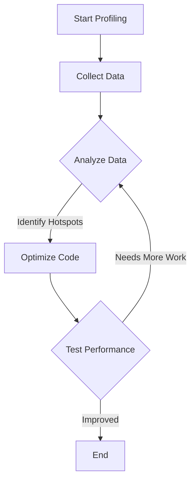

## 14.9 Profiling and Performance Testing

In the realm of software development, especially when working with Lua, understanding how your code utilizes resources is crucial. Profiling and performance testing are essential practices that help developers identify bottlenecks and optimize their applications for better performance. In this section, we will delve into the intricacies of profiling and performance testing in Lua, exploring tools, techniques, and best practices.

### Measuring Resource Usage

Before diving into optimization, it's essential to measure how your code consumes resources such as time and memory. This measurement provides a baseline to understand where improvements are needed.

#### Implementing Profiling

Profiling is the process of measuring the performance of your code to identify areas that consume the most resources. In Lua, this can be achieved using various tools and techniques.

##### Profiling Tools

1. **LuaProfiler**: A popular tool for profiling Lua applications. It provides insights into function call times and memory usage.

   ```lua
   -- Example of using LuaProfiler
   require("profiler")
   profiler.start("profile.txt") -- Start profiling and output to profile.txt

   -- Your Lua code here

   profiler.stop() -- Stop profiling
   ```

2. **Built-in Debug Hooks**: Lua's debug library allows you to set hooks that can be used for profiling.

   ```lua
   -- Example of using debug hooks for profiling
   local function hook()
       local info = debug.getinfo(2, "nSl")
       print(info.name, info.currentline)
   end

   debug.sethook(hook, "c") -- Set a call hook
   ```

##### Analyzing Data

Once profiling data is collected, the next step is to analyze it to identify performance bottlenecks. Look for functions that consume the most time or memory and focus on optimizing them.

- **Function Call Frequency**: Identify functions that are called frequently and check if they can be optimized.
- **Execution Time**: Focus on functions with the longest execution times.
- **Memory Usage**: Analyze memory allocation patterns to identify potential leaks or excessive usage.

### Performance Optimization

After identifying the bottlenecks, the next step is to optimize the code. This involves focusing on critical sections, improving algorithms, and making efficient use of resources.

#### Hotspots

Hotspots are sections of code that consume a significant portion of resources. Optimizing these areas can lead to substantial performance improvements.

- **Loop Optimization**: Ensure loops are efficient and avoid unnecessary computations within them.
- **Data Structures**: Choose the right data structures for your needs. Lua tables are versatile but can be optimized based on usage patterns.

#### Algorithm Improvements

Improving the logic and algorithms in your code can lead to better performance.

- **Algorithm Complexity**: Analyze the complexity of your algorithms and strive for more efficient ones.
- **Caching Results**: Cache results of expensive computations to avoid redundant calculations.

### Use Cases and Examples

Profiling and performance testing are crucial in various scenarios, from high-performance applications to resource-constrained environments.

#### High-Performance Applications

In applications where performance is critical, such as games or real-time systems, profiling ensures smooth user experiences.

- **Example**: In a game, profiling can help identify slow rendering functions or physics calculations that need optimization.

#### Resource-Constrained Environments

In environments with limited resources, such as embedded systems, optimizing for performance is essential.

- **Example**: On a microcontroller, profiling can help reduce memory usage and improve execution speed, ensuring the application runs smoothly.

### Try It Yourself

Experiment with the provided code examples by modifying them to profile different parts of your Lua applications. Try adding more complex logic or increasing the data size to see how it affects performance.

### Visualizing Profiling and Optimization

To better understand the profiling and optimization process, let's visualize it using a flowchart.



**Figure 1**: A flowchart illustrating the profiling and optimization process.

### References and Links

- [LuaProfiler Documentation](https://www.lua.org/manual/5.1/manual.html#5.9)
- [Lua Debug Library](https://www.lua.org/manual/5.1/manual.html#5.9)

### Knowledge Check

- What are the key steps in profiling and performance testing?
- How can you identify hotspots in your Lua code?
- What are some common optimization techniques for Lua applications?

### Embrace the Journey

Remember, profiling and performance testing are iterative processes. As you continue to develop and refine your Lua applications, regularly revisit these practices to ensure optimal performance. Keep experimenting, stay curious, and enjoy the journey!

## Quiz Time!



### What is the primary purpose of profiling in Lua?

- [x] To measure resource usage and identify bottlenecks
- [ ] To write new code
- [ ] To debug syntax errors
- [ ] To create user interfaces

> **Explanation:** Profiling is used to measure how code consumes resources and identify areas for optimization.

### Which tool is commonly used for profiling Lua applications?

- [x] LuaProfiler
- [ ] LuaDebugger
- [ ] LuaOptimizer
- [ ] LuaAnalyzer

> **Explanation:** LuaProfiler is a popular tool for profiling Lua applications, providing insights into function call times and memory usage.

### What is a hotspot in the context of performance optimization?

- [x] A section of code that consumes significant resources
- [ ] A section of code with syntax errors
- [ ] A section of code that is rarely executed
- [ ] A section of code that is well-optimized

> **Explanation:** Hotspots are sections of code that consume a significant portion of resources and are the focus of optimization efforts.

### How can you use Lua's debug library for profiling?

- [x] By setting hooks to monitor function calls
- [ ] By writing new functions
- [ ] By creating user interfaces
- [ ] By debugging syntax errors

> **Explanation:** Lua's debug library allows setting hooks to monitor function calls, which can be used for profiling.

### What is a common optimization technique for loops in Lua?

- [x] Ensuring loops are efficient and avoiding unnecessary computations
- [ ] Adding more iterations
- [ ] Removing all loops
- [ ] Using global variables

> **Explanation:** Optimizing loops involves ensuring they are efficient and avoiding unnecessary computations within them.

### Why is it important to analyze memory usage during profiling?

- [x] To identify potential leaks or excessive usage
- [ ] To write new code
- [ ] To create user interfaces
- [ ] To debug syntax errors

> **Explanation:** Analyzing memory usage helps identify potential leaks or excessive usage, which can impact performance.

### What is the benefit of caching results in Lua?

- [x] To avoid redundant calculations
- [ ] To increase memory usage
- [ ] To slow down execution
- [ ] To create user interfaces

> **Explanation:** Caching results of expensive computations avoids redundant calculations, improving performance.

### In what scenario is profiling particularly crucial?

- [x] In high-performance applications like games
- [ ] In simple scripts
- [ ] In static websites
- [ ] In text editors

> **Explanation:** Profiling is crucial in high-performance applications like games, where smooth user experiences are essential.

### What is the role of algorithm complexity in performance optimization?

- [x] To analyze and strive for more efficient algorithms
- [ ] To increase code length
- [ ] To create user interfaces
- [ ] To debug syntax errors

> **Explanation:** Analyzing algorithm complexity helps identify more efficient algorithms, improving performance.

### True or False: Profiling and performance testing are one-time processes.

- [ ] True
- [x] False

> **Explanation:** Profiling and performance testing are iterative processes that should be revisited regularly to ensure optimal performance.


