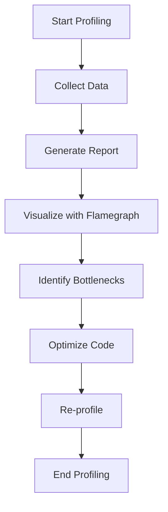

## 15.1 Profiling Lua Applications

In the world of software development, performance is key. Profiling is an essential practice for identifying performance bottlenecks and optimizing applications. In this section, we will delve into the art of profiling Lua applications, exploring various techniques, tools, and real-world use cases. By the end of this guide, you'll be equipped with the knowledge to enhance the efficiency of your Lua applications.

### Identifying Performance Bottlenecks

Before diving into optimization, it's crucial to identify where your application is spending most of its time. This process is known as profiling. Profiling helps pinpoint performance bottlenecks, allowing you to focus your optimization efforts where they will have the most impact.

#### Profiling Techniques

There are two primary techniques for profiling applications: sampling profilers and instrumentation profilers. Each has its strengths and weaknesses, and the choice between them depends on the specific requirements of your project.

##### Sampling Profilers

Sampling profilers collect data at regular intervals, providing a statistical representation of where time is being spent in your application. This method is less intrusive and has a lower overhead compared to instrumentation profiling.

- **Advantages**:
  - Minimal impact on application performance.
  - Provides a broad overview of performance hotspots.

- **Disadvantages**:
  - Less precise than instrumentation profiling.
  - May miss short-lived functions.

##### Instrumentation Profilers

Instrumentation profilers record function entry and exit, providing detailed information about the execution time of each function. This method is more precise but can introduce significant overhead.

- **Advantages**:
  - Detailed insights into function execution times.
  - Useful for identifying specific performance issues.

- **Disadvantages**:
  - Higher overhead can affect application performance.
  - More complex to set up and analyze.

### Tools and Libraries

Several tools and libraries are available for profiling Lua applications. These tools help automate the profiling process, making it easier to gather and analyze performance data.

#### LuaProfiler

LuaProfiler is a popular tool for profiling Lua code. It provides both sampling and instrumentation profiling capabilities, making it a versatile choice for developers.

- **Features**:
  - Supports both sampling and instrumentation profiling.
  - Generates detailed reports on function execution times.
  - Easy integration with Lua applications.

- **Installation**:
  To install LuaProfiler, you can use LuaRocks, the package manager for Lua:

  ```bash
  luarocks install luaprofiler
  ```

- **Usage**:
  To profile a Lua script using LuaProfiler, you need to include the profiler in your script and start the profiling session:

  ```lua
  local profiler = require("profiler")

  profiler.start("profile.log") -- Start profiling and log to a file

  -- Your Lua code here

  profiler.stop() -- Stop profiling
  ```

  The `profile.log` file will contain detailed information about the execution times of functions in your script.

#### Third-Party Tools

In addition to LuaProfiler, several third-party tools can be integrated with Lua applications for performance monitoring. These tools often provide more advanced features, such as real-time monitoring and visualization.

- **Examples**:
  - **Flamegraph**: Visualizes profiling data as a flame graph, making it easy to identify performance bottlenecks.
  - **Valgrind**: A powerful tool for memory profiling and debugging, which can be used with Lua applications through LuaJIT.

### Use Cases and Examples

Profiling is not just a theoretical exercise; it has practical applications in various domains. Let's explore some real-world use cases where profiling can significantly improve performance.

#### Optimizing Game Loops

In game development, maintaining smooth frame rates is crucial for a good user experience. Profiling can help identify performance bottlenecks in the game loop, allowing developers to optimize rendering and update processes.

- **Example**:
  Consider a Lua-based game where the frame rate drops during complex scenes. By profiling the game loop, you can identify functions that consume the most time and optimize them for better performance.

  ```lua
  local profiler = require("profiler")

  profiler.start("game_profile.log")

  function gameLoop()
      -- Update game state
      updateGameState()

      -- Render graphics
      renderGraphics()
  end

  profiler.stop()
  ```

  By analyzing the `game_profile.log`, you can pinpoint which functions are causing frame rate drops and focus your optimization efforts there.

#### Server Applications

For server applications, handling high request volumes efficiently is critical. Profiling can help identify slow functions or bottlenecks in request processing, enabling developers to optimize server performance.

- **Example**:
  Imagine a Lua-based web server that experiences slow response times under heavy load. Profiling the request handling functions can reveal performance issues that need attention.

  ```lua
  local profiler = require("profiler")

  profiler.start("server_profile.log")

  function handleRequest(request)
      -- Process request
      processRequest(request)

      -- Send response
      sendResponse()
  end

  profiler.stop()
  ```

  The `server_profile.log` will provide insights into which parts of the request handling process are slowing down the server.

### Try It Yourself

To truly master profiling, it's important to experiment with the tools and techniques discussed. Try profiling a Lua application of your choice, and make modifications to see how they affect performance.

- **Exercise**:
  1. Choose a Lua script or application you have developed.
  2. Use LuaProfiler to profile the application and identify performance bottlenecks.
  3. Optimize the identified bottlenecks and re-profile to measure improvements.

### Visualizing Profiling Data

Visualizing profiling data can make it easier to understand and communicate performance issues. Tools like Flamegraph can help create visual representations of profiling data.



**Diagram Description**: This flowchart illustrates the process of profiling a Lua application, from starting the profiling session to visualizing data and optimizing code.

### References and Links

For further reading and resources on profiling and performance optimization, consider the following links:

- [LuaProfiler Documentation](https://luaprofiler.sourceforge.net/)
- [Flamegraph GitHub Repository](https://github.com/brendangregg/Flamegraph)
- [Valgrind Official Site](http://valgrind.org/)

### Knowledge Check

To reinforce your understanding of profiling Lua applications, consider the following questions:

- What are the main differences between sampling and instrumentation profilers?
- How can LuaProfiler be used to identify performance bottlenecks in a Lua application?
- What are some common use cases for profiling in game development and server applications?

### Embrace the Journey

Remember, profiling is an ongoing process. As your applications evolve, new performance challenges will arise. Keep experimenting, stay curious, and enjoy the journey of optimizing your Lua applications for peak performance.

### Formatting and Structure

Organize your profiling efforts with clear goals and methodologies. Use bullet points to break down complex information, and highlight important terms or concepts using bold or italic text sparingly.

### Writing Style

Use first-person plural (we, let's) to create a collaborative feel. Avoid gender-specific pronouns; use they/them or rewrite sentences to be inclusive. Define acronyms and abbreviations upon first use.

## Quiz Time!



### What is the primary purpose of profiling a Lua application?

- [x] To identify performance bottlenecks
- [ ] To add new features
- [ ] To improve code readability
- [ ] To refactor code

> **Explanation:** Profiling is used to identify performance bottlenecks in an application.

### Which profiling technique collects data at regular intervals?

- [x] Sampling Profilers
- [ ] Instrumentation Profilers
- [ ] Debugging Tools
- [ ] Memory Analyzers

> **Explanation:** Sampling profilers collect data at regular intervals, providing a statistical overview of performance.

### What is a disadvantage of instrumentation profilers?

- [x] Higher overhead
- [ ] Less detailed insights
- [ ] Inability to profile functions
- [ ] Lack of precision

> **Explanation:** Instrumentation profilers have higher overhead due to recording function entry and exit.

### Which tool is commonly used for profiling Lua applications?

- [x] LuaProfiler
- [ ] LuaRocks
- [ ] LuaJIT
- [ ] LuaSQL

> **Explanation:** LuaProfiler is a popular tool for profiling Lua applications.

### What is a common use case for profiling in game development?

- [x] Optimizing game loops
- [ ] Adding new levels
- [ ] Enhancing graphics
- [ ] Improving sound quality

> **Explanation:** Profiling is used to optimize game loops to maintain smooth frame rates.

### How can profiling help server applications?

- [x] By identifying slow request handling functions
- [ ] By adding more servers
- [ ] By increasing bandwidth
- [ ] By improving security

> **Explanation:** Profiling helps identify slow functions in request handling, improving server performance.

### What is the benefit of using Flamegraph with profiling data?

- [x] Visualizing performance bottlenecks
- [ ] Enhancing code readability
- [ ] Debugging syntax errors
- [ ] Refactoring code

> **Explanation:** Flamegraph visualizes profiling data, making it easier to identify performance bottlenecks.

### What is the first step in the profiling process?

- [x] Start Profiling
- [ ] Optimize Code
- [ ] Generate Report
- [ ] Visualize Data

> **Explanation:** The first step is to start profiling to collect performance data.

### What should you do after identifying bottlenecks in your application?

- [x] Optimize Code
- [ ] Add new features
- [ ] Increase server capacity
- [ ] Refactor code

> **Explanation:** After identifying bottlenecks, the next step is to optimize the code.

### Profiling is an ongoing process. True or False?

- [x] True
- [ ] False

> **Explanation:** Profiling is an ongoing process as applications evolve and new performance challenges arise.


