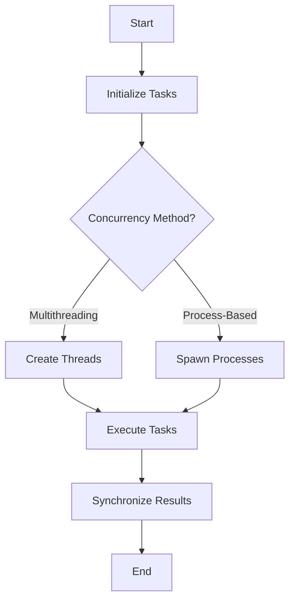

## 15.10 Parallelism and Concurrency Optimization

In the world of software development, optimizing performance is a critical aspect, especially when dealing with large-scale applications or systems that require real-time processing. Lua, being a lightweight and efficient scripting language, offers several ways to implement parallelism and concurrency to enhance performance. In this section, we will explore how to leverage multiple cores, implement concurrency, and use synchronization mechanisms effectively in Lua.

### Leveraging Multiple Cores

Modern processors come with multiple cores, allowing programs to run tasks in parallel. By distributing tasks across these cores, we can significantly improve the performance of our applications. Lua, although single-threaded by nature, can be extended to utilize multiple cores through various libraries and techniques.

#### Implementing Concurrency

Concurrency in Lua can be achieved through multithreading libraries and process-based concurrency. Let's delve into these methods:

##### Multithreading Libraries

Lua does not natively support multithreading, but several libraries extend its capabilities:

1. **LuaLanes**: This library provides a simple way to create lanes (lightweight threads) in Lua. It allows you to run Lua code in parallel, taking advantage of multiple cores.

   ```lua
   local lanes = require "lanes".configure()

   -- Define a function to run in a separate lane
   local function heavy_computation(x)
       local result = 0
       for i = 1, x do
           result = result + i
       end
       return result
   end

   -- Create a lane
   local lane = lanes.gen("*", heavy_computation)(1000000)

   -- Wait for the lane to complete and get the result
   local result = lane[1]
   print("Result:", result)
   ```

   In this example, `heavy_computation` is executed in a separate lane, allowing the main program to continue running concurrently.

2. **Lua-Tasks**: Another library that facilitates multithreading by creating tasks that run in parallel.

   ```lua
   local tasks = require "tasks"

   -- Define a task
   local function task_function()
       print("Task is running")
   end

   -- Create and run a task
   local task = tasks.new(task_function)
   task:start()
   ```

   Lua-Tasks provides a straightforward API to create and manage tasks, making it easier to implement concurrency.

##### Process-Based Concurrency

Another approach to achieve concurrency is by spawning separate processes. This method involves running multiple instances of the Lua interpreter, each executing a different task.

```lua
local os = require "os"

-- Function to spawn a new process
local function spawn_process(command)
    local handle = io.popen(command)
    local result = handle:read("*a")
    handle:close()
    return result
end

-- Spawn a new Lua process
local output = spawn_process("lua -e 'print(\"Hello from a new process\")'")
print(output)
```

This technique is useful when tasks are independent and can be executed in isolation, as it avoids the complexity of shared state management.

### Synchronization Mechanisms

When implementing concurrency, managing shared resources becomes crucial. Synchronization mechanisms help ensure that concurrent tasks do not interfere with each other.

#### Locks and Semaphores

Locks and semaphores are traditional synchronization tools used to manage access to shared resources.

- **Locks**: Ensure that only one task can access a resource at a time.

  ```lua
  local lanes = require "lanes".configure()
  local lock = lanes.linda()

  local function critical_section()
      lock:send("lock", true)
      -- Perform operations on shared resource
      lock:receive("lock")
  end
  ```

- **Semaphores**: Allow a certain number of tasks to access a resource simultaneously.

  ```lua
  local semaphore = lanes.linda()

  local function access_resource()
      semaphore:send("semaphore", true)
      -- Access shared resource
      semaphore:receive("semaphore")
  end
  ```

#### Message Passing

Message passing is an alternative to shared state, where tasks communicate by sending messages to each other. This approach reduces the risk of race conditions and deadlocks.

```lua
local lanes = require "lanes".configure()
local linda = lanes.linda()

local function producer()
    for i = 1, 10 do
        linda:send("channel", i)
    end
end

local function consumer()
    for i = 1, 10 do
        local value = linda:receive("channel")
        print("Received:", value)
    end
end

lanes.gen("*", producer)()
lanes.gen("*", consumer)()
```

In this example, the producer sends messages to a channel, and the consumer receives them, demonstrating a simple message-passing system.

### Use Cases and Examples

Let's explore some practical use cases where parallelism and concurrency optimization can be beneficial:

#### Data Processing Pipelines

When dealing with large datasets, processing them in parallel can significantly reduce execution time. By dividing the data into chunks and processing each chunk concurrently, we can achieve faster results.

```lua
local lanes = require "lanes".configure()

local function process_chunk(chunk)
    -- Process data chunk
    return #chunk
end

local data = {1, 2, 3, 4, 5, 6, 7, 8, 9, 10}
local chunk_size = 2
local results = {}

for i = 1, #data, chunk_size do
    local chunk = {unpack(data, i, i + chunk_size - 1)}
    local lane = lanes.gen("*", process_chunk)(chunk)
    table.insert(results, lane[1])
end

print("Processed results:", table.concat(results, ", "))
```

This example demonstrates how to process data in chunks using lanes, optimizing the overall processing time.

#### Server Applications

In server applications, handling multiple client requests simultaneously is crucial for performance. By implementing concurrency, we can serve multiple clients without blocking.

```lua
local socket = require "socket"

local server = assert(socket.bind("*", 12345))
server:settimeout(0) -- Non-blocking mode

local clients = {}

while true do
    local client = server:accept()
    if client then
        table.insert(clients, client)
    end

    for i, client in ipairs(clients) do
        local line, err = client:receive()
        if not err then
            client:send("Echo: " .. line .. "\n")
        else
            table.remove(clients, i)
        end
    end
end
```

This simple server accepts multiple clients and echoes their messages back, demonstrating non-blocking I/O for concurrency.

### Try It Yourself

Experiment with the code examples provided. Try modifying the number of tasks or processes, and observe how it affects performance. Consider implementing your own data processing pipeline or server application using the concepts discussed.

### Visualizing Concurrency

To better understand how concurrency works, let's visualize the process using a flowchart:



This flowchart illustrates the steps involved in implementing concurrency, from initializing tasks to synchronizing results.

### References and Links

For further reading on Lua concurrency and parallelism, consider the following resources:

- [LuaLanes Documentation](https://lualanes.github.io/)
- [Lua-Tasks GitHub Repository](https://github.com/Neopallium/lua-tasks)
- [Socket Programming in Lua](https://www.lua.org/pil/9.1.html)

### Knowledge Check

- What are the benefits of using parallelism and concurrency in Lua?
- How does message passing differ from shared state synchronization?
- What are some common challenges when implementing concurrency?

### Embrace the Journey

Remember, mastering parallelism and concurrency is a journey. As you experiment and apply these concepts, you'll gain a deeper understanding of how to optimize performance in your Lua applications. Keep exploring, stay curious, and enjoy the process!

## Quiz Time!



### What is the primary benefit of leveraging multiple cores in Lua?

- [x] Improved performance through parallel execution
- [ ] Simplified code structure
- [ ] Reduced memory usage
- [ ] Enhanced security

> **Explanation:** Leveraging multiple cores allows tasks to be executed in parallel, improving overall performance.

### Which library provides lightweight threads in Lua for parallel execution?

- [x] LuaLanes
- [ ] LuaSocket
- [ ] LuaSQL
- [ ] LuaCURL

> **Explanation:** LuaLanes is a library that provides lightweight threads, known as lanes, for parallel execution in Lua.

### What is a key advantage of using message passing over shared state?

- [x] Reduces the risk of race conditions
- [ ] Increases memory usage
- [ ] Simplifies code readability
- [ ] Enhances security

> **Explanation:** Message passing reduces the risk of race conditions by avoiding shared state, making concurrency safer.

### In process-based concurrency, what is typically spawned to achieve parallelism?

- [x] Separate processes
- [ ] Threads
- [ ] Functions
- [ ] Classes

> **Explanation:** Process-based concurrency involves spawning separate processes to achieve parallelism.

### What synchronization mechanism ensures only one task can access a resource at a time?

- [x] Locks
- [ ] Semaphores
- [ ] Message passing
- [ ] Channels

> **Explanation:** Locks ensure that only one task can access a shared resource at a time, preventing conflicts.

### Which of the following is a use case for parallelism in Lua?

- [x] Data processing pipelines
- [ ] Simple arithmetic operations
- [ ] String concatenation
- [ ] Variable declaration

> **Explanation:** Parallelism is beneficial in data processing pipelines, where large datasets can be processed concurrently.

### What is the purpose of a semaphore in concurrency?

- [x] Allow a certain number of tasks to access a resource simultaneously
- [ ] Prevent any task from accessing a resource
- [ ] Simplify code structure
- [ ] Enhance security

> **Explanation:** Semaphores allow a specified number of tasks to access a shared resource simultaneously.

### How does Lua-Tasks facilitate concurrency?

- [x] By creating and managing tasks that run in parallel
- [ ] By simplifying string manipulation
- [ ] By enhancing error handling
- [ ] By optimizing memory usage

> **Explanation:** Lua-Tasks facilitates concurrency by providing an API to create and manage tasks that run in parallel.

### What is the role of a producer in a message-passing system?

- [x] To send messages to a channel
- [ ] To receive messages from a channel
- [ ] To process messages
- [ ] To delete messages

> **Explanation:** In a message-passing system, the producer's role is to send messages to a channel for consumption.

### True or False: Lua natively supports multithreading.

- [ ] True
- [x] False

> **Explanation:** Lua does not natively support multithreading; it requires external libraries like LuaLanes for multithreading capabilities.


