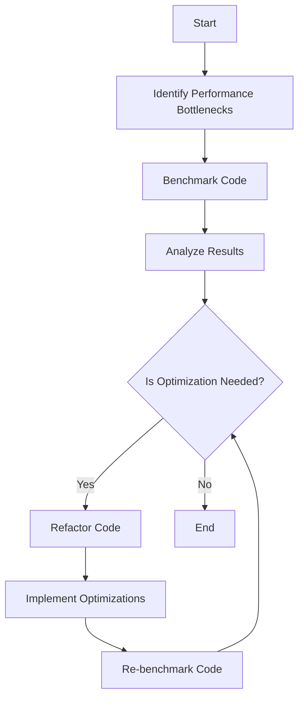

## 15.11 Best Practices for High-Performance Lua Code

In the world of software engineering, performance optimization is a critical aspect that can significantly impact the efficiency and scalability of applications. Lua, known for its lightweight and embeddable nature, offers a unique set of features and capabilities that can be leveraged for high-performance applications. This section delves into the best practices for optimizing Lua code, focusing on holistic strategies that combine various techniques to achieve optimal results.

### Holistic Optimization Strategies

To achieve high performance in Lua applications, it's essential to adopt a holistic approach that combines multiple optimization strategies. This involves not only improving the code itself but also understanding the underlying system and environment in which the code operates.

#### Key Practices

1. **Benchmarking**

   Benchmarking is the process of measuring the performance of your code to identify bottlenecks and areas for improvement. It provides a quantitative basis for optimization efforts, allowing you to track performance improvements over time.

   - **Tools and Techniques**: Utilize Lua's built-in `os.clock()` function or external libraries like `luajit` for precise time measurements.
   - **Example**: Measure the execution time of a function to identify slow operations.

     ```lua
     local start_time = os.clock()
     -- Function to be benchmarked
     local result = performComplexCalculation()
     local end_time = os.clock()
     print("Execution time: " .. (end_time - start_time) .. " seconds")
     ```

   - **Best Practices**: Always benchmark under realistic conditions and consider variations in hardware and system load.

2. **Code Simplification**

   Simplifying code can lead to significant performance gains by reducing complexity and improving readability. This involves refactoring code to eliminate unnecessary operations and streamline logic.

   - **Techniques**: Use Lua's powerful table and string manipulation functions to simplify operations.
   - **Example**: Replace complex loops with built-in functions.

     ```lua
     -- Before simplification
     local sum = 0
     for i = 1, #numbers do
         sum = sum + numbers[i]
     end

     -- After simplification
     local sum = 0
     for _, value in ipairs(numbers) do
         sum = sum + value
     end
     ```

   - **Best Practices**: Regularly review and refactor code to maintain simplicity and efficiency.

3. **Staying Updated**

   Keeping abreast of the latest Lua versions and features is crucial for leveraging new performance enhancements and optimizations. Lua's development community continuously works on improving the language, and staying updated ensures you can take advantage of these improvements.

   - **Resources**: Follow Lua's official website and community forums for updates.
   - **Example**: Utilize new language features that offer performance benefits.

     ```lua
     -- Example of using a new Lua feature
     local function newFeatureExample()
         -- Code utilizing a new feature
     end
     ```

   - **Best Practices**: Regularly update your development environment and test your code with new Lua versions.

### Use Cases and Examples

Understanding the practical applications of these optimization strategies can help you apply them effectively in real-world scenarios.

#### Competitive Programming

In competitive programming, achieving the fastest execution times is crucial. Lua's lightweight nature makes it an excellent choice for such tasks, provided you optimize your code effectively.

- **Techniques**: Focus on algorithmic efficiency and minimize overhead.
- **Example**: Optimize a sorting algorithm for speed.

  ```lua
  -- Optimized quicksort implementation
  local function quicksort(arr)
      if #arr < 2 then return arr end
      local pivot = arr[1]
      local less, greater = {}, {}
      for i = 2, #arr do
          if arr[i] <= pivot then
              table.insert(less, arr[i])
          else
              table.insert(greater, arr[i])
          end
      end
      return quicksort(less), pivot, quicksort(greater)
  end
  ```

- **Best Practices**: Continuously test and refine your algorithms to achieve optimal performance.

#### Enterprise Applications

In enterprise applications, ensuring scalability and responsiveness is key to handling large volumes of data and users. Lua's embeddable nature makes it suitable for integrating into larger systems, but performance optimization is essential.

- **Techniques**: Use caching and lazy loading to reduce resource consumption.
- **Example**: Implement a caching mechanism to store frequently accessed data.

  ```lua
  local cache = {}

  local function getData(key)
      if cache[key] then
          return cache[key]
      else
          local data = fetchDataFromDatabase(key)
          cache[key] = data
          return data
      end
  end
  ```

- **Best Practices**: Monitor application performance and adjust optimization strategies as needed.

### Visualizing Optimization Strategies

To better understand the flow of optimization strategies, let's visualize the process using a flowchart.



**Caption**: This flowchart illustrates the iterative process of identifying, benchmarking, and optimizing Lua code for high performance.

### Knowledge Check

To reinforce your understanding of high-performance Lua code, consider the following questions:

- How can benchmarking help identify performance bottlenecks?
- What are some techniques for simplifying Lua code?
- Why is it important to stay updated with the latest Lua versions?

### Embrace the Journey

Remember, optimizing Lua code for high performance is an ongoing process. As you continue to develop your skills, you'll discover new techniques and strategies to enhance your applications. Keep experimenting, stay curious, and enjoy the journey!

## Quiz Time!



### What is the primary purpose of benchmarking in Lua code optimization?

- [x] To measure performance and identify bottlenecks
- [ ] To simplify code complexity
- [ ] To update Lua versions
- [ ] To refactor code

> **Explanation:** Benchmarking helps measure performance and identify bottlenecks in the code, providing a basis for optimization.

### Which Lua function can be used for precise time measurements during benchmarking?

- [x] os.clock()
- [ ] os.time()
- [ ] os.date()
- [ ] os.execute()

> **Explanation:** The `os.clock()` function is used for precise time measurements in Lua.

### What is a key benefit of code simplification in Lua?

- [x] Improved readability and reduced complexity
- [ ] Increased code length
- [ ] More complex logic
- [ ] Slower execution times

> **Explanation:** Code simplification improves readability and reduces complexity, leading to better performance.

### Why is it important to stay updated with the latest Lua versions?

- [x] To leverage new performance enhancements and optimizations
- [ ] To increase code complexity
- [ ] To avoid using new features
- [ ] To maintain outdated practices

> **Explanation:** Staying updated with the latest Lua versions allows you to leverage new performance enhancements and optimizations.

### What is a common technique for optimizing code in competitive programming?

- [x] Focus on algorithmic efficiency
- [ ] Increase code complexity
- [ ] Use outdated libraries
- [ ] Avoid benchmarking

> **Explanation:** Focusing on algorithmic efficiency is crucial for optimizing code in competitive programming.

### How can caching benefit enterprise applications?

- [x] By reducing resource consumption and improving performance
- [ ] By increasing resource consumption
- [ ] By slowing down data access
- [ ] By complicating code logic

> **Explanation:** Caching reduces resource consumption and improves performance by storing frequently accessed data.

### What is the role of lazy loading in performance optimization?

- [x] To load resources only when needed
- [ ] To load all resources at once
- [ ] To increase memory usage
- [ ] To complicate code logic

> **Explanation:** Lazy loading improves performance by loading resources only when needed, reducing memory usage.

### What should be done after implementing optimizations in Lua code?

- [x] Re-benchmark the code to measure improvements
- [ ] Increase code complexity
- [ ] Avoid further testing
- [ ] Discard previous benchmarks

> **Explanation:** After implementing optimizations, re-benchmark the code to measure improvements and ensure effectiveness.

### What is a benefit of using Lua's built-in functions for code simplification?

- [x] They streamline operations and improve performance
- [ ] They increase code complexity
- [ ] They slow down execution
- [ ] They complicate logic

> **Explanation:** Lua's built-in functions streamline operations and improve performance, making code simpler and more efficient.

### True or False: Performance optimization in Lua is a one-time process.

- [ ] True
- [x] False

> **Explanation:** Performance optimization in Lua is an ongoing process that requires continuous monitoring and refinement.


