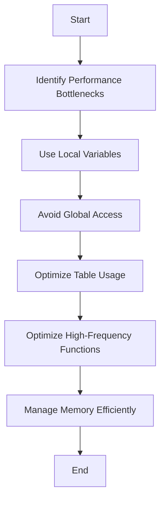

## 15.2 Lua Performance Tips and Best Practices

In the world of software development, performance optimization is a critical aspect that can significantly impact the efficiency and responsiveness of applications. Lua, known for its simplicity and flexibility, is no exception. In this section, we will delve into various performance tips and best practices that can help you write efficient Lua code. By understanding and applying these techniques, you can enhance the performance of your Lua applications, making them faster and more resource-efficient.

### Writing Efficient Lua Code

To write efficient Lua code, it is essential to understand the language's characteristics and how it handles various operations. Here, we will explore some general guidelines and key practices to optimize your Lua code.

#### Key Practices

##### Local Variables

One of the most effective ways to improve performance in Lua is by using local variables. Local variables are faster to access than global variables because they are stored in registers rather than in the global environment. This reduces lookup times and enhances execution speed.

```lua
-- Example of using local variables
local function calculateSum(a, b)
    local sum = a + b
    return sum
end

-- Using local variables within a loop
local total = 0
for i = 1, 1000000 do
    local value = i * 2
    total = total + value
end
```

In the above example, the use of local variables within the function and loop minimizes the overhead associated with accessing global variables, resulting in faster execution.

##### Avoiding Global Access

Global variables in Lua are stored in a table called `_G`, which makes accessing them slower compared to local variables. To optimize performance, minimize the use of global variables and prefer local variables whenever possible.

```lua
-- Avoid using global variables
local function processData(data)
    -- Use local variables instead of global ones
    local processedData = {}
    for i, value in ipairs(data) do
        processedData[i] = value * 2
    end
    return processedData
end
```

By avoiding global access, you can reduce the time spent on variable lookups, leading to more efficient code execution.

##### Table Usage

Tables are a core data structure in Lua, and optimizing their usage can have a significant impact on performance. Here are some tips for efficient table operations:

- **Preallocate Table Size**: When you know the size of a table in advance, preallocate its size to avoid dynamic resizing during execution.

```lua
-- Preallocate table size
local data = {}
for i = 1, 1000 do
    data[i] = 0
end
```

- **Use Numeric Indices**: Accessing table elements using numeric indices is faster than using string keys.

```lua
-- Use numeric indices for faster access
local numbers = {10, 20, 30, 40, 50}
local sum = 0
for i = 1, #numbers do
    sum = sum + numbers[i]
end
```

- **Avoid Table Copying**: Copying tables can be expensive. Instead, try to modify tables in place or use references.

```lua
-- Avoid unnecessary table copying
local function modifyTable(t)
    for i = 1, #t do
        t[i] = t[i] * 2
    end
end
```

By following these practices, you can optimize table operations and improve the overall performance of your Lua applications.

#### Use Cases and Examples

##### High-Frequency Functions

High-frequency functions are those that are called repeatedly within a program. Optimizing these functions can lead to significant performance gains. Here are some strategies to enhance the performance of high-frequency functions:

- **Minimize Function Calls**: Reduce the number of function calls within high-frequency functions to decrease overhead.

```lua
-- Example of minimizing function calls
local function calculateFactorial(n)
    local result = 1
    for i = 2, n do
        result = result * i
    end
    return result
end
```

- **Inline Functions**: Consider inlining small functions to eliminate the overhead of function calls.

```lua
-- Example of inlining a small function
local function calculateSquare(n)
    return n * n
end

local function processNumbers(numbers)
    for i = 1, #numbers do
        numbers[i] = numbers[i] * numbers[i]
    end
end
```

By optimizing high-frequency functions, you can achieve noticeable improvements in the performance of your Lua applications.

##### Memory Management

Efficient memory management is crucial for optimizing performance in Lua. Here are some tips to reduce unnecessary memory allocations:

- **Reuse Tables**: Instead of creating new tables frequently, reuse existing tables to minimize memory allocations.

```lua
-- Example of reusing tables
local function processData(data)
    local result = {}
    for i = 1, #data do
        result[i] = data[i] * 2
    end
    return result
end

local data = {1, 2, 3, 4, 5}
local processedData = processData(data)
```

- **Avoid Creating Temporary Tables**: Minimize the creation of temporary tables within loops or high-frequency functions.

```lua
-- Avoid creating temporary tables
local function sumNumbers(numbers)
    local sum = 0
    for i = 1, #numbers do
        sum = sum + numbers[i]
    end
    return sum
end
```

By managing memory efficiently, you can reduce the overhead associated with memory allocations and improve the performance of your Lua applications.

### Visualizing Lua Performance Optimization

To better understand the impact of these performance tips, let's visualize the process of optimizing Lua code using a flowchart.



**Figure 1**: Flowchart illustrating the process of optimizing Lua code for performance.

### Try It Yourself

To reinforce your understanding of Lua performance optimization, try modifying the code examples provided in this section. Experiment with different techniques and observe the impact on performance. Here are some suggestions:

- Modify the `calculateSum` function to use global variables and compare the performance with the local variable version.
- Experiment with different table sizes and observe the impact of preallocating table size on performance.
- Inline the `calculateSquare` function and compare the performance with the original version.

### References and Links

For further reading on Lua performance optimization, consider exploring the following resources:

- [Lua Performance Tips](https://www.lua.org/gems/sample.pdf)
- [Programming in Lua](https://www.lua.org/pil/contents.html)
- [Lua Performance Guide](https://www.lua.org/manual/5.1/performance.html)

### Knowledge Check

To test your understanding of Lua performance optimization, consider the following questions:

1. What is the primary benefit of using local variables in Lua?
2. How can you minimize the overhead associated with global variable access?
3. What are some strategies for optimizing table usage in Lua?
4. Why is it important to optimize high-frequency functions?
5. How can efficient memory management improve the performance of Lua applications?

### Embrace the Journey

Remember, optimizing Lua code for performance is an ongoing journey. As you continue to explore and experiment with different techniques, you'll gain a deeper understanding of how to write efficient and high-performing Lua applications. Keep experimenting, stay curious, and enjoy the journey!

## Quiz Time!



### What is the primary benefit of using local variables in Lua?

- [x] Faster access due to reduced lookup times
- [ ] Easier to debug
- [ ] Better readability
- [ ] More secure

> **Explanation:** Local variables are stored in registers, making them faster to access than global variables, which are stored in a table.

### How can you minimize the overhead associated with global variable access?

- [x] Use local variables instead
- [ ] Use more global variables
- [ ] Increase the size of the global table
- [ ] Use string keys for global variables

> **Explanation:** Using local variables reduces the need to access the global environment, minimizing lookup times.

### What is a recommended practice for optimizing table usage in Lua?

- [x] Preallocate table size
- [ ] Use string keys for all table elements
- [ ] Copy tables frequently
- [ ] Avoid using tables

> **Explanation:** Preallocating table size helps avoid dynamic resizing during execution, improving performance.

### Why is it important to optimize high-frequency functions?

- [x] They are called repeatedly, so optimization can lead to significant performance gains
- [ ] They are rarely used, so optimization is unnecessary
- [ ] They are easier to debug
- [ ] They are more secure

> **Explanation:** High-frequency functions are executed often, so optimizing them can have a substantial impact on overall performance.

### How can efficient memory management improve the performance of Lua applications?

- [x] By reducing unnecessary memory allocations
- [ ] By increasing memory usage
- [ ] By creating more temporary tables
- [ ] By using more global variables

> **Explanation:** Efficient memory management reduces the overhead associated with memory allocations, enhancing performance.

### What is a potential downside of using global variables in Lua?

- [x] Slower access due to lookup times
- [ ] Easier to debug
- [ ] Better readability
- [ ] More secure

> **Explanation:** Global variables are stored in a table, making them slower to access compared to local variables.

### What is a benefit of inlining small functions in Lua?

- [x] Eliminates the overhead of function calls
- [ ] Increases code readability
- [ ] Makes debugging easier
- [ ] Enhances security

> **Explanation:** Inlining small functions removes the need for function calls, reducing overhead and improving performance.

### How can you avoid unnecessary table copying in Lua?

- [x] Modify tables in place or use references
- [ ] Create new tables frequently
- [ ] Use string keys for table elements
- [ ] Avoid using tables

> **Explanation:** Modifying tables in place or using references avoids the performance cost of copying tables.

### What is a common use case for preallocating table size in Lua?

- [x] When the size of the table is known in advance
- [ ] When the table size is unknown
- [ ] When using string keys
- [ ] When copying tables

> **Explanation:** Preallocating table size is beneficial when the size is known, as it prevents dynamic resizing.

### True or False: Using local variables in Lua can improve code security.

- [ ] True
- [x] False

> **Explanation:** While local variables improve performance, they do not inherently enhance code security.


