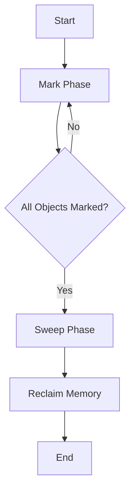

## 15.3 Memory Management and Garbage Collection

In this section, we delve into the critical aspects of memory management and garbage collection in Lua, a language known for its lightweight and efficient execution. Understanding these concepts is essential for optimizing performance, especially in resource-constrained environments such as embedded systems or long-running applications.

### Understanding Lua's Garbage Collector

Lua employs an automatic memory management system, primarily through its garbage collector (GC). The GC is responsible for reclaiming memory occupied by objects that are no longer in use, thus preventing memory leaks and ensuring efficient memory utilization.

#### How Lua Manages Memory

Lua's memory management revolves around its garbage collector, which is based on incremental mark-and-sweep algorithms. This approach allows Lua to manage memory efficiently without significant pauses, making it suitable for real-time applications.

- **Mark Phase**: The GC traverses all reachable objects, marking them as active.
- **Sweep Phase**: The GC scans through memory, collecting unmarked objects and reclaiming their memory.

The GC operates incrementally, meaning it performs small amounts of work at a time, reducing the impact on application performance.

```lua
-- Example: Creating and discarding objects
local function createObjects()
    for i = 1, 1000 do
        local obj = { value = i }
        -- obj goes out of scope here and becomes eligible for garbage collection
    end
end

createObjects()
-- The garbage collector will eventually reclaim the memory used by these objects
```

### Optimizing Memory Usage

Efficient memory usage is crucial for maintaining application performance. Here are some strategies to optimize memory management in Lua:

#### Managing Object Lifetimes

Reusing objects instead of creating new ones can significantly reduce the overhead of memory allocation and garbage collection. Consider using object pools for frequently used objects.

```lua
-- Example: Object pool for reusable objects
local objectPool = {}

function getObject()
    if #objectPool > 0 then
        return table.remove(objectPool)
    else
        return { value = 0 }
    end
end

function releaseObject(obj)
    table.insert(objectPool, obj)
end

-- Usage
local obj = getObject()
obj.value = 42
releaseObject(obj)
```

#### Controlling Garbage Collection

Lua provides functions to control the behavior of the garbage collector, allowing you to adjust its parameters for optimal performance.

- **`collectgarbage("collect")`**: Forces a full garbage collection cycle.
- **`collectgarbage("stop")`**: Stops the garbage collector.
- **`collectgarbage("restart")`**: Restarts the garbage collector.
- **`collectgarbage("setpause", pause)`**: Sets the GC pause, controlling how long the collector waits before starting a new cycle.
- **`collectgarbage("setstepmul", stepmul)`**: Sets the GC step multiplier, controlling the speed of the collector relative to memory allocation.

```lua
-- Example: Adjusting garbage collection parameters
collectgarbage("setpause", 200)  -- Increase pause to reduce GC frequency
collectgarbage("setstepmul", 500)  -- Increase step multiplier for faster collection
```

### Monitoring Memory

Monitoring memory usage is essential for identifying potential issues and optimizing performance. Lua provides tools for memory profiling and tracking.

#### Memory Profiling

Memory profiling involves tracking memory usage over time to identify patterns and potential leaks. Lua's `collectgarbage("count")` function returns the current memory usage in kilobytes.

```lua
-- Example: Memory profiling
local initialMemory = collectgarbage("count")
-- Perform operations
local finalMemory = collectgarbage("count")
print("Memory used:", finalMemory - initialMemory, "KB")
```

### Use Cases and Examples

Understanding how to manage memory effectively is crucial in various scenarios, such as long-running applications and embedded systems.

#### Long-Running Applications

In long-running applications, memory leaks can accumulate over time, leading to performance degradation. Regularly monitoring memory usage and adjusting GC parameters can help mitigate these issues.

```lua
-- Example: Monitoring memory in a long-running application
while true do
    -- Perform application logic
    if collectgarbage("count") > 1024 then  -- Check if memory usage exceeds threshold
        collectgarbage("collect")  -- Trigger garbage collection
    end
end
```

#### Embedded Systems

Embedded systems often operate within tight memory constraints, making efficient memory management critical. Minimizing memory usage and controlling garbage collection can help maintain performance.

```lua
-- Example: Memory management in an embedded system
local function performTask()
    local data = getObject()
    -- Process data
    releaseObject(data)
end

while true do
    performTask()
    collectgarbage("step", 10)  -- Perform incremental garbage collection
end
```

### Visualizing Lua's Garbage Collection Process

To better understand Lua's garbage collection process, let's visualize it using a flowchart:



**Figure 1**: Visualizing Lua's Garbage Collection Process

### Try It Yourself

Experiment with the provided code examples by modifying object pool sizes, adjusting garbage collection parameters, and observing the impact on memory usage. This hands-on approach will deepen your understanding of Lua's memory management.

### Knowledge Check

- What is the primary function of Lua's garbage collector?
- How can you optimize memory usage in Lua applications?
- What are some strategies for managing object lifetimes?
- How can you monitor memory usage in Lua?
- Why is memory management critical in embedded systems?

### Embrace the Journey

Remember, mastering memory management and garbage collection in Lua is a journey. As you continue to explore and experiment, you'll gain insights into optimizing performance and building efficient applications. Keep learning, stay curious, and enjoy the process!

## Quiz Time!



### What is the primary function of Lua's garbage collector?

- [x] To reclaim memory occupied by unused objects
- [ ] To allocate memory for new objects
- [ ] To manage CPU usage
- [ ] To optimize network performance

> **Explanation:** The garbage collector's primary function is to reclaim memory occupied by objects that are no longer in use.

### Which Lua function forces a full garbage collection cycle?

- [x] `collectgarbage("collect")`
- [ ] `collectgarbage("stop")`
- [ ] `collectgarbage("restart")`
- [ ] `collectgarbage("setpause", pause)`

> **Explanation:** The `collectgarbage("collect")` function forces a full garbage collection cycle.

### What is a strategy for managing object lifetimes in Lua?

- [x] Reusing objects through object pools
- [ ] Creating new objects frequently
- [ ] Avoiding object creation
- [ ] Disabling garbage collection

> **Explanation:** Reusing objects through object pools is an effective strategy for managing object lifetimes and reducing memory allocation overhead.

### How can you monitor memory usage in Lua?

- [x] Using `collectgarbage("count")`
- [ ] Using `collectgarbage("stop")`
- [ ] Using `collectgarbage("restart")`
- [ ] Using `collectgarbage("setstepmul", stepmul)`

> **Explanation:** The `collectgarbage("count")` function returns the current memory usage in kilobytes, allowing you to monitor memory usage.

### Why is memory management critical in embedded systems?

- [x] Due to tight memory constraints
- [ ] Due to high CPU availability
- [ ] Due to network limitations
- [ ] Due to large storage capacity

> **Explanation:** Embedded systems often operate within tight memory constraints, making efficient memory management critical for maintaining performance.

### What does the `collectgarbage("setpause", pause)` function do?

- [x] Sets the GC pause, controlling how long the collector waits before starting a new cycle
- [ ] Forces a full garbage collection cycle
- [ ] Stops the garbage collector
- [ ] Restarts the garbage collector

> **Explanation:** The `collectgarbage("setpause", pause)` function sets the GC pause, controlling how long the collector waits before starting a new cycle.

### What is the impact of increasing the GC step multiplier?

- [x] It increases the speed of the collector relative to memory allocation
- [ ] It decreases the speed of the collector
- [ ] It stops the garbage collector
- [ ] It restarts the garbage collector

> **Explanation:** Increasing the GC step multiplier increases the speed of the collector relative to memory allocation.

### What is the purpose of using object pools?

- [x] To reuse objects and reduce memory allocation overhead
- [ ] To create new objects frequently
- [ ] To disable garbage collection
- [ ] To manage CPU usage

> **Explanation:** Object pools are used to reuse objects and reduce memory allocation overhead, improving performance.

### How can you prevent memory leaks in long-running applications?

- [x] Regularly monitor memory usage and adjust GC parameters
- [ ] Disable garbage collection
- [ ] Create new objects frequently
- [ ] Avoid object creation

> **Explanation:** Regularly monitoring memory usage and adjusting GC parameters can help prevent memory leaks in long-running applications.

### True or False: Lua's garbage collector operates incrementally.

- [x] True
- [ ] False

> **Explanation:** Lua's garbage collector operates incrementally, performing small amounts of work at a time to reduce the impact on application performance.




