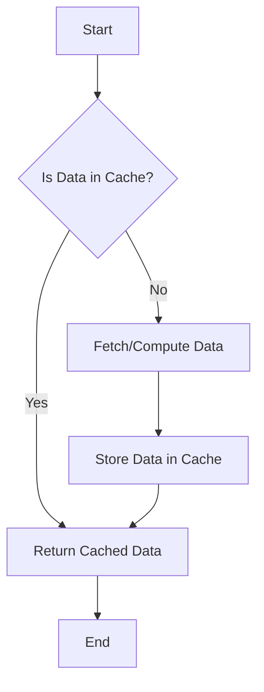

## 15.5 Caching Strategies and Memoization

In the realm of software development, performance optimization is a crucial aspect that can significantly impact the efficiency and responsiveness of applications. One of the most effective ways to enhance performance is through caching strategies and memoization. In this section, we will delve into these concepts, focusing on their implementation in Lua, a powerful and lightweight scripting language.

### Introduction to Caching and Memoization

Caching is a technique used to store computed results or frequently accessed data temporarily, so that future requests for that data can be served faster. Memoization, a specific form of caching, involves storing the results of expensive function calls and returning the cached result when the same inputs occur again.

#### Why Use Caching?

- **Performance Improvement**: By avoiding redundant calculations, caching can drastically reduce the time complexity of operations.
- **Resource Optimization**: Caching helps in reducing the load on computational resources, such as CPU and memory.
- **Latency Reduction**: For network requests, caching can minimize latency by storing responses locally.

### Implementing Caching in Lua

Lua, with its simple yet powerful table data structure, provides an excellent foundation for implementing caching mechanisms. Let's explore how we can implement caching and memoization in Lua.

#### Memoization: Caching Function Results

Memoization is particularly useful for functions with expensive computations. By caching the results of these functions, we can avoid recalculating them for the same inputs.

```lua
-- Memoization function in Lua
function memoize(func)
    local cache = {}
    return function (x)
        if cache[x] == nil then
            cache[x] = func(x)
        end
        return cache[x]
    end
end

-- Example of an expensive computation function
function expensiveComputation(x)
    -- Simulate a time-consuming computation
    local result = 0
    for i = 1, 1000000 do
        result = result + math.sin(x) * math.cos(x)
    end
    return result
end

-- Memoized version of the expensive computation
local memoizedComputation = memoize(expensiveComputation)

-- Test the memoized function
print(memoizedComputation(10))  -- Computation occurs
print(memoizedComputation(10))  -- Cached result is returned
```

In this example, the `memoize` function creates a closure that maintains a cache of previously computed results. When the `memoizedComputation` function is called with the same argument, it retrieves the result from the cache instead of recalculating it.

#### Data Caches: Storing Frequently Accessed Data

Data caching involves storing frequently accessed data in a cache to improve retrieval times. This is particularly useful for data that is expensive to fetch, such as database queries or network requests.

```lua
-- Simple data cache implementation
local dataCache = {}

function fetchData(key)
    if dataCache[key] then
        return dataCache[key]  -- Return cached data
    else
        -- Simulate data fetching
        local data = "Data for " .. key
        dataCache[key] = data  -- Store in cache
        return data
    end
end

-- Fetch data and utilize cache
print(fetchData("user:123"))  -- Fetches and caches data
print(fetchData("user:123"))  -- Returns cached data
```

In this example, the `fetchData` function checks if the requested data is already in the cache. If not, it simulates fetching the data and stores it in the cache for future requests.

### Use Cases and Examples

Caching strategies can be applied in various scenarios to enhance performance. Let's explore some common use cases.

#### Expensive Computations

For functions that perform complex calculations, memoization can significantly reduce execution time by avoiding redundant computations.

```lua
-- Fibonacci sequence with memoization
local fibCache = {}

function fibonacci(n)
    if n <= 1 then
        return n
    elseif fibCache[n] then
        return fibCache[n]
    else
        fibCache[n] = fibonacci(n - 1) + fibonacci(n - 2)
        return fibCache[n]
    end
end

print(fibonacci(40))  -- Efficiently computes the 40th Fibonacci number
```

In this example, the Fibonacci sequence is computed using memoization, drastically reducing the number of recursive calls.

#### Network Requests

Caching network responses can reduce latency and improve the responsiveness of applications.

```lua
-- Simulated network request with caching
local networkCache = {}

function fetchNetworkData(url)
    if networkCache[url] then
        return networkCache[url]  -- Return cached response
    else
        -- Simulate network request
        local response = "Response from " .. url
        networkCache[url] = response  -- Cache the response
        return response
    end
end

print(fetchNetworkData("http://example.com/api"))  -- Fetches and caches response
print(fetchNetworkData("http://example.com/api"))  -- Returns cached response
```

In this example, network responses are cached to minimize the number of requests made to the server, reducing latency.

### Design Considerations

When implementing caching strategies, consider the following:

- **Cache Invalidation**: Determine when cached data should be invalidated or refreshed.
- **Cache Size**: Limit the size of the cache to prevent excessive memory usage.
- **Consistency**: Ensure that cached data remains consistent with the source data.

### Visualizing Caching and Memoization

To better understand caching and memoization, let's visualize the process using a flowchart.



This flowchart illustrates the decision-making process involved in caching: checking if data is in the cache, fetching or computing it if not, storing it in the cache, and then returning the result.

### Try It Yourself

Experiment with the provided code examples by modifying them to suit different scenarios:

- **Modify the Memoization Function**: Extend the `memoize` function to handle multiple arguments.
- **Implement a Cache Eviction Policy**: Add logic to the data cache to evict the least recently used (LRU) items when the cache reaches a certain size.

### References and Links

For further reading on caching and memoization, consider the following resources:

- [MDN Web Docs: Caching](https://developer.mozilla.org/en-US/docs/Web/HTTP/Caching)
- [Wikipedia: Memoization](https://en.wikipedia.org/wiki/Memoization)

### Knowledge Check

To reinforce your understanding of caching strategies and memoization, consider the following questions:

- What are the benefits of using caching in software applications?
- How does memoization differ from general caching?
- What are some common use cases for caching in Lua applications?

### Embrace the Journey

Remember, mastering caching strategies and memoization is just one step in optimizing your Lua applications. As you continue to explore and experiment, you'll discover more ways to enhance performance and efficiency. Keep learning, stay curious, and enjoy the journey!

## Quiz Time!



### What is the primary benefit of caching in software applications?

- [x] Reducing redundant calculations
- [ ] Increasing memory usage
- [ ] Decreasing code readability
- [ ] Enhancing security

> **Explanation:** Caching helps in reducing redundant calculations, thereby improving performance.

### How does memoization differ from general caching?

- [x] Memoization specifically caches function results
- [ ] Memoization caches network responses
- [ ] Memoization is used for data storage
- [ ] Memoization increases memory usage

> **Explanation:** Memoization is a specific form of caching that involves storing the results of function calls.

### What is a common use case for caching in Lua applications?

- [x] Expensive computations
- [ ] Increasing code complexity
- [ ] Reducing code maintainability
- [ ] Enhancing security

> **Explanation:** Caching is commonly used for expensive computations to avoid redundant calculations.

### What should be considered when implementing caching strategies?

- [x] Cache invalidation
- [ ] Increasing code complexity
- [ ] Reducing code readability
- [ ] Enhancing security

> **Explanation:** Cache invalidation is important to ensure that cached data remains consistent with the source data.

### What is the purpose of a cache eviction policy?

- [x] To manage cache size and remove old data
- [ ] To increase memory usage
- [ ] To enhance security
- [ ] To decrease code readability

> **Explanation:** A cache eviction policy helps manage cache size by removing old or least recently used data.

### How can caching improve network request performance?

- [x] By reducing latency through cached responses
- [ ] By increasing the number of requests
- [ ] By decreasing code readability
- [ ] By enhancing security

> **Explanation:** Caching network responses can reduce latency and improve performance by minimizing requests.

### What is a potential drawback of caching?

- [x] Inconsistent data if not properly invalidated
- [ ] Increased code readability
- [ ] Enhanced security
- [ ] Reduced memory usage

> **Explanation:** If cached data is not properly invalidated, it can lead to inconsistencies with the source data.

### What is the role of a closure in memoization?

- [x] To maintain a cache of computed results
- [ ] To increase memory usage
- [ ] To enhance security
- [ ] To decrease code readability

> **Explanation:** A closure is used in memoization to maintain a cache of computed results for function calls.

### What is an example of data caching in Lua?

- [x] Storing frequently accessed data in a table
- [ ] Increasing code complexity
- [ ] Reducing code maintainability
- [ ] Enhancing security

> **Explanation:** Data caching involves storing frequently accessed data in a table to improve retrieval times.

### True or False: Memoization can be used for network requests.

- [x] True
- [ ] False

> **Explanation:** Memoization can be used to cache the results of network requests, reducing latency and improving performance.


