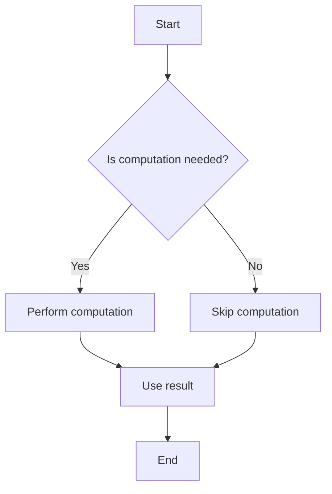

## 15.6 Lazy Evaluation and Dynamic Loading

In the realm of software engineering, efficiency is paramount. As developers, we strive to create applications that are not only functional but also optimized for performance. Two powerful techniques that can significantly enhance the efficiency of Lua applications are **lazy evaluation** and **dynamic loading**. These techniques allow us to defer computations and manage resources more effectively, leading to faster startup times and reduced memory usage.

### Deferring Computations: Calculating Values Only When Needed

Lazy evaluation is a strategy that delays the computation of values until they are actually needed. This approach can lead to significant performance improvements, especially in scenarios where not all computed values are used. By deferring computations, we can avoid unnecessary processing and optimize resource usage.

#### Implementing Lazy Evaluation

Lazy evaluation in Lua can be implemented using various techniques, with **thunks** and **on-demand loading** being two of the most common methods.

##### Thunks: Wrapping Computations in Functions

A **thunk** is a function that encapsulates a computation. Instead of performing a computation immediately, we wrap it in a function and call this function only when the result is needed. This allows us to defer the computation until the last possible moment.

Here's a simple example of using thunks in Lua:

```lua
-- Define a thunk for a computation
local function createThunk(computation)
    return function()
        return computation()
    end
end

-- Example computation
local expensiveComputation = function()
    print("Performing expensive computation...")
    return 42
end

-- Create a thunk for the expensive computation
local thunk = createThunk(expensiveComputation)

-- The computation is not performed until the thunk is called
print("Before calling thunk")
local result = thunk() -- Computation happens here
print("Result:", result)
```

In this example, the `expensiveComputation` function is wrapped in a thunk. The computation is deferred until the thunk is called, demonstrating how lazy evaluation can be achieved in Lua.

##### On-Demand Loading: Loading Modules or Data at Runtime

Another form of lazy evaluation is **on-demand loading**, where modules or data are loaded only when they are needed. This can be particularly useful for reducing startup times and optimizing memory usage.

Consider the following example of on-demand loading in Lua:

```lua
-- Lazy loading of a module
local function lazyLoadModule(moduleName)
    local module
    return function()
        if not module then
            print("Loading module:", moduleName)
            module = require(moduleName)
        end
        return module
    end
end

-- Create a lazy loader for a module
local lazyMath = lazyLoadModule("math")

-- The module is not loaded until it is accessed
print("Before accessing math module")
local mathModule = lazyMath() -- Module is loaded here
print("Square root of 16:", mathModule.sqrt(16))
```

In this example, the `lazyLoadModule` function creates a lazy loader for a specified module. The module is not loaded until it is accessed, demonstrating how on-demand loading can be used to optimize resource management.

### Use Cases and Examples

Lazy evaluation and dynamic loading have numerous applications in software development. Let's explore some common use cases and examples.

#### Resource Management: Reducing Startup Times

One of the primary benefits of lazy evaluation and dynamic loading is the ability to reduce application startup times. By deferring computations and loading resources only when needed, we can minimize the initial load on the system and improve the user experience.

Consider a scenario where an application needs to load a large dataset. Instead of loading the entire dataset at startup, we can use lazy evaluation to load only the necessary portions as they are accessed. This approach can significantly reduce startup times and improve performance.

#### Optimizing Memory Usage: Loading Only Necessary Data

Lazy evaluation and dynamic loading can also help optimize memory usage by ensuring that only necessary data is loaded into memory. This is particularly important in environments with limited resources, such as embedded systems or mobile devices.

For example, in a game development context, we might use lazy evaluation to load textures or assets only when they are needed for rendering. This can help reduce memory consumption and improve performance.

### Visualizing Lazy Evaluation and Dynamic Loading

To better understand the concepts of lazy evaluation and dynamic loading, let's visualize the process using a flowchart.



**Figure 1: Lazy Evaluation Flowchart**

This flowchart illustrates the decision-making process involved in lazy evaluation. The computation is performed only if it is needed, allowing us to optimize resource usage and improve performance.

### Design Considerations

When implementing lazy evaluation and dynamic loading, there are several design considerations to keep in mind:

- **Performance Trade-offs**: While lazy evaluation can improve performance by deferring computations, it can also introduce overhead when computations are eventually performed. It's important to balance the benefits of deferred computations with the potential costs.
- **Complexity**: Lazy evaluation can add complexity to the codebase, making it harder to understand and maintain. Ensure that the benefits outweigh the added complexity before adopting this approach.
- **Concurrency**: In concurrent environments, care must be taken to ensure that lazy evaluation does not introduce race conditions or other concurrency issues.

### Differences and Similarities

Lazy evaluation and dynamic loading are related concepts that share some similarities but also have distinct differences:

- **Similarities**: Both techniques aim to optimize resource usage by deferring computations or loading resources only when needed. They can be used together to achieve greater efficiency.
- **Differences**: Lazy evaluation focuses on deferring computations, while dynamic loading is concerned with loading resources or modules at runtime. Each technique has its own use cases and considerations.

### Try It Yourself

To gain a deeper understanding of lazy evaluation and dynamic loading, try modifying the code examples provided in this section. Experiment with different computations and modules to see how lazy evaluation can be applied in various scenarios. Consider the following challenges:

- Modify the thunk example to include a cache that stores the result of the computation, avoiding repeated calculations.
- Implement a lazy loader for a custom module that simulates a time-consuming initialization process.

### References and Links

For further reading on lazy evaluation and dynamic loading, consider exploring the following resources:

- [Lua Programming Guide](https://www.lua.org/manual/5.4/)
- [MDN Web Docs on Lazy Evaluation](https://developer.mozilla.org/en-US/docs/Web/JavaScript/Guide/Iterators_and_Generators#Lazy_evaluation)
- [W3Schools on Dynamic Loading](https://www.w3schools.com/js/js_dynamic.asp)

### Knowledge Check

Before moving on, take a moment to reflect on the key concepts covered in this section. Consider the following questions:

- How does lazy evaluation differ from eager evaluation?
- What are the benefits of using thunks in lazy evaluation?
- How can dynamic loading improve application performance?

### Embrace the Journey

Remember, mastering lazy evaluation and dynamic loading is just one step in your journey to becoming a proficient Lua developer. As you continue to explore these concepts, you'll discover new ways to optimize your applications and enhance their performance. Keep experimenting, stay curious, and enjoy the journey!

## Quiz Time!



### What is lazy evaluation?

- [x] A strategy that delays the computation of values until they are needed
- [ ] A method of precomputing all values at startup
- [ ] A technique for optimizing memory usage by loading all data at once
- [ ] A way to dynamically load modules at runtime

> **Explanation:** Lazy evaluation is a strategy that delays the computation of values until they are actually needed, optimizing resource usage.

### What is a thunk in the context of lazy evaluation?

- [x] A function that encapsulates a computation
- [ ] A variable that stores precomputed values
- [ ] A module that is loaded at runtime
- [ ] A method for optimizing memory usage

> **Explanation:** A thunk is a function that wraps a computation, allowing it to be deferred until needed.

### How does on-demand loading benefit application performance?

- [x] By reducing startup times and optimizing memory usage
- [ ] By precomputing all values at startup
- [ ] By loading all modules at once
- [ ] By deferring all computations indefinitely

> **Explanation:** On-demand loading reduces startup times and optimizes memory usage by loading resources only when needed.

### What is a potential drawback of lazy evaluation?

- [x] It can introduce overhead when computations are eventually performed
- [ ] It always improves performance with no trade-offs
- [ ] It requires all computations to be performed at startup
- [ ] It eliminates the need for dynamic loading

> **Explanation:** Lazy evaluation can introduce overhead when computations are eventually performed, requiring a balance between benefits and costs.

### What is the primary focus of dynamic loading?

- [x] Loading resources or modules at runtime
- [ ] Deferring computations until needed
- [ ] Precomputing all values at startup
- [ ] Optimizing memory usage by loading all data at once

> **Explanation:** Dynamic loading focuses on loading resources or modules at runtime, optimizing resource management.

### How can lazy evaluation improve memory usage?

- [x] By ensuring only necessary data is loaded into memory
- [ ] By precomputing all values at startup
- [ ] By loading all modules at once
- [ ] By deferring all computations indefinitely

> **Explanation:** Lazy evaluation improves memory usage by loading only necessary data into memory, optimizing resource usage.

### What is a common use case for lazy evaluation?

- [x] Reducing application startup times
- [ ] Precomputing all values at startup
- [ ] Loading all modules at once
- [ ] Deferring all computations indefinitely

> **Explanation:** Lazy evaluation is commonly used to reduce application startup times by deferring computations until needed.

### What is a key difference between lazy evaluation and dynamic loading?

- [x] Lazy evaluation defers computations, while dynamic loading focuses on loading resources at runtime
- [ ] Lazy evaluation precomputes all values at startup, while dynamic loading defers computations
- [ ] Lazy evaluation and dynamic loading are the same concept
- [ ] Lazy evaluation focuses on loading resources at runtime, while dynamic loading defers computations

> **Explanation:** Lazy evaluation defers computations, while dynamic loading focuses on loading resources or modules at runtime.

### Can lazy evaluation and dynamic loading be used together?

- [x] True
- [ ] False

> **Explanation:** Lazy evaluation and dynamic loading can be used together to achieve greater efficiency in resource management.

### What should be considered when implementing lazy evaluation?

- [x] Performance trade-offs, complexity, and concurrency issues
- [ ] Only performance trade-offs
- [ ] Only complexity
- [ ] Only concurrency issues

> **Explanation:** When implementing lazy evaluation, consider performance trade-offs, complexity, and concurrency issues to ensure optimal results.


