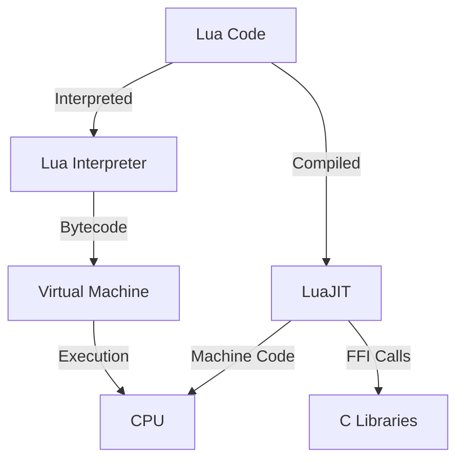

## 15.7 Utilizing LuaJIT for Performance

In the world of software development, performance is often a critical factor, especially when dealing with compute-intensive tasks or systems that require low-latency execution. LuaJIT, a Just-In-Time (JIT) compiler for Lua, offers a powerful solution for enhancing the performance of Lua applications. In this section, we will delve into the benefits of LuaJIT, explore its features such as the Foreign Function Interface (FFI) library, and provide practical examples and considerations for using LuaJIT effectively.

### Enhancing Speed with LuaJIT

LuaJIT is renowned for its ability to significantly boost the performance of Lua scripts. By compiling Lua code into machine code at runtime, LuaJIT can execute scripts much faster than the standard Lua interpreter. This process, known as Just-In-Time compilation, allows LuaJIT to optimize code execution dynamically, adapting to the specific needs of the application.

#### Benefits of LuaJIT

1. **Performance Gains**: LuaJIT can deliver performance improvements of up to 10 times or more compared to the standard Lua interpreter. This is particularly beneficial for applications that require high-speed execution, such as game engines, real-time data processing, and high-frequency trading systems.

2. **FFI Library**: One of the standout features of LuaJIT is its Foreign Function Interface (FFI) library, which allows Lua scripts to call C functions directly without the need for complex bindings. This capability not only enhances performance by reducing overhead but also simplifies the integration of Lua with existing C libraries.

3. **Ease of Use**: LuaJIT is designed to be a drop-in replacement for the standard Lua interpreter, making it easy to integrate into existing projects. Developers can take advantage of LuaJIT's performance benefits with minimal changes to their codebase.

4. **Cross-Platform Support**: LuaJIT supports a wide range of platforms, including Windows, macOS, Linux, and various embedded systems, making it a versatile choice for performance optimization.

### Considerations

While LuaJIT offers significant performance benefits, there are several considerations to keep in mind when using it:

1. **Compatibility**: Not all Lua code is compatible with LuaJIT. Certain features, such as the `debug` library and some metatable operations, may behave differently or be unsupported. It's important to test your code thoroughly to ensure compatibility.

2. **Debugging Differences**: LuaJIT's optimizations can sometimes make debugging more challenging. For example, the JIT compiler may reorder or inline code, which can affect stack traces and error messages. Developers should be aware of these differences and use LuaJIT's debugging tools to assist in troubleshooting.

3. **Memory Usage**: While LuaJIT generally improves performance, it can also increase memory usage due to the JIT compilation process. Developers should monitor memory consumption and optimize their code to manage resources effectively.

4. **Platform-Specific Behavior**: LuaJIT's performance can vary depending on the platform and architecture. It's important to test and profile your application on the target platform to ensure optimal performance.

### Use Cases and Examples

LuaJIT is particularly well-suited for applications that require high performance and low latency. Here are some common use cases and examples:

#### Compute-Intensive Tasks

For tasks that involve heavy computation, such as numerical simulations or data analysis, LuaJIT can provide substantial performance improvements. Consider the following example, which demonstrates the use of LuaJIT for matrix multiplication:

```lua
-- Matrix multiplication using LuaJIT FFI
local ffi = require("ffi")

-- Define a C function for matrix multiplication
ffi.cdef[[
void matrix_multiply(double *a, double *b, double *c, int n);
]]

-- Load the shared library containing the C function
local lib = ffi.load("matrix")

-- Define the matrix size
local n = 1000

-- Allocate memory for matrices
local a = ffi.new("double[?]", n * n)
local b = ffi.new("double[?]", n * n)
local c = ffi.new("double[?]", n * n)

-- Initialize matrices a and b
for i = 0, n * n - 1 do
    a[i] = math.random()
    b[i] = math.random()
end

-- Perform matrix multiplication
lib.matrix_multiply(a, b, c, n)

-- Output the result
print("Matrix multiplication completed.")
```

In this example, we use LuaJIT's FFI library to call a C function for matrix multiplication. This approach leverages the performance of compiled C code while maintaining the flexibility of Lua for other parts of the application.

#### High-Frequency Trading Systems

In high-frequency trading (HFT) systems, low-latency execution is crucial. LuaJIT's ability to execute Lua scripts at near-native speeds makes it an excellent choice for implementing trading algorithms and processing market data in real-time.

```lua
-- Example of a simple trading strategy using LuaJIT
local ffi = require("ffi")

-- Define a C function for fast data processing
ffi.cdef[[
double process_market_data(double *data, int size);
]]

-- Load the shared library containing the C function
local lib = ffi.load("trading")

-- Simulate market data
local size = 10000
local data = ffi.new("double[?]", size)
for i = 0, size - 1 do
    data[i] = math.random()
end

-- Process market data using the C function
local result = lib.process_market_data(data, size)

-- Output the result
print("Market data processed. Result:", result)
```

In this example, we use LuaJIT's FFI library to call a C function for processing market data. This approach allows us to achieve the low-latency execution required for high-frequency trading.

### Visualizing LuaJIT's Interaction with Lua Code

To better understand how LuaJIT enhances performance, let's visualize the interaction between LuaJIT, Lua code, and the underlying hardware:



**Diagram Description**: This diagram illustrates the interaction between Lua code, the Lua interpreter, LuaJIT, and the CPU. LuaJIT compiles Lua code into machine code, which is executed directly by the CPU, bypassing the virtual machine. Additionally, LuaJIT can make FFI calls to C libraries, further enhancing performance.

### Try It Yourself

To fully appreciate the power of LuaJIT, we encourage you to experiment with the code examples provided. Try modifying the matrix size in the matrix multiplication example or adjusting the data size in the trading strategy example. Observe how LuaJIT handles these changes and explore the impact on performance.

### References and Links

For further reading and exploration, consider the following resources:

- [LuaJIT Official Website](https://luajit.org/)
- [LuaJIT FFI Documentation](https://luajit.org/ext_ffi.html)
- [LuaJIT Performance Tips](https://luajit.org/performance.html)

### Knowledge Check

To reinforce your understanding of LuaJIT and its performance benefits, consider the following questions:

1. What is Just-In-Time compilation, and how does it enhance Lua performance?
2. How does LuaJIT's FFI library improve the integration of Lua with C libraries?
3. What are some potential challenges when debugging Lua code with LuaJIT?
4. How can LuaJIT be used to optimize compute-intensive tasks?
5. Why is LuaJIT particularly well-suited for high-frequency trading systems?

### Embrace the Journey

Remember, mastering LuaJIT and performance optimization is a journey. As you experiment with LuaJIT, you'll discover new ways to enhance the performance of your Lua applications. Keep exploring, stay curious, and enjoy the process of learning and optimizing your code.

## Quiz Time!



### What is the primary benefit of using LuaJIT?

- [x] Significant performance improvements
- [ ] Simplified syntax
- [ ] Enhanced debugging capabilities
- [ ] Increased memory usage

> **Explanation:** LuaJIT provides significant performance improvements by compiling Lua code into machine code at runtime.

### How does LuaJIT's FFI library enhance performance?

- [x] By allowing direct calls to C functions
- [ ] By simplifying Lua syntax
- [ ] By reducing memory usage
- [ ] By improving error handling

> **Explanation:** The FFI library allows Lua scripts to call C functions directly, reducing overhead and enhancing performance.

### What is a potential challenge when using LuaJIT?

- [x] Debugging differences due to code optimization
- [ ] Increased code complexity
- [ ] Lack of cross-platform support
- [ ] Limited library support

> **Explanation:** LuaJIT's optimizations can affect stack traces and error messages, making debugging more challenging.

### Which of the following is a common use case for LuaJIT?

- [x] High-frequency trading systems
- [ ] Simple scripting tasks
- [ ] Basic arithmetic operations
- [ ] Static web pages

> **Explanation:** LuaJIT is well-suited for high-frequency trading systems due to its low-latency execution capabilities.

### What does JIT stand for in LuaJIT?

- [x] Just-In-Time
- [ ] Java Integration Tool
- [ ] Joint Interface Technology
- [ ] JavaScript Interoperability Tool

> **Explanation:** JIT stands for Just-In-Time, referring to the compilation of code at runtime.

### How does LuaJIT handle memory usage compared to the standard Lua interpreter?

- [x] It can increase memory usage due to JIT compilation
- [ ] It significantly reduces memory usage
- [ ] It has no impact on memory usage
- [ ] It always uses less memory

> **Explanation:** LuaJIT can increase memory usage because of the additional resources required for JIT compilation.

### What is the role of the LuaJIT FFI library?

- [x] To facilitate direct interaction with C libraries
- [ ] To provide enhanced debugging tools
- [ ] To simplify Lua syntax
- [ ] To manage memory allocation

> **Explanation:** The FFI library allows Lua scripts to interact directly with C libraries, enhancing performance.

### What should developers monitor when using LuaJIT?

- [x] Memory consumption
- [ ] Syntax errors
- [ ] Code readability
- [ ] Variable naming conventions

> **Explanation:** Developers should monitor memory consumption, as LuaJIT can increase memory usage due to JIT compilation.

### True or False: LuaJIT is a drop-in replacement for the standard Lua interpreter.

- [x] True
- [ ] False

> **Explanation:** LuaJIT is designed to be a drop-in replacement for the standard Lua interpreter, allowing easy integration into existing projects.

### What is a key feature of LuaJIT that benefits high-performance applications?

- [x] Just-In-Time compilation
- [ ] Simplified syntax
- [ ] Enhanced error handling
- [ ] Reduced memory usage

> **Explanation:** Just-In-Time compilation is a key feature of LuaJIT that significantly enhances performance for high-performance applications.


