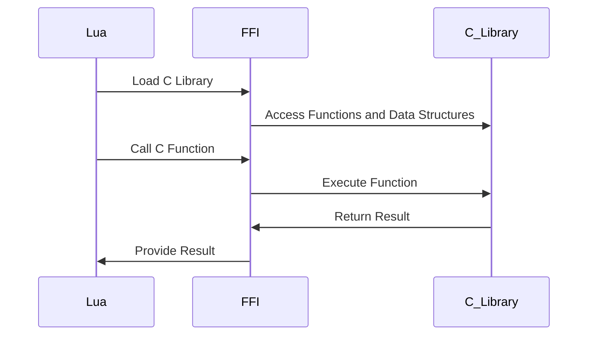

## 15.8 FFI (Foreign Function Interface) Optimization

In the realm of software development, performance is often a critical factor that can make or break an application. Lua, known for its simplicity and flexibility, can sometimes fall short in performance-intensive scenarios. This is where the Foreign Function Interface (FFI) comes into play, particularly with LuaJIT, a Just-In-Time Compiler for Lua. FFI allows Lua to interface directly with C libraries, providing a powerful mechanism to optimize performance-critical code by leveraging the speed and efficiency of C.

### Interfacing with C Libraries: Using FFI for Performance-Critical Code

FFI enables Lua scripts to call C functions and manipulate C data structures as if they were native Lua objects. This capability is invaluable when you need to perform operations that are computationally expensive or require low-level system access.

#### Implementing FFI

To harness the power of FFI, we need to understand how to define C data structures and call C functions from Lua. Let's dive into these concepts.

##### Defining C Data Structures: Mapping Lua Types to C Types

FFI allows you to define C data structures directly in Lua. This is done using the `ffi.cdef` function, which declares C types and functions. Here's how you can define a simple C structure in Lua:

```lua
local ffi = require("ffi")

ffi.cdef[[
typedef struct {
    int x;
    int y;
} Point;
]]

-- Create an instance of the C structure
local point = ffi.new("Point", {x = 10, y = 20})

print("Point coordinates:", point.x, point.y)
```

In this example, we define a `Point` structure with two integer fields, `x` and `y`. We then create an instance of this structure and access its fields just like a Lua table.

##### Calling C Functions: Directly Invoking Functions from Shared Libraries

Once you've defined your C data structures, you can call C functions from shared libraries. This is done using the `ffi.load` function, which loads a shared library and allows you to call its functions. Here's an example:

```lua
local ffi = require("ffi")

ffi.cdef[[
int printf(const char *fmt, ...);
]]

local C = ffi.C

-- Call the C printf function
C.printf("Hello from C! x = %d, y = %d\n", point.x, point.y)
```

In this code, we declare the `printf` function from the C standard library and call it from Lua, passing the `Point` structure's fields as arguments.

### Use Cases and Examples

FFI is particularly useful in scenarios where performance is critical, and you need to leverage existing C libraries or write custom extensions in C.

#### Leveraging Existing Libraries: Utilizing Well-Optimized C Code

One of the primary use cases for FFI is to utilize existing C libraries that are well-optimized for specific tasks. For example, you might use a C library for image processing, cryptography, or numerical computations. Here's how you can use FFI to interface with a hypothetical C library for matrix operations:

```lua
local ffi = require("ffi")

ffi.cdef[[
typedef struct {
    int rows;
    int cols;
    double *data;
} Matrix;

Matrix* create_matrix(int rows, int cols);
void destroy_matrix(Matrix *matrix);
void add_matrices(const Matrix *a, const Matrix *b, Matrix *result);
]]

local matrix_lib = ffi.load("matrixlib")

local a = matrix_lib.create_matrix(3, 3)
local b = matrix_lib.create_matrix(3, 3)
local result = matrix_lib.create_matrix(3, 3)

-- Assume matrices a and b are initialized

matrix_lib.add_matrices(a, b, result)

-- Clean up
matrix_lib.destroy_matrix(a)
matrix_lib.destroy_matrix(b)
matrix_lib.destroy_matrix(result)
```

In this example, we define a `Matrix` structure and declare functions from a C library for matrix operations. We then create matrices, perform addition, and clean up resources.

#### Custom Extensions: Writing Performance-Critical Code in C

Sometimes, you may need to write custom C code to optimize specific parts of your application. FFI allows you to seamlessly integrate this code with your Lua scripts. Here's a simple example of writing a C function for a performance-critical task:

```c
// mylib.c
#include <math.h>

double compute_distance(double x1, double y1, double x2, double y2) {
    return sqrt((x2 - x1) * (x2 - x1) + (y2 - y1) * (y2 - y1));
}
```

Compile this C code into a shared library, and then use FFI to call it from Lua:

```lua
local ffi = require("ffi")

ffi.cdef[[
double compute_distance(double x1, double y1, double x2, double y2);
]]

local mylib = ffi.load("mylib")

local distance = mylib.compute_distance(0, 0, 3, 4)
print("Distance:", distance)
```

In this example, we define a C function to compute the distance between two points and call it from Lua using FFI.

### Visualizing FFI Interactions

To better understand how Lua interacts with C libraries using FFI, let's visualize the process with a sequence diagram:



This diagram illustrates the flow of interactions between Lua, FFI, and a C library. Lua loads the library, accesses its functions and data structures, and calls functions to perform operations, with results returned back to Lua.

### Try It Yourself

To get hands-on experience with FFI, try modifying the code examples above. For instance, you can:

- Define additional C structures and functions.
- Experiment with different C libraries.
- Write custom C code for tasks specific to your application.

### References and Links

For further reading on LuaJIT and FFI, consider the following resources:

- [LuaJIT FFI Documentation](http://luajit.org/ext_ffi.html)
- [LuaJIT: The Design and Implementation of a Just-In-Time Compiler](https://www.lua.org/wshop12/Ierusalimschy.pdf)
- [MDN Web Docs on C Programming](https://developer.mozilla.org/en-US/docs/Web/C)

### Knowledge Check

Before we wrap up, let's reinforce what we've learned with a few questions:

- What is the primary purpose of FFI in Lua?
- How do you define a C structure in Lua using FFI?
- What are some common use cases for FFI?
- How can you call a C function from Lua using FFI?

### Embrace the Journey

Remember, mastering FFI is a journey that involves experimentation and practice. As you continue to explore and apply these concepts, you'll unlock new levels of performance and efficiency in your Lua applications. Keep experimenting, stay curious, and enjoy the journey!

## Quiz Time!



### What is the primary purpose of FFI in Lua?

- [x] To interface Lua with C libraries for performance optimization
- [ ] To provide a graphical user interface for Lua applications
- [ ] To compile Lua scripts into standalone executables
- [ ] To enable Lua scripts to run on mobile devices

> **Explanation:** FFI is used to interface Lua with C libraries, allowing for performance optimization by leveraging the speed and efficiency of C.

### How do you define a C structure in Lua using FFI?

- [x] Using the `ffi.cdef` function
- [ ] Using the `ffi.load` function
- [ ] Using the `ffi.new` function
- [ ] Using the `ffi.call` function

> **Explanation:** The `ffi.cdef` function is used to declare C types and functions in Lua.

### What function is used to load a shared library in Lua with FFI?

- [x] `ffi.load`
- [ ] `ffi.cdef`
- [ ] `ffi.new`
- [ ] `ffi.call`

> **Explanation:** The `ffi.load` function is used to load a shared library, allowing Lua to call its functions.

### Which of the following is a common use case for FFI?

- [x] Leveraging existing C libraries for performance-critical tasks
- [ ] Creating graphical user interfaces
- [ ] Writing Lua scripts for web development
- [ ] Compiling Lua scripts into machine code

> **Explanation:** FFI is commonly used to leverage existing C libraries for performance-critical tasks.

### What is the role of the `ffi.new` function in FFI?

- [x] To create an instance of a C data structure
- [ ] To declare C functions
- [ ] To load a shared library
- [ ] To call a C function

> **Explanation:** The `ffi.new` function is used to create an instance of a C data structure in Lua.

### How can you call a C function from Lua using FFI?

- [x] By declaring the function with `ffi.cdef` and then calling it through a loaded library
- [ ] By using the `ffi.new` function
- [ ] By using the `ffi.load` function
- [ ] By using the `ffi.call` function

> **Explanation:** You declare the function with `ffi.cdef` and call it through a loaded library using FFI.

### What is the benefit of using FFI for performance optimization?

- [x] It allows Lua to execute performance-critical code written in C
- [ ] It enables Lua scripts to run on multiple platforms
- [ ] It provides a graphical interface for Lua applications
- [ ] It compiles Lua scripts into standalone executables

> **Explanation:** FFI allows Lua to execute performance-critical code written in C, optimizing performance.

### What is the purpose of the `ffi.cdef` function?

- [x] To declare C types and functions in Lua
- [ ] To load a shared library
- [ ] To create an instance of a C data structure
- [ ] To call a C function

> **Explanation:** The `ffi.cdef` function is used to declare C types and functions in Lua.

### Which of the following is NOT a use case for FFI?

- [x] Creating graphical user interfaces
- [ ] Leveraging existing C libraries
- [ ] Writing custom C extensions
- [ ] Optimizing performance-critical code

> **Explanation:** FFI is not typically used for creating graphical user interfaces; it is used for interfacing with C libraries.

### True or False: FFI can be used to call C++ functions directly from Lua.

- [ ] True
- [x] False

> **Explanation:** FFI is designed to interface with C libraries, not C++ directly. C++ functions need to be exposed as C-compatible functions to be used with FFI.


