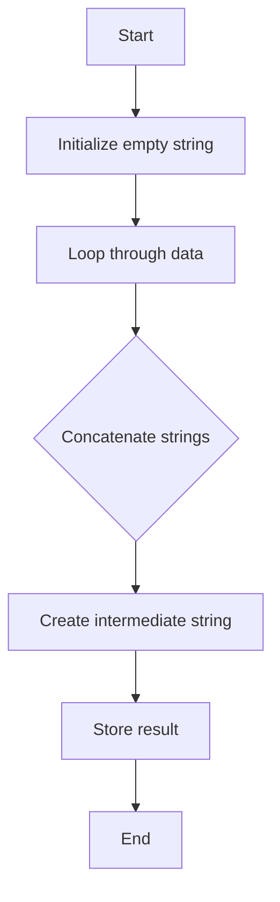

## 15.9 Avoiding Common Performance Pitfalls

In the world of software development, performance is a critical aspect that can make or break an application. Lua, known for its simplicity and efficiency, is no exception. However, even in a language as streamlined as Lua, there are common pitfalls that can lead to suboptimal performance. In this section, we will explore these pitfalls, provide best practices to avoid them, and illustrate their impact with real-world use cases.

### Recognizing Inefficient Patterns

Before diving into specific pitfalls, it's essential to understand what constitutes inefficient patterns in Lua programming. Inefficient patterns are coding practices that unnecessarily consume resources, such as CPU time and memory, leading to slower execution and increased latency. Recognizing these patterns is the first step toward optimizing your Lua applications.

#### Common Pitfalls

Let's delve into some of the most common performance pitfalls in Lua and how to avoid them.

##### Unnecessary Table Creations

Tables are the cornerstone of Lua's data structures, but they can also be a source of inefficiency if not used judiciously. Creating tables unnecessarily can lead to increased memory usage and garbage collection overhead.

**Example of Unnecessary Table Creation:**

```lua
-- Inefficient: Creating a new table in each iteration
for i = 1, 1000 do
    local tempTable = {a = i, b = i * 2}
    -- Perform operations on tempTable
end
```

**Optimized Approach:**

```lua
-- Efficient: Reusing a single table
local tempTable = {}
for i = 1, 1000 do
    tempTable.a = i
    tempTable.b = i * 2
    -- Perform operations on tempTable
end
```

By reusing a single table, we reduce the overhead of creating and destroying tables repeatedly.

##### String Concatenation

String operations are common in many applications, but they can be costly if not handled correctly. In Lua, concatenating strings using the `..` operator in a loop can lead to performance issues due to the creation of intermediate strings.

**Example of Inefficient String Concatenation:**

```lua
-- Inefficient: Concatenating strings in a loop
local result = ""
for i = 1, 1000 do
    result = result .. "Line " .. i .. "\n"
end
```

**Optimized Approach Using Table Concatenation:**

```lua
-- Efficient: Using table.concat for string concatenation
local lines = {}
for i = 1, 1000 do
    lines[i] = "Line " .. i .. "\n"
end
local result = table.concat(lines)
```

Using `table.concat` is more efficient as it reduces the number of intermediate strings created during concatenation.

##### Inefficient Loops

Loops are a fundamental construct in programming, but they can become a bottleneck if not optimized. Performing unnecessary computations or operations within loops can degrade performance.

**Example of Inefficient Loop:**

```lua
-- Inefficient: Recalculating length in each iteration
local data = {1, 2, 3, 4, 5}
for i = 1, #data do
    -- Perform operations
end
```

**Optimized Approach:**

```lua
-- Efficient: Calculating length once
local data = {1, 2, 3, 4, 5}
local dataLength = #data
for i = 1, dataLength do
    -- Perform operations
end
```

By calculating the length of the table once before the loop, we avoid redundant computations.

### Best Practices

To avoid these common pitfalls, it's essential to adopt best practices that promote efficient coding.

#### Code Reviews

Conducting regular code reviews is a proactive way to catch performance issues early. During code reviews, focus on identifying inefficient patterns, redundant computations, and opportunities for optimization.

#### Continuous Profiling

Profiling your application continuously helps monitor performance over time. Use profiling tools to identify bottlenecks and areas that require optimization. Profiling should be an ongoing process, not just a one-time activity.

### Use Cases and Examples

Understanding the impact of performance pitfalls is crucial, especially in large-scale applications and real-time systems where efficiency is paramount.

#### Large-Scale Applications

In large-scale applications, even small inefficiencies can accumulate, leading to significant performance degradation. For instance, unnecessary table creations in a data processing pipeline can lead to increased memory usage and slower execution times.

**Example:**

Consider a data processing application that handles millions of records. If each record involves creating a new table, the memory overhead can become substantial, affecting the application's scalability.

#### Real-Time Systems

In real-time systems, performance is critical as delays can lead to unacceptable user experiences. Inefficient string concatenation or loops can introduce latency, impacting the system's responsiveness.

**Example:**

In a real-time gaming application, inefficient loops in the game loop can lead to frame rate drops, affecting the player's experience.

### Visualizing Performance Pitfalls

To better understand the impact of these pitfalls, let's visualize the process of string concatenation using a flowchart.



**Caption:** This flowchart illustrates the process of string concatenation using the `..` operator, highlighting the creation of intermediate strings at each step.

### Try It Yourself

To solidify your understanding, try modifying the code examples provided. Experiment with different data sizes and observe the impact on performance. Consider using profiling tools to measure execution times and memory usage.

### Knowledge Check

Let's reinforce what we've learned with a few questions:

- What are the common pitfalls in Lua programming that can lead to performance issues?
- How can reusing tables improve performance?
- Why is `table.concat` preferred over the `..` operator for string concatenation?
- What role do code reviews play in performance optimization?

### Embrace the Journey

Remember, optimizing performance is an ongoing journey. As you continue to develop your Lua applications, keep experimenting with different techniques, stay curious, and enjoy the process of making your code more efficient.

### Summary

In this section, we've explored common performance pitfalls in Lua programming and provided best practices to avoid them. By recognizing inefficient patterns, conducting code reviews, and continuously profiling your applications, you can ensure optimal performance in your Lua projects.

## Quiz Time!



### What is a common performance pitfall when using tables in Lua?

- [x] Unnecessary table creations
- [ ] Using tables for data storage
- [ ] Accessing table elements
- [ ] Iterating over tables

> **Explanation:** Unnecessary table creations can lead to increased memory usage and garbage collection overhead.

### Which method is more efficient for string concatenation in Lua?

- [ ] Using the `..` operator
- [x] Using `table.concat`
- [ ] Using `string.format`
- [ ] Using `string.gsub`

> **Explanation:** `table.concat` is more efficient as it reduces the number of intermediate strings created during concatenation.

### How can you optimize loops in Lua?

- [x] Calculate loop bounds outside the loop
- [ ] Use nested loops
- [ ] Perform complex calculations inside the loop
- [ ] Use global variables inside the loop

> **Explanation:** Calculating loop bounds outside the loop avoids redundant computations.

### What is the benefit of conducting code reviews?

- [x] Catching performance issues early
- [ ] Increasing code complexity
- [ ] Reducing code readability
- [ ] Delaying project timelines

> **Explanation:** Code reviews help identify and address performance issues early in the development process.

### Why is continuous profiling important?

- [x] It helps monitor performance over time
- [ ] It increases code size
- [ ] It reduces code execution speed
- [ ] It complicates the codebase

> **Explanation:** Continuous profiling helps identify bottlenecks and areas for optimization.

### What impact can small inefficiencies have in large-scale applications?

- [x] They can accumulate and degrade performance
- [ ] They have no impact
- [ ] They improve performance
- [ ] They simplify the codebase

> **Explanation:** Small inefficiencies can accumulate, leading to significant performance degradation in large-scale applications.

### In real-time systems, why is performance critical?

- [x] Delays can lead to unacceptable user experiences
- [ ] Performance is not important
- [ ] It reduces system complexity
- [ ] It increases system security

> **Explanation:** In real-time systems, performance is critical as delays can affect the system's responsiveness.

### How can reusing tables improve performance?

- [x] It reduces memory usage and garbage collection overhead
- [ ] It increases code complexity
- [ ] It slows down execution
- [ ] It complicates debugging

> **Explanation:** Reusing tables reduces the overhead of creating and destroying tables repeatedly.

### What is the role of profiling tools?

- [x] Identifying bottlenecks and areas for optimization
- [ ] Increasing code complexity
- [ ] Reducing code readability
- [ ] Delaying project timelines

> **Explanation:** Profiling tools help identify bottlenecks and areas that require optimization.

### True or False: Using `..` for string concatenation is always the best choice.

- [ ] True
- [x] False

> **Explanation:** Using `..` for string concatenation can lead to performance issues due to the creation of intermediate strings. `table.concat` is often a better choice.


