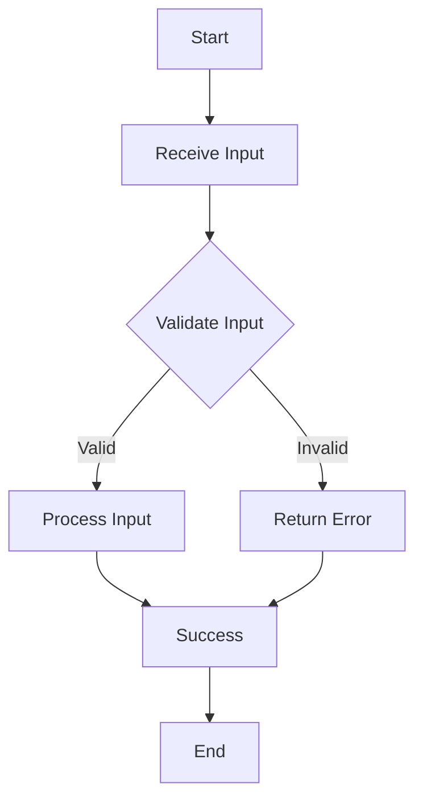

## 16.1 Secure Coding Practices in Lua

In today's digital landscape, security is paramount. As software engineers and architects, it is our responsibility to anticipate and mitigate security risks in our applications. Lua, a lightweight and flexible scripting language, is no exception. This section will guide you through the essential secure coding practices in Lua, ensuring your applications are robust and resilient against potential threats.

### Writing Secure Code

Writing secure code involves more than just fixing bugs; it requires a proactive approach to identify and address potential vulnerabilities before they can be exploited. Let's explore the principles of secure development and common security pitfalls in Lua.

#### Principles of Secure Development

1. **Least Privilege**

   The principle of least privilege dictates that a program should only have the permissions necessary to perform its tasks. This minimizes the potential damage from a security breach. In Lua, this means restricting access to sensitive functions and data.

   ```lua
   -- Example of least privilege: limiting access to sensitive functions
   local function performSensitiveOperation()
       -- Sensitive operation code
   end

   local function publicFunction()
       -- Publicly accessible code
       -- Does not directly call performSensitiveOperation
   end
   ```

   By encapsulating sensitive operations within private functions, we limit their exposure to potential misuse.

2. **Defense in Depth**

   Defense in depth involves implementing multiple layers of security controls to protect against threats. In Lua, this can be achieved by combining various security measures, such as input validation, error handling, and secure coding practices.

   ```lua
   -- Defense in depth: combining input validation and error handling
   local function validateInput(input)
       if type(input) ~= "string" then
           error("Invalid input type")
       end
       -- Additional validation logic
   end

   local function processInput(input)
       validateInput(input)
       -- Process validated input
   end

   local success, err = pcall(processInput, userInput)
   if not success then
       print("Error processing input:", err)
   end
   ```

   By validating inputs and handling errors gracefully, we create a robust defense against potential attacks.

#### Common Security Pitfalls in Lua

1. **Global Variables**

   Global variables can pose significant security risks, as they can be accessed and modified from anywhere in the code. This can lead to unintended behavior and vulnerabilities.

   ```lua
   -- Avoid using global variables
   local function secureFunction()
       local localVar = "secure"
       -- Use local variables instead of globals
   end
   ```

   Always use local variables whenever possible to limit the scope and potential impact of variable modifications.

2. **Dynamic Code Execution**

   Lua's flexibility allows for dynamic code execution using functions like `loadstring()` and `loadfile()`. However, these functions can introduce security risks if not used carefully.

   ```lua
   -- Caution with dynamic code execution
   local safeCode = "return 2 + 2"
   local unsafeCode = "os.execute('rm -rf /')"

   local function executeCode(code)
       local func, err = loadstring(code)
       if not func then
           error("Invalid code: " .. err)
       end
       return func()
   end

   -- Only execute trusted code
   executeCode(safeCode)
   ```

   Always validate and sanitize code before executing it dynamically to prevent malicious actions.

### Best Practices

1. **Input Validation**

   Input validation is crucial to ensure that all external inputs are sanitized and conform to expected formats. This prevents injection attacks and other vulnerabilities.

   ```lua
   -- Input validation example
   local function sanitizeInput(input)
       return input:gsub("[^%w%s]", "")
   end

   local function processUserInput(input)
       local sanitizedInput = sanitizeInput(input)
       -- Process sanitized input
   end
   ```

   By sanitizing inputs, we reduce the risk of malicious data affecting our application.

2. **Error Handling**

   Proper error handling prevents the leakage of sensitive information through error messages. It also ensures that the application can recover gracefully from unexpected situations.

   ```lua
   -- Error handling example
   local function safeDivide(a, b)
       if b == 0 then
           return nil, "Division by zero"
       end
       return a / b
   end

   local result, err = safeDivide(10, 0)
   if not result then
       print("Error:", err)
   else
       print("Result:", result)
   end
   ```

   By handling errors explicitly, we maintain control over the application's behavior and prevent information leaks.

### Visualizing Secure Coding Practices

To better understand the flow of secure coding practices, let's visualize the process of input validation and error handling using a flowchart.



**Figure 1: Input Validation and Error Handling Flowchart**

This flowchart illustrates the steps involved in validating inputs and handling errors, ensuring a secure and robust application.

### Try It Yourself

To reinforce your understanding of secure coding practices in Lua, try modifying the code examples provided. Experiment with different input validation techniques and error handling strategies. Consider the following challenges:

- Implement a function that validates email addresses using pattern matching.
- Create a secure file reader that handles file not found errors gracefully.
- Develop a small script that demonstrates the principle of least privilege by restricting access to sensitive data.

### References and Links

For further reading on secure coding practices, consider the following resources:

- [OWASP Secure Coding Practices](https://owasp.org/www-project-secure-coding-practices/)
- [Lua Programming Guide](https://www.lua.org/manual/5.4/)
- [MDN Web Docs: Security](https://developer.mozilla.org/en-US/docs/Web/Security)

### Knowledge Check

Before moving on, let's review some key takeaways:

- Secure coding practices are essential for building robust applications.
- The principles of least privilege and defense in depth are fundamental to secure development.
- Common pitfalls in Lua include global variables and dynamic code execution.
- Input validation and error handling are critical components of secure coding.

### Embrace the Journey

Remember, mastering secure coding practices is an ongoing journey. As you continue to develop your skills, keep experimenting, stay curious, and enjoy the process of building secure and resilient applications.

## Quiz Time!



### What is the principle of least privilege?

- [x] Granting the minimum necessary permissions to perform tasks
- [ ] Allowing unrestricted access to all resources
- [ ] Providing maximum permissions to ensure functionality
- [ ] Disabling all security measures

> **Explanation:** The principle of least privilege involves granting only the permissions necessary to perform tasks, minimizing potential damage from security breaches.

### What is defense in depth?

- [x] Implementing multiple layers of security controls
- [ ] Relying on a single security measure
- [ ] Ignoring security concerns
- [ ] Using only encryption for security

> **Explanation:** Defense in depth involves using multiple layers of security controls to protect against threats, rather than relying on a single measure.

### Why are global variables a security risk in Lua?

- [x] They can be accessed and modified from anywhere in the code
- [ ] They are always secure
- [ ] They are faster than local variables
- [ ] They are automatically encrypted

> **Explanation:** Global variables can be accessed and modified from anywhere in the code, leading to unintended behavior and vulnerabilities.

### How can dynamic code execution be made safer in Lua?

- [x] By validating and sanitizing code before execution
- [ ] By executing any code without checks
- [ ] By using global variables
- [ ] By disabling error handling

> **Explanation:** Validating and sanitizing code before executing it dynamically helps prevent malicious actions and enhances security.

### What is the purpose of input validation?

- [x] Ensuring all external inputs are sanitized
- [ ] Allowing any input without checks
- [ ] Ignoring user input
- [ ] Disabling security measures

> **Explanation:** Input validation ensures that all external inputs are sanitized and conform to expected formats, preventing injection attacks and other vulnerabilities.

### How does error handling contribute to security?

- [x] Prevents leakage of sensitive information through error messages
- [ ] Ignores errors
- [ ] Displays all error details to users
- [ ] Disables security measures

> **Explanation:** Proper error handling prevents the leakage of sensitive information through error messages and ensures the application can recover gracefully.

### What is a common security pitfall in Lua?

- [x] Using global variables
- [ ] Using local variables
- [ ] Validating inputs
- [ ] Handling errors

> **Explanation:** Using global variables is a common security pitfall in Lua, as they can be accessed and modified from anywhere in the code.

### What is the benefit of using local variables in Lua?

- [x] Limits the scope and potential impact of variable modifications
- [ ] Increases security risks
- [ ] Slows down the application
- [ ] Makes code harder to read

> **Explanation:** Using local variables limits the scope and potential impact of variable modifications, enhancing security and maintainability.

### What should be done before executing dynamic code in Lua?

- [x] Validate and sanitize the code
- [ ] Execute without checks
- [ ] Use global variables
- [ ] Disable error handling

> **Explanation:** Before executing dynamic code in Lua, it should be validated and sanitized to prevent malicious actions and enhance security.

### True or False: Secure coding practices are only necessary for large applications.

- [ ] True
- [x] False

> **Explanation:** Secure coding practices are essential for applications of all sizes to protect against potential threats and vulnerabilities.


