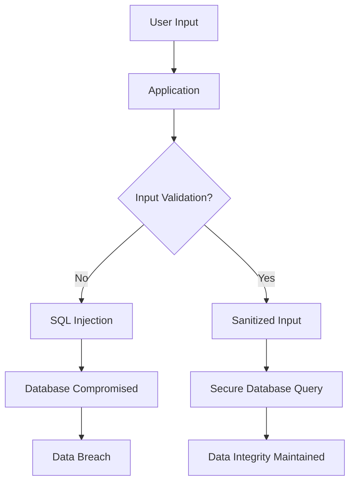

## 16.10 Case Studies: Security Breaches and Mitigations

In the ever-evolving landscape of software development, security remains a paramount concern. Lua, like any other programming language, is not immune to vulnerabilities. In this section, we delve into real-world case studies of security breaches in Lua applications, analyze the vulnerabilities that were exploited, and discuss the mitigations that were implemented. By understanding these incidents, we can better prepare ourselves to prevent similar issues in our own projects.

### Analyzing Real-World Incidents

#### Lessons from Breaches

Security breaches often serve as wake-up calls, highlighting vulnerabilities that were previously overlooked. Let's explore some notable incidents involving Lua applications and the lessons they imparted.

1. **Case Study: Insecure API Exposure**

   **Incident Overview:** A popular web application built with Lua exposed sensitive API endpoints without proper authentication mechanisms. This oversight allowed unauthorized users to access and manipulate data.

   **Vulnerability Analysis:** The root cause of this breach was the lack of authentication and authorization checks on critical API endpoints. Developers assumed that the endpoints would only be accessed by trusted clients, leading to a false sense of security.

   **Lessons Learned:**
   - **Implement Robust Authentication:** Always enforce authentication and authorization checks on all API endpoints, regardless of perceived trust levels.
   - **Use Secure Communication Channels:** Ensure that all data exchanges occur over secure channels like HTTPS to prevent interception.

2. **Case Study: SQL Injection in Lua Script**

   **Incident Overview:** A Lua-based application suffered a data breach due to an SQL injection vulnerability. Attackers exploited this flaw to execute arbitrary SQL commands, compromising the database.

   **Vulnerability Analysis:** The application directly concatenated user inputs into SQL queries without proper sanitization, allowing attackers to inject malicious SQL code.

   **Lessons Learned:**
   - **Sanitize User Inputs:** Always validate and sanitize user inputs before using them in SQL queries.
   - **Use Prepared Statements:** Employ prepared statements or parameterized queries to prevent SQL injection attacks.

3. **Case Study: Cross-Site Scripting (XSS) Attack**

   **Incident Overview:** An online Lua-based service was targeted by an XSS attack, where attackers injected malicious scripts into web pages viewed by other users.

   **Vulnerability Analysis:** The application failed to properly escape user-generated content before rendering it on web pages, allowing attackers to execute scripts in the context of other users' browsers.

   **Lessons Learned:**
   - **Escape Output:** Always escape user-generated content before displaying it in web pages to prevent XSS attacks.
   - **Content Security Policy (CSP):** Implement CSP headers to restrict the execution of unauthorized scripts.

### Preventative Measures

#### Implementing Fixes

Once vulnerabilities are identified, implementing effective fixes is crucial to safeguarding applications. Here are some strategies to enhance security in Lua applications:

1. **Secure Coding Practices**

   - **Input Validation:** Rigorously validate all user inputs to ensure they conform to expected formats and types.
   - **Error Handling:** Implement comprehensive error handling to prevent information leakage through error messages.

2. **Access Control**

   - **Principle of Least Privilege:** Grant users and processes only the permissions necessary to perform their tasks.
   - **Role-Based Access Control (RBAC):** Implement RBAC to manage permissions based on user roles.

3. **Data Protection**

   - **Encryption:** Use strong encryption algorithms to protect sensitive data both at rest and in transit.
   - **Secure Storage:** Store sensitive data in secure, encrypted formats to prevent unauthorized access.

#### Policy Changes

In addition to technical fixes, policy changes play a vital role in preventing future security breaches. Consider the following policy adjustments:

1. **Regular Security Training**

   - **Educate Developers:** Conduct regular security training sessions to keep developers informed about the latest threats and best practices.
   - **Security Awareness Programs:** Implement programs to raise awareness about security risks among all employees.

2. **Incident Response Planning**

   - **Develop Response Plans:** Create detailed incident response plans to ensure swift and effective action in the event of a breach.
   - **Conduct Drills:** Regularly conduct drills to test and refine incident response procedures.

### Continuous Improvement

#### Security Audits

Regular security audits are essential for identifying and addressing vulnerabilities before they can be exploited. Here's how to conduct effective audits:

1. **Automated Scanning**

   - **Use Security Tools:** Employ automated security scanning tools to identify common vulnerabilities in your codebase.
   - **Continuous Integration (CI):** Integrate security scans into your CI pipeline to catch issues early in the development process.

2. **Manual Code Reviews**

   - **Peer Reviews:** Conduct peer code reviews to identify potential security flaws that automated tools might miss.
   - **Security Experts:** Involve security experts in code reviews to leverage their specialized knowledge.

#### Staying Informed

The threat landscape is constantly evolving, making it crucial to stay informed about emerging threats and vulnerabilities. Here are some strategies:

1. **Subscribe to Security Bulletins**

   - **Follow Security Blogs:** Subscribe to reputable security blogs and newsletters to receive updates on the latest threats and vulnerabilities.
   - **Join Security Forums:** Participate in security forums and communities to exchange knowledge and experiences with peers.

2. **Monitor Vulnerability Databases**

   - **CVE Database:** Regularly check the Common Vulnerabilities and Exposures (CVE) database for new vulnerabilities affecting your technology stack.
   - **Vendor Advisories:** Monitor advisories from software vendors for security patches and updates.

### Use Cases and Examples

#### Retrospectives

Conducting retrospectives on past security incidents can provide valuable insights and guide future improvements. Here's how to conduct effective retrospectives:

1. **Analyze Root Causes**

   - **Identify Weaknesses:** Analyze the root causes of past breaches to identify weaknesses in your security posture.
   - **Document Lessons Learned:** Document the lessons learned from each incident to inform future security efforts.

2. **Implement Improvements**

   - **Actionable Recommendations:** Develop actionable recommendations based on retrospective findings to enhance security.
   - **Track Progress:** Monitor the implementation of recommendations and track progress over time.

#### Risk Assessment

Prioritizing security efforts based on potential impact is crucial for effective risk management. Here's how to conduct risk assessments:

1. **Identify Assets**

   - **Catalog Assets:** Create a comprehensive inventory of all assets, including hardware, software, and data.
   - **Assess Value:** Evaluate the value and importance of each asset to your organization.

2. **Evaluate Threats**

   - **Identify Threats:** Identify potential threats to each asset, considering both internal and external factors.
   - **Assess Likelihood:** Evaluate the likelihood of each threat materializing and its potential impact.

3. **Develop Mitigation Strategies**

   - **Prioritize Risks:** Prioritize risks based on their potential impact and likelihood.
   - **Implement Controls:** Develop and implement controls to mitigate identified risks.

### Try It Yourself

To reinforce your understanding of security breaches and mitigations, try experimenting with the following exercises:

1. **Simulate an SQL Injection Attack**

   - **Create a Vulnerable Script:** Write a simple Lua script that concatenates user inputs into an SQL query.
   - **Exploit the Vulnerability:** Attempt to exploit the vulnerability by injecting malicious SQL code.
   - **Implement Mitigations:** Apply input validation and prepared statements to secure the script.

2. **Implement an XSS Defense**

   - **Create a Web Page:** Develop a basic web page that displays user-generated content.
   - **Inject Malicious Scripts:** Attempt to inject malicious scripts into the page.
   - **Apply Escaping:** Implement output escaping to prevent XSS attacks.

3. **Conduct a Security Audit**

   - **Review Code:** Conduct a manual code review of a Lua application to identify potential security flaws.
   - **Use Security Tools:** Run automated security scans on the codebase to detect vulnerabilities.
   - **Document Findings:** Document the findings and develop a plan to address identified issues.

### Visualizing Security Concepts

To better understand the flow of security measures and potential vulnerabilities, let's visualize a typical security breach scenario and its mitigation using a flowchart.

**Diagram Description:** This flowchart illustrates the process of handling user inputs in an application. If input validation is not performed, it can lead to SQL injection and a potential data breach. Proper input validation and sanitization ensure secure database queries and maintain data integrity.

### References and Links

- [OWASP Top Ten](https://owasp.org/www-project-top-ten/): A list of the most critical web application security risks.
- [CVE Database](https://cve.mitre.org/): A database of publicly disclosed cybersecurity vulnerabilities.
- [NIST Cybersecurity Framework](https://www.nist.gov/cyberframework): A framework for improving critical infrastructure cybersecurity.

### Knowledge Check

Before moving on, take a moment to reflect on the key takeaways from this section:

- Understanding the root causes of security breaches is crucial for implementing effective mitigations.
- Regular security audits and staying informed about emerging threats are essential for maintaining a strong security posture.
- Conducting retrospectives and risk assessments helps prioritize security efforts and guide continuous improvement.

### Embrace the Journey

Remember, security is an ongoing journey, not a destination. As you continue to develop and maintain Lua applications, keep security at the forefront of your efforts. Stay curious, stay informed, and never stop learning. By doing so, you'll be well-equipped to protect your applications and users from potential threats.

## Quiz Time!



### What is a common cause of SQL injection vulnerabilities?

- [x] Concatenating user inputs into SQL queries without sanitization
- [ ] Using prepared statements
- [ ] Implementing input validation
- [ ] Employing parameterized queries

> **Explanation:** SQL injection vulnerabilities often arise from concatenating user inputs directly into SQL queries without proper sanitization or validation.

### Which of the following is a preventative measure against XSS attacks?

- [x] Escaping user-generated content before rendering it
- [ ] Disabling JavaScript in browsers
- [ ] Using HTTP instead of HTTPS
- [ ] Allowing all scripts to execute

> **Explanation:** Escaping user-generated content before rendering it on web pages is a key preventative measure against XSS attacks.

### What is the principle of least privilege?

- [x] Granting users only the permissions necessary to perform their tasks
- [ ] Allowing all users to have administrative access
- [ ] Disabling all security features
- [ ] Providing unrestricted access to all resources

> **Explanation:** The principle of least privilege involves granting users and processes only the permissions necessary to perform their tasks, minimizing potential security risks.

### Why is it important to conduct regular security audits?

- [x] To identify and address vulnerabilities before they can be exploited
- [ ] To increase the complexity of the codebase
- [ ] To reduce the need for security measures
- [ ] To eliminate the need for input validation

> **Explanation:** Regular security audits help identify and address vulnerabilities before they can be exploited, ensuring a strong security posture.

### What is a key benefit of using prepared statements in SQL queries?

- [x] They prevent SQL injection attacks
- [ ] They increase the complexity of queries
- [x] They separate query logic from data
- [ ] They allow for dynamic query generation

> **Explanation:** Prepared statements prevent SQL injection attacks by separating query logic from data, ensuring that user inputs are treated as data rather than executable code.

### How can security awareness programs benefit an organization?

- [x] By raising awareness about security risks among employees
- [ ] By eliminating the need for security measures
- [ ] By reducing the complexity of security protocols
- [ ] By allowing unrestricted access to resources

> **Explanation:** Security awareness programs educate employees about security risks, promoting a culture of security within the organization.

### What is the purpose of conducting retrospectives on past security incidents?

- [x] To analyze root causes and implement improvements
- [ ] To increase the complexity of security measures
- [x] To document lessons learned
- [ ] To eliminate the need for security audits

> **Explanation:** Retrospectives help analyze root causes of past incidents, document lessons learned, and implement improvements to enhance security.

### Why is it important to stay informed about emerging threats?

- [x] To adapt security measures to new vulnerabilities
- [ ] To increase the complexity of security protocols
- [ ] To reduce the need for security audits
- [ ] To eliminate the need for input validation

> **Explanation:** Staying informed about emerging threats allows organizations to adapt their security measures to address new vulnerabilities effectively.

### What is a key component of an effective incident response plan?

- [x] Detailed procedures for swift and effective action
- [ ] Disabling all security features
- [ ] Allowing unrestricted access to resources
- [ ] Eliminating the need for security audits

> **Explanation:** An effective incident response plan includes detailed procedures for swift and effective action in the event of a security breach.

### True or False: Encryption is only necessary for data in transit.

- [ ] True
- [x] False

> **Explanation:** Encryption is necessary for both data in transit and data at rest to ensure comprehensive data protection.


