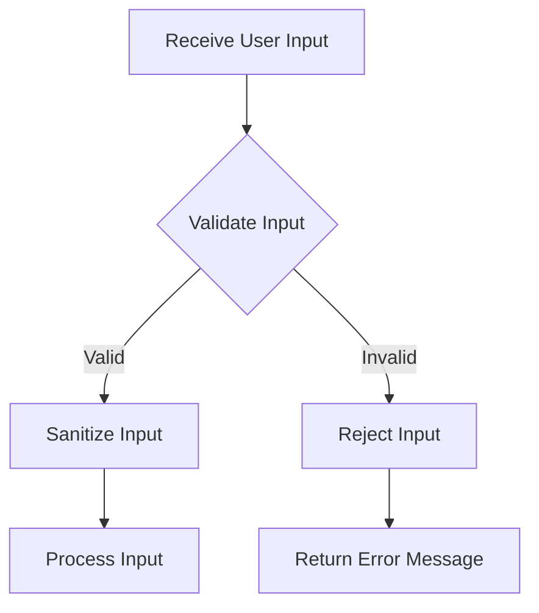

## 16.2 Input Validation and Sanitization

In the realm of software security, input validation and sanitization are critical practices that safeguard applications from malicious attacks. Lua, a versatile scripting language, is no exception when it comes to the need for robust input handling mechanisms. This section delves into the principles and techniques of input validation and sanitization in Lua, focusing on protecting against injection attacks such as SQL injection and code injection.

### Protecting Against Injection Attacks

Injection attacks are a prevalent threat in software applications, where an attacker provides untrusted input to manipulate the execution of a program. Common types of injection attacks include SQL injection, code injection, and command injection. These attacks can lead to unauthorized data access, data corruption, and even complete system compromise.

#### SQL Injection

SQL injection occurs when an attacker inserts or "injects" malicious SQL code into a query. This can lead to unauthorized access to or manipulation of the database. Consider the following example:

```lua
-- Vulnerable SQL query construction
local user_input = "1; DROP TABLE users;" -- Malicious input
local query = "SELECT * FROM users WHERE id = " .. user_input
```

In this example, the attacker can execute arbitrary SQL commands by manipulating the `user_input`.

#### Code Injection

Code injection involves inserting malicious code into a program, which is then executed by the application. This can occur in Lua scripts if user input is directly executed as code.

```lua
-- Vulnerable code execution
local user_input = "os.execute('rm -rf /')" -- Malicious input
load(user_input)()
```

In this scenario, the attacker can execute harmful system commands.

### Implementing Input Validation

Input validation is the process of ensuring that user input conforms to expected formats and values. It is the first line of defense against injection attacks.

#### Whitelist Approach

The whitelist approach involves accepting only known good inputs. This method is more secure than blacklisting, which attempts to block known bad inputs. By defining a set of acceptable values or patterns, you can prevent unexpected or harmful input.

```lua
-- Whitelist validation example
local function is_valid_input(input)
    local valid_inputs = { "1", "2", "3", "4", "5" }
    for _, v in ipairs(valid_inputs) do
        if input == v then
            return true
        end
    end
    return false
end

local user_input = "3"
if is_valid_input(user_input) then
    print("Valid input")
else
    print("Invalid input")
end
```

In this example, only inputs that match the predefined list are considered valid.

#### Regular Expressions

Regular expressions are powerful tools for validating input formats. Lua provides pattern matching capabilities that can be used to enforce input constraints.

```lua
-- Regular expression validation example
local function is_valid_email(email)
    local pattern = "^[%w._%+-]+@[%w.-]+%.[a-zA-Z]{2,4}$"
    return string.match(email, pattern) ~= nil
end

local email_input = "user@example.com"
if is_valid_email(email_input) then
    print("Valid email")
else
    print("Invalid email")
end
```

This code snippet uses a Lua pattern to validate email addresses, ensuring they conform to a standard format.

### Sanitizing Inputs

Sanitization involves cleaning input data to remove or neutralize harmful content. It complements validation by ensuring that even valid inputs cannot be used maliciously.

#### Escaping Special Characters

Escaping special characters is crucial when constructing database queries or executing system commands. This prevents attackers from injecting malicious code.

```lua
-- Escaping special characters for SQL queries
local function escape_sql(input)
    return input:gsub("'", "''")
end

local user_input = "O'Reilly"
local query = "SELECT * FROM books WHERE author = '" .. escape_sql(user_input) .. "'"
```

In this example, single quotes in the input are escaped to prevent SQL injection.

#### Removing Malicious Content

In addition to escaping, you may need to filter out harmful scripts or code from user input. This is especially important for web applications that process HTML or JavaScript.

```lua
-- Removing malicious content
local function sanitize_html(input)
    return input:gsub("<", "&lt;"):gsub(">", "&gt;")
end

local user_input = "<script>alert('Hacked!')</script>"
local safe_input = sanitize_html(user_input)
```

This code replaces HTML tags with their escaped equivalents, preventing script execution.

### Use Cases and Examples

#### Web Form Processing

Web forms are common sources of user input. Proper validation and sanitization are essential to prevent attacks.

```lua
-- Web form processing example
local function process_form(data)
    if not is_valid_email(data.email) then
        return "Invalid email address"
    end
    local safe_name = sanitize_html(data.name)
    -- Further processing...
end

local form_data = { email = "user@example.com", name = "<b>John</b>" }
process_form(form_data)
```

This example demonstrates secure handling of form data by validating email addresses and sanitizing names.

#### Command Execution

When building interfaces that execute system commands, it's vital to validate and sanitize inputs to prevent command injection.

```lua
-- Secure command execution example
local function execute_command(command)
    local safe_command = escape_sql(command) -- Example of escaping
    os.execute(safe_command)
end

local user_command = "ls -la"
execute_command(user_command)
```

By escaping special characters, you can mitigate the risk of executing unintended commands.

### Visualizing Input Validation and Sanitization

To better understand the flow of input validation and sanitization, let's visualize the process using a flowchart.



**Figure 1: Input Validation and Sanitization Process**

This flowchart illustrates the steps involved in handling user input, from validation to sanitization and processing.

### References and Links

For further reading on input validation and sanitization, consider the following resources:

- [OWASP Input Validation Cheat Sheet](https://cheatsheetseries.owasp.org/cheatsheets/Input_Validation_Cheat_Sheet.html)
- [Lua Patterns](https://www.lua.org/manual/5.1/manual.html#5.4.1)
- [SQL Injection Prevention](https://www.owasp.org/index.php/SQL_Injection_Prevention_Cheat_Sheet)

### Knowledge Check

To reinforce your understanding of input validation and sanitization, consider the following questions:

1. What are the key differences between input validation and sanitization?
2. How can regular expressions be used to validate input formats in Lua?
3. Why is escaping special characters important for preventing SQL injection?
4. What are some common use cases for input validation and sanitization in web applications?

### Embrace the Journey

Remember, mastering input validation and sanitization is a crucial step in building secure Lua applications. As you continue to explore these concepts, you'll develop a deeper understanding of how to protect your software from injection attacks. Keep experimenting, stay curious, and enjoy the journey!

## Quiz Time!



### What is the primary goal of input validation?

- [x] To ensure that user input conforms to expected formats and values
- [ ] To remove all user input
- [ ] To execute user input as code
- [ ] To store user input in a database

> **Explanation:** Input validation ensures that user input conforms to expected formats and values, preventing unexpected or harmful input.

### Which approach involves accepting only known good inputs?

- [x] Whitelist approach
- [ ] Blacklist approach
- [ ] Regular expression approach
- [ ] Escaping approach

> **Explanation:** The whitelist approach involves accepting only known good inputs, making it more secure than blacklisting.

### How can regular expressions be used in Lua?

- [x] To validate input formats
- [ ] To execute system commands
- [ ] To store data in a database
- [ ] To create user interfaces

> **Explanation:** Regular expressions can be used in Lua to validate input formats, ensuring they conform to expected patterns.

### What is the purpose of escaping special characters?

- [x] To prevent injection attacks
- [ ] To execute code
- [ ] To validate input
- [ ] To store data

> **Explanation:** Escaping special characters prevents injection attacks by neutralizing potentially harmful input.

### What is a common use case for input validation in web applications?

- [x] Web form processing
- [ ] Database storage
- [ ] System command execution
- [ ] User interface design

> **Explanation:** Web form processing is a common use case for input validation, as it involves handling user-submitted data.

### What is the result of failing to validate and sanitize input?

- [x] Increased risk of injection attacks
- [ ] Improved system performance
- [ ] Enhanced user experience
- [ ] Reduced code complexity

> **Explanation:** Failing to validate and sanitize input increases the risk of injection attacks, compromising application security.

### How does the whitelist approach differ from the blacklist approach?

- [x] Whitelist accepts only known good inputs, while blacklist blocks known bad inputs
- [ ] Whitelist blocks known bad inputs, while blacklist accepts only known good inputs
- [ ] Whitelist and blacklist are the same
- [ ] Whitelist is more secure than blacklist

> **Explanation:** The whitelist approach accepts only known good inputs, while the blacklist approach blocks known bad inputs.

### What is the role of sanitization in input handling?

- [x] To clean input data and remove harmful content
- [ ] To execute input data as code
- [ ] To store input data in a database
- [ ] To validate input data

> **Explanation:** Sanitization cleans input data and removes harmful content, complementing validation.

### Which Lua function can be used to replace HTML tags with escaped equivalents?

- [x] `gsub`
- [ ] `match`
- [ ] `find`
- [ ] `sub`

> **Explanation:** The `gsub` function can be used to replace HTML tags with escaped equivalents, preventing script execution.

### True or False: Input validation and sanitization are only necessary for web applications.

- [ ] True
- [x] False

> **Explanation:** Input validation and sanitization are necessary for all types of applications, not just web applications, to protect against injection attacks.


