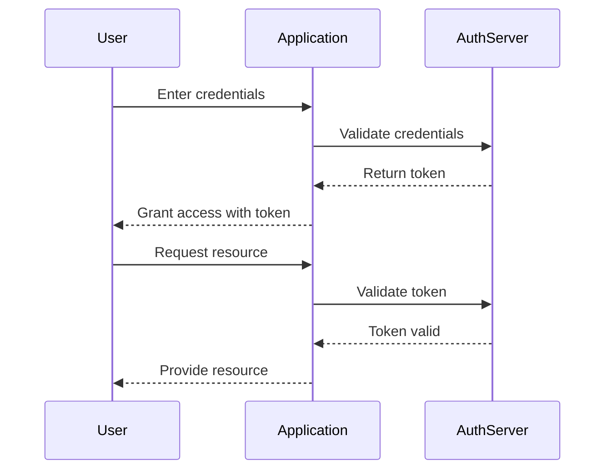

## 16.3 Authentication and Authorization Mechanisms

In the realm of software development, ensuring that users are who they claim to be and that they have the appropriate permissions to access resources is paramount. This section delves into the intricacies of implementing authentication and authorization mechanisms in Lua applications. We will explore various strategies, including password management, multi-factor authentication, and access control techniques such as Role-Based Access Control (RBAC) and Attribute-Based Access Control (ABAC).

### Ensuring User Identity and Access Control

Authentication and authorization are two fundamental concepts in securing applications. Let's break them down:

- **Authentication**: This is the process of verifying the identity of a user or system. It ensures that the entity trying to gain access is indeed who they claim to be.
- **Authorization**: Once authentication is successful, authorization determines what an authenticated user is allowed to do. It involves setting permissions and access rights based on user roles or attributes.

### Implementing Authentication in Lua

#### Password Management

Effective password management is crucial for securing user accounts. Here are some best practices:

1. **Hashing and Salting**: Never store passwords as plain text. Instead, use cryptographic hashing algorithms like SHA-256 or bcrypt to hash passwords. Salting involves adding a unique value to each password before hashing to prevent attacks like rainbow table attacks.

   ```lua
   local bcrypt = require("bcrypt")

   -- Hash a password
   local password = "user_password"
   local salt = bcrypt.salt(12)
   local hashed_password = bcrypt.digest(password, salt)

   -- Verify a password
   local is_valid = bcrypt.verify("user_password", hashed_password)
   print("Password is valid:", is_valid)
   ```

   > **Key Point**: Always use a strong, unique salt for each password to enhance security.

2. **Multi-Factor Authentication (MFA)**: Enhance security by requiring additional verification steps beyond passwords. This could include SMS codes, email verification, or authenticator apps.

   ```lua
   -- Example of a simple MFA check
   local function verify_mfa_code(user_input, actual_code)
       return user_input == actual_code
   end

   local user_input = "123456"
   local actual_code = "123456"
   print("MFA verification:", verify_mfa_code(user_input, actual_code))
   ```

   > **Try It Yourself**: Modify the MFA example to include a time-based one-time password (TOTP) using a library like `lua-resty-totp`.

### Authorization Techniques

Authorization ensures that authenticated users have the appropriate permissions. Let's explore two common models:

#### Role-Based Access Control (RBAC)

RBAC assigns permissions to roles rather than individual users. Users are then assigned roles, simplifying permission management.

```lua
local roles = {
    admin = {"read", "write", "delete"},
    user = {"read", "write"},
    guest = {"read"}
}

local function check_permission(role, action)
    local permissions = roles[role]
    for _, permission in ipairs(permissions) do
        if permission == action then
            return true
        end
    end
    return false
end

print("Admin can delete:", check_permission("admin", "delete"))
print("User can delete:", check_permission("user", "delete"))
```

> **Key Point**: RBAC is effective for systems with well-defined roles and permissions.

#### Attribute-Based Access Control (ABAC)

ABAC provides fine-grained access control based on user attributes, environment conditions, and resource attributes.

```lua
local function check_access(user_attributes, resource_attributes)
    if user_attributes.role == "admin" or user_attributes.department == resource_attributes.department then
        return true
    end
    return false
end

local user_attributes = {role = "user", department = "sales"}
local resource_attributes = {department = "sales"}
print("Access granted:", check_access(user_attributes, resource_attributes))
```

> **Try It Yourself**: Extend the ABAC example to include time-based conditions or location-based access.

### Use Cases and Examples

#### Secure APIs

When building APIs, it's crucial to restrict access to endpoints based on user roles or attributes. This can be achieved by integrating authentication and authorization checks in your API handlers.

```lua
local function api_handler(request)
    local user_role = request.user.role
    if not check_permission(user_role, "access_api") then
        return {status = 403, message = "Forbidden"}
    end
    -- Proceed with API logic
    return {status = 200, message = "Success"}
end
```

> **Key Point**: Always validate user permissions before processing API requests.

#### User Account Systems

Building robust login mechanisms involves combining authentication and authorization techniques. Here's a simple example of a login function:

```lua
local users = {
    ["user1"] = {password = bcrypt.digest("password1", bcrypt.salt(12)), role = "user"},
    ["admin"] = {password = bcrypt.digest("adminpass", bcrypt.salt(12)), role = "admin"}
}

local function login(username, password)
    local user = users[username]
    if user and bcrypt.verify(password, user.password) then
        return {status = "success", role = user.role}
    end
    return {status = "failure", message = "Invalid credentials"}
end

local login_result = login("user1", "password1")
print("Login status:", login_result.status)
```

> **Try It Yourself**: Enhance the login system to include MFA and session management.

### Visualizing Authentication and Authorization Flow

To better understand the flow of authentication and authorization, let's visualize the process using a sequence diagram:



> **Diagram Explanation**: This diagram illustrates the interaction between a user, an application, and an authentication server during the authentication and authorization process.

### References and Links

- [OWASP Authentication Cheat Sheet](https://cheatsheetseries.owasp.org/cheatsheets/Authentication_Cheat_Sheet.html)
- [NIST Digital Identity Guidelines](https://pages.nist.gov/800-63-3/)
- [Lua bcrypt Library](https://github.com/jeremyong/lua-bcrypt)

### Knowledge Check

- What is the difference between authentication and authorization?
- How does salting enhance password security?
- What are the benefits of using RBAC over ABAC?

### Embrace the Journey

Remember, implementing robust authentication and authorization mechanisms is a continuous process. As you progress, you'll encounter new challenges and opportunities to enhance security. Keep experimenting, stay curious, and enjoy the journey!

## Quiz Time!



### What is the primary purpose of authentication?

- [x] Verifying user identity
- [ ] Granting access to resources
- [ ] Managing user roles
- [ ] Encrypting data

> **Explanation:** Authentication is the process of verifying the identity of a user or system.

### Which technique is used to enhance password security by adding a unique value before hashing?

- [x] Salting
- [ ] Encryption
- [ ] Tokenization
- [ ] Obfuscation

> **Explanation:** Salting involves adding a unique value to each password before hashing to prevent attacks like rainbow table attacks.

### What is the main advantage of Role-Based Access Control (RBAC)?

- [x] Simplifies permission management by assigning permissions to roles
- [ ] Provides fine-grained access control based on attributes
- [ ] Requires multi-factor authentication
- [ ] Encrypts user data

> **Explanation:** RBAC assigns permissions to roles, simplifying permission management.

### In the context of authorization, what does ABAC stand for?

- [x] Attribute-Based Access Control
- [ ] Access-Based Attribute Control
- [ ] Authentication-Based Access Control
- [ ] Attribute-Based Authentication Control

> **Explanation:** ABAC stands for Attribute-Based Access Control, which provides fine-grained access control based on attributes.

### Which of the following is an example of multi-factor authentication?

- [x] SMS code verification
- [ ] Password hashing
- [ ] Role assignment
- [ ] Data encryption

> **Explanation:** Multi-factor authentication involves additional verification steps beyond passwords, such as SMS code verification.

### What should be done before processing API requests to ensure security?

- [x] Validate user permissions
- [ ] Encrypt all data
- [ ] Assign user roles
- [ ] Log user activity

> **Explanation:** Always validate user permissions before processing API requests to ensure security.

### Which library can be used in Lua for password hashing?

- [x] bcrypt
- [ ] OpenSSL
- [ ] JWT
- [ ] OAuth

> **Explanation:** The bcrypt library can be used in Lua for password hashing.

### What is the purpose of a sequence diagram in the context of authentication and authorization?

- [x] To visualize the interaction between components during the process
- [ ] To encrypt user data
- [ ] To assign user roles
- [ ] To validate user credentials

> **Explanation:** A sequence diagram visualizes the interaction between components during the authentication and authorization process.

### What is the role of an authentication server in the authentication process?

- [x] Validate credentials and issue tokens
- [ ] Encrypt user data
- [ ] Assign user roles
- [ ] Log user activity

> **Explanation:** The authentication server validates credentials and issues tokens during the authentication process.

### True or False: Authorization determines what an authenticated user is allowed to do.

- [x] True
- [ ] False

> **Explanation:** Authorization determines what an authenticated user is allowed to do by setting permissions and access rights.


