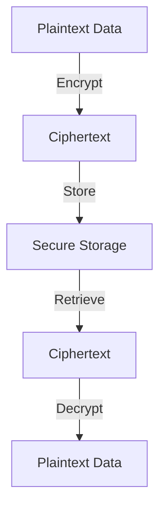

## 16.4 Encrypting Data and Secure Storage

In today's digital landscape, protecting sensitive data is paramount. Whether it's safeguarding user information, securing communications, or ensuring data integrity, encryption plays a crucial role. In this section, we will delve into the principles of encrypting data and secure storage, focusing on how these can be effectively implemented in Lua applications.

### Protecting Data at Rest and in Transit

Data protection involves securing data both at rest (stored data) and in transit (data being transmitted). Encryption is a key technique used to achieve this protection.

#### Encryption Fundamentals

Encryption is the process of converting plaintext into ciphertext, making it unreadable to unauthorized users. There are two primary types of encryption:

- **Symmetric Encryption**: Uses the same key for both encryption and decryption. It's fast and suitable for encrypting large amounts of data.
- **Asymmetric Encryption**: Uses a pair of keys—a public key for encryption and a private key for decryption. It's more secure for transmitting data over unsecured channels.

Let's explore these concepts further.

##### Symmetric Encryption

Symmetric encryption is efficient and widely used for encrypting data at rest. One of the most popular symmetric encryption algorithms is the Advanced Encryption Standard (AES).

**Example: Symmetric Encryption with AES in Lua**

```lua
local openssl = require("openssl")
local cipher = openssl.cipher.get("aes-256-cbc")

-- Key and initialization vector (IV) must be 32 and 16 bytes respectively
local key = "0123456789abcdef0123456789abcdef"
local iv = "abcdef9876543210"

-- Encrypting data
local function encrypt(data)
    local encrypted = cipher:encrypt(data, key, iv)
    return openssl.base64(encrypted)
end

-- Decrypting data
local function decrypt(encrypted_data)
    local decoded_data = openssl.base64(encrypted_data)
    return cipher:decrypt(decoded_data, key, iv)
end

local data = "Sensitive information"
local encrypted_data = encrypt(data)
print("Encrypted:", encrypted_data)

local decrypted_data = decrypt(encrypted_data)
print("Decrypted:", decrypted_data)
```

In this example, we use the OpenSSL library to perform AES encryption and decryption. The key and IV must be securely managed to ensure data confidentiality.

##### Asymmetric Encryption

Asymmetric encryption is ideal for secure communications, where data needs to be encrypted by one party and decrypted by another. RSA is a widely used asymmetric encryption algorithm.

**Example: Asymmetric Encryption with RSA in Lua**

```lua
local openssl = require("openssl")
local rsa = openssl.pkey.new({type="rsa", bits=2048})

-- Generate public and private keys
local public_key = rsa:export("public")
local private_key = rsa:export("private")

-- Encrypting data with the public key
local function encrypt(data, pub_key)
    local encrypted = openssl.pkey.encrypt(pub_key, data)
    return openssl.base64(encrypted)
end

-- Decrypting data with the private key
local function decrypt(encrypted_data, priv_key)
    local decoded_data = openssl.base64(encrypted_data)
    return openssl.pkey.decrypt(priv_key, decoded_data)
end

local data = "Confidential message"
local encrypted_data = encrypt(data, public_key)
print("Encrypted:", encrypted_data)

local decrypted_data = decrypt(encrypted_data, private_key)
print("Decrypted:", decrypted_data)
```

In this example, we generate RSA keys and use them to encrypt and decrypt data. The public key is used for encryption, while the private key is used for decryption.

##### Hash Functions

Hash functions are used to ensure data integrity. They produce a fixed-size hash value from input data, which can be used to verify the data's authenticity.

**Example: Hashing with SHA-256 in Lua**

```lua
local openssl = require("openssl")
local digest = openssl.digest.get("sha256")

local function hash(data)
    return openssl.base64(digest:digest(data))
end

local data = "Important data"
local hash_value = hash(data)
print("Hash:", hash_value)
```

In this example, we use the SHA-256 hash function to generate a hash value for the given data. Hash values are commonly used in digital signatures and data verification.

### Secure Storage Practices

Secure storage involves protecting data stored on disk or in databases. This includes managing cryptographic keys and ensuring that sensitive files are encrypted.

#### Key Management

Key management is critical in encryption. Keys must be stored securely and accessed only by authorized entities.

- **Key Storage**: Use secure storage solutions, such as hardware security modules (HSMs) or encrypted key vaults, to store cryptographic keys.
- **Key Rotation**: Regularly rotate keys to minimize the risk of key compromise.
- **Access Control**: Implement strict access controls to ensure that only authorized personnel can access keys.

#### Secure File Handling

When dealing with sensitive files, it's important to encrypt them to prevent unauthorized access.

**Example: Secure File Encryption in Lua**

```lua
local openssl = require("openssl")
local cipher = openssl.cipher.get("aes-256-cbc")

local key = "0123456789abcdef0123456789abcdef"
local iv = "abcdef9876543210"

-- Encrypt a file
local function encrypt_file(input_file, output_file)
    local file = io.open(input_file, "rb")
    local data = file:read("*all")
    file:close()

    local encrypted_data = cipher:encrypt(data, key, iv)
    local encrypted_file = io.open(output_file, "wb")
    encrypted_file:write(encrypted_data)
    encrypted_file:close()
end

-- Decrypt a file
local function decrypt_file(input_file, output_file)
    local file = io.open(input_file, "rb")
    local encrypted_data = file:read("*all")
    file:close()

    local decrypted_data = cipher:decrypt(encrypted_data, key, iv)
    local decrypted_file = io.open(output_file, "wb")
    decrypted_file:write(decrypted_data)
    decrypted_file:close()
end

encrypt_file("sensitive.txt", "encrypted.dat")
decrypt_file("encrypted.dat", "decrypted.txt")
```

In this example, we encrypt and decrypt files using AES. Ensure that the key and IV are securely managed.

### Use Cases and Examples

Encryption is used in various scenarios to protect data and ensure secure communications.

#### Secure Communications

Encrypting network transmissions is essential to protect data in transit. This can be achieved using protocols like TLS (Transport Layer Security).

- **TLS**: Use TLS to encrypt data transmitted over networks, ensuring confidentiality and integrity.
- **VPNs**: Implement Virtual Private Networks (VPNs) to secure communications between remote systems.

#### Data Storage

Protecting databases and configuration files is crucial to prevent data breaches.

- **Database Encryption**: Encrypt sensitive data stored in databases to protect it from unauthorized access.
- **Configuration Files**: Encrypt configuration files containing sensitive information, such as API keys or passwords.

### Visualizing Encryption and Secure Storage

To better understand the encryption process and secure storage practices, let's visualize the flow of data encryption and decryption.



**Diagram Description**: This flowchart illustrates the process of encrypting plaintext data into ciphertext, storing it securely, retrieving it, and decrypting it back into plaintext.

### References and Links

For further reading on encryption and secure storage, consider the following resources:

- [OpenSSL Documentation](https://www.openssl.org/docs/)
- [MDN Web Docs on Encryption](https://developer.mozilla.org/en-US/docs/Web/Security)
- [OWASP Cryptographic Storage Cheat Sheet](https://cheatsheetseries.owasp.org/cheatsheets/Cryptographic_Storage_Cheat_Sheet.html)

### Knowledge Check

To reinforce your understanding of encrypting data and secure storage, consider the following questions:

- What are the differences between symmetric and asymmetric encryption?
- How can you ensure secure key management in your applications?
- What are some common use cases for encryption in software development?

### Embrace the Journey

Remember, mastering encryption and secure storage is a continuous journey. As you progress, you'll encounter new challenges and opportunities to enhance your skills. Keep experimenting, stay curious, and enjoy the journey!

## Quiz Time!



### What is the primary difference between symmetric and asymmetric encryption?

- [x] Symmetric encryption uses the same key for encryption and decryption, while asymmetric encryption uses a pair of keys.
- [ ] Symmetric encryption is slower than asymmetric encryption.
- [ ] Asymmetric encryption uses the same key for encryption and decryption, while symmetric encryption uses a pair of keys.
- [ ] Symmetric encryption is more secure than asymmetric encryption.

> **Explanation:** Symmetric encryption uses the same key for both encryption and decryption, whereas asymmetric encryption uses a public key for encryption and a private key for decryption.

### Which algorithm is commonly used for symmetric encryption?

- [x] AES
- [ ] RSA
- [ ] SHA-256
- [ ] MD5

> **Explanation:** AES (Advanced Encryption Standard) is a widely used algorithm for symmetric encryption.

### What is the purpose of a hash function?

- [x] To ensure data integrity by producing a fixed-size hash value.
- [ ] To encrypt data for secure storage.
- [ ] To decrypt data for secure communication.
- [ ] To generate random numbers for cryptographic purposes.

> **Explanation:** Hash functions produce a fixed-size hash value from input data, which can be used to verify the data's integrity.

### Why is key management important in encryption?

- [x] To ensure that cryptographic keys are stored securely and accessed only by authorized entities.
- [ ] To increase the speed of encryption and decryption processes.
- [ ] To generate random keys for encryption.
- [ ] To reduce the size of encrypted data.

> **Explanation:** Key management is crucial to protect cryptographic keys from unauthorized access and ensure data security.

### What is the role of TLS in secure communications?

- [x] To encrypt data transmitted over networks, ensuring confidentiality and integrity.
- [ ] To decrypt data stored in databases.
- [ ] To generate hash values for data verification.
- [ ] To manage cryptographic keys securely.

> **Explanation:** TLS (Transport Layer Security) encrypts data transmitted over networks, providing confidentiality and integrity.

### How can you protect sensitive files in your application?

- [x] By encrypting them using a secure encryption algorithm.
- [ ] By storing them in a public directory.
- [ ] By compressing them to reduce size.
- [ ] By renaming them to obscure their contents.

> **Explanation:** Encrypting sensitive files ensures that they are protected from unauthorized access.

### What is the advantage of using asymmetric encryption for secure communications?

- [x] It allows secure data transmission between parties without sharing a secret key.
- [ ] It is faster than symmetric encryption.
- [ ] It uses the same key for encryption and decryption.
- [ ] It is easier to implement than symmetric encryption.

> **Explanation:** Asymmetric encryption uses a public key for encryption and a private key for decryption, allowing secure communication without sharing a secret key.

### Which of the following is a best practice for key management?

- [x] Regularly rotate cryptographic keys to minimize the risk of key compromise.
- [ ] Store keys in plaintext files for easy access.
- [ ] Share keys with all team members to ensure availability.
- [ ] Use the same key for all encryption tasks to simplify management.

> **Explanation:** Regularly rotating cryptographic keys helps minimize the risk of key compromise and enhances security.

### What is the purpose of encrypting data at rest?

- [x] To protect stored data from unauthorized access.
- [ ] To speed up data retrieval processes.
- [ ] To reduce the size of stored data.
- [ ] To ensure data integrity during transmission.

> **Explanation:** Encrypting data at rest protects stored data from unauthorized access and potential breaches.

### True or False: Hash functions can be used to encrypt data.

- [ ] True
- [x] False

> **Explanation:** Hash functions are not used for encryption; they are used to produce a fixed-size hash value for data integrity verification.


