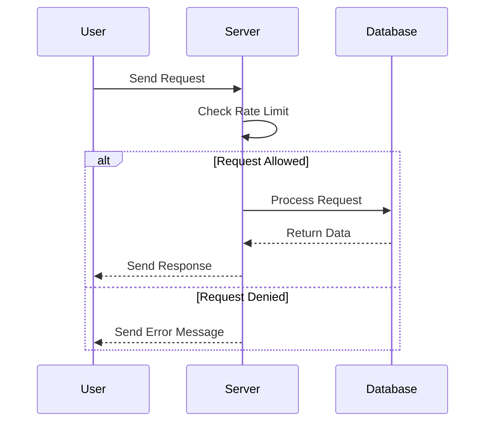

## 16.5 Protecting Against Common Vulnerabilities

In today's digital landscape, securing applications against vulnerabilities is paramount. Lua, being a versatile and lightweight scripting language, is often used in various applications, from embedded systems to web development. However, like any other language, Lua applications can be susceptible to common vulnerabilities if not properly secured. In this section, we will explore potential threats, implement security measures, and discuss security testing techniques to protect Lua applications.

### Understanding Potential Threats

#### Buffer Overflows

Buffer overflows occur when a program writes more data to a buffer than it can hold, potentially leading to arbitrary code execution. While Lua itself is immune to buffer overflows due to its dynamic nature, Lua applications using C extensions can be vulnerable.

**Example of a Buffer Overflow in C:**

```c
#include <string.h>
#include <stdio.h>

void vulnerableFunction(char *input) {
    char buffer[10];
    strcpy(buffer, input); // Potential buffer overflow
}

int main() {
    char *input = "This is a very long input string";
    vulnerableFunction(input);
    return 0;
}
```

**Mitigation Strategies:**

- **Use Safe Functions**: Replace unsafe functions like `strcpy` with safer alternatives like `strncpy`.
- **Bounds Checking**: Always check the length of the input before copying it into a buffer.
- **Use LuaJIT FFI**: When interfacing with C, use LuaJIT's Foreign Function Interface (FFI) to minimize risks.

#### Cross-Site Scripting (XSS)

XSS attacks occur when an attacker injects malicious scripts into web pages viewed by other users. Lua-based web applications, especially those using Lua for server-side scripting, can be vulnerable to XSS if user inputs are not properly sanitized.

**Mitigation Strategies:**

- **Input Sanitization**: Always sanitize user inputs to remove or escape potentially harmful characters.
- **Output Encoding**: Encode outputs to ensure that any HTML or JavaScript content is treated as data, not executable code.
- **Use Libraries**: Utilize libraries that provide built-in protection against XSS.

#### Denial of Service (DoS)

DoS attacks aim to make a service unavailable by overwhelming it with requests. Lua applications, especially those running on web servers, can be targets of DoS attacks.

**Mitigation Strategies:**

- **Rate Limiting**: Limit the number of requests a user can make in a given time frame.
- **Resource Management**: Monitor and manage resources to prevent exhaustion.
- **Use Asynchronous I/O**: Implement asynchronous I/O to handle multiple requests efficiently.

### Implementing Security Measures

#### Input Throttling

Input throttling is a technique used to limit the rate of input to prevent abuse. This is particularly useful in preventing DoS attacks.

**Example of Input Throttling in Lua:**

```lua
local request_count = {}
local MAX_REQUESTS = 100
local TIME_WINDOW = 60 -- seconds

function is_request_allowed(user_id)
    local current_time = os.time()
    if not request_count[user_id] then
        request_count[user_id] = {count = 0, timestamp = current_time}
    end

    local user_data = request_count[user_id]
    if current_time - user_data.timestamp > TIME_WINDOW then
        user_data.count = 0
        user_data.timestamp = current_time
    end

    if user_data.count < MAX_REQUESTS then
        user_data.count = user_data.count + 1
        return true
    else
        return false
    end
end
```

**Try It Yourself**: Modify the `MAX_REQUESTS` and `TIME_WINDOW` values to see how they affect the rate limiting.

#### Content Security Policies

Content Security Policies (CSP) define allowed content sources, helping to prevent XSS attacks by restricting the execution of unauthorized scripts.

**Example of a CSP Header:**

```lua
local function set_csp_header()
    ngx.header["Content-Security-Policy"] = "default-src 'self'; script-src 'self' https://trusted.cdn.com"
end
```

**Explanation**: This CSP allows scripts only from the same origin and a trusted CDN.

### Security Testing

#### Vulnerability Scanning

Vulnerability scanning involves using tools to identify weaknesses in an application. These tools can scan for known vulnerabilities and provide reports on potential security issues.

**Popular Vulnerability Scanners**:

- **OWASP ZAP**: An open-source tool for finding vulnerabilities in web applications.
- **Nessus**: A comprehensive vulnerability scanner for various platforms.

#### Penetration Testing

Penetration testing simulates attacks to test an application's defenses. It involves ethical hacking to identify and fix vulnerabilities before they can be exploited.

**Steps in Penetration Testing**:

1. **Planning**: Define the scope and objectives of the test.
2. **Scanning**: Use tools to gather information about the target.
3. **Exploitation**: Attempt to exploit identified vulnerabilities.
4. **Reporting**: Document findings and provide recommendations for remediation.

### Use Cases and Examples

#### Web Application Hardening

Web application hardening involves strengthening security in web services to protect against common vulnerabilities.

**Example of Web Application Hardening in Lua**:

```lua
local function sanitize_input(input)
    return input:gsub("[<>]", "") -- Remove potentially harmful characters
end

local function handle_request(request)
    local sanitized_input = sanitize_input(request.input)
    -- Process the sanitized input
end
```

**Explanation**: This example demonstrates input sanitization to prevent XSS attacks.

#### API Protection

API protection involves implementing measures like rate limiting and abuse prevention to secure APIs.

**Example of API Rate Limiting in Lua**:

```lua
local api_requests = {}
local MAX_API_REQUESTS = 50
local API_TIME_WINDOW = 60 -- seconds

function is_api_request_allowed(api_key)
    local current_time = os.time()
    if not api_requests[api_key] then
        api_requests[api_key] = {count = 0, timestamp = current_time}
    end

    local api_data = api_requests[api_key]
    if current_time - api_data.timestamp > API_TIME_WINDOW then
        api_data.count = 0
        api_data.timestamp = current_time
    end

    if api_data.count < MAX_API_REQUESTS then
        api_data.count = api_data.count + 1
        return true
    else
        return false
    end
end
```

**Try It Yourself**: Experiment with different `MAX_API_REQUESTS` and `API_TIME_WINDOW` values to see how they impact API usage.

### Visualizing Security Concepts

To better understand the flow of security measures in a Lua application, let's visualize the process using a sequence diagram.



**Diagram Explanation**: This sequence diagram illustrates how a server checks the rate limit before processing a request and either processes the request or denies it based on the rate limit.

### References and Links

- [OWASP Top Ten](https://owasp.org/www-project-top-ten/): A list of the top ten web application security risks.
- [NIST Vulnerability Database](https://nvd.nist.gov/): A comprehensive database of known vulnerabilities.
- [LuaJIT FFI Documentation](http://luajit.org/ext_ffi.html): Documentation on using LuaJIT's Foreign Function Interface.

### Knowledge Check

- **Question**: What is a buffer overflow, and how can it be mitigated in Lua applications using C extensions?
- **Exercise**: Implement a simple Lua script that uses input throttling to limit the number of requests a user can make.

### Embrace the Journey

Remember, securing your Lua applications is an ongoing process. As you continue to develop and deploy applications, stay informed about the latest security threats and best practices. Keep experimenting, stay curious, and enjoy the journey of building secure and robust Lua applications!

## Quiz Time!



### What is a buffer overflow?

- [x] A condition where more data is written to a buffer than it can hold
- [ ] A method of encrypting data
- [ ] A technique for optimizing memory usage
- [ ] A way to manage input throttling

> **Explanation:** A buffer overflow occurs when a program writes more data to a buffer than it can hold, potentially leading to arbitrary code execution.

### How can XSS attacks be mitigated in Lua-based web applications?

- [x] Input sanitization and output encoding
- [ ] Using LuaJIT FFI
- [ ] Implementing asynchronous I/O
- [ ] Rate limiting

> **Explanation:** XSS attacks can be mitigated by sanitizing user inputs and encoding outputs to ensure that any HTML or JavaScript content is treated as data, not executable code.

### What is the purpose of input throttling?

- [x] To limit the rate of input to prevent abuse
- [ ] To encrypt sensitive data
- [ ] To optimize memory usage
- [ ] To manage resource exhaustion

> **Explanation:** Input throttling is used to limit the rate of input to prevent abuse, such as DoS attacks.

### Which tool is commonly used for vulnerability scanning?

- [x] OWASP ZAP
- [ ] LuaJIT
- [ ] LuaSQL
- [ ] LuaPy

> **Explanation:** OWASP ZAP is a popular open-source tool for finding vulnerabilities in web applications.

### What is the role of Content Security Policies (CSP)?

- [x] To define allowed content sources and prevent XSS attacks
- [ ] To encrypt data in transit
- [ ] To manage API rate limiting
- [ ] To optimize performance

> **Explanation:** Content Security Policies (CSP) define allowed content sources, helping to prevent XSS attacks by restricting the execution of unauthorized scripts.

### What is penetration testing?

- [x] Simulating attacks to test an application's defenses
- [ ] Encrypting sensitive data
- [ ] Implementing input throttling
- [ ] Managing resource exhaustion

> **Explanation:** Penetration testing involves simulating attacks to test an application's defenses, identifying and fixing vulnerabilities before they can be exploited.

### How can API protection be implemented?

- [x] Rate limiting and abuse prevention
- [ ] Using LuaJIT FFI
- [ ] Implementing asynchronous I/O
- [ ] Input sanitization

> **Explanation:** API protection involves implementing measures like rate limiting and abuse prevention to secure APIs.

### What is the purpose of a sequence diagram in security?

- [x] To visualize the flow of security measures in an application
- [ ] To encrypt data in transit
- [ ] To manage API rate limiting
- [ ] To optimize performance

> **Explanation:** A sequence diagram is used to visualize the flow of security measures in an application, illustrating how requests are processed and either allowed or denied based on security checks.

### What is the OWASP Top Ten?

- [x] A list of the top ten web application security risks
- [ ] A database of known vulnerabilities
- [ ] A tool for vulnerability scanning
- [ ] A method for encrypting data

> **Explanation:** The OWASP Top Ten is a list of the top ten web application security risks, providing guidance on how to mitigate them.

### True or False: Lua applications are immune to buffer overflows.

- [ ] True
- [x] False

> **Explanation:** While Lua itself is immune to buffer overflows due to its dynamic nature, Lua applications using C extensions can be vulnerable.


