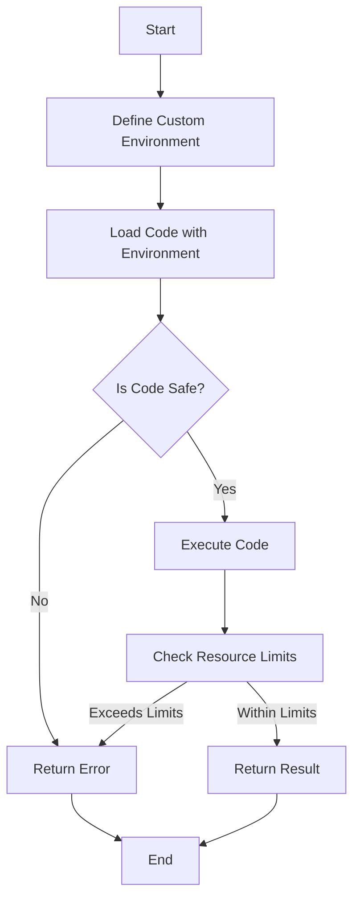

## 16.6 Implementing Sandboxes for Untrusted Code

In the realm of software development, executing untrusted code safely is a critical concern. Lua, with its lightweight and embeddable nature, is often used in environments where security is paramount. This section delves into the intricacies of implementing sandboxes for untrusted code in Lua, ensuring that you can execute such code without compromising the integrity of your system.

### Executing Untrusted Code Safely

#### Sandboxing Concepts

Sandboxing is a security mechanism used to restrict the execution environment of code. The primary goal is to isolate the code from the host system, preventing it from performing unauthorized actions. In Lua, sandboxing involves creating a controlled environment where scripts can run with limited access to system resources and functions.

- **Isolation**: The sandbox environment is isolated from the host environment, meaning that the code running within the sandbox cannot access or modify the host system's resources.
- **Controlled Access**: Only specific functions and resources are made available to the sandboxed code, reducing the risk of malicious actions.
- **Resource Management**: The sandbox can limit the resources (such as CPU time and memory) that the code can consume, preventing denial-of-service attacks.

### Building a Lua Sandbox

Building a sandbox in Lua involves creating a custom environment where the untrusted code can execute safely. This requires defining a limited global scope and restricting access to potentially dangerous functions.

#### Custom Environments

In Lua, the global environment is where all global variables and functions reside. By creating a custom environment, you can control what the untrusted code can access.

```lua
-- Define a custom environment
local sandbox_env = {
    print = print,  -- Allow access to the print function
    math = math,    -- Allow access to the math library
    string = string -- Allow access to the string library
}

-- Function to execute code in a sandbox
function execute_in_sandbox(code)
    local func, err = load(code, "sandbox", "t", sandbox_env)
    if not func then
        return nil, err
    end
    return pcall(func)
end

-- Example usage
local code = [[
    print("Hello from the sandbox!")
    return math.sqrt(16)
]]

local success, result = execute_in_sandbox(code)
if success then
    print("Result:", result)
else
    print("Error:", result)
end
```

In this example, we define a `sandbox_env` table that includes only the `print`, `math`, and `string` libraries. The `execute_in_sandbox` function loads and executes the code within this restricted environment.

#### Restricted Functions

To enhance security, it's crucial to prevent access to functions that could compromise the system, such as `os.execute` or `io.open`. By not including these functions in the `sandbox_env`, we effectively restrict their usage.

```lua
-- Restricted environment without dangerous functions
local restricted_env = {
    print = print,
    math = math,
    string = string
    -- Note: No os or io functions included
}
```

### Resource Limitation

Limiting resources is another essential aspect of sandboxing. This includes setting execution timeouts and memory usage limits to prevent abuse.

#### Execution Time

To prevent infinite loops or long-running scripts from consuming excessive CPU time, you can set execution timeouts.

```lua
-- Example of setting a timeout using coroutines
local function run_with_timeout(code, timeout)
    local co = coroutine.create(function()
        local func, err = load(code, "sandbox", "t", sandbox_env)
        if not func then
            return nil, err
        end
        return pcall(func)
    end)

    local start_time = os.time()
    while coroutine.status(co) ~= "dead" do
        if os.time() - start_time > timeout then
            return false, "Execution timeout"
        end
        coroutine.resume(co)
    end

    return coroutine.yield(co)
end

-- Example usage
local success, result = run_with_timeout(code, 5)
if success then
    print("Result:", result)
else
    print("Error:", result)
end
```

In this example, we use Lua's coroutine mechanism to periodically check the execution time and terminate the script if it exceeds the specified timeout.

#### Memory Usage

Limiting memory usage can be more challenging, as Lua does not provide built-in mechanisms for this. However, you can monitor memory usage and terminate the script if it exceeds a certain threshold.

```lua
-- Example of monitoring memory usage
local function check_memory_limit(limit)
    if collectgarbage("count") > limit then
        error("Memory limit exceeded")
    end
end

-- Insert memory check in the sandboxed code
local sandbox_code = [[
    check_memory_limit(1024)  -- Limit to 1MB
    -- Your code here
]]
```

### Use Cases and Examples

#### Plugin Systems

In plugin systems, users can extend the functionality of an application by writing custom scripts. Sandboxing ensures that these scripts cannot perform malicious actions.

```lua
-- Plugin system example
local plugin_env = {
    print = print,
    -- Other safe functions
}

function load_plugin(plugin_code)
    local func, err = load(plugin_code, "plugin", "t", plugin_env)
    if not func then
        return nil, err
    end
    return pcall(func)
end
```

#### Educational Tools

Educational tools often allow users to submit code for execution. Sandboxing provides a safe environment for running user-submitted code without risking the host system.

```lua
-- Educational tool example
local student_code = [[
    print("Hello, world!")
    -- More student code
]]

local success, result = execute_in_sandbox(student_code)
if success then
    print("Student code executed successfully")
else
    print("Error in student code:", result)
end
```

### Visualizing Sandboxing in Lua

To better understand how sandboxing works in Lua, let's visualize the process using a flowchart.



This flowchart illustrates the steps involved in executing untrusted code within a sandbox. It starts by defining a custom environment, loading the code with this environment, checking if the code is safe, executing it, and finally checking resource limits.

### Try It Yourself

To gain hands-on experience with sandboxing in Lua, try modifying the code examples provided. Experiment with different environments, add or remove functions, and test the impact on security. Consider implementing additional resource checks or integrating third-party libraries for enhanced functionality.

### References and Links

- [Lua 5.4 Reference Manual](https://www.lua.org/manual/5.4/)
- [Lua Users Wiki - Sandboxing](http://lua-users.org/wiki/SandBoxes)
- [MDN Web Docs - Security](https://developer.mozilla.org/en-US/docs/Web/Security)

### Knowledge Check

- What is sandboxing, and why is it important?
- How can you create a custom environment in Lua?
- What are some functions that should be restricted in a sandbox?
- How can you limit execution time and memory usage in a Lua sandbox?
- What are some practical use cases for sandboxing in Lua?

### Embrace the Journey

Remember, implementing sandboxes for untrusted code is just one aspect of securing your Lua applications. As you continue to explore Lua's capabilities, you'll discover more ways to enhance security and performance. Keep experimenting, stay curious, and enjoy the journey!

## Quiz Time!



### What is the primary goal of sandboxing in Lua?

- [x] To isolate code execution from the host system
- [ ] To enhance code readability
- [ ] To improve code performance
- [ ] To simplify code debugging

> **Explanation:** The primary goal of sandboxing is to isolate code execution from the host system, preventing unauthorized actions.

### Which Lua function is used to load code with a custom environment?

- [x] load
- [ ] require
- [ ] dofile
- [ ] pcall

> **Explanation:** The `load` function is used to load code with a custom environment in Lua.

### What is a key benefit of using a custom environment in a Lua sandbox?

- [x] It restricts access to specific functions and resources
- [ ] It improves code execution speed
- [ ] It simplifies code syntax
- [ ] It enhances code readability

> **Explanation:** A custom environment restricts access to specific functions and resources, enhancing security.

### How can you limit execution time in a Lua sandbox?

- [x] By using coroutines to set timeouts
- [ ] By using the `os.clock` function
- [ ] By using the `math.random` function
- [ ] By using the `string.len` function

> **Explanation:** Coroutines can be used to set timeouts and limit execution time in a Lua sandbox.

### Which of the following functions should be restricted in a Lua sandbox?

- [x] os.execute
- [ ] math.sqrt
- [x] io.open
- [ ] string.len

> **Explanation:** Functions like `os.execute` and `io.open` should be restricted to prevent unauthorized system access.

### What is a practical use case for sandboxing in Lua?

- [x] Plugin systems
- [ ] Code refactoring
- [ ] Syntax highlighting
- [ ] Code formatting

> **Explanation:** Sandboxing is useful in plugin systems to safely execute user-provided code.

### How can you monitor memory usage in a Lua sandbox?

- [x] By using `collectgarbage("count")`
- [ ] By using `os.clock`
- [ ] By using `math.random`
- [ ] By using `string.len`

> **Explanation:** The `collectgarbage("count")` function can be used to monitor memory usage in Lua.

### What is the purpose of the `pcall` function in a Lua sandbox?

- [x] To execute code safely and handle errors
- [ ] To load code with a custom environment
- [ ] To print output to the console
- [ ] To measure code execution time

> **Explanation:** The `pcall` function executes code safely and handles errors, making it useful in sandboxes.

### What does the `load` function return if the code is not safe?

- [x] nil and an error message
- [ ] true and a success message
- [ ] false and a warning message
- [ ] nil and a success message

> **Explanation:** The `load` function returns `nil` and an error message if the code is not safe.

### True or False: Sandboxing can prevent all security vulnerabilities in Lua applications.

- [x] False
- [ ] True

> **Explanation:** While sandboxing enhances security, it cannot prevent all vulnerabilities. Other security measures are also necessary.


