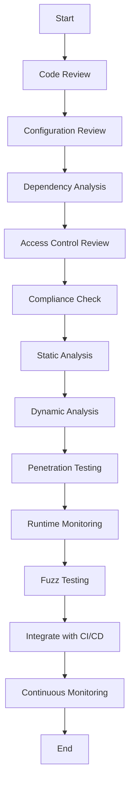

## 16.7 Security Testing and Auditing

In the ever-evolving landscape of software development, ensuring the security of applications is paramount. This section delves into the critical aspects of security testing and auditing in Lua applications. We will explore various strategies, tools, and best practices to safeguard your applications against vulnerabilities and ensure compliance with industry standards.

### Ensuring Application Security

Security testing and auditing are integral to the software development lifecycle. They help identify vulnerabilities, ensure compliance with security standards, and maintain the integrity of applications. Let's explore the key components of ensuring application security.

#### Security Audits

Security audits involve a thorough examination of your application's code and configurations to identify potential security risks. Regular audits are essential for maintaining a secure application environment. Here are some key steps involved in conducting a security audit:

1. **Code Review**: Manually inspect the codebase to identify security flaws such as hardcoded credentials, improper error handling, and insecure data storage practices.

2. **Configuration Review**: Examine configuration files for misconfigurations that could lead to security vulnerabilities, such as open ports or weak encryption settings.

3. **Dependency Analysis**: Review third-party libraries and dependencies for known vulnerabilities and ensure they are up-to-date.

4. **Access Control Review**: Verify that access controls are properly implemented to prevent unauthorized access to sensitive data and functionality.

5. **Compliance Check**: Ensure that the application complies with relevant security standards and regulations, such as GDPR, HIPAA, or PCI-DSS.

#### Testing Strategies

Effective security testing involves a combination of static and dynamic analysis techniques. Let's explore these strategies in detail.

##### Static Analysis

Static analysis involves examining the source code without executing it. This technique helps identify potential security vulnerabilities early in the development process. Here are some key aspects of static analysis:

- **Automated Code Inspection Tools**: Utilize tools like SonarQube, ESLint, or LuaCheck to automatically scan your codebase for security issues. These tools can detect common vulnerabilities such as SQL injection, cross-site scripting (XSS), and buffer overflows.

- **Code Quality Metrics**: Analyze code quality metrics such as cyclomatic complexity, code duplication, and code coverage to identify areas that may require refactoring for improved security.

- **Security-Specific Rules**: Configure static analysis tools with security-specific rules to enforce best practices and prevent common security pitfalls.

##### Dynamic Analysis

Dynamic analysis involves testing the application while it is running to identify vulnerabilities that may not be apparent in the source code. Here are some key aspects of dynamic analysis:

- **Penetration Testing**: Conduct penetration tests to simulate real-world attacks and identify vulnerabilities in the application. This involves testing for issues such as authentication bypass, session hijacking, and insecure data transmission.

- **Runtime Monitoring**: Use tools like OWASP ZAP or Burp Suite to monitor the application's runtime behavior and identify security issues such as insecure API endpoints or data leaks.

- **Fuzz Testing**: Perform fuzz testing by providing unexpected or random inputs to the application to identify potential security vulnerabilities.

### Automated Tools

Incorporating automated security tools into your development pipeline is crucial for maintaining a secure application environment. Let's explore how to integrate security checks into your CI/CD processes.

#### Integration with CI/CD

Continuous Integration and Continuous Deployment (CI/CD) pipelines are essential for modern software development. Integrating security checks into these pipelines ensures that security is a continuous process rather than an afterthought. Here are some key steps to achieve this:

1. **Static Analysis Integration**: Integrate static analysis tools into your CI/CD pipeline to automatically scan code changes for security vulnerabilities. This ensures that security issues are identified and addressed early in the development process.

2. **Automated Testing**: Incorporate automated security tests into your CI/CD pipeline to validate the security of your application before deployment. This includes running unit tests, integration tests, and security-specific tests.

3. **Vulnerability Scanning**: Use vulnerability scanning tools to automatically scan your application and its dependencies for known vulnerabilities. This helps ensure that your application is not exposed to known security risks.

4. **Continuous Monitoring**: Implement continuous monitoring to detect and respond to security incidents in real-time. This includes monitoring application logs, network traffic, and system performance for signs of security breaches.

### Use Cases and Examples

To illustrate the importance of security testing and auditing, let's explore some real-world use cases and examples.

#### Compliance Requirements

Meeting industry security standards is crucial for organizations that handle sensitive data. Here are some common compliance requirements and how security testing and auditing can help meet them:

- **GDPR Compliance**: Conduct regular security audits to ensure that personal data is handled securely and in compliance with GDPR requirements. This includes implementing strong access controls, data encryption, and data breach notification procedures.

- **HIPAA Compliance**: Perform security testing to ensure that healthcare applications comply with HIPAA regulations. This includes testing for data encryption, access controls, and audit logging.

- **PCI-DSS Compliance**: Conduct security audits to ensure that payment applications comply with PCI-DSS standards. This includes testing for secure data transmission, access controls, and vulnerability management.

#### Continuous Security Improvement

Proactive vulnerability management is essential for maintaining a secure application environment. Here are some strategies for continuous security improvement:

- **Regular Security Audits**: Conduct regular security audits to identify and address security vulnerabilities. This helps ensure that your application remains secure over time.

- **Security Training**: Provide security training to developers and other stakeholders to raise awareness of security best practices and common vulnerabilities.

- **Incident Response Planning**: Develop and test an incident response plan to ensure that your organization is prepared to respond to security incidents effectively.

- **Security Metrics**: Track security metrics such as the number of vulnerabilities identified, time to remediation, and security test coverage to measure the effectiveness of your security program.

### Try It Yourself

To reinforce your understanding of security testing and auditing, try experimenting with the following code example. This example demonstrates how to use LuaCheck for static analysis in a Lua application.

```lua
-- Sample Lua script with potential security issues

-- Hardcoded credentials (security risk)
local username = "admin"
local password = "password123"

-- Insecure data storage (security risk)
local sensitiveData = {
    creditCardNumber = "1234-5678-9012-3456",
    expirationDate = "12/25"
}

-- Function to authenticate user
local function authenticate(user, pass)
    if user == username and pass == password then
        return true
    else
        return false
    end
end

-- Function to process payment
local function processPayment(data)
    -- Insecure data handling (security risk)
    print("Processing payment for card number: " .. data.creditCardNumber)
end

-- Main function
local function main()
    local isAuthenticated = authenticate("admin", "password123")
    if isAuthenticated then
        processPayment(sensitiveData)
    else
        print("Authentication failed.")
    end
end

main()
```

**Experimentation Suggestions**:
- Use LuaCheck to analyze the code and identify security issues.
- Modify the code to address the identified security risks, such as using environment variables for credentials and encrypting sensitive data.

### Visualizing Security Testing and Auditing

To better understand the process of security testing and auditing, let's visualize the workflow using a Mermaid.js flowchart.



**Diagram Description**: This flowchart illustrates the workflow of security testing and auditing, starting from code review and configuration review, through static and dynamic analysis, to integration with CI/CD and continuous monitoring.

### References and Links

For further reading on security testing and auditing, consider exploring the following resources:

- [OWASP Testing Guide](https://owasp.org/www-project-web-security-testing-guide/)
- [NIST Cybersecurity Framework](https://www.nist.gov/cyberframework)
- [SANS Institute Security Resources](https://www.sans.org/security-resources/)
- [LuaCheck Documentation](https://github.com/mpeterv/luacheck)

### Knowledge Check

To reinforce your understanding of security testing and auditing, consider the following questions and challenges:

1. What are the key components of a security audit?
2. How can static analysis tools help identify security vulnerabilities?
3. What is the difference between static and dynamic analysis?
4. How can you integrate security checks into a CI/CD pipeline?
5. What are some common compliance requirements for security testing?

### Embrace the Journey

Remember, security testing and auditing are ongoing processes that require continuous attention and improvement. As you progress in your journey to mastering Lua design patterns, keep experimenting, stay curious, and prioritize security in your applications. By doing so, you'll build robust, secure applications that stand the test of time.

## Quiz Time!



### What is the primary goal of a security audit?

- [x] To identify potential security risks in the code and configurations
- [ ] To improve application performance
- [ ] To enhance user interface design
- [ ] To increase application scalability

> **Explanation:** The primary goal of a security audit is to identify potential security risks in the code and configurations.

### Which of the following is a static analysis tool for Lua?

- [x] LuaCheck
- [ ] OWASP ZAP
- [ ] Burp Suite
- [ ] Nessus

> **Explanation:** LuaCheck is a static analysis tool for Lua that helps identify potential security vulnerabilities in the code.

### What is the main difference between static and dynamic analysis?

- [x] Static analysis examines the source code without executing it, while dynamic analysis tests the application while it is running.
- [ ] Static analysis tests the application while it is running, while dynamic analysis examines the source code without executing it.
- [ ] Both static and dynamic analysis involve testing the application while it is running.
- [ ] Both static and dynamic analysis involve examining the source code without executing it.

> **Explanation:** Static analysis examines the source code without executing it, while dynamic analysis tests the application while it is running.

### How can security checks be integrated into a CI/CD pipeline?

- [x] By incorporating static analysis tools and automated security tests
- [ ] By increasing the number of manual code reviews
- [ ] By reducing the frequency of deployments
- [ ] By focusing solely on performance optimization

> **Explanation:** Security checks can be integrated into a CI/CD pipeline by incorporating static analysis tools and automated security tests.

### Which of the following is a compliance requirement for security testing?

- [x] GDPR
- [ ] HTML5
- [ ] CSS3
- [ ] JSON

> **Explanation:** GDPR is a compliance requirement for security testing, ensuring that personal data is handled securely.

### What is the purpose of penetration testing?

- [x] To simulate real-world attacks and identify vulnerabilities
- [ ] To improve application performance
- [ ] To enhance user interface design
- [ ] To increase application scalability

> **Explanation:** The purpose of penetration testing is to simulate real-world attacks and identify vulnerabilities in the application.

### What is fuzz testing?

- [x] Providing unexpected or random inputs to the application to identify potential security vulnerabilities
- [ ] Analyzing the source code without executing it
- [ ] Monitoring the application's runtime behavior
- [ ] Conducting manual code reviews

> **Explanation:** Fuzz testing involves providing unexpected or random inputs to the application to identify potential security vulnerabilities.

### What is the role of continuous monitoring in security testing?

- [x] To detect and respond to security incidents in real-time
- [ ] To improve application performance
- [ ] To enhance user interface design
- [ ] To increase application scalability

> **Explanation:** Continuous monitoring plays a role in detecting and responding to security incidents in real-time.

### What is the benefit of using automated security tools in the development pipeline?

- [x] They help identify security issues early in the development process
- [ ] They increase the frequency of manual code reviews
- [ ] They reduce the need for security testing
- [ ] They focus solely on performance optimization

> **Explanation:** Automated security tools help identify security issues early in the development process, ensuring a secure application environment.

### True or False: Security testing and auditing are one-time processes.

- [ ] True
- [x] False

> **Explanation:** Security testing and auditing are ongoing processes that require continuous attention and improvement.


