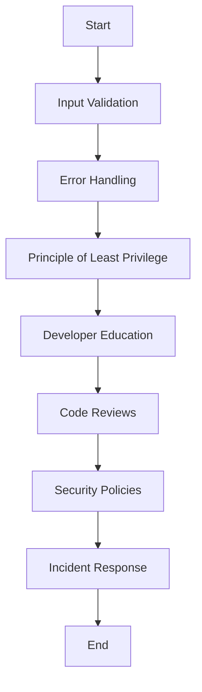

## 16.8 Best Practices for Secure Scripting

In the ever-evolving landscape of software development, security remains a paramount concern. As Lua continues to gain traction in various domains, from game development to web applications, understanding and implementing secure scripting practices is crucial. This section delves into the best practices for secure scripting in Lua, providing you with the knowledge to safeguard your applications against potential threats.

### Adhering to Security Principles

#### Secure Coding Guidelines

Secure coding is the foundation of building robust applications. By adhering to established guidelines, developers can minimize vulnerabilities and enhance the security posture of their Lua scripts.

1. **Input Validation and Sanitization**: Always validate and sanitize user inputs to prevent injection attacks. Use pattern matching to ensure inputs conform to expected formats.

   ```lua
   -- Example of input validation
   local function validate_input(input)
       if not input:match("^[a-zA-Z0-9]+$") then
           error("Invalid input: Only alphanumeric characters are allowed.")
       end
   end
   ```

2. **Avoid Hardcoding Sensitive Information**: Never hardcode sensitive information such as passwords or API keys within your scripts. Use environment variables or secure vaults to manage secrets.

3. **Error Handling**: Implement comprehensive error handling to prevent information leakage through error messages. Use Lua's `pcall` or `xpcall` for safe execution of potentially error-prone code.

   ```lua
   -- Example of error handling with pcall
   local status, err = pcall(function()
       -- Potentially unsafe operation
   end)
   if not status then
       print("An error occurred: " .. err)
   end
   ```

4. **Use Secure Libraries**: Leverage well-maintained and secure libraries for cryptographic operations and other security-related tasks. Avoid using deprecated or untrusted libraries.

5. **Regular Updates**: Keep your Lua environment and dependencies up to date to protect against known vulnerabilities.

#### Principle of Least Privilege

The principle of least privilege is a security concept that advocates for granting only the minimum necessary permissions to users and processes. This minimizes the potential damage from accidental or malicious actions.

- **Restrict File Permissions**: Ensure that Lua scripts and configuration files have the least necessary permissions. Use file system permissions to control access.

- **Limit Network Access**: Configure network permissions to restrict Lua scripts from accessing unnecessary network resources.

- **Sandboxing**: Use Lua's sandboxing capabilities to restrict the execution environment of scripts, limiting their access to system resources.

### Developer Education

#### Training Programs

Continuous education is vital for keeping development teams informed about the latest security trends and practices.

- **Workshops and Seminars**: Organize regular workshops and seminars to educate developers about secure coding practices and emerging threats.

- **Online Courses**: Encourage developers to enroll in online courses focused on security in software development.

#### Code Reviews

Code reviews are an effective way to identify and mitigate security vulnerabilities in Lua scripts.

- **Collaborative Reviews**: Implement a collaborative review process where multiple developers review code changes, focusing on security aspects.

- **Automated Tools**: Use automated code analysis tools to detect common security issues in Lua scripts.

### Security Policies

#### Documentation

Clear and comprehensive documentation of security policies is essential for maintaining a secure development environment.

- **Guidelines and Procedures**: Develop and maintain documentation outlining security guidelines and procedures for Lua development.

- **Access Control Policies**: Document access control policies to ensure that only authorized personnel have access to sensitive resources.

#### Incident Response Plans

Being prepared for security incidents is crucial for minimizing damage and ensuring a swift recovery.

- **Incident Response Team**: Establish a dedicated team responsible for handling security incidents.

- **Response Protocols**: Develop response protocols detailing the steps to be taken in the event of a security breach.

### Use Cases and Examples

#### Enterprise Applications

In enterprise environments, implementing organization-wide security practices is critical for protecting sensitive data and maintaining compliance with regulations.

- **Centralized Logging**: Implement centralized logging to monitor and audit Lua script activities across the organization.

- **Access Management**: Use role-based access control (RBAC) to manage permissions for Lua scripts and associated resources.

#### Open Source Projects

Open source projects benefit from community involvement in maintaining security standards.

- **Community Guidelines**: Establish security guidelines for contributors to follow when submitting code to the project.

- **Vulnerability Reporting**: Provide a clear process for reporting security vulnerabilities in the project.

### Try It Yourself

To reinforce your understanding of secure scripting practices, try modifying the code examples provided. Experiment with different input validation patterns or implement additional error handling mechanisms. Consider setting up a sandbox environment to test the principle of least privilege.

### Visualizing Secure Scripting Practices

To better understand the flow of secure scripting practices, let's visualize the process using a flowchart.



This flowchart illustrates the sequential steps involved in implementing secure scripting practices, from input validation to incident response.

### References and Links

For further reading on secure scripting practices, consider exploring the following resources:

- [OWASP Secure Coding Practices](https://owasp.org/www-project-secure-coding-practices-quick-reference-guide/)
- [Lua Users Wiki - Security](http://lua-users.org/wiki/Security)
- [NIST Secure Software Development Framework](https://csrc.nist.gov/publications/detail/sp/800-218/final)

### Knowledge Check

To test your understanding of secure scripting practices, consider the following questions:

1. Why is input validation important in secure scripting?
2. How can the principle of least privilege enhance security in Lua applications?
3. What are the benefits of conducting code reviews with a focus on security?
4. How can developer education contribute to a more secure development environment?

### Embrace the Journey

Remember, mastering secure scripting is an ongoing journey. As you continue to develop your skills, stay curious and proactive in learning about new security threats and mitigation strategies. By implementing the best practices outlined in this guide, you'll be well-equipped to build secure and resilient Lua applications.

## Quiz Time!



### Why is input validation crucial in secure scripting?

- [x] To prevent injection attacks
- [ ] To improve code readability
- [ ] To enhance performance
- [ ] To simplify debugging

> **Explanation:** Input validation is crucial to prevent injection attacks by ensuring that inputs conform to expected formats.

### What is the principle of least privilege?

- [x] Granting only necessary permissions
- [ ] Allowing all permissions by default
- [ ] Restricting access to administrators only
- [ ] Providing full access to all users

> **Explanation:** The principle of least privilege involves granting only the minimum necessary permissions to users and processes.

### How can developer education improve security?

- [x] By keeping teams updated on security trends
- [ ] By reducing development time
- [ ] By increasing code complexity
- [ ] By eliminating the need for code reviews

> **Explanation:** Developer education improves security by keeping teams informed about the latest security trends and practices.

### What is the purpose of code reviews?

- [x] To identify and mitigate security vulnerabilities
- [ ] To increase code size
- [ ] To reduce code readability
- [ ] To eliminate the need for testing

> **Explanation:** Code reviews help identify and mitigate security vulnerabilities in scripts.

### What should be included in security documentation?

- [x] Guidelines and procedures
- [ ] Personal opinions
- [x] Access control policies
- [ ] Unrelated project details

> **Explanation:** Security documentation should include guidelines, procedures, and access control policies to maintain a secure environment.

### Why is sandboxing important in Lua scripting?

- [x] To restrict the execution environment
- [ ] To increase script execution speed
- [ ] To simplify code maintenance
- [ ] To enhance user interface design

> **Explanation:** Sandboxing restricts the execution environment of scripts, limiting their access to system resources.

### What is the role of an incident response team?

- [x] To handle security incidents
- [ ] To develop new features
- [x] To minimize damage from breaches
- [ ] To manage user accounts

> **Explanation:** An incident response team is responsible for handling security incidents and minimizing damage from breaches.

### How can centralized logging benefit enterprise applications?

- [x] By monitoring and auditing script activities
- [ ] By reducing storage requirements
- [ ] By simplifying user interfaces
- [ ] By increasing network traffic

> **Explanation:** Centralized logging helps monitor and audit script activities across the organization.

### What is the benefit of using secure libraries?

- [x] To leverage well-maintained and trusted code
- [ ] To reduce code readability
- [ ] To increase code complexity
- [ ] To eliminate the need for testing

> **Explanation:** Secure libraries provide well-maintained and trusted code for cryptographic operations and other security tasks.

### True or False: Hardcoding sensitive information is a secure practice.

- [ ] True
- [x] False

> **Explanation:** Hardcoding sensitive information is not secure; use environment variables or secure vaults instead.


