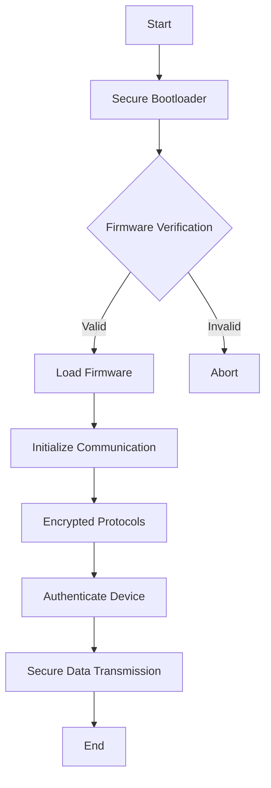

## 16.9 Security in Embedded Lua

Embedded systems are ubiquitous in today's technology-driven world, powering everything from smart home devices to industrial control systems. Lua, with its lightweight footprint and flexibility, is a popular choice for scripting in these environments. However, the unique constraints and challenges of embedded systems necessitate a robust approach to security. In this section, we will explore the security considerations specific to embedded Lua applications, focusing on resource constraints, physical access risks, and communication security.

### Unique Challenges in Embedded Systems

Embedded systems present a distinct set of challenges when it comes to security. These challenges arise primarily from the constraints inherent in the hardware and the environments in which these systems operate.

#### Resource Constraints

Embedded systems often have limited memory and processing power. This constraint impacts the ability to implement complex security measures that are commonplace in more powerful computing environments. For instance, encryption algorithms that require significant computational resources may not be feasible. Therefore, developers must balance security needs with the available resources.

#### Physical Access

Unlike traditional computing systems, embedded devices are often deployed in environments where they are physically accessible to potential attackers. This accessibility increases the risk of hardware tampering, which can lead to unauthorized access or control over the device. Ensuring physical security is as crucial as securing the software running on these devices.

### Implementing Security Measures

To address the challenges posed by embedded systems, several security measures can be implemented. These measures focus on protecting the code, ensuring secure boot processes, and safeguarding communication channels.

#### Code Obfuscation

Code obfuscation is a technique used to make the source code of a program difficult to understand. This is particularly important in embedded systems where the risk of reverse engineering is high. By obfuscating the Lua scripts, developers can protect intellectual property and reduce the risk of malicious modifications.

```lua
-- Example of a simple Lua function
function calculateSum(a, b)
    return a + b
end

-- Obfuscated version
function a(b,c)return b+c end
```

In the example above, the function `calculateSum` is obfuscated to `a`, and the parameters are renamed to `b` and `c`. While this is a simple example, more advanced obfuscation techniques can significantly increase the complexity of reverse engineering efforts.

#### Secure Bootloaders

A secure bootloader ensures that only authorized firmware is executed on the device. This is a critical security measure for preventing unauthorized code from being loaded onto the device, which could compromise its operation.

- **Implementation Steps**:
  1. **Digital Signatures**: Use cryptographic signatures to verify the authenticity of the firmware.
  2. **Integrity Checks**: Implement checks to ensure the firmware has not been tampered with.
  3. **Rollback Protection**: Prevent downgrading to older, potentially vulnerable firmware versions.

### Communication Security

Securing communication channels is vital for embedded systems, especially those that are part of the Internet of Things (IoT). This involves encrypting data transmissions and authenticating devices to prevent unauthorized access.

#### Encrypted Protocols

Using encrypted protocols ensures that data transmitted between devices is secure from eavesdropping and tampering. Common protocols include TLS (Transport Layer Security) and DTLS (Datagram Transport Layer Security) for secure communications.

```lua
-- Example of setting up a secure communication channel using Lua
local socket = require("socket")
local ssl = require("ssl")

local params = {
    mode = "client",
    protocol = "tlsv1_2",
    verify = "peer",
    options = "all",
}

local client = socket.tcp()
client:connect("example.com", 443)
client = ssl.wrap(client, params)
client:dohandshake()
```

In this example, we use LuaSocket and LuaSec to establish a secure TLS connection to a server, ensuring that data transmitted is encrypted.

#### Authentication Protocols

Authentication protocols validate the identities of devices communicating over a network. This prevents unauthorized devices from accessing or controlling the system.

- **Implementation Techniques**:
  - **Public Key Infrastructure (PKI)**: Use certificates to authenticate devices.
  - **Pre-Shared Keys (PSK)**: Use shared secrets for authentication in resource-constrained environments.
  - **OAuth**: Implement token-based authentication for web-connected devices.

### Use Cases and Examples

The principles and techniques discussed are applicable across various domains where embedded Lua is used. Let's explore some specific use cases.

#### Smart Devices

In smart home automation systems, security is paramount to protect user privacy and prevent unauthorized control of devices.

- **Example**: A smart thermostat using Lua scripts to manage temperature settings must ensure that only authorized users can change settings. Implementing encrypted communication and robust authentication mechanisms can prevent unauthorized access.

#### Industrial Control

Industrial control systems often manage critical infrastructure components, making security a top priority.

- **Example**: A Lua-scripted PLC (Programmable Logic Controller) controlling a power grid must ensure that commands are only accepted from authorized sources. Secure bootloaders and encrypted communication channels can help protect against unauthorized access and control.

### Visualizing Security in Embedded Lua

To better understand the security architecture in embedded Lua applications, let's visualize the process of secure communication and bootloading.



**Diagram Description**: This flowchart illustrates the process of securing an embedded Lua application, starting with a secure bootloader that verifies firmware integrity, followed by establishing encrypted communication channels and authenticating devices for secure data transmission.

### References and Links

- [MDN Web Docs on TLS](https://developer.mozilla.org/en-US/docs/Web/Security/Transport_Layer_Security)
- [OWASP IoT Security Guidance](https://owasp.org/www-project-internet-of-things/)
- [LuaSec Documentation](https://github.com/brunoos/luasec/wiki)

### Knowledge Check

- Explain the importance of code obfuscation in embedded systems.
- Describe how secure bootloaders protect embedded devices.
- Discuss the role of encrypted protocols in communication security.

### Embrace the Journey

Remember, securing embedded systems is a continuous process. As you implement these security measures, stay curious and keep exploring new techniques to enhance the robustness of your Lua applications. The journey to mastering security in embedded Lua is ongoing, and each step you take strengthens the foundation of your systems.

## Quiz Time!



### What is a primary challenge in securing embedded systems?

- [x] Resource constraints
- [ ] High processing power
- [ ] Unlimited memory
- [ ] Lack of physical access

> **Explanation:** Embedded systems often have limited memory and processing power, making it challenging to implement complex security measures.

### Why is code obfuscation important in embedded systems?

- [x] To protect against reverse engineering
- [ ] To improve code readability
- [ ] To increase execution speed
- [ ] To reduce code size

> **Explanation:** Code obfuscation makes the source code difficult to understand, protecting it from reverse engineering and unauthorized modifications.

### What is the role of a secure bootloader?

- [x] To ensure only authorized firmware runs
- [ ] To increase device speed
- [ ] To enhance user interface
- [ ] To manage power consumption

> **Explanation:** A secure bootloader verifies the authenticity of the firmware, ensuring that only authorized code is executed on the device.

### Which protocol is commonly used for secure communication in embedded systems?

- [x] TLS
- [ ] HTTP
- [ ] FTP
- [ ] SMTP

> **Explanation:** TLS (Transport Layer Security) is commonly used to secure communications by encrypting data transmitted between devices.

### What is a benefit of using encrypted protocols?

- [x] Securing data transmission
- [ ] Reducing code complexity
- [ ] Increasing data size
- [ ] Simplifying authentication

> **Explanation:** Encrypted protocols secure data transmission by preventing eavesdropping and tampering.

### How does authentication protect embedded systems?

- [x] By validating device identities
- [ ] By increasing processing speed
- [ ] By reducing memory usage
- [ ] By simplifying code

> **Explanation:** Authentication protocols validate the identities of devices, preventing unauthorized access and control.

### What is a common technique for authenticating devices in resource-constrained environments?

- [x] Pre-Shared Keys (PSK)
- [ ] OAuth
- [ ] JSON Web Tokens (JWT)
- [ ] Biometric authentication

> **Explanation:** Pre-Shared Keys (PSK) are often used in resource-constrained environments for authentication due to their simplicity and low resource requirements.

### What is a risk associated with physical access to embedded devices?

- [x] Hardware tampering
- [ ] Increased processing power
- [ ] Unlimited memory
- [ ] Enhanced security

> **Explanation:** Physical access to embedded devices increases the risk of hardware tampering, which can lead to unauthorized access or control.

### What is a key consideration when implementing secure bootloaders?

- [x] Digital signatures
- [ ] User interface design
- [ ] Power management
- [ ] Code readability

> **Explanation:** Digital signatures are used to verify the authenticity of the firmware, ensuring that only authorized code is executed.

### True or False: Encrypted protocols are unnecessary for embedded systems.

- [ ] True
- [x] False

> **Explanation:** Encrypted protocols are essential for securing data transmission in embedded systems, preventing unauthorized access and tampering.


