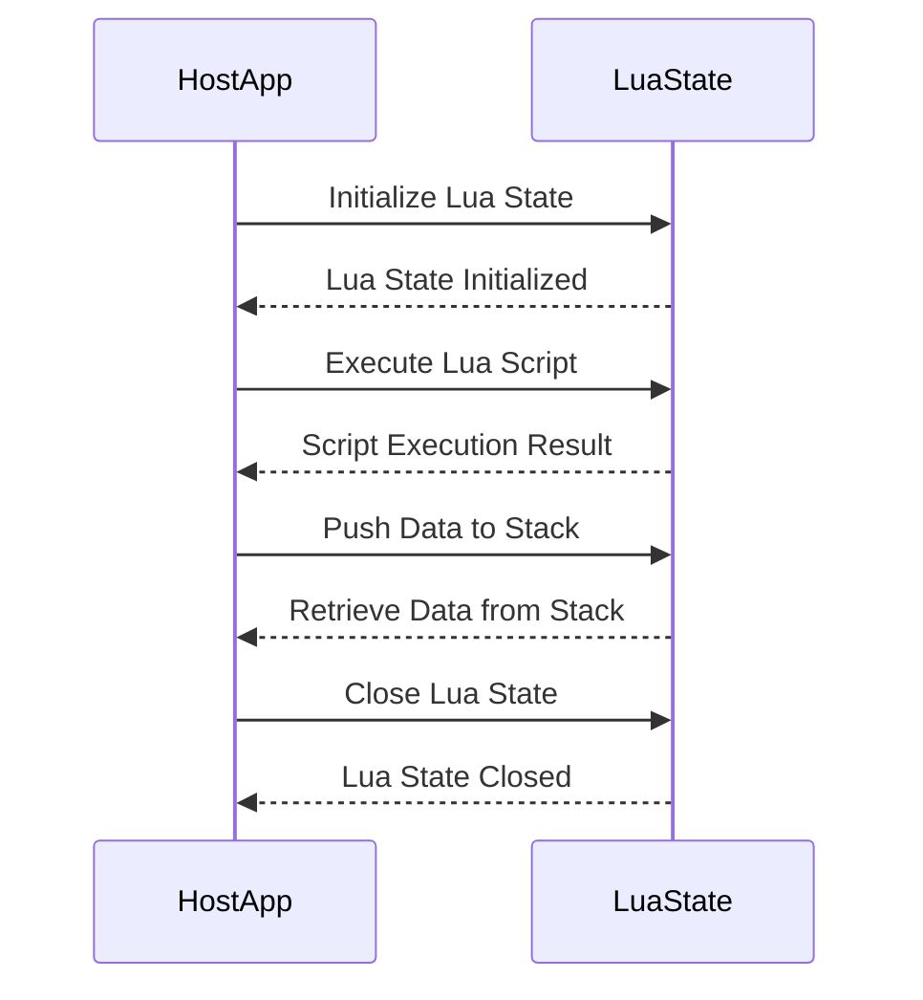

## 17.1 Embedding Lua in Host Applications

Embedding Lua in host applications is a powerful technique that allows developers to extend the functionality of their software, offering flexibility, customization, and rapid development capabilities. Lua's lightweight nature and ease of integration make it an ideal choice for embedding in various applications, from game engines to automation software. In this section, we will explore the benefits of embedding Lua, the steps involved in integrating Lua into host applications, data exchange mechanisms, and practical use cases.

### Extending Application Functionality

#### Benefits of Lua Embedding

Embedding Lua in host applications provides several advantages:

- **Flexibility**: Lua allows developers to modify application behavior without recompiling the entire application. This flexibility is particularly beneficial in environments where frequent updates are necessary.
  
- **Customization**: Users can customize application features through Lua scripts, tailoring the software to their specific needs without altering the core codebase.
  
- **Rapid Development**: Lua's simple syntax and dynamic nature enable rapid prototyping and development, allowing developers to quickly test and implement new features.

### Integration Steps

To embed Lua in a host application, follow these integration steps:

#### Initializing the Lua State

The first step in embedding Lua is setting up the Lua interpreter, known as the Lua state. This involves creating a new Lua state and loading the necessary libraries.

```c
#include <lua.h>
#include <lualib.h>
#include <lauxlib.h>

int main() {
    // Create a new Lua state
    lua_State *L = luaL_newstate();
    
    // Load Lua libraries
    luaL_openlibs(L);
    
    // Your code here...

    // Close the Lua state
    lua_close(L);
    return 0;
}
```

- **Explanation**: The `luaL_newstate()` function creates a new Lua state, and `luaL_openlibs(L)` loads the standard Lua libraries into the state. Finally, `lua_close(L)` is used to close the Lua state when it is no longer needed.

#### Executing Lua Code

Once the Lua state is initialized, you can execute Lua scripts within the host application. This can be done by loading and running Lua files or executing Lua code strings.

```c
// Load and run a Lua script file
if (luaL_dofile(L, "script.lua") != LUA_OK) {
    fprintf(stderr, "Error: %s\n", lua_tostring(L, -1));
    lua_pop(L, 1); // Remove error message from stack
}

// Execute a Lua code string
const char *lua_code = "print('Hello from Lua!')";
if (luaL_dostring(L, lua_code) != LUA_OK) {
    fprintf(stderr, "Error: %s\n", lua_tostring(L, -1));
    lua_pop(L, 1); // Remove error message from stack
}
```

- **Explanation**: The `luaL_dofile()` function loads and executes a Lua script file, while `luaL_dostring()` executes a Lua code string. Error handling is performed by checking the return value and printing the error message from the Lua stack.

### Data Exchange Mechanisms

#### The Lua Stack

The Lua stack is the primary mechanism for exchanging data between Lua and the host application. It allows you to push and retrieve values, facilitating communication between the two environments.

```c
// Push a number onto the stack
lua_pushnumber(L, 42);

// Retrieve the number from the stack
double num = lua_tonumber(L, -1);
lua_pop(L, 1); // Remove the number from the stack
```

- **Explanation**: The `lua_pushnumber()` function pushes a number onto the Lua stack, and `lua_tonumber()` retrieves the number from the stack. The `lua_pop()` function removes the value from the stack.

#### Error Handling

Proper error handling is crucial when embedding Lua in host applications. Lua provides mechanisms to manage and propagate errors effectively.

```c
// Error handling example
if (luaL_dofile(L, "script.lua") != LUA_OK) {
    fprintf(stderr, "Error: %s\n", lua_tostring(L, -1));
    lua_pop(L, 1); // Remove error message from stack
}
```

- **Explanation**: Error handling involves checking the return value of Lua functions and retrieving error messages from the stack using `lua_tostring()`.

### Use Cases and Examples

#### Game Engines

Lua is widely used in game engines to allow game logic scripting. By embedding Lua, developers can enable game designers to script game behavior, AI, and events without modifying the engine's core code.

```lua
-- Example Lua script for game logic
function onPlayerEnterZone(zone)
    if zone == "danger" then
        print("Warning: You have entered a dangerous area!")
    end
end
```

- **Explanation**: In this example, a Lua script defines a function `onPlayerEnterZone()` that prints a warning message when the player enters a dangerous zone.

#### Automation Software

Embedding Lua in automation software enables users to script tasks and workflows, enhancing the software's flexibility and adaptability to different environments.

```lua
-- Example Lua script for automation
function automateTask()
    print("Task automation in progress...")
    -- Perform automation steps
end
```

- **Explanation**: This Lua script defines a function `automateTask()` that prints a message and performs automation steps.

### Visualizing Lua Embedding

To better understand the process of embedding Lua in host applications, let's visualize the interaction between the host application and Lua using a sequence diagram.



- **Description**: This sequence diagram illustrates the interaction between the host application and the Lua state, including initialization, script execution, data exchange, and closing the Lua state.

### Try It Yourself

To deepen your understanding of embedding Lua in host applications, try modifying the code examples provided:

1. **Modify the Lua Script**: Change the Lua script to perform different tasks, such as calculating a mathematical expression or interacting with user input.

2. **Experiment with Data Exchange**: Push different data types onto the Lua stack and retrieve them in the host application. Explore how Lua handles various data types.

3. **Implement Error Handling**: Introduce intentional errors in the Lua script and observe how the host application handles them. Experiment with different error handling strategies.

### Knowledge Check

To reinforce your understanding of embedding Lua in host applications, consider the following questions:

- What are the benefits of embedding Lua in host applications?
- How do you initialize a Lua state in a host application?
- What is the Lua stack, and how is it used for data exchange?
- How can Lua be used in game engines and automation software?

### Embrace the Journey

Remember, embedding Lua in host applications is just the beginning of enhancing your software's flexibility and customization capabilities. As you progress, you'll discover more advanced techniques and patterns for integrating Lua into various environments. Keep experimenting, stay curious, and enjoy the journey!

## Quiz Time!



### What is the primary benefit of embedding Lua in host applications?

- [x] Flexibility and customization
- [ ] Increased application size
- [ ] Reduced performance
- [ ] Limited scripting capabilities

> **Explanation:** Embedding Lua provides flexibility and customization, allowing developers to modify application behavior without recompiling the entire application.

### How do you initialize a Lua state in a host application?

- [x] Using `luaL_newstate()` and `luaL_openlibs()`
- [ ] Using `lua_open()` and `lua_loadlibs()`
- [ ] Using `lua_start()` and `lua_initlibs()`
- [ ] Using `lua_create()` and `lua_load()`

> **Explanation:** The `luaL_newstate()` function creates a new Lua state, and `luaL_openlibs()` loads the standard Lua libraries into the state.

### What is the Lua stack used for?

- [x] Exchanging data between Lua and the host application
- [ ] Storing Lua scripts
- [ ] Managing Lua libraries
- [ ] Compiling Lua code

> **Explanation:** The Lua stack is used for exchanging data between Lua and the host application, allowing values to be pushed and retrieved.

### How can you execute a Lua script file in a host application?

- [x] Using `luaL_dofile()`
- [ ] Using `lua_execute()`
- [ ] Using `lua_runfile()`
- [ ] Using `lua_script()`

> **Explanation:** The `luaL_dofile()` function loads and executes a Lua script file within the host application.

### What is the purpose of error handling in Lua embedding?

- [x] Managing and propagating errors effectively
- [ ] Increasing application size
- [ ] Reducing performance
- [ ] Limiting scripting capabilities

> **Explanation:** Error handling is crucial for managing and propagating errors effectively when embedding Lua in host applications.

### How can Lua be used in game engines?

- [x] Allowing game logic scripting
- [ ] Reducing game performance
- [ ] Limiting game features
- [ ] Increasing game size

> **Explanation:** Lua is widely used in game engines to allow game designers to script game behavior, AI, and events.

### What is the benefit of using Lua in automation software?

- [x] Enabling scripting capabilities
- [ ] Reducing automation flexibility
- [ ] Limiting task customization
- [ ] Increasing software size

> **Explanation:** Embedding Lua in automation software enables users to script tasks and workflows, enhancing flexibility and adaptability.

### What function is used to push a number onto the Lua stack?

- [x] `lua_pushnumber()`
- [ ] `lua_pushvalue()`
- [ ] `lua_pushint()`
- [ ] `lua_pushfloat()`

> **Explanation:** The `lua_pushnumber()` function is used to push a number onto the Lua stack.

### How do you retrieve a number from the Lua stack?

- [x] Using `lua_tonumber()`
- [ ] Using `lua_getnumber()`
- [ ] Using `lua_retrieve()`
- [ ] Using `lua_fetch()`

> **Explanation:** The `lua_tonumber()` function retrieves a number from the Lua stack.

### Embedding Lua in host applications allows for rapid development.

- [x] True
- [ ] False

> **Explanation:** Lua's simple syntax and dynamic nature enable rapid prototyping and development, allowing developers to quickly test and implement new features.


