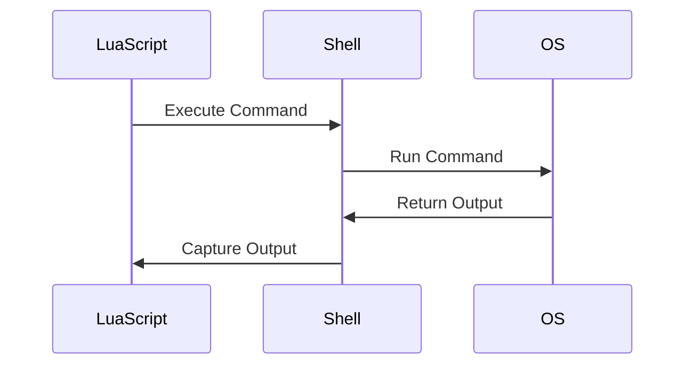

## 17.10 Interfacing with Operating System Services

In this section, we delve into the fascinating world of interfacing with operating system services using Lua. As software engineers and architects, understanding how to leverage OS features can significantly enhance the capabilities of your Lua applications. We will explore executing system commands, interacting with environment variables, handling files and directories, and managing processes. Let's embark on this journey to unlock the full potential of Lua in operating system integration.

### Accessing OS Features from Lua

#### System Commands: Executing Shell Commands Safely

One of the powerful features of Lua is its ability to execute system commands. This capability allows Lua scripts to interact with the operating system, perform administrative tasks, automate processes, and much more. However, executing shell commands requires caution to avoid security vulnerabilities.

**Executing a Simple Command**

To execute a shell command in Lua, you can use the `os.execute` function. Here's a simple example:

```lua
-- Execute a simple shell command
local result = os.execute("ls -l")
print("Command executed with result:", result)
```

In this example, the `ls -l` command lists the contents of the current directory in long format. The `os.execute` function returns a status code indicating the success or failure of the command.

**Capturing Command Output**

To capture the output of a shell command, you can use the `io.popen` function, which opens a pipe to the command:

```lua
-- Capture the output of a shell command
local handle = io.popen("ls -l")
local result = handle:read("*a")
handle:close()

print("Command output:\n", result)
```

Here, `io.popen` executes the command and returns a file handle. We read the output using `handle:read("*a")`, which reads the entire output as a string.

**Security Considerations**

When executing shell commands, it's crucial to validate and sanitize any user input to prevent command injection attacks. Avoid constructing command strings with untrusted data. Instead, use predefined commands or carefully validate input.

#### Environment Interaction: Reading and Setting Environment Variables

Environment variables are key-value pairs that provide configuration information to applications. Lua provides functions to read and set these variables, enabling your scripts to adapt to different environments.

**Reading Environment Variables**

You can read environment variables using the `os.getenv` function:

```lua
-- Read an environment variable
local path = os.getenv("PATH")
print("System PATH:", path)
```

This example retrieves the value of the `PATH` environment variable, which contains directories where executable programs are located.

**Setting Environment Variables**

To set an environment variable, use the `os.setenv` function (available in some Lua distributions) or modify the environment for the current process:

```lua
-- Set an environment variable (if supported)
os.setenv("MY_VAR", "Hello, Lua!")

-- Alternatively, modify the environment for the current process
os.execute("export MY_VAR='Hello, Lua!'")
```

Note that setting environment variables may not persist across different processes or shells.

### Implementing OS Integration

#### Lua Filesystem: Handling Files and Directories

The LuaFileSystem (lfs) library provides a comprehensive set of functions for file and directory manipulation. It allows you to create, read, write, and delete files and directories, as well as query file attributes.

**Installing LuaFileSystem**

To use LuaFileSystem, you need to install it. You can do this using LuaRocks, a package manager for Lua:

```bash
luarocks install luafilesystem
```

**Basic File Operations**

Here's an example of using LuaFileSystem to perform basic file operations:

```lua
local lfs = require("lfs")

-- Create a new directory
lfs.mkdir("new_directory")

-- Change to the new directory
lfs.chdir("new_directory")

-- Create a new file and write to it
local file = io.open("example.txt", "w")
file:write("Hello, LuaFileSystem!")
file:close()

-- List files in the current directory
for file in lfs.dir(".") do
    print("Found file:", file)
end

-- Remove the file and directory
os.remove("example.txt")
lfs.chdir("..")
lfs.rmdir("new_directory")
```

This script demonstrates creating a directory, writing to a file, listing directory contents, and cleaning up by removing the file and directory.

#### Process Management: Starting and Controlling Other Processes

Managing processes is a crucial aspect of OS integration. Lua provides mechanisms to start and control other processes, allowing you to build powerful automation scripts and system tools.

**Starting a Process**

You can start a new process using the `os.execute` function or by using Lua's `io.popen` for more control over input and output:

```lua
-- Start a process and wait for it to complete
local status = os.execute("sleep 5")
print("Process completed with status:", status)

-- Start a process and capture its output
local handle = io.popen("echo 'Hello from Lua!'")
local output = handle:read("*a")
handle:close()
print("Process output:", output)
```

**Controlling Processes**

For more advanced process control, you may need to use external libraries or tools that provide process management capabilities, such as `luaposix` or `luaproc`.

### Use Cases and Examples

#### Automation Scripts: System Administration Tasks

Lua's ability to interface with the operating system makes it an excellent choice for automation scripts. You can automate system administration tasks such as backups, log rotation, and user management.

**Example: Automated Backup Script**

Here's a simple Lua script to automate file backups:

```lua
local lfs = require("lfs")

-- Define source and backup directories
local source_dir = "/path/to/source"
local backup_dir = "/path/to/backup"

-- Create the backup directory if it doesn't exist
lfs.mkdir(backup_dir)

-- Function to copy files
local function copy_file(src, dest)
    local src_file = io.open(src, "rb")
    local dest_file = io.open(dest, "wb")
    dest_file:write(src_file:read("*a"))
    src_file:close()
    dest_file:close()
end

-- Iterate over files in the source directory
for file in lfs.dir(source_dir) do
    if file ~= "." and file ~= ".." then
        local src_path = source_dir .. "/" .. file
        local dest_path = backup_dir .. "/" .. file
        copy_file(src_path, dest_path)
        print("Backed up:", file)
    end
end
```

This script copies files from the source directory to the backup directory, creating a simple backup solution.

#### Monitoring Applications: Gathering System Metrics

Lua can also be used to build monitoring applications that gather system metrics such as CPU usage, memory usage, and disk space.

**Example: System Monitoring Script**

Here's a Lua script that monitors system CPU usage:

```lua
-- Function to get CPU usage
local function get_cpu_usage()
    local handle = io.popen("top -bn1 | grep 'Cpu(s)'")
    local result = handle:read("*a")
    handle:close()
    return result
end

-- Print CPU usage every 5 seconds
while true do
    local cpu_usage = get_cpu_usage()
    print("CPU Usage:", cpu_usage)
    os.execute("sleep 5")
end
```

This script uses the `top` command to retrieve CPU usage and prints it every 5 seconds.

### Visualizing OS Integration

To better understand how Lua interacts with operating system services, let's visualize the process flow using a sequence diagram.



**Diagram Description:** This sequence diagram illustrates the process of executing a shell command from a Lua script. The Lua script sends a command to the shell, which runs it on the operating system. The output is then captured and returned to the Lua script.

### References and Links

- [Lua 5.4 Reference Manual](https://www.lua.org/manual/5.4/)
- [LuaFileSystem Documentation](https://keplerproject.github.io/luafilesystem/)
- [LuaRocks: Package Manager for Lua](https://luarocks.org/)

### Knowledge Check

- How can you safely execute shell commands in Lua?
- What function is used to read environment variables in Lua?
- Describe how LuaFileSystem can be used to manage files and directories.
- What are some use cases for interfacing Lua with operating system services?

### Embrace the Journey

Remember, interfacing with operating system services is a powerful capability that can greatly enhance your Lua applications. As you explore these concepts, keep experimenting and building more complex solutions. Stay curious, and enjoy the journey of mastering Lua!

## Quiz Time!



### What function is used to execute shell commands in Lua?

- [x] os.execute
- [ ] io.open
- [ ] os.getenv
- [ ] lfs.dir

> **Explanation:** The `os.execute` function is used to execute shell commands in Lua.

### How can you capture the output of a shell command in Lua?

- [x] io.popen
- [ ] os.execute
- [ ] os.getenv
- [ ] lfs.mkdir

> **Explanation:** The `io.popen` function opens a pipe to a command and allows you to capture its output.

### What library provides functions for file and directory manipulation in Lua?

- [x] LuaFileSystem
- [ ] LuaSocket
- [ ] LuaSQL
- [ ] LuaJIT

> **Explanation:** LuaFileSystem provides functions for file and directory manipulation in Lua.

### Which function is used to read environment variables in Lua?

- [x] os.getenv
- [ ] os.setenv
- [ ] io.popen
- [ ] lfs.dir

> **Explanation:** The `os.getenv` function is used to read environment variables in Lua.

### What is a common use case for interfacing Lua with operating system services?

- [x] Automation scripts
- [ ] Game development
- [ ] Web development
- [ ] Machine learning

> **Explanation:** Interfacing Lua with operating system services is commonly used for automation scripts.

### How can you start a new process and wait for it to complete in Lua?

- [x] os.execute
- [ ] io.popen
- [ ] os.getenv
- [ ] lfs.mkdir

> **Explanation:** The `os.execute` function can start a new process and wait for it to complete.

### What is the purpose of the LuaFileSystem library?

- [x] To handle files and directories
- [ ] To manage network connections
- [ ] To interface with databases
- [ ] To perform mathematical calculations

> **Explanation:** The LuaFileSystem library is used to handle files and directories.

### How can you set an environment variable in Lua?

- [x] os.setenv (if supported)
- [ ] io.popen
- [ ] lfs.mkdir
- [ ] os.getenv

> **Explanation:** The `os.setenv` function (if supported) can be used to set an environment variable in Lua.

### What command can be used to retrieve CPU usage in a Lua script?

- [x] top
- [ ] ls
- [ ] mkdir
- [ ] rm

> **Explanation:** The `top` command can be used to retrieve CPU usage in a Lua script.

### True or False: Lua can be used to build monitoring applications that gather system metrics.

- [x] True
- [ ] False

> **Explanation:** True. Lua can be used to build monitoring applications that gather system metrics.


