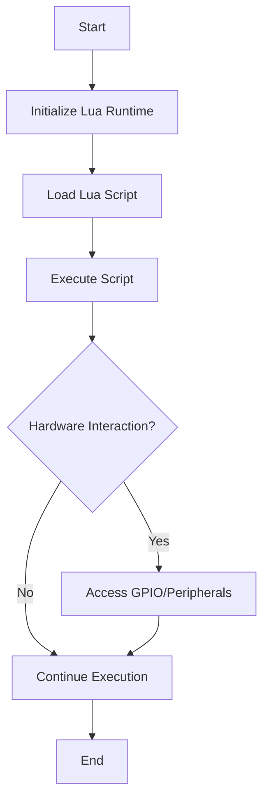

## 17.11 Porting Lua to a Microcontroller

In this section, we delve into the fascinating world of running Lua on microcontrollers. Microcontrollers are the backbone of many embedded systems, from simple IoT devices to complex industrial machines. By porting Lua to these devices, we can leverage its simplicity and flexibility to create powerful, efficient applications. Let's explore the challenges, solutions, and practical applications of using Lua in these constrained environments.

### Running Lua on Limited Hardware

Microcontrollers are designed to perform specific tasks with limited resources. Running a scripting language like Lua on such devices requires careful consideration of memory, processing power, and hardware interaction. Two popular Lua distributions for embedded systems are eLua and LuaRTOS.

#### eLua and LuaRTOS

**eLua** is a version of Lua designed specifically for embedded systems. It provides a lightweight and efficient runtime environment, making it ideal for microcontrollers with limited resources. eLua supports a wide range of platforms, including ARM, AVR, and ESP8266, and offers features like real-time operating system (RTOS) integration, hardware abstraction layers, and peripheral access.

**LuaRTOS** is another Lua distribution tailored for embedded systems, particularly those based on the ESP32 microcontroller. LuaRTOS combines the Lua scripting language with a real-time operating system, providing a robust platform for developing IoT applications. It includes support for Wi-Fi, Bluetooth, and various sensors, making it a versatile choice for connected devices.

### Challenges and Solutions

Porting Lua to a microcontroller involves overcoming several challenges, including memory constraints and hardware interaction. Let's explore these challenges and the solutions that make Lua a viable option for embedded systems.

#### Memory Constraints

Microcontrollers often have limited RAM and flash memory, which can pose a challenge when running a scripting language like Lua. Here are some strategies to optimize Lua for low-resource environments:

- **Memory Management**: Use Lua's garbage collector efficiently to manage memory allocation and deallocation. Tune the garbage collector's parameters to balance performance and memory usage.
- **Code Optimization**: Minimize the size of your Lua scripts by removing unnecessary code and using efficient algorithms. Consider using bytecode compilation to reduce the memory footprint.
- **Modular Design**: Break down your application into smaller, reusable modules. Load only the necessary modules at runtime to conserve memory.

#### Hardware Interaction

Interacting with hardware peripherals is a crucial aspect of embedded programming. Lua provides several mechanisms to access and control hardware components:

- **GPIO Access**: Use Lua libraries or bindings to interact with General Purpose Input/Output (GPIO) pins. This allows you to control LEDs, buttons, and other peripherals directly from Lua scripts.
- **Peripheral Libraries**: Leverage existing libraries for common peripherals like I2C, SPI, and UART. These libraries provide high-level abstractions for hardware communication, simplifying the development process.
- **RTOS Integration**: Integrate Lua with a real-time operating system to manage tasks, interrupts, and scheduling. This enables you to build responsive and reliable applications on microcontrollers.

### Use Cases and Examples

Porting Lua to microcontrollers opens up a wide range of possibilities, from IoT devices to educational projects. Let's explore some practical use cases and examples.

#### IoT Devices

Lua is an excellent choice for scripting the behavior of IoT devices. Its lightweight nature and ease of use make it ideal for developing smart sensors, home automation systems, and other connected devices. Here's an example of using Lua to control an IoT device:

```lua
-- Example: Controlling an LED with Lua on an ESP8266

-- Initialize GPIO pin for the LED
gpio.mode(1, gpio.OUTPUT)

-- Function to toggle the LED state
function toggleLED()
    local state = gpio.read(1)
    if state == gpio.LOW then
        gpio.write(1, gpio.HIGH)
    else
        gpio.write(1, gpio.LOW)
    end
end

-- Set up a timer to toggle the LED every second
tmr.alarm(0, 1000, tmr.ALARM_AUTO, toggleLED)
```

In this example, we use Lua to control an LED connected to an ESP8266 microcontroller. The script initializes a GPIO pin and sets up a timer to toggle the LED state every second.

#### Educational Projects

Microcontrollers are widely used in educational settings to teach programming and electronics. Lua's simplicity and readability make it an excellent choice for beginners. Here's an example of using Lua in an educational project:

```lua
-- Example: Simple Temperature Logger with Lua and a DHT11 Sensor

-- Initialize the DHT11 sensor
dhtPin = 2

-- Function to read temperature and humidity
function readDHT()
    status, temp, humi = dht.read(dhtPin)
    if status == dht.OK then
        print("Temperature: "..temp.." C")
        print("Humidity: "..humi.." %")
    else
        print("Failed to read from DHT sensor")
    end
end

-- Set up a timer to read the sensor every 5 seconds
tmr.alarm(1, 5000, tmr.ALARM_AUTO, readDHT)
```

In this example, we use Lua to read temperature and humidity data from a DHT11 sensor connected to a microcontroller. The script logs the sensor data every 5 seconds, providing a simple yet effective way to teach programming and data logging concepts.

### Visualizing Lua's Interaction with Microcontrollers

To better understand how Lua interacts with microcontrollers, let's visualize the process using a flowchart. This diagram illustrates the steps involved in running a Lua script on a microcontroller, from initialization to hardware interaction.



This flowchart provides a high-level overview of the process, highlighting the key steps involved in running Lua on a microcontroller.

### Try It Yourself

Now that we've explored the basics of porting Lua to a microcontroller, it's time to try it yourself. Here are some suggestions for experimenting with the code examples:

- **Modify the LED Control Script**: Change the GPIO pin or the toggle interval to see how it affects the LED behavior.
- **Extend the Temperature Logger**: Add functionality to log the data to an SD card or send it to a cloud service for remote monitoring.
- **Create Your Own Project**: Use Lua to build a simple IoT device or educational project, such as a weather station or a smart home controller.

### References and Links

For further reading and resources on porting Lua to microcontrollers, check out the following links:

- [eLua Project](http://www.eluaproject.net/)
- [LuaRTOS Documentation](https://github.com/whitecatboard/Lua-RTOS-ESP32)
- [ESP8266 Lua NodeMCU Documentation](https://nodemcu.readthedocs.io/en/release/)

### Knowledge Check

To reinforce your understanding of porting Lua to microcontrollers, consider the following questions:

1. What are the key challenges of running Lua on a microcontroller?
2. How can you optimize Lua scripts for memory-constrained environments?
3. What are some common peripherals you can control with Lua on a microcontroller?
4. How does integrating Lua with an RTOS benefit embedded applications?
5. What are some practical use cases for Lua on microcontrollers?

### Embrace the Journey

Porting Lua to a microcontroller is an exciting journey that opens up new possibilities for embedded programming. Remember, this is just the beginning. As you progress, you'll discover more advanced techniques and applications. Keep experimenting, stay curious, and enjoy the journey!

## Quiz Time!



### What is eLua?

- [x] A version of Lua designed for embedded systems
- [ ] A hardware component for microcontrollers
- [ ] A real-time operating system
- [ ] A type of microcontroller

> **Explanation:** eLua is a version of Lua specifically designed for embedded systems, providing a lightweight runtime environment.

### What is a common challenge when porting Lua to microcontrollers?

- [x] Memory constraints
- [ ] Lack of GPIO support
- [ ] High power consumption
- [ ] Incompatibility with C

> **Explanation:** Memory constraints are a common challenge due to the limited resources available on microcontrollers.

### How can Lua scripts be optimized for low-resource environments?

- [x] By using bytecode compilation
- [ ] By increasing the script size
- [ ] By using more global variables
- [ ] By avoiding modular design

> **Explanation:** Bytecode compilation reduces the memory footprint, making Lua scripts more suitable for low-resource environments.

### What is the benefit of integrating Lua with an RTOS?

- [x] It enables task management and scheduling
- [ ] It increases power consumption
- [ ] It limits hardware interaction
- [ ] It reduces code readability

> **Explanation:** Integrating Lua with an RTOS allows for efficient task management and scheduling, improving application responsiveness.

### Which Lua distribution is tailored for ESP32 microcontrollers?

- [x] LuaRTOS
- [ ] eLua
- [ ] NodeMCU
- [ ] MicroPython

> **Explanation:** LuaRTOS is specifically designed for ESP32 microcontrollers, providing a robust platform for IoT applications.

### What is a practical use case for Lua on microcontrollers?

- [x] Scripting behavior of IoT devices
- [ ] Developing desktop applications
- [ ] Building web servers
- [ ] Creating mobile apps

> **Explanation:** Lua is commonly used to script the behavior of IoT devices due to its lightweight nature and ease of use.

### How can GPIO pins be accessed in Lua?

- [x] Using Lua libraries or bindings
- [ ] By writing C code
- [ ] By using a web interface
- [ ] By modifying the microcontroller firmware

> **Explanation:** Lua libraries or bindings provide a high-level interface for accessing GPIO pins directly from Lua scripts.

### What is a benefit of using Lua in educational projects?

- [x] Its simplicity and readability
- [ ] Its high power consumption
- [ ] Its complex syntax
- [ ] Its limited hardware support

> **Explanation:** Lua's simplicity and readability make it an excellent choice for teaching programming and electronics concepts.

### What is a common peripheral that can be controlled with Lua?

- [x] LEDs
- [ ] Monitors
- [ ] Keyboards
- [ ] Printers

> **Explanation:** LEDs are commonly controlled using GPIO pins, which can be accessed through Lua scripts.

### True or False: Lua can only be used on high-end microcontrollers.

- [ ] True
- [x] False

> **Explanation:** Lua can be used on a wide range of microcontrollers, including those with limited resources, thanks to distributions like eLua and LuaRTOS.


